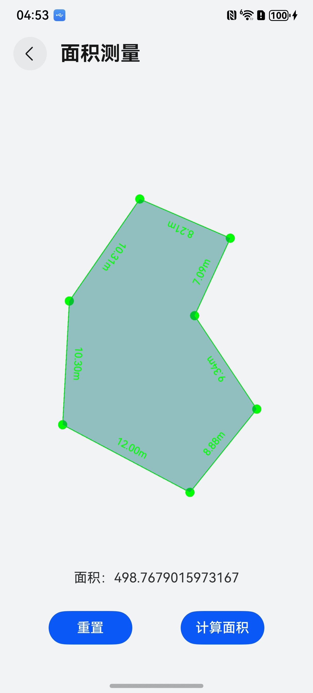

# 面积测量组件快速入门

## 目录

- [简介](#简介)
- [约束与限制](#约束与限制)
- [快速入门](#快速入门)
- [API参考](#API参考)
- [示例代码](#示例代码)

## 简介

本组件提供了绘制多边形，通过设置某一条边的长度可以计算多边形的面积的功能。



## 约束与限制
### 环境
* DevEco Studio版本：DevEco Studio 5.0.3 Release及以上
* HarmonyOS SDK版本：HarmonyOS 5.0.3 Release SDK及以上
* 设备类型：华为手机（包括双折叠和阔折叠）
* 系统版本：HarmonyOS 5.0.3(15)及以上


## 快速入门

1. 安装组件。

   如果是在DevEco Studio使用插件集成组件，则无需安装组件，请忽略此步骤。

   如果是从生态市场下载组件，请参考以下步骤安装组件。

   a. 解压下载的组件包，将包中所有文件夹拷贝至您工程根目录的XXX目录下。

   b. 在项目根目录build-profile.json5添加area_calculate模块。
   ```typescript
   // build-profile.json5
   "modules": [
      {
           "name": "area_calculate",
           "srcPath": "./XXX/area_calculate",
      }
   ]
   ```
   c. 在项目根目录oh-package.json5中添加依赖。
   ```typescript
       // 在项目根目录oh-package.json5填写area_calculate路径。其中XXX为组件存放的目录名
      "dependencies": {
         "area_calculate": "file:./XXX/area_calculate"
      } 
   ```


2. 引入组件。

```typescript
import { AreaCalculateController, AreaCalculate } from 'area_calculate'
```

3. 调用组件，详细参数配置说明参见[API参考](#API参考)。

```typescript
private canvasContext:CanvasRenderingContext2D = new CanvasRenderingContext2D();
// 点击多边形的边回调，后调后需要写入边长markLength;
borderClick = () => {
   ...
}
private  areaCalculateController:AreaCalculateController = new AreaCalculateController(this.canvasContext, this.borderClick)

build() {
   AreaCalculate({
      canvasContext: this.canvasContext,
      areaCalculateUtil: this.areaCalculateController
   })
}

```


## API参考

### 子组件
无

### 接口
new AreaCalculateController(this.canvasContext, this.borderClick)

控制器初始化传参


**参数：**

| 参数名          | 类型                 | 是否必填 | 说明       |
|--------------|--------------------|----|----------|
| canvasContext | CanvasRenderingContext2D | 是  | canvas对象 |
| borderClickCallBack | Function           | 是  | 点击多边形边长的回调|


### 属性

**AreaCalculateController属性：**

| 属性名              | 类型                              | 是否必填 | 说明             |
|------------------|---------------------------------|----|----------------|
| fontSize         | string                          | 否  | 标注字体大小         |
| fontColor        | string                          | 否  | 标注字体颜色         |
| lineWidth        | number                          | 否  | 线宽             |
| lineColor        | string                          | 否  | 边颜色            |
| pointRadius      | number                          | 否  | 定点点半径          |
| pointColor       | string                          | 否  | 顶点颜色           |
| currentPointX    | number                          | 否  | 点击X坐标          |
| currentPointY    | number                          | 否  | 点击Y坐标         |
| originPointX     | number                          | 否  | 第一个点X坐标      |
| originPointY | number                          | 否  | 第一个点Y坐标        |
| referenceLength  | number| 否  | 根据两点坐标算的基准边的长度 |
| markLength       | number| 否  | 实际标注基准边的长度     |
| unit             | string | 否  | 标注单位           |
## 示例代码
```typescript
import { AreaCalculateController, AreaCalculate } from 'area_calculate'

@Entry
@ComponentV2
struct CalculateComponent {
   private canvasContext:CanvasRenderingContext2D = new CanvasRenderingContext2D();
   @Local area: number = 0;
   @Local markLength: number = 0;
   @Local unit: string = 'mm';
   @Local dialogIds:number[] = [];
   // 点击多边形的边回调，后调后需要写入边长markLength;
   borderClick = () => {
      this.getUIContext().getPromptAction().openCustomDialog({
         builder:() => {
            this.setMark();
         }
      }).then((dialogId: number) => {
         this.dialogIds.push(dialogId); // 保存dialogId
      })
   }
   private  areaCalculateController:AreaCalculateController = new AreaCalculateController(this.canvasContext, this.borderClick)

   setMarkLength() {
      this.areaCalculateController.markLength = this.markLength;
      this.areaCalculateController.unit = this.unit;
      this.areaCalculateController.setLabels();
   }

   closeDialog() {
      const targetIds = this.dialogIds.pop();
      this.getUIContext().getPromptAction().closeCustomDialog(targetIds)
   }

   @Builder
   setMark() {
      Column({space:12}) {
         Row() {
            Text('长度：')
               .margin({
                  right:10
               })
            TextInput()
               .layoutWeight(1)
               .onChange((value) => {
                  this.markLength = Number(value);
               })
         }
         .width('100%')
         Row() {
            Text('单位：')
               .margin({
                  right:10
               })
            TextInput()
               .layoutWeight(1)
               .onChange((value) => {
                  this.unit = value;
               })
         }
         .width('100%')
         Row() {
            Button('取消')
               .width(100)
               .margin({
                  right:10
               })
               .onClick(() => {
                  this.closeDialog()
               })
            Button('确定')
               .width(100)
               .onClick(() => {
                  this.setMarkLength();
                  this.closeDialog()
               })
         }
         .width('100%')
            .justifyContent(FlexAlign.Center)
      }
      .padding(20)
   }

   build() {
      Column() {
         AreaCalculate({
            canvasContext: this.canvasContext,
            areaCalculateUtil: this.areaCalculateController
         })
            .layoutWeight(1)

         Text(`面积：${this.area}`)
         Row() {
            Button('重置')
               .width(100)
               .onClick(() => {
                  this.areaCalculateController.reset()
               })

            Button('计算面积')
               .width(100)
               .onClick(() => {
                 if (this.markLength === 0 || this.markLength === undefined) {
                   this.getUIContext().getPromptAction().showToast({
                     duration: 1500,
                     message: '请单击某一条边并填写该边的真实长度'
                   })
                 } else {
                   this.area = this.areaCalculateController.calculatePolygonArea();
                 }
               })
         }
         .justifyContent(FlexAlign.SpaceEvenly)
            .width('100%')
            .height(100)
      }
      .width('100%')
         .height('100%')
   }
}
```
