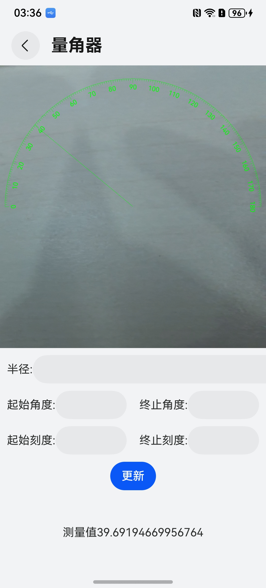

# 量角器组件快速入门

## 目录

- [简介](#简介)
- [约束与限制](#约束与限制)
- [快速入门](#快速入门)
- [API参考](#API参考)
- [示例代码](#示例代码)

## 简介

本组件使用canvas、相机绘制量角器，可自由设置量角器半径、起始角度结束角度、刻度值。



## 约束与限制
### 环境
* DevEco Studio版本：DevEco Studio 5.0.3 Release及以上
* HarmonyOS SDK版本：HarmonyOS 5.0.3 Release SDK及以上
* 设备类型：华为手机（包括双折叠和阔折叠）
* 系统版本：HarmonyOS 5.0.3(15)及以上


## 快速入门

1. 安装组件。

   如果是在DevEco Studio使用插件集成组件，则无需安装组件，请忽略此步骤。

   如果是从生态市场下载组件，请参考以下步骤安装组件。

   a. 解压下载的组件包，将包中所有文件夹拷贝至您工程根目录的XXX目录下。

   b. 在项目根目录build-profile.json5添加protractor模块。
   ```typescript
   // build-profile.json5
   "modules": [
      {
          "name": "protractor",
          "srcPath": "./XXX/protractor",
      }
   ]
   ```
   c. 在项目根目录oh-package.json5中添加依赖。
   ```typescript
       // 在项目根目录oh-package.json5填写protractor路径。其中XXX为组件存放的目录名
      "dependencies": {
         "protractor": "file:./XXX/protractor",
      } 
   ```


2. 引入组件。

```typescript
import { Protractor, ProtractorController } from 'protractor'
```

3. 调用组件，详细参数配置说明参见[API参考](#API参考)。

```typescript
   @Local angle:number = 0;
   @Local protractorUtil: ProtractorController = new ProtractorController({
      radius: this.radius,
      startAngle: this.startAngle,
      endAngle: this.endAngle,
      startValue: this.startValue,
      endValue: this.endValue,
      step: 10,
   });

   Protractor({
      protractorUtil: this.protractorUtil,
      angleChange:(angle) => {
         this.angle = angle;
      }
   })
```

## API参考

### 子组件
无

### 接口
new ProtractorController([param](#param对象说明));

控制器初始化参数。

### param对象说明

| 参数名          | 类型                                        | 是否必填 | 说明          |
|--------------|-------------------------------------------|--------|-------------|
| radius       |numuber| 是      | 量角器半径(单位vp) |
| startAngle   |number | 是      | 起始角度        |
| endAngle     | number| 是      | 终止角度        |
| startValue   | number | 是      | 起始刻度        |
| endValue     | number | 是 | 终止刻度        |
| step         | number | 是 | 刻度步长值       |
 | textColor    | string | 否 | 刻度值颜色（例：'#00ff00'） |
| textFontSize | string | 否 | 刻度值字体大小（例：'30px'）|
| lineColor    | string | 否 | 量角器颜色（例：'00ff00'）|


###  Protractor组件属性

| 参数名          | 类型                 | 是否必填 | 说明       |
|--------------|--------------------|----|----------|
| protractorController | ProtractorController | 是  | 量角器控制器对象 |
| angleChange | Function           | 是  | 角度变化回调   |

## 示例代码
1、在 module.json5 中配置如下权限。
```typescript
 "requestPermissions": [
   {
      "name": "ohos.permission.CAMERA",
      "reason": "$string:camera",
      "usedScene": {
         "abilities": [
            "EntryAbility"
         ],
         "when": "always"
      }
   }
 ]
```

2、在使用组件的页面添加如下代码。
```typescript
import { Protractor, ProtractorController } from 'protractor'

@Entry
@ComponentV2
struct ProtractorComponent {
   @Local angle:number = 0;  // 测量角度值
   @Local radius: number = 180; // 量角器半径
   @Local startAngle: number = 180; // 起始角度
   @Local endAngle: number = 360;  // 终止角度（需要大于起始角度）
   @Local startValue: number = 0; // 起始刻度值
   @Local endValue: number = 180; // 终止刻度值
   @Local protractorController: ProtractorController = new ProtractorController({
      radius: this.radius,
      startAngle: this.startAngle,
      endAngle: this.endAngle,
      startValue: this.startValue,
      endValue: this.endValue,
      step: 10,
   });

   build() {
     Column() {
         Protractor({
            protractorController: this.protractorController,
            angleChange:(angle) => {
               this.angle = angle;
            }
         })
            .layoutWeight(1)

         Column({space:16}) {
            Row() {
               Text('半径:')
               TextInput()
                  .layoutWeight(1)
                  .onChange((value) => {
                     this.radius = Number(value);
                  })
            }
            .width('100%')
               .justifyContent(FlexAlign.Start)

            Row() {
               Text('起始角度:')
               TextInput()
                  .layoutWeight(1)
                  .onChange((value) => {
                     this.startAngle = Number(value);
                  })
               Blank()
               Text('终止角度:')
               TextInput()
                  .layoutWeight(1)
                  .onChange((value) => {
                     this.endAngle = Number(value);
                  })
            }
            .width('100%')
               .justifyContent(FlexAlign.Start)

            Row() {
               Text('起始刻度:')
               TextInput()
                  .layoutWeight(1)
                  .onChange((value) => {
                     this.startValue = Number(value);
                  })
               Blank()
               Text('终止刻度:')
               TextInput()
                  .layoutWeight(1)
                  .onChange((value) => {
                     this.endValue = Number(value);
                  })
            }
            .width('100%')
               .justifyContent(FlexAlign.Start)


            Button('更新')
               .onClick(() => {
                  this.protractorController.updateParam({
                     radius: this.radius,
                     startAngle: this.startAngle,
                     endAngle: this.endAngle,
                     startValue: this.startValue,
                     endValue: this.endValue,
                  })
                  this.protractorController.drawProtractor();
               })
         }
         .padding(16)
         Text(`测量值${String(this.angle)}`)
            .height(60)
         }.width('100%').height('100%')
   }
}
```