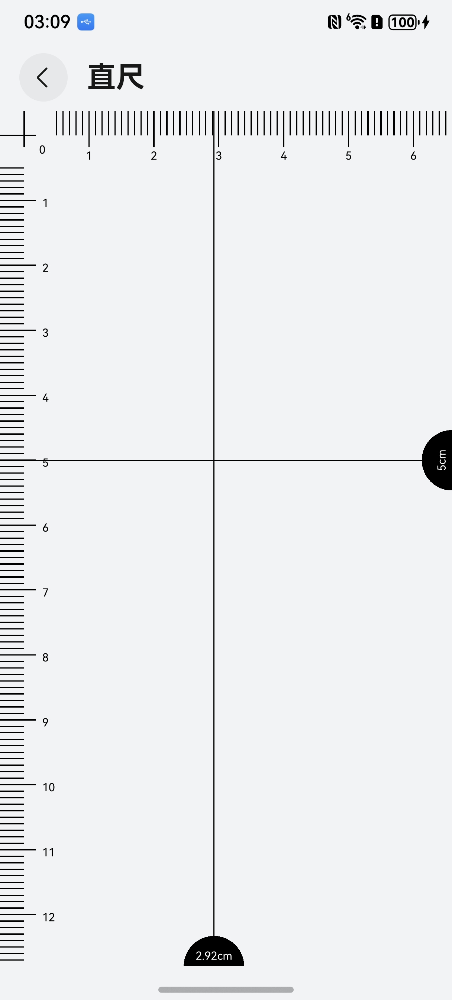

# 直尺组件快速入门

## 目录

- [简介](#简介)
- [约束与限制](#约束与限制)
- [快速入门](#快速入门)
- [API参考](#API参考)
- [示例代码](#示例代码)

## 简介

本组件使用canvas绘制刻度尺，以厘米为单位进行真实长度的测量。



## 约束与限制
### 环境
* DevEco Studio版本：DevEco Studio 5.0.3 Release及以上
* HarmonyOS SDK版本：HarmonyOS 5.0.3 Release SDK及以上
* 设备类型：华为手机（包括双折叠和阔折叠）
* 系统版本：HarmonyOS 5.0.3(15)及以上


## 快速入门

1. 安装组件。

   如果是在DevEco Studio使用插件集成组件，则无需安装组件，请忽略此步骤。

   如果是从生态市场下载组件，请参考以下步骤安装组件。

   a. 解压下载的组件包，将包中所有文件夹拷贝至您工程根目录的XXX目录下。

   b. 在项目根目录build-profile.json5添加ruler模块。
   ```typescript
   // build-profile.json5
   "modules": [
      {
        "name": "ruler",
        "srcPath": "./XXX/ruler",
      }
   ]
   ```
   c. 在项目根目录oh-package.json5中添加依赖。
   ```typescript
       // 在项目根目录oh-package.json5填写ruler路径。其中XXX为组件存放的目录名
      "dependencies": {
        "ruler": "file:./XXX/ruler",
      } 
   ```


2. 引入组件。

```typescript
import { RulerController, Ruler, CrossPointer } from 'ruler'
```

3. 调用组件，详细参数配置说明参见[API参考](#API参考)。

```typescript
   private canvasContext:CanvasRenderingContext2D = new CanvasRenderingContext2D();
   crossPointer:CrossPointer = {
      pointerX: 20,
      pointerY: 20,
   }
   private  rulerController:RulerController = new RulerController(
      this.canvasContext,
      {
         crossPointer:this.crossPointer,
         extraScaleLength: 10,
         lineColor:'#000000'
      }
   )    
      
   Ruler({
      canvasContext: this.canvasContext,
      rulerController: this.rulerController,
      onReady:() => {
         this.rulerController.setRulerPointers(
            [
               [0, this.crossPointer.pointerY, this.canvasContext.width, this.crossPointer.pointerY],
               [this.crossPointer.pointerX, 0, this.crossPointer.pointerX, this.canvasContext.height]
            ]
         );
         this.rulerController.drawRuler();
      }
   })
```

## API参考

### 子组件
无

### 接口
new RulerController(this.canvasContext，param);

控制器初始化参数。
**参数：**

| 参数名          | 类型                                        | 是否必填   | 说明       |
|--------------|-------------------------------------------|--------|----------|
| canvasContext |CanvasRenderingContext2D| 是      | canvas实例 |
| param |RulerProperty | 是      | 刻度尺属性    |


### RulerProperty对象说明

| 参数名          | 类型                                        | 是否必填 | 说明    |
|--------------|-------------------------------------------|----|-------|
| lineWidth | number | 否  | 线宽 |
| lineColor |string | 否  | 线颜色 |
| fontSize? | string | 否  | 字体大小 |
| fontColor | string | 否  | 字体颜色 |
| resultFontColor | string | 否  | 测量结果字体颜色 |
| extraScaleLength | number | 否  | 长刻度线比短刻度线多出的长度 |
| crossPointer | [CrossPointer](#CrossPointer对象说明) | 是  | 横向和纵向刻度尺的交点（0刻度位置） |

### CrossPointer对象说明

| 参数名          | 类型                                        | 是否必填 | 说明             |
|--------------|-------------------------------------------|----|----------------|
| pointerX | number | 是 | 横向和纵向刻度尺的交点X坐标 |
| pointerY | number | 是 | 横向和纵向刻度尺的交点Y坐标 |

### Ruler组件属性

| 属性名          | 类型                 | 是否必填 | 说明               |
|--------------|--------------------|----|------------------|
| canvasContext | CanvasRenderingContext2D | 是  | canvas实例         |
| rulerController | RulerController           | 是  | 控制器              |
| onReady | Function | 是 | canvas ready回调函数 |
## 示例代码
```typescript
import { RulerController, Ruler, CrossPointer } from 'ruler'

@Entry
@ComponentV2
struct RulerComponent {
   private canvasContext:CanvasRenderingContext2D = new CanvasRenderingContext2D();
   crossPointer:CrossPointer = {
      pointerX: 20,
      pointerY: 20,
   }
   private  rulerController:RulerController = new RulerController(
      this.canvasContext,
      {
         crossPointer:this.crossPointer,
         extraScaleLength: 10,
         lineColor:'#000000'
      }
   )

   build() {
      Column() {
         Ruler({
            canvasContext: this.canvasContext,
            rulerController: this.rulerController,
            onReady:() => {
               this.rulerController.setRulerPointers(
                  [
                     [0, this.crossPointer.pointerY, this.canvasContext.width, this.crossPointer.pointerY],
                     [this.crossPointer.pointerX, 0, this.crossPointer.pointerX, this.canvasContext.height]
                  ]
               );
               this.rulerController.drawRuler();
            }
         })
      }
      .width('100%')
      .height('100%')
   }
}
```