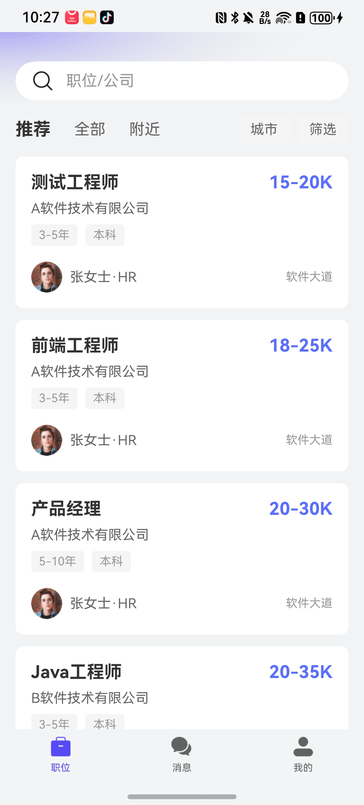
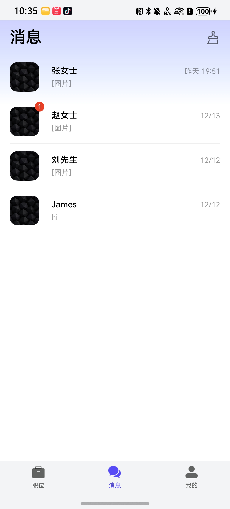
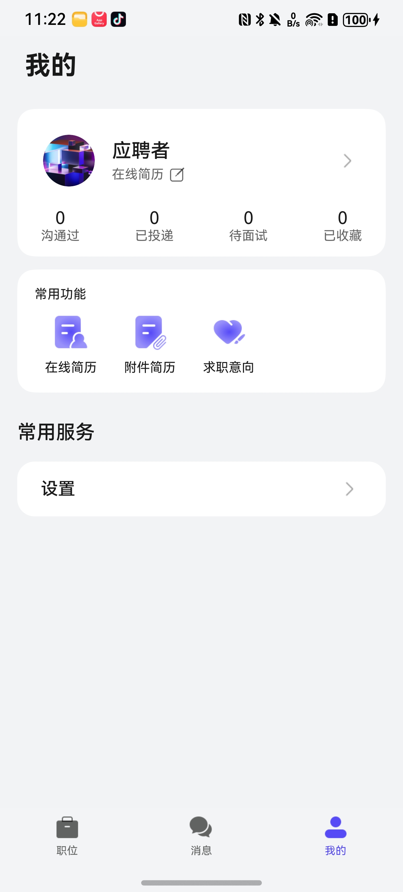

# 招聘应用模板快速入门

## 目录

- [功能介绍](#功能介绍)
- [约束与限制](#约束与限制)
- [快速入门](#快速入门)
- [示例效果](#示例效果)
- [开源许可协议](#开源许可协议)

## 功能介绍

您可以基于此模板直接定制招聘应用，也可以挑选此模板中提供的多种组件使用，从而降低您的开发难度，提高您的开发效率。

此模板提供如下组件，所有组件存放在工程根目录的components下，如果您仅需使用组件，可参考对应组件的指导链接；如果您使用此模板，请参考本文档。

| 组件                                    | 描述                                    | 使用指导                                                                     |
|:--------------------------------------|:--------------------------------------|:--------------------------------------------------------------------------|
| 求职意向组件（job_intention）                 | 提供求职意向设置功能                   | [使用指导](components/job_intention/README.md)                              |
| 通用登录组件（aggregated_login）              | 提供华为账号一键登录及其他方式登录（微信、手机号登录）            | [使用指导](components/aggregated_login/README.md)                           |
| 通用分享组件（aggregated_share）              | 提供通用的分享功能                   | [使用指导](components/aggregated_share/README.md)                           |
| 检测应用更新组件（check_app_update）            | 提供检测应用是否存在新版本功能                      | [使用指导](components/check_app_update/README.md)                           |
| 通用城市选择组件（city_select）                 | 提供城市选择功能                   | [使用指导](components/city_select/README.md)                                |
| 通用个人信息组件（collect_personal_info）       | 支持编辑头像、昵称、姓名、性别、手机号、生日、个人简介等                    | [使用指导](components/collect_personal_info/README.md)                      |
| 文件管理组件（file_management）               | 提供文件上传、下载、预览等功能                   | [使用指导](components/file_management/README.md)                            |
| 分类列表组件（link_category）                 | 提供链接分类展示功能                   | [使用指导](components/link_category/README.md)                              |
| 消息管理组件（message_manager）               | 提供消息管理功能                   | [使用指导](components/message_manager/README.md)                            |
| 搜索组件（search_box）                     | 提供通用搜索框功能                   | [使用指导](components/search_box/README.md)                                 |

本模板为招聘类应用提供了常用功能的开发样例，模板主要分职位、消息、个人中心三大模块：

| 职位                                                         | 消息                                                         | 个人中心                                                       |
|------------------------------------------------------------|------------------------------------------------------------|------------------------------------------------------------|
|  |  |  |

本模板已集成华为账号、即时通讯、推送、分享等服务，支持深色模式、适老化、无障碍等特性，提供完整的招聘应用解决方案，只需做少量配置和定制即可快速实现招聘应用的核心功能。

本模板主要页面及核心功能如下所示：

```text
招聘应用模板
  ├──职位                           
  │   ├──职位列表  
  │   │   ├── 职位浏览                          
  │   │   ├── 职位搜索                      
  │   │   └── 职位筛选                      
  │   │         
  │   ├──职位详情         
  │   │   ├── 职位信息展示                                             
  │   │   ├── 公司信息
  │   │   └── 在线投递
  │   │
  │   └──职位管理    
  │       ├── 投递记录                                             
  │       ├── 收藏职位                         
  │       └── 浏览历史 
  │
  ├──消息                           
  │   ├──消息列表  
  │   │   ├── 系统消息 
  │   │   ├── 聊天消息
  │   │   └── 通知消息                      
  │   │         
  │   ├──即时通讯         
  │   │   ├── 文字消息
  │   │   ├── 图片消息
  │   │   ├── 文件消息
  │   │   ├── 位置消息
  │   │   └── 语音消息                            
  │   │                    
  │   └──聊天管理    
  │       ├── 聊天记录搜索                                             
  │       ├── 消息收藏                         
  │       └── 聊天记录管理                       
  │
  └──个人中心                           
      ├──账号管理  
      │   ├── 华为账号登录                          
      │   ├── 个人信息编辑                                                   
      │   └── 账号安全设置                       
      │         
      ├──简历管理         
      │   ├── 创建简历
      │   ├── 编辑简历
      │   ├── 简历预览
      │   └── 简历投递记录
      │                    
      ├──求职设置    
      │   ├── 求职意向                                        
      │   ├── 期望城市                   
      │   ├── 期望薪资                             
      │   └── 工作经验
      │
      └──帮助与反馈    
          ├── 意见反馈                                        
          ├── 关于我们                   
          └── 版本更新                               
```

本模板工程代码结构如下所示：

```text
Recruitment
├──commons                                            // 公共模块
│  ├──common/src/main/ets                             // 基础公共模块             
│  │    ├──basic                                      // 基础类（ViewModel、日志等）
│  │    ├──constant                                   // 通用常量（路由、偏好设置等）
│  │    ├──core                                       // 核心功能（路由器）
│  │    ├──model                                      // 数据模型（用户信息、职位信息等）
│  │    ├──service                                    // 服务层（Mock服务）
│  │    ├──ui                                         // 通用UI组件（头部、协议页等）
│  │    └──util                                       // 通用工具类（权限、缓存、下载等）
│  │
│  └──oh_router                                       // 路由模块
│
├──components                                         // 业务组件
│  ├──aggregated_login                                // 通用登录组件
│  ├──aggregated_share                                // 通用分享组件
│  ├──chat_base                                       // 聊天基础组件
│  ├──chat_input                                      // 聊天输入组件
│  ├──chat_window                                     // 聊天窗口组件
│  ├──chat_location                                   // 聊天定位组件
│  ├──chat_history_search                             // 聊天历史搜索组件
│  ├──chat_history_collection                         // 聊天收藏组件
│  ├──check_app_update                                // 应用更新检查组件
│  ├──city_select                                     // 城市选择组件
│  ├──collect_personal_info                           // 个人信息收集组件
│  ├──feedback                                        // 意见反馈组件
│  ├──file_management                                 // 文件管理组件
│  ├──job_intention                                   // 求职意向组件
│  ├──link_category                                   // 链接分类组件
│  ├──message_manager                                 // 消息管理组件
│  ├──resume                                          // 简历组件
│  └──search_box                                      // 搜索框组件             
│      
├──features                                           // 功能模块
│  │
│  ├──position/src/main/ets                           // 职位模块             
│  │    ├──viewModel                                  // 视图模型
│  │    └──views                                      // 视图页面
│  │
│  ├──message/src/main/ets                            // 消息模块             
│  │    ├──viewModel                                  // 视图模型
│  │    └──views                                      // 视图页面
│  │
│  └──person/src/main/ets                             // 个人中心模块             
│       ├──comp                                       // 组件
│       ├──viewmodel                                  // 视图模型
│       └──views                                      // 视图页面
│
├──sdk                                                // SDK模块
│  └──instant_messaging                               // 即时通讯SDK
│
└──products                                           // 产品模块
   └──entry/src/main/ets                              // 应用入口模块
        ├──entryability                               // 入口能力
        │   └──EntryAbility.ets                       // 应用入口能力
        ├──pages                                      // 页面
        │   └──Index.ets                              // 入口页面
        └──viewmodels                                 // 视图模型
```

## 约束与限制

### 环境

- DevEco Studio版本：DevEco Studio 5.0.5 Release及以上
- HarmonyOS SDK版本：HarmonyOS 5.0.5 Release SDK及以上
- 设备类型：华为手机（包括双折叠和阔折叠）
- 系统版本：HarmonyOS 5.0.3(15) 及以上

### 权限

- 网络权限: ohos.permission.INTERNET
- 位置权限: ohos.permission.LOCATION（用于位置分享功能）
- 相机权限: ohos.permission.CAMERA（用于拍照上传）


## 快速入门

### 配置工程

在运行此模板前，需要完成以下配置：

1. 在AppGallery Connect创建应用，将包名配置到模板中。

   a. 参考[创建HarmonyOS应用](https://developer.huawei.com/consumer/cn/doc/app/agc-help-create-app-0000002247955506)为应用创建APP ID，并将APP ID与应用进行关联。

   b. 返回应用列表页面，查看应用的包名。

   c. 将模板工程根目录下AppScope/app.json5文件中的bundleName（当前为"com.huawei.recruitment"）替换为创建应用的包名。

2. 配置华为账号服务。

   a. 将应用的Client ID配置到products/entry/src/main路径下的module.json5文件中的metadata部分（当前为"xxxxxx"），详细参考：[配置Client ID](https://developer.huawei.com/consumer/cn/doc/harmonyos-guides/account-client-id)。

   b. 申请华为账号一键登录所需权限，详细参考：[配置scope权限](https://developer.huawei.com/consumer/cn/doc/harmonyos-guides/account-config-permissions)。

3. 配置即时通讯服务（可选）。

   a. 根据业务需求配置即时通讯SDK。

   b. 在sdk/instant_messaging模块中配置相关参数。

4. 配置推送服务（可选）。

   a. [开启推送服务](https://developer.huawei.com/consumer/cn/doc/harmonyos-guides/push-config-setting)。

   b. [按照需要申请通知消息权益](https://developer.huawei.com/consumer/cn/doc/harmonyos-guides/push-apply-right)

5. 对应用进行[手工签名](https://developer.huawei.com/consumer/cn/doc/harmonyos-guides/ide-signing#section297715173233)。

6. 添加手工签名所用证书对应的公钥指纹，详细参考：[配置应用签名证书指纹](https://developer.huawei.com/consumer/cn/doc/app/agc-help-cert-fingerprint-0000002278002933)


### 运行调试工程

1. 连接调试手机和PC。

2. 菜单选择"Run > Run 'entry' "或者"Run > Debug 'entry' "，运行或调试模板工程。

## 示例效果

运行应用后，您可以体验以下功能：

### 1. 职位模块

提供职位浏览、搜索、筛选、投递等功能。


**职位列表**

支持按条件筛选职位，包括城市、薪资、工作经验等。

**职位详情**

查看职位详细信息，包括职位描述、任职要求、公司信息等，支持在线投递简历。


### 2. 消息模块

支持即时通讯、消息通知、聊天记录管理等功能。


**即时通讯**

支持文字、图片、文件、位置等多种消息类型。

|                                                                      |                                                                                                         |      
|:---------------------------------------------------------------------|:------------------------------------------------------------------------------------------------------
|  |                                          

### 3. 个人中心模块

提供账号管理、简历管理、求职设置等功能。


**简历管理**

支持创建、编辑、预览简历，查看简历投递记录。

|                                                            |                                                                                  |    
|:-----------------------------------------------------------|:---------------------------------------------------------------------------------
|  |                         


**求职设置**

设置求职意向、期望城市、期望薪资、工作经验等信息。

|                                                                  |                                                                  |                                                              |
|:-----------------------------------------------------------------|:-----------------------------------------------------------------|:-------------------------------------------------------------
|  |  |  |

## 开源许可协议

该代码经过[Apache 2.0 授权许可](http://www.apache.org/licenses/LICENSE-2.0)。
