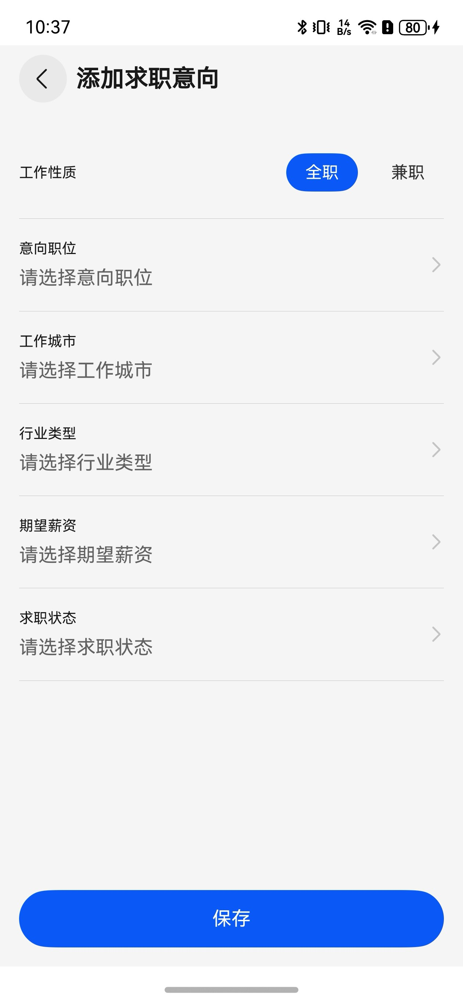
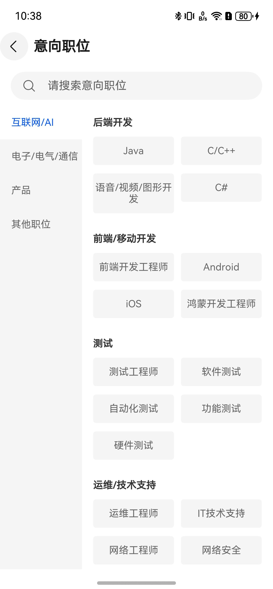
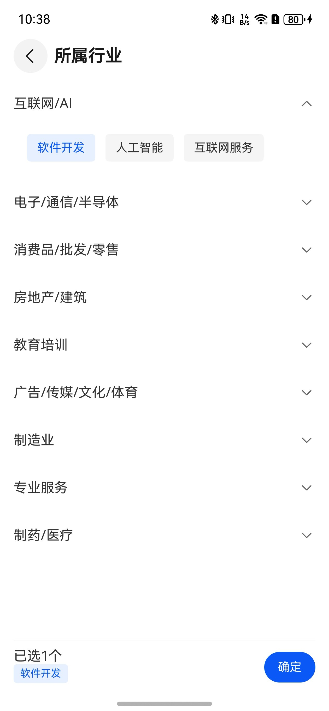

# 求职意向组件快速入门

## 目录

- [简介](#简介)
- [约束与限制](#约束与限制)
- [使用](#使用)
- [API参考](#API参考)
- [示例代码](#示例代码)

## 简介

本组件提供了求职意向管理功能,支持添加、编辑、删除求职意向信息,包括工作性质、意向职位、工作城市、行业类型、期望薪资和求职状态等信息的填写和管理。

| 求职意向页面 | 添加求职意向页面 | 意向职位页面 | 所属行业页面 |
|----------------------------------------------------------------------|------------------------------------------------------------------------|-----------------------------------------------------------------------|-----------------------------------------------------------------------|
|  |  |  |  |

## 约束与限制

### 环境

- DevEco Studio版本：DevEco Studio 5.0.5 Release及以上
- HarmonyOS SDK版本：HarmonyOS 5.0.3(15) Release SDK及以上
- 设备类型：华为手机
- 系统版本：HarmonyOS 5.0.3(15) 及以上

### 权限

- 位置权限：ohos.permission.APPROXIMATELY_LOCATION

## 使用

1. 安装组件。

   如果是在DevEco Studio使用插件集成组件，则无需安装组件，请忽略此步骤。
   如果是从生态市场下载组件，请参考以下步骤安装组件。

   a. 解压下载的组件包，将包中所有文件夹拷贝至您工程根目录的components目录下。

   b. 在项目根目录build-profile.json5添加job_intention和city_select模块。

   ```json5
   {
     "modules": [
       {
         "name": "job_intention",
         "srcPath": "./XXX/job_intention"
       },
       {
         "name": "city_select",
         "srcPath": "./XXX/city_select"
       }
     ]
   }
   ```

   c. 在项目根目录oh-package.json5中添加依赖。

   ```json5
   {
     "dependencies": {
       "job_intention": "file:./XXX/job_intention",
     }
   }
   ```

   d. 在项目的命令窗口执行命令。

   ```shell
   ohpm i
   ```
   确保组件内的依赖   city_select  (城市选择组件)完成下载。


2. 调用组件。

   在Navigation组件中通过路由跳转到求职意向页面：

   ```typescript
   this.navPathStack.pushPathByName('JobIntentionsPage', null)
   ```

## API参考

### 数据模型

#### CareerObjectiveModel

求职意向数据管理类，提供单例模式访问。

**属性：**

| 参数名 | 类型                                | 说明 |
|--------|-----------------------------------|------|
| jobStatus | string                            | 全局求职状态 |
| items | Array\<[CareerObjectiveItem](#CareerObjectiveItem)\> | 求职意向列表 |
| editingIndex | number                            | 当前编辑项索引 |
| draft | CareerObjectiveItem               | 编辑草稿 |

#### CareerObjectiveItem

求职意向数据项接口。

**属性：**

| 参数名 | 类型 | 说明 |
|--------|------|------|
| jobType | string | 工作性质（全职/兼职） |
| position | string | 意向职位 |
| city | string | 工作城市 |
| industry | string | 行业类型 |
| salary | string | 期望薪资 |
| jobStatus | string | 求职状态 |

**方法：**

| 方法名 | 参数 | 返回值 | 说明 |
|--------|------|--------|------|
| startEdit | (index: number, item?: [CareerObjectiveItem](#CareerObjectiveItem)) | void | 开始编辑或新增 |
| saveDraft | () | void | 保存草稿 |
| addItem | (item: CareerObjectiveItem) | void | 添加新项 |
| updateItem | (index: number, item: [CareerObjectiveItem](#CareerObjectiveItem)) | void | 更新指定项 |
| deleteItem | (index: number) | void | 删除指定项 |
| setDraftJobType | (value: string) | void | 设置草稿工作性质 |
| setDraftPosition | (value: string) | void | 设置草稿意向职位 |
| setDraftCity | (value: string) | void | 设置草稿工作城市 |
| setDraftIndustry | (value: string) | void | 设置草稿行业类型 |
| setDraftSalary | (value: string) | void | 设置草稿期望薪资 |
| setDraftJobStatus | (value: string) | void | 设置草稿求职状态 |

## 示例代码

```typescript
@Entry
@ComponentV2
struct JobIntention {
   @Local message: string = '打开求职意向页面';
   @Local navPathStack: NavPathStack = new NavPathStack();

   build() {
      Navigation(this.navPathStack) {
         Column() {
            Text(this.message)
               .fontSize($r('app.float.page_text_font_size'))
               .fontWeight(FontWeight.Bold)
               .onClick(() => {
                  this.navPathStack.pushPathByName('JobIntentionsPage', null)
               })
         }
         .justifyContent(FlexAlign.Center)
            .height('100%')
            .width('100%')
      }
      .hideTitleBar(true)
         .height('100%')
         .width('100%')
   }
}
```

## 功能特性

- 支持全职和兼职两种工作性质
- 支持添加、编辑、删除多个求职意向
- 集成城市选择组件，方便选择工作城市
- 支持职位分类选择和自定义输入
- 支持行业类型多选
- 支持期望薪资范围选择
- 支持求职状态设置
- 数据自动持久化存储
- 未保存提醒功能
