# 商务（求职招聘）应用模板快速入门

## 目录

- [功能介绍](#功能介绍)
- [约束与限制](#约束与限制)
- [快速入门](#快速入门)
- [示例效果](#示例效果)
- [开源许可协议](#开源许可协议)

## 功能介绍

您可以基于此模板直接定制应用，也可以挑选此模板中提供的多种组件使用，从而降低您的开发难度，提高您的开发效率。

本模板提供如下组件，所有组件存放在工程根目录的components下，如果您仅需使用组件，可参考对应组件的指导链接；如果您使用此模板，请参考本文档。

| 组件                                | 描述                                                                | 使用指导                                              |
|:---------------------------------|:------------------------------------------------------------------|:--------------------------------------------------|
| 通用登录组件（aggregated_login）        | 提供华为账号一键登录及其他方式登录（微信、手机号登录）,开发者可以根据业务需要快速实现应用登录                   | [使用指导](components/aggregated_login/README.md) |
| 通用问题反馈组件（feedback）              | 提供通用的问题反馈功能                                                       | [使用指导](components/feedback/README.md)         |
| 检测应用更新组件（check_app_update）      | 提供检测应用是否存在新版本功能                                                   | [使用指导](components/check_app_update/README.md) |
| 通用个人信息组件（collect_personal_info） | 支持编辑头像、昵称、姓名、性别、手机号、生日、个人简介等                                      | [使用指导](components/collect_personal_info/README.md) |
| 通用城市选择组件（city_select）          | 提供选择城市的功能                                                         | [使用指导](components/city_select/README.md)      |

本模板为求职类应用提供了常用功能的开发样例，模板主要分模板、简历和我的三大模块。

* 模板：提供多种简历模板供用户选择，支持模板预览和切换。

* 简历管理：提供简历创建、编辑、预览、导出等功能;支持基本信息、求职意向、工作经历、项目经验、教育背景、职业技能、资格证书等模块的编辑。

* 个人中心：提供个人信息管理、意见反馈、设置等功能。

本模板已集成华为账号、微信登录、应用更新检查、意见反馈等服务，只需做少量配置和定制即可快速实现简历应用的核心功能。

|                          模板                           |                            简历                             |                           我的                            |
|:-----------------------------------------------------:|:---------------------------------------------------------:|:-------------------------------------------------------:|
| 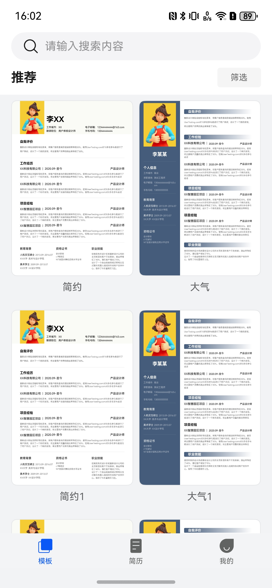 | 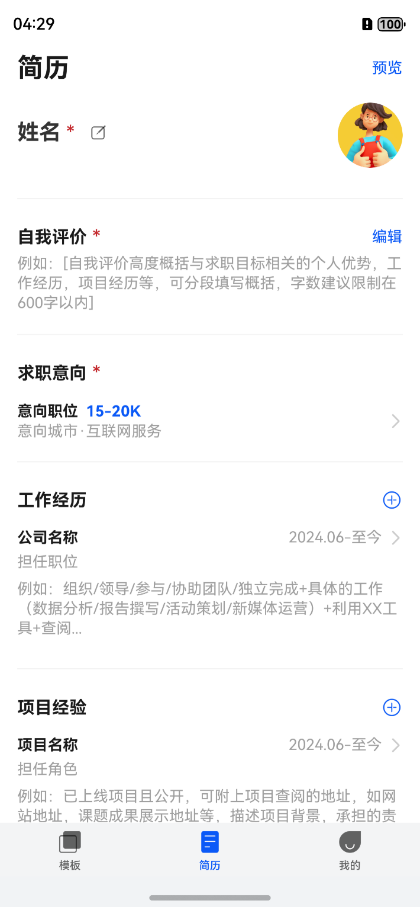 | 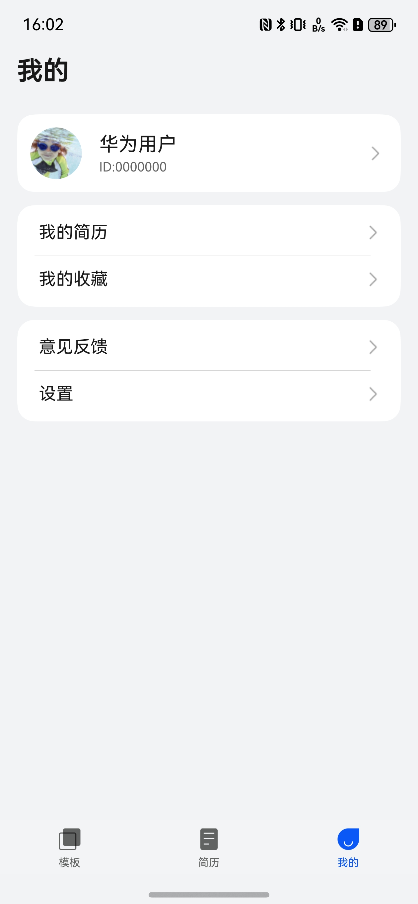 |

本模板主要页面及核心功能如下所示:

```text
求职应用模板
  ├──模板选择                           
  │   ├──模板列表  
  │   │   ├── 模板预览 
  │   │   ├── 模板搜索
  │   │   └── 模板切换  
  │   │         
  │   ├──模板筛选         
  │   │   ├── 按行业筛选
  │   │   ├── 按岗位筛选
  │   │   └── 按风格筛选                       
  │   │ 
  │   └──模板详情    
  │       ├── 模板预览                                             
  │       └── 使用模板                         
  │
  ├──简历管理                           
  │   ├──简历列表  
  │   │   ├── 添加信息                          
  │   │   ├── 删除信息                                     
  │   │   └── 编辑信息                     
  │   │                          
  │   ├──简历编辑    
  │   │   ├── 基本信息编辑
  │   │   ├── 求职意向编辑
  │   │   ├── 工作经历编辑
  │   │   ├── 项目经验编辑
  │   │   ├── 教育背景编辑
  │   │   ├── 职业技能编辑
  │   │   └── 资格证书编辑
  │   │
  │   └──简历操作    
  │       ├── 简历预览                                             
  │       └── 简历导出                         
  │                        
  └──个人中心                           
      ├──登录  
      │   ├── 华为账号登录                          
      │   ├── 微信登录                                                   
      │   └── 用户隐私协议同意                       
      │         
      ├──个人信息         
      │   ├── 头像、昵称
      │   └── 个人资料编辑               
      │
      └──常用服务    
          ├── 我的简历
          ├── 收藏模板
          ├── 意见反馈                                                         
          └── 设置
               ├── 个人信息             
               ├── 隐私设置
               ├── 清除缓存           
               ├── 关于我们 
               └── 退出登录                               
```

本模板工程代码结构如下所示:

```text
求职应用模板
├──commons                                                // 公共模块
│  ├──common                                              // 基础模块             
│  │    ├──basic                                          // 基础类（BaseViewModel、GlobalContext、Logger等）
│  │    ├──constant                                       // 通用常量（Constants、RouterMap等）
│  │    ├──model                                          // 数据模型（UserInfo、FileInfo等）
│  │    ├──service                                        // 通用服务
│  │    ├──ui                                             // 通用UI组件（Header、WebView等）
│  │    └──util                                           // 通用工具方法（权限、缓存、文件、时间等工具类）
│  │
│  │
│  └──OHRouter                                            // 路由模块（页面管理、路由跳转）
│
├──components                                             // 组件模块
│  ├──aggregated_login                                    // 通用登录组件
│  ├──feedback                                            // 通用问题意见反馈组件
│  ├──check_app_update                                    // 检测应用更新组件
│  ├──collect_personal_info                               // 通用个人信息收集组件
│  └──city_select                                         // 通用城市选择组件
│      
├──features                                               // 功能模块
│  │        
│  │
│  ├──template                                            // 模板模块             
│  │    ├──comp                                           // 组件
│  │    ├──viewsmodel                                     // 视图模型
│  │    └──views                                          // 视图页面
│  │
│  ├──resume                                              // 简历模块             
│  │    ├──comp                                           // 组件（行业选择等）
│  │    ├──utils                                          // 工具类（简历快照工具等）
│  │    ├──viewsmodel                                     // 视图模型
│  │    └──views                                          // 视图页面
│  │        ├──ResumePage.ets                             // 简历页面
│  │        ├──ResumePreviewPage.ets                      // 简历预览页面
│  │        ├──BasicalInformationPage.ets                 // 基本信息页面
│  │        ├──CareerObjectivePage.ets                    // 求职意向页面
│  │        ├──WorkExperiencePage.ets                     // 工作经历页面
│  │        ├──ProjectExperiencePage.ets                  // 项目经验页面
│  │        ├──EducationalBackgroundPage.ets              // 教育背景页面
│  │        ├──QualificationCertificatePage.ets           // 资格证书页面
│  │        └──DescriptionEditingPage.ets                 // 描述编辑页面
│  │
│  │
│  │
│  └──person                                              // 个人中心模块             
│       ├──comp                                           // 组件（用户信息行等）
│       ├──viewmodel                                      // 视图模型
│       └──views                                          // 视图页面
│           ├──MinePage.ets                               // 我的页面
│           ├──SetupPage.ets                              // 设置页面
│           ├──EditPersonalCenterPage.ets                 // 编辑个人中心页面
│           ├──LoginPage.ets                              // 登录页面
│           ├──PrivacySettingsPage.ets                    // 隐私设置页面
│           ├──PrivacyAgreementPage.ets                   // 隐私协议页面
│           ├──PrivacyInfoCollectPage.ets                 // 隐私信息收集页面
│           ├──Privacy3rdPartySharePage.ets               // 第三方信息共享页面
│           └──AboutPage.ets                              // 关于页面
│
└──products                                               // 产品模块
   └──entry/src/main/ets                                  // 入口模块
        ├──entryability                                   // 入口能力
        │   └──EntryAbility.ets                           // 应用入口
        ├──entrybackupability                             // 入口备份能力
        │   └──EntryBackupAbility.ets                     // 应用备份入口
        ├──pages                                          // 页面
        │   ├──HomePage.ets                               // 主页
        │   └──Index.ets                                  // 首页
        └──viewmodels                                     // 视图模型
            └──IndexVM.ets                                // 首页视图模型
```

## 约束与限制

### 环境

- DevEco Studio版本：DevEco Studio 5.0.5 Release及以上
- HarmonyOS SDK版本：HarmonyOS 5.0.3(15) Release SDK及以上
- 设备类型：华为手机（包括双折叠和阔折叠）
- 系统版本：HarmonyOS 6.0.0及以上

### 权限

- 网络权限：ohos.permission.INTERNET
- 相机权限：ohos.permission.CAMERA
- 位置权限：ohos.permission.APPROXIMATELY_LOCATION

## 快速入门

### 配置工程

在运行此模板前，需要完成以下配置：

1. 在AppGallery Connect创建应用,将包名配置到模板中。

   a. 参考[创建HarmonyOS应用](https://developer.huawei.com/consumer/cn/doc/app/agc-help-create-app-0000002247955506)为应用创建APP ID，并将APP ID与应用进行关联。

   b. 返回应用列表页面,查看应用的包名。

   c. 将模板工程根目录下AppScope/app.json5文件中的bundleName替换为创建应用的包名。

2. 配置华为账号服务。

   a. 将应用的Client ID配置到products/entry/src/main路径下的module.json5文件中，详细参考：[配置Client ID](https://developer.huawei.com/consumer/cn/doc/harmonyos-guides/account-client-id)。

   b. 申请华为账号登录所需权限，详细参考：[申请账号权限](https://developer.huawei.com/consumer/cn/doc/harmonyos-guides/account-config-permissions)。

3. 接入微信SDK（可选）。

   前往微信开放平台申请AppID并配置鸿蒙应用信息，详情参考：[鸿蒙接入指南](https://developers.weixin.qq.com/doc/oplatform/Mobile_App/Access_Guide/ohos.html)。

4. 对应用进行[手工签名](https://developer.huawei.com/consumer/cn/doc/harmonyos-guides/ide-signing#section297715173233)。

5. 添加手工签名所用证书对应的公钥指纹，详细参考：[配置公钥指纹](https://developer.huawei.com/consumer/cn/doc/app/agc-help-cert-fingerprint-0000002278002933)。

### 运行调试工程

1. 连接调试手机和PC。

2. 菜单选择"Run > Run 'entry' "或者"Run > Debug 'entry' "，运行或调试模板工程。

## 示例效果

### 模板功能

|                                模板筛选                                 |                                模板详情                                |                               模板搜索                                |
|:-------------------------------------------------------------------:|:------------------------------------------------------------------:|:-----------------------------------------------------------------:|
| 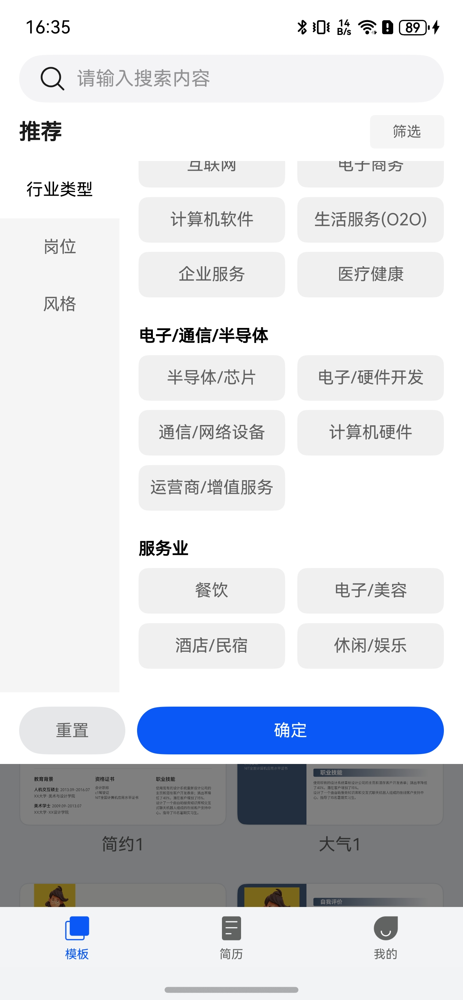 | 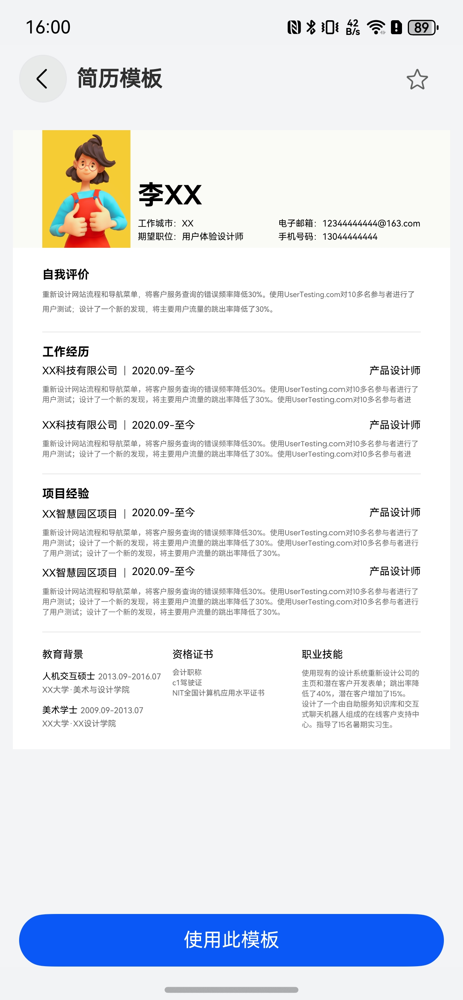 | 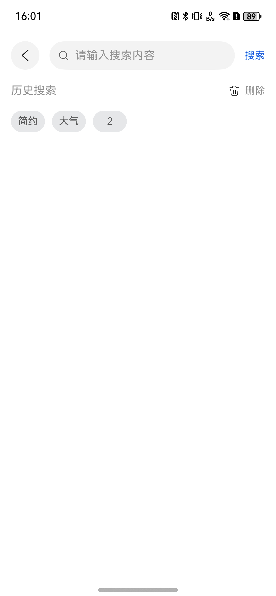 |


### 简历功能

|                                行业选择                                 |                                职位名称                                |                               项目角色                                |
|:-------------------------------------------------------------------:|:------------------------------------------------------------------:|:-----------------------------------------------------------------:|
| 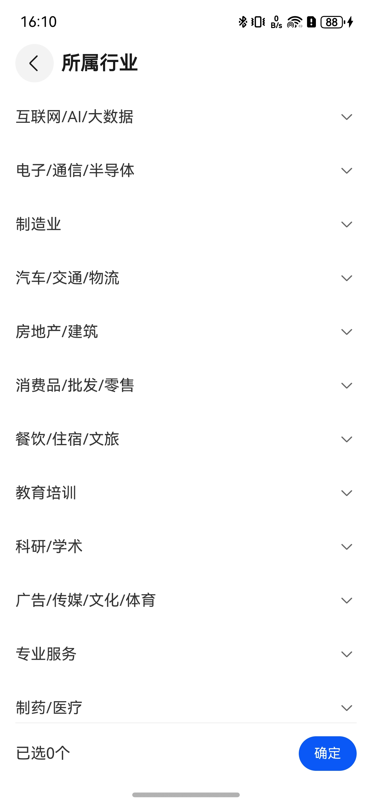 | 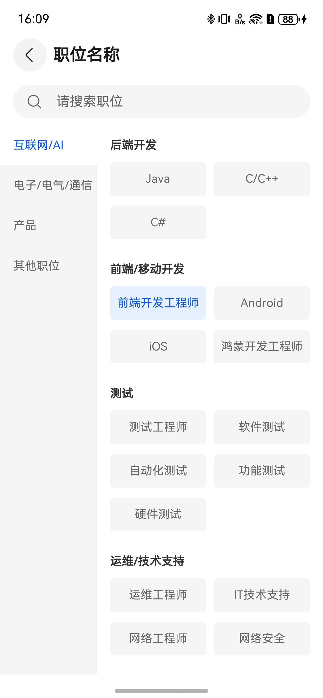 | 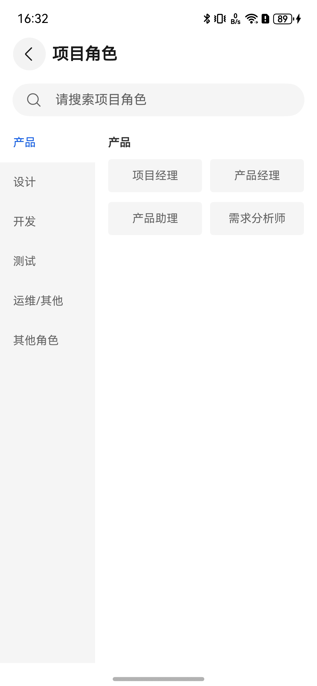 |

### 我的模块

|                                 我的简历                                 |                              收藏模板                               |                              设置                               |
|:--------------------------------------------------------------------:|:---------------------------------------------------------------:|:-------------------------------------------------------------:|
| 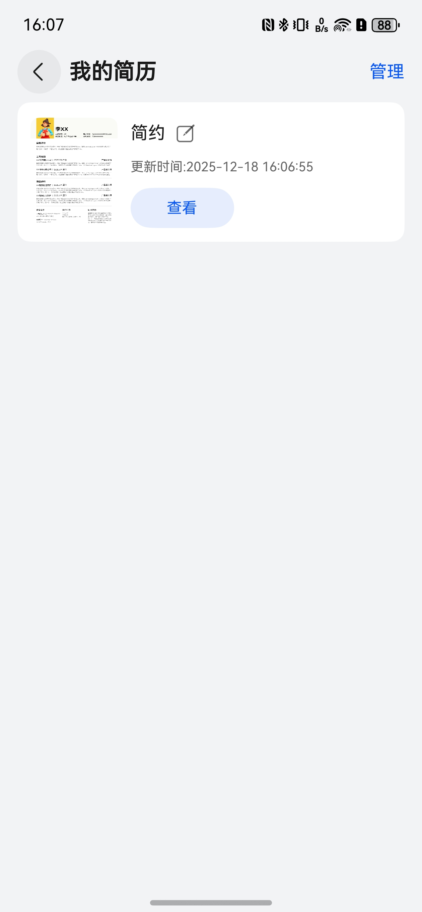 | 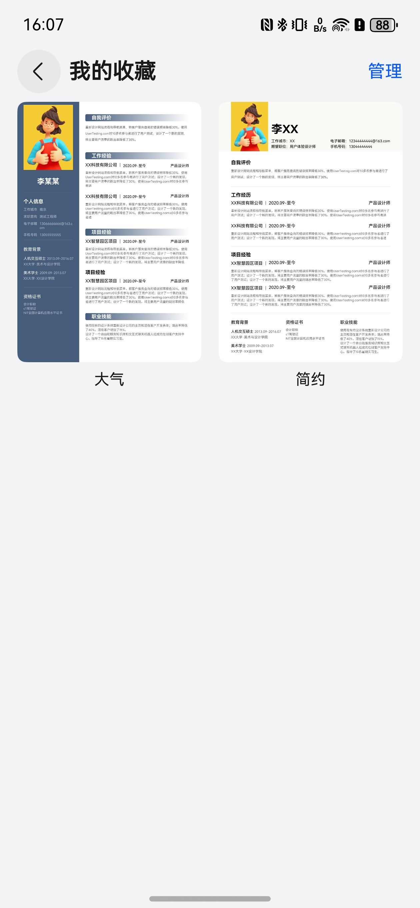 | 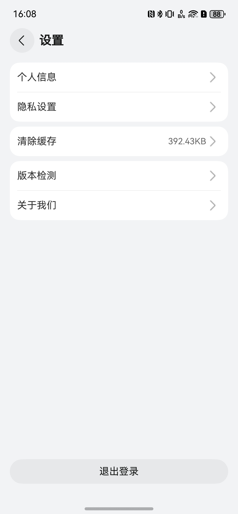 |

## 开源许可协议

该代码经过[Apache 2.0 授权许可](http://www.apache.org/licenses/LICENSE-2.0)。
