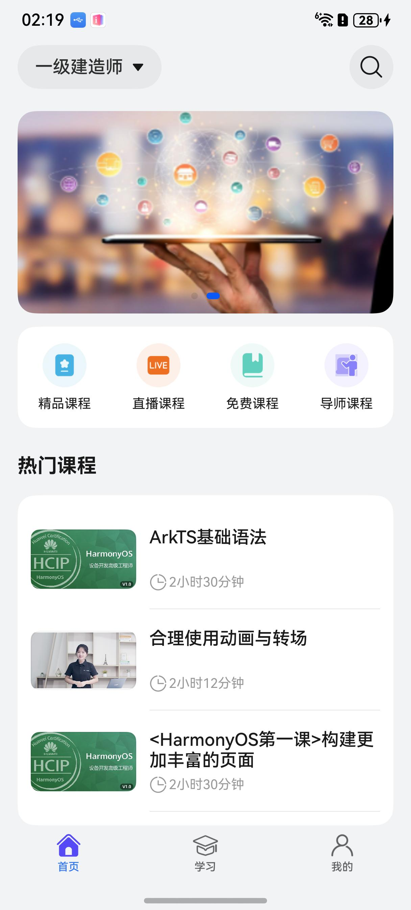
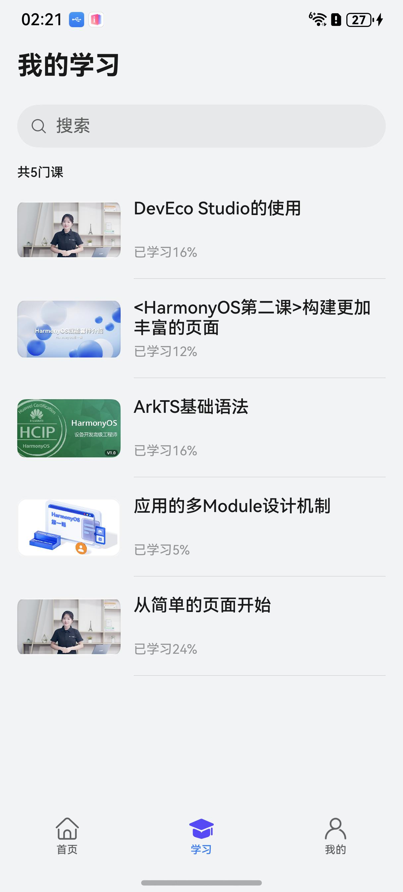
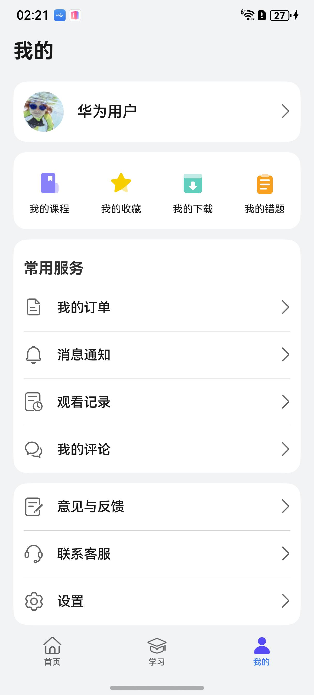
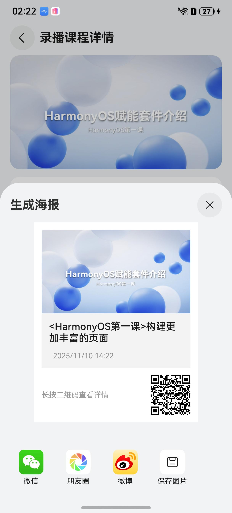
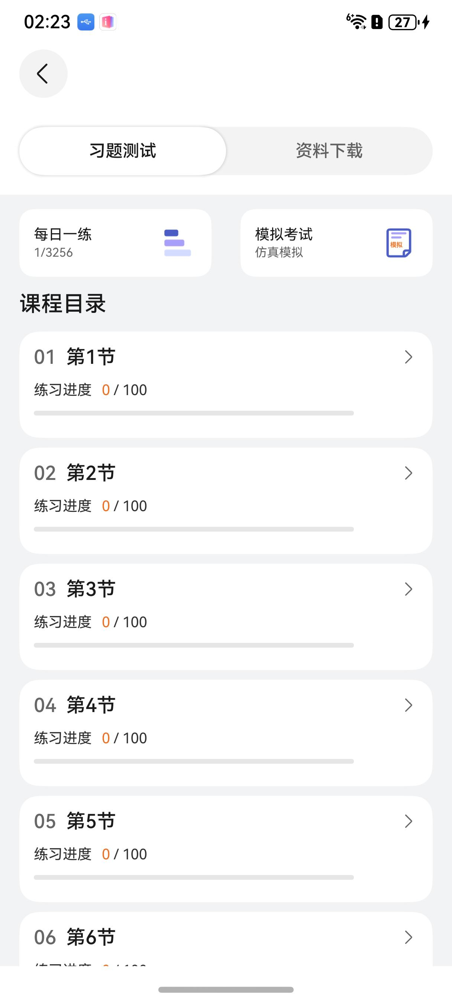
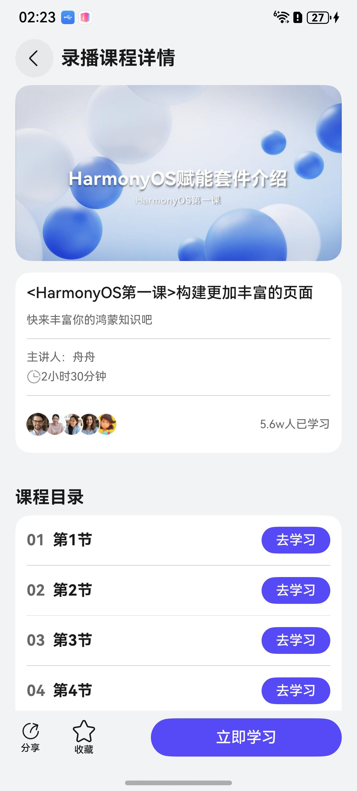

# 教育（学习）应用模板快速入门

## 目录

- [功能介绍](#功能介绍)
- [约束与限制](#约束与限制)
- [快速入门](#快速入门)
- [示例效果](#示例效果)
- [开源许可协议](#开源许可协议)

## 功能介绍

您可以基于此模板直接定制应用，也可以挑选此模板中提供的多种组件使用，从而降低您的开发难度，提高您的开发效率。

此模板提供如下组件，所有组件存放在工程根目录的components下，如果您仅需使用组件，可参考对应组件的指导链接；如果您使用此模板，请参考本文档。

| 组件                         | 描述                      | 使用指导                                            |
|:---------------------------|:------------------------| :-------------------------------------------------- |
| 播放组件（recorded_player）      | 视频播放支持加解锁、画中画、倍速、分辨率等功能 | [使用指导](components/recorded_player/README.md)    |
| 通用支付组件（aggregated_payment） | 支付能力                    | [使用指导](components/aggregated_payment/README.md) |
| 通用分享组件（aggregated_share）   | 分享能力                    | [使用指导](components/aggregated_share/README.md)   |
| 意见反馈组件（feed_back）          | 意见反馈                    | [使用指导](components/feed_back/README.md)          |
| 登录组件（login_info）           | 登录功能                    | [使用指导](components/login_info/README.md)         |

本模板为教育类应用提供了常用功能的开发样例，对视频播放器进行了定制化的开发，模板主要分首页、学习、我的三大模块：
* 首页：提供推荐课程信息流、搜索等功能。

* 学习：提供学习记录、视频播放等功能。

* 我的：提供个人信息查看、消息、意见反馈、设置等功能。

本模板已集成华为账号、广告等服务，只需做少量配置和定制即可快速实现华为账号的登录、媒体播放等功能。

| 首页                                                 | 学习                                                 | 我的                                                 |
|----------------------------------------------------|----------------------------------------------------|----------------------------------------------------|
|  |  |  |

本模板主要页面及核心功能如下所示：

```text
教育学习应用模板
  ├──首页                           
  │   ├──顶部栏-搜索  
  │   │   ├── 搜索                          
  │   │   └── 职级分类选择                      
  │   │         
  │   ├──课堂列表    
  │   │   ├── 动态布局                                             
  │   │   ├── 信息流                         
  │   │   └── 功能区                      
  │   └──课堂详情    
  │       ├── 图文                                             
  │       ├── 收藏、评论                         
  │       ├── 分享（微信、朋友圈、QQ、生成海报、复制链接等）
  │       └── 视频                      
  ├──学习                           
  │   ├──顶部栏                        
  │   │   └── 搜索                      
  │   ├──课堂列表    
  │   └──视频详情页         
  │       ├── 竖屏播放
  │       ├── 横屏播放
  │       ├── 暂停、播放、进度调节、倍速、选集、画中画
  │       └── 收藏、评论、分享                            
  │
  └──我的                           
      ├──登录  
      │   ├── 华为账号一键登录                          
      │   ├── 微信登录                                                   
      │   ├── 账密登录
      │   └── 用户隐私协议同意                       
      │         
      ├──个人主页         
      │   └── 头像、昵称、简介
      │                    
      ├──功能栏    
      │   ├── 我的课程                                        
      │   ├── 我的收藏                   
      │   ├── 我的下载                             
      │   └── 我的错题
      │
      └──常用服务    
          ├── 订单                                        
          ├── 消息        
          ├── 评论    
          ├── 观看记录           
          ├── 意见反馈                     
          └── 设置
               ├── 编辑个人信息             
               ├── 隐私设置           
               ├── 播放设置             
               ├── 清理缓存           
               ├── 检测版本 
               ├── 关于我们 
               └── 退出登录                               
```

本模板工程代码结构如下所示：

```text
Course
├──commons
│  ├──commonlib/src/main/ets                              // 基础模块             
│  │    ├──components
│  │    │   ├──BottomEditBar.ets                          // 底部编辑组件
│  │    │   ├──CourseItemComponent.ets                    // 课程列表组件
│  │    │   ├──DeleteDialog.ets                           // 删除按钮组件
│  │    │   ├──DialogComponent.ets                        // 自适应弹框组件
│  │    │   ├──GlobalAttributeModifier.ets                // 自定义动态属性
│  │    │   ├──LeftSwipeComponent.ets                     // 编辑组件
│  │    │   ├──NoData.ets                                 // 空数据页面
│  │    │   └──TopBar.ets                                 // 标题栏               
│  │    ├──constants  
│  │    │   ├──CommonConstants.ets                        // 常量
│  │    │   └──CommonEnums.ets                            // 路由页面         
│  │    ├──models  
│  │    │   ├──CollectionModel.ets                        // 收藏
│  │    │   ├──DownloadModel.ets                          // 下载
│  │    │   ├──MyCourseModel.ets                          // 我的课程
│  │    │   ├──OrderInfo.ets                              // 订单数据模型
│  │    │   ├──TopicItemModel.ets                         // 题目数据模型
│  │    │   ├──UserInfo.ets                               // 用户信息
│  │    │   ├──WindowSize.ets                             // 窗口数据模型
│  │    │   └──WrongQuestionModel.ets                     // 错题数据模型                           
│  │    └──utils  
│  │        ├──DialogUtil.ets                             // 弹框
│  │        ├──Logger.ets                                 // 日志
│  │        ├──NumberUtil.ets                             // 数据格式化
│  │        ├──PermissionUtil.ets                         // 权限
│  │        ├──PreferenceUtil.ets                         // 首选项
│  │        └──RouterModule.ets                           // 路由 
│  │
│  │ 
│  └──http/src/main/ets                                   // 网络模块       
│       ├──apis
│       │    ├──Apis.ets                                  // 请求接口
│       │    └──HttpRequest.ets                           // 请求对象
│       ├──mocks  
│       │    ├──AxiosMock.ets                             // mock
│       │    ├──RequestMock.ets                           // 请求mock数据
│       │    └──Data
│       │         └──CourseData.ets                       // 数据源
│       ├──model  
│       │   └──CourseModel.ets                            // 课程数据模型         
│       ├──tools  
│       │   └──ConvertTool.ets                            // 模型转换工具                           
│       └──types  
│           └──Course.ets                                 // 课程数据协议 
├──components
│  ├──aggregated_payment                                   // 支付组件                     
│  ├──aggregated_share                                     // 分享组件
│  ├──classification                                       // 分类组件 
│  ├──feed_back                                            // 意见反馈组件
│  ├──login_info                                           // 登录组件
│  ├──open_ads                                             // 广告组件
│  ├──search                                               // 搜索组件
│  ├──live_streaming                                       // 直播间组件
│  └──recorded_player                                      // 视频播放组件            
├──features                
│  ├──course/src/main/ets                                  // 学习课程模块             
│  │    ├──component
│  │    │   └──CourseStudyComponent.ets                    // 课程数据源                
│  │    ├──viewModels
│  │    │   └──CourseVM.ets                                // 课程数据源                
│  │    └──views 
│  │        └──MyLearnPage.ets                             // 学习页面              
│  │
│  ├──home/src/main/ets                                    // 首页模块     
│  │    ├──components
│  │    │   ├──AnswerQuestionsComponent.ets                // 答题view
│  │    │   ├──CommentPopup.ets                            // 评分弹框
│  │    │   ├──CourseCatalogComponents.ets                 // 课程章节弹框
│  │    │   ├──DescribeComponent.ets                       // 详情描述view
│  │    │   ├──DownLoadSheet.ets                           // 下载sheet
│  │    │   ├──LiveBroadcastSign.ets                       // 直播标签view
│  │    │   ├──LiveNumberOverlay.ets                       // 数量view
│  │    │   ├──LiveStreamingItem.ets                       // 直播列表item
│  │    │   ├──AnswerSheetDialog.ets                       // 答题卡view
│  │    │   └──HomeTop.ets                                 // 首页职能类型选择页面      
│  │    ├──models
│  │    │   ├──Practice.ets                                // 模块数据
│  │    │   ├──HomeMenuModel.ets                           // 课程数据
│  │    │   ├──SelectRoleModel.ets                         // 职称级别数据
│  │    │   └──Score.ets                                   // 打分数据            
│  │    ├──viewModels
│  │    │   ├──CourseCatalogVM.ets                         // 章节数据刷新
│  │    │   └──HomeVM.ets                                  // 首页数据刷新               
│  │    └──pages
│  │        ├──AnswerQuestionsExamPage.ets                 // 答题页面
│  │        ├──AnswerQuestionsPage.ets                     // 答题view
│  │        ├──AnswerSheetPage.ets                         // 答题卡页面
│  │        ├──ChapterDetail.ets                           // 章节详情页面
│  │        ├──CourseListPage.ets                          // 课程页页面
│  │        ├──ExamResultPage.ets                          // 答题结果页面
│  │        ├──HomePage.ets                                // 首页
│  │        ├──HomeSearch.ets                              // 搜索页面
│  │        ├──LiveStreamingListPage.ets                   // 直播列表页面
│  │        ├──InputCommentPage.ets                        // 文本输入页面
│  │        ├──LiveDetailPage.ets                          // 直播前页面
│  │        ├──LiveStreamingPage.ets                       // 直播中页面
│  │        ├──LookFilePage.ets                            // 文件预览页面
│  │        ├──MaterialPage.ets                            // 资料页面
│  │        ├──TestReportPage.ets                          // 结果页面
│  │        └──RecordedDetail.ets                          // 课程详情页面  
│  └──mine/src/main/ets                                    // 个人模块      
│       ├──viewModel
│       │   └──MyVM.ets                                    // 数据处理层                      
│       ├──models
│       │   ├──MessageModel.ets                            // 消息数据
│       │   ├──SystemMessageModel.ets                      // 系统消息数据
│       │   └──ServiceModel.ets                            // 模块服务数据     
│       ├──component
│       │   ├──CourseHistoryComponent.ets                  // 观看记录item
│       │   └──TopicItemComponent.ets                      // 题目标题     
│       └──views
│           ├──AboutAndVersion.ets                         // 关于页面
│           ├──AboutPage.ets                               // 设置页面
│           ├──Authentication.ets                          // 用户协议页面
│           ├──CourseUpdateMessagePage.ets                 // 课程动态消息页面
│           ├──DataSharingPage.ets                         // 三方信息页面
│           ├──FeedbackPage.ets                            // 意见反馈页面
│           ├──FeedbackRecordsPage.ets                     // 反馈记录
│           ├──MessageListCard.ets                         // 消息列表组件页面
│           ├──MessagePage.ets                             // 消息页面
│           ├──MinePage.ets                                // 个人页面
│           ├──MultiLineText.ets                           // 消息组件页面
│           ├──MyCollectionPage.ets                        // 收藏页面
│           ├──MyCourseComments.ets                        // 课程评论页面
│           ├──MyCoursePage.ets                            // 课程页面
│           ├──MyDownloadPage.ets                          // 下载页面
│           ├──MyOrderPage.ets                             // 订单页面
│           ├──MyWrongQuestionPage.ets                     // 错题页面
│           ├──OrderListPage.ets                           // 订单列表页面
│           ├──OrderDetailPage.ets                         // 订单列表页面
│           ├──PersonalInfoPage.ets                        // 个人信息页面
│           ├──PersonalInformationCollectionPage.ets       // 个人信息收集页面
│           ├──PrivacyAgreement.ets                        // 隐私协议页面
│           ├──PrivacySetPage.ets                          // 隐私设置页面
│           ├──PrivacyStatement.ets                        // 隐私声明页面
│           ├──SetUpPage.ets                               // 设置页面
│           ├──SystemMessage.ets                           // 系统消息页面
│           ├──UpdateVersionContentCard.ets                // 版本更新页面
│           ├──WatchHistoryPage.ets                        // 观看记录页面
│           └──UserAgreement.ets                           // 服务协议页面   
│
└──product
   └──entry/src/main/ets    
        ├──viewmodels                                      // 首页数据
        │   └──MainEntryVM.ets    
        ├──entryability                                    // 入口
        │   └──EntryAbility.ets                                       
        ├──entrybackupability                              // 后台
        │   └──EntryBackupAbility.ets        
        ├──models             
        │   ├──RouterTable.ets                             // 路由表
        │   └──Types.ets                                   // tab数据类型
        └──pages   
           ├──Index.ets                                    // 入口页面
           ├──Launch.ets                                   // 启动页面
           ├──LaunchAd.ets                                 // 广告页面
           ├──Login.ets                                    // 登录页面
           ├──MainEntry.ets                                // 主页面
           ├──PrivacyPolicy.ets                            // 隐私页面
           └──PrivacyPolicyAlert.ets                       // 隐私弹框页面
 
```

## 约束与限制

### 环境

- DevEco Studio版本：DevEco Studio 5.0.5 Release及以上
- HarmonyOS SDK版本：HarmonyOS 5.0.5 Release SDK及以上
- 设备类型：华为手机（包括双折叠和阔折叠）
- 系统版本：HarmonyOS 5.0.5(17)及以上

### 权限

- 网络权限: ohos.permission.INTERNET, ohos.permission.GET_NETWORK_INFO, ohos.permission.GET_WIFI_INFO

### 调试
由于当前模拟器无法兼容支付宝SDK，若您需要在模拟器环境下进行相关测试，请参考支付组件中的[使用说明](components/aggregated_payment/README.md)
## 快速入门

### 配置工程

在运行此模板前，需要完成以下配置：

1. 在AppGallery Connect创建应用，将包名配置到模板中。

   a. 参考[创建HarmonyOS应用](https://developer.huawei.com/consumer/cn/doc/app/agc-help-create-app-0000002247955506)为应用创建APP ID，并将APP ID与应用进行关联。

   b. 返回应用列表页面，查看应用的包名。

   c. 将模板工程根目录下AppScope/app.json5文件中的bundleName替换为创建应用的包名。

2. 配置华为账号服务。

   a. 将应用的Client ID配置到products/phone/src/main路径下的module.json5文件中，详细参考：[配置Client ID](https://developer.huawei.com/consumer/cn/doc/harmonyos-guides/account-client-id)。

   b. 申请华为账号一键登录权限，详细参考：[申请账号权限](https://developer.huawei.com/consumer/cn/doc/harmonyos-guides/account-config-permissions)。

3. 配置广告服务。

   a. 如果仅调测广告，可使用测试广告位ID：开屏广告：testd7c5cewoj6、横幅广告：testw6vs28auh3。

   b. 申请正式的广告位ID。
   登录[鲸鸿动能媒体服务平台](https://developer.huawei.com/consumer/cn/monetize)进行申请，具体操作详情请参见[展示位创建](https://developer.huawei.com/consumer/cn/doc/distribution/monetize/zhanshiweichuangjian-0000001132700049)。

4. 接入微信SDK。
   前往微信开放平台申请AppID并配置鸿蒙应用信息，详情参考：[鸿蒙接入指南](https://developers.weixin.qq.com/doc/oplatform/Mobile_App/Access_Guide/ohos.html)。

5. 对应用进行[手工签名](https://developer.huawei.com/consumer/cn/doc/harmonyos-guides/ide-signing#section297715173233)。

6. 添加手工签名所用证书对应的公钥指纹，详细参考：[配置应用签名证书指纹](https://developer.huawei.com/consumer/cn/doc/app/agc-help-cert-fingerprint-0000002278002933)。

### 运行调试工程

1. 连接调试手机和PC。

2. 菜单选择“Run > Run 'entry' ”或者“Run > Debug 'entry' ”，运行或调试模板工程。

## 示例效果

未加锁


加锁


更多


举报


| 分享                                                  | 习题练习                                                | 课程学习                                                |
|-----------------------------------------------------|-----------------------------------------------------|-----------------------------------------------------|
|  |  |  |


## 开源许可协议

该代码经过[Apache 2.0 授权许可](http://www.apache.org/licenses/LICENSE-2.0)。

