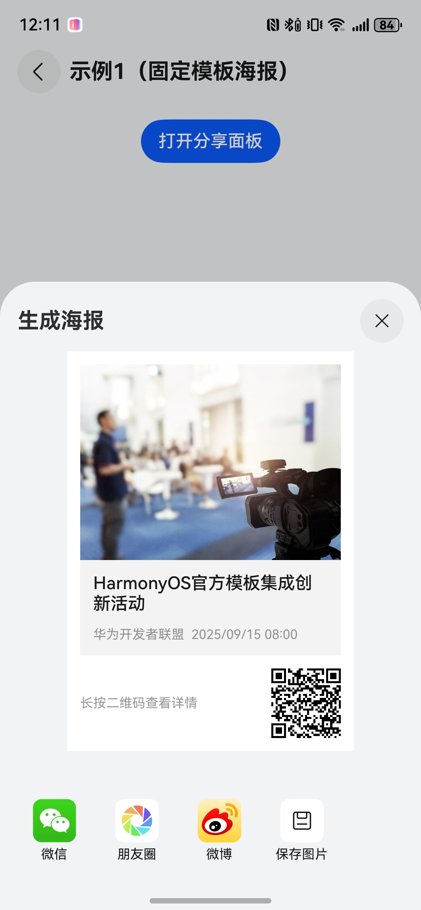
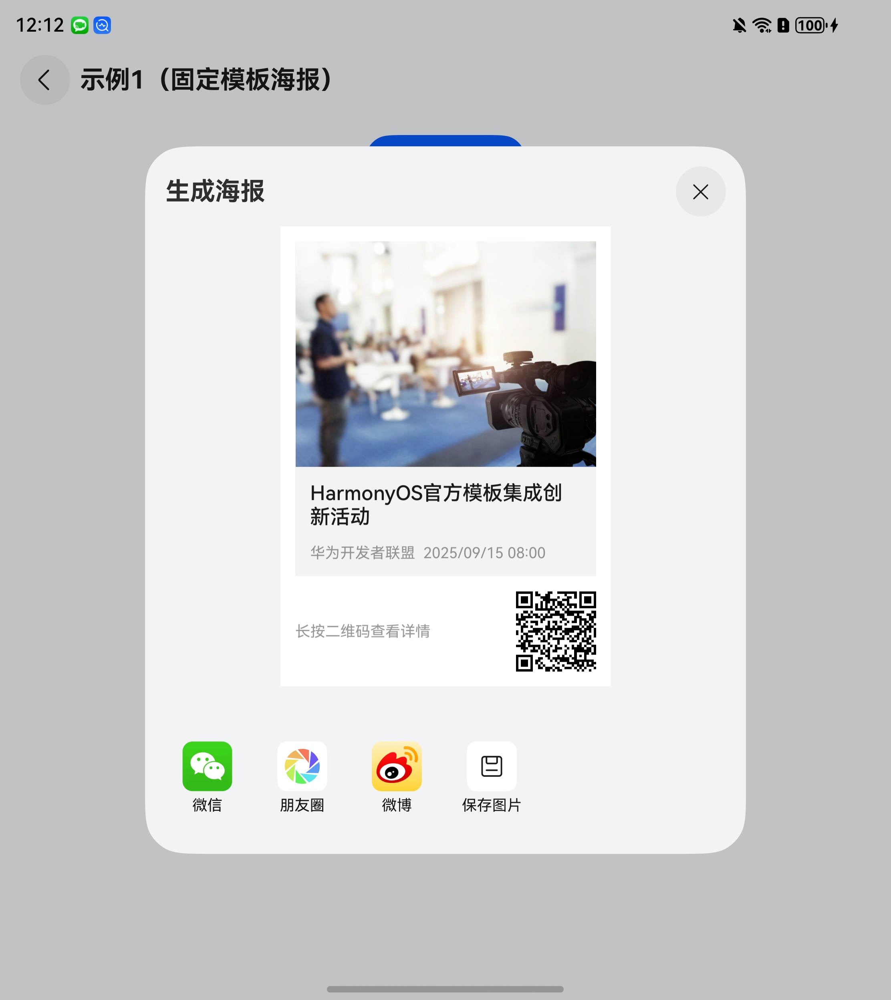

# 通用分享组件快速入门

## 目录

- [简介](#简介)
- [约束与限制](#约束与限制)
- [快速入门](#快速入门)
- [API参考](#API参考)
- [示例代码](#示例代码)

## 简介

本组件支持分享到微信好友、朋友圈、QQ、微博等，支持碰一碰分享、生成海报、系统分享等功能。

<div style='overflow-x:auto'>
  <table style='min-width:800px'>
    <tr>
      <th></th>
      <th>直板机</th>
      <th>折叠屏/平板</th>
    </tr>
    <tr>
      <th scope='row'>分享面板</th>
      <td valign='top'></td>
      <td valign='top'></td>
    </tr>
    <tr>
      <th scope='row'>分享海报</th>
      <td valign='top'></td>
      <td valign='top'></td>
    </tr>
  </table>
</div>

## 约束与限制

### 环境

- DevEco Studio版本：DevEco Studio 5.0.3 Release及以上
- HarmonyOS SDK版本：HarmonyOS 5.0.3 Release SDK及以上
- 设备类型：华为手机（包括双折叠和阔折叠）、平板
- 系统版本：HarmonyOS 5.0.1(13)及以上

### 权限

- 网络权限：ohos.permission.INTERNET

### 使用约束
- 碰一碰分享：任意一端设备不支持碰一碰能力时，轻碰无任何响应，详细参考：[手机与手机碰一碰分享](https://developer.huawei.com/consumer/cn/doc/harmonyos-guides/knock-share-phone-to-phone#section15384182281511)。

## 快速入门

1. 安装组件。

   如果是在DevEco Studio使用插件集成组件，则无需安装组件，请忽略此步骤。

   如果是从生态市场下载组件，请参考以下步骤安装组件。

   a. 解压下载的组件包，将包中所有文件夹拷贝至您工程根目录的XXX目录下。

   b. 在项目根目录build-profile.json5添加aggregated_share模块。

   ```
   // 项目根目录下build-profile.json5填写aggregated_share路径。其中XXX为组件存放的目录名
   "modules": [
     {
       "name": "aggregated_share",
       "srcPath": "./XXX/aggregated_share"
     }
   ]
   ```

   c. 在项目根目录oh-package.json5添加依赖。

   ```
   // XXX为组件存放的目录名称
   "dependencies": {
     "aggregated_share": "file:./XXX/aggregated_share"
   }
   ```

2. 引入组件。

   ```
   import { SharePicker } from 'aggregated_share';
   ```
3. 调用组件，详细组件调用参见[示例代码](#示例代码)。

   ```
   import { SharePicker } from 'aggregated_share';
   
   @Entry
   @ComponentV2
   export struct Index {
     build() {
       Column(){
       Button('打开分享面板')
         onClick(() => {
          const picker: SharePicker = new SharePicker({
            title: 'HarmonyOS官方模板集成创新活动',
          });
          picker.show();
         )
       }
     }
   }
   ```

4. （可选）接入微信SDK。前往微信开放平台申请AppID并配置鸿蒙应用信息，详情参考：[鸿蒙接入指南](https://developers.weixin.qq.com/doc/oplatform/Mobile_App/Access_Guide/ohos.html)。
5. （可选）接入QQ SDK。前往QQ开放平台申请AppID并配置鸿蒙应用信息，详情参考：[SDK接入流程](https://wiki.connect.qq.com/sdk%E6%8E%A5%E5%85%A5%E4%BD%BF%E7%94%A8%E8%AF%B4%E6%98%8E%E6%96%87%E6%A1%A3)。
6. （可选）接入微博SDK。前往微博开放平台申请应用并下载SDK，详情参考：[SDK资源](https://open.weibo.com/wiki/SDK)。
7. 在项目的entry模块下src/main/module.json5中添加配置。
   ```
   "querySchemes": [
      "weixin",
      "wxopensdk",
      "qqopenapi",
      "https"
    ],
   ```
   ```
   "skills": [
     {
       "entities": [
         "entity.system.home",
         "entity.system.browser"
       ],
       "actions": [
         "action.system.home",
         "wxentity.action.open",
         "ohos.want.action.viewData"
       ],
       "uris": [
         {
           // 接收QQ回调数据
           "scheme": "qqopenapi",
           // todo 填写业务申请的QQ互联AppId，如果填错会导致QQ无法回调
           "host": "102061317",
           "pathRegex": "\\b(auth|share)\\b",
         },
       ],
       "domainVerify": true
     }
   ]
   ```
     

8. 在项目的entry模块下src/main/ets/entryability/EntryAbility.ets中初始化SDK和应用回调。

   ```
   import { ShareService } from 'aggregated_share';
   
   export default class EntryAbility extends UIAbility {
     // 实例化分享服务
     private shareServiceImpl: ShareService =
       ShareService.create()
          // todo 填写微信开放平台配置的应用AppID
          .initWX('wxc92d9d6570127a32')
          // todo 填写QQ互联平台配置的应用AppID
          .initQQ(102061317);
   
     onNewWant(want: Want): void {
       this.shareServiceImpl.handleWant(want, this.context);
     }
   
     onCreate(want: Want): void {
       this.shareServiceImpl.handleWant(want, this.context);
     }
   }
   ```

9. （可选）如果需要接入微博分享，需要完成以下步骤。

   a. 将步骤6下载好的微博SDK包core.har拷贝至您工程根目录的XXX目录下（与步骤1创建的XXX目录名称一致）。

   b. 在项目根目录oh-package.json5添加依赖。

   ```
   // 其中XXX为SDK存放的目录名。
   "dependencies": {
     "core": "file:./XXX/core.har"
   }
   ```

   c. 在项目根目录XXX/aggregated_share/oh-package.json5中，修改微博SDK依赖路径。

   ```
   "dependencies": {
     "core": "file:../core.har"
   }
   ```

   d. 在项目的entry模块的src/main/ets目录下，创建文件：abilitystage/MyAbilityStage.ets。

   ```
   import AbilityStage from '@ohos.app.ability.AbilityStage';
   import { WBAPI, AuthInfo, SdkListener, WeiboLogger, Utility } from 'core';
   
   const TAG = 'MyAbilityStage';
   
   export default class MyAbilityStage extends AbilityStage {
     private logger: WeiboLogger = new WeiboLogger('weibo_sdk_demo');
     // todo: 填写实际的AppKey
     private readonly APP_KEY = '2045436852';
     // todo: 填写实际的重定向地址
     private readonly REDIRECT_URL = 'http://www.sina.com';
     // todo: 填写实际的scope。注意：scope为""，表示没有申请的高级权限，则走快捷授权流程
     private readonly SCOPE =
       'email,direct_messages_read,direct_messages_write,' +
         'friendships_groups_read,friendships_groups_write,statuses_to_me_read,' + 'follow_app_official_microblog,' +
         'invitation_write';
   
     onCreate(): void {
       // 调试时可以打开log开关 默认是false;
       WeiboLogger.logEnable = true;
       // true：代表使用appid校验  false: 代表使用证书fingerprint校验
       new Utility().getSign(true).then(sign => {
         // 获取debug和release包对应的签名，用于开放平台注册。获取完成可删除此代码。
         this.logger.debug(TAG, 'get sign: ' + sign);
       })
       this.initSdk();
     }
   
     private initSdk(): void {
       let authInfo: AuthInfo = new AuthInfo(this.context, this.APP_KEY, this.REDIRECT_URL, this.SCOPE, true);
       let listener: SdkListener = {
         onInitSuccess: () => {
           this.logger.debug(TAG, 'init sdk success');
         },
         onInitFail: (error: Error) => {
           this.logger.debug(TAG, 'init sdk failed errmsg: ' + error.message);
         },
       };
       WBAPI.getInstance().registerApp(authInfo, listener);
     }
   }
   ```

   e. 在工程的entry模块下添加配置。

   ```
   {
     "module": {
       "srcEntry": "./ets/abilitystage/MyAbilityStage.ets",
     }
   }
   ```
   

## API参考

### SharePicker

分享picker。

#### constructor(record: [ShareRecordData](#ShareRecordData))

构造函数。

#### show(options?: [ShareOptions](#ShareOptions)): void

拉起分享半模态弹窗。

#### close(): void

关闭分享半模态弹窗。

#### setWindowLayoutFullScreen(isLayoutFullScreen: boolean): SharePicker

设置应用窗口模式。

#### setSignQQShareDataCB(callback: (shareJson: string) => Promise<[QQShareData](#QQShareData)>): SharePicker

设置QQ互联分享签名。

---

### ShareService

分享服务。

#### static create(): ShareService

创建实例。

#### initWX(appId: string): ShareService

初始化微信SDK。

#### initQQ(appId: number): ShareService

初始化QQ SDK。

#### handleWant(want: Want, context: common.UIAbilityContext): void

处理被分享应用的want信息。

---

### ShareRecordData

分享数据记录，包含标题、链接等信息。

| 参数名            | 类型          | 是否必填 | 说明                                         |
|:---------------|:------------|:-----|:-------------------------------------------|
| recordId       | string      | 否    | 分享数据的唯一标识，默认值：系统自动生成随机数。                   |
| title          | string      | 是    | 标题。                                        |
| subTitle       | string      | 否    | 副标题。                                       |
| coverUrl       | string      | 否    | 封面图片链接。                                    |
| thumbUrl       | ResourceStr | 否    | 缩略图链接，支持网络图片和本地资源引用，比如$r('app.media.xxx')。 |
| landingPageUrl | string      | 否    | 落地页链接。                                     |
| createTime     | number      | 否    | 创建时间（Unix 时间戳，单位：毫秒）。                      |

### ShareOptions

分享配置项，用于设置分享面板标题、是否自动关闭、屏蔽分享方式等。

| 参数名               | 类型                                                                 | 是否必填 | 说明                            |
|:------------------|:-------------------------------------------------------------------|:-----|:------------------------------|
| autoClose         | boolean                                                            | 否    | 分享面板是否在分享成功后自动关闭。默认值： `true`。 |
| directPoster      | boolean                                                            | 否    | 是否直接拉起生成海报面板。默认为 `false`。     |
| extComponentId    | string                                                             | 否    | 外部组件ID，可用于自定义生成海报。            |
| sheetTitle        | string                                                             | 否    | 分享面板的标题。 默认值：`分享到`。           |
| posterSheetTitle  | string                                                             | 否    | 生成海报面板的标题。默认值：`生成海报`。         |
| excludedAbilities | ([ShareAppType](#ShareAppType枚举说明) \| [ShareWay](#ShareWay枚举说明))[] | 否    | 排除的分享方式或分享操作。默认值：`[]`。        |

### QQShareData

继承qq-open-sdk中的ShareData，字段参考[接口说明](https://wiki.connect.qq.com/harmonyos_sdk%e6%8e%a5%e5%8f%a3%e8%af%b4%e6%98%8e)。

### ShareAppType枚举说明

方式区支持的应用。

| 名称              | 说明     |
|:----------------|:-------|
| WECHAT_SESSION  | 分享到微信  |
| WECHAT_TIMELINE | 分享到朋友圈 |
| QQ              | 分享到QQ  |
| WEIBO           | 分享到微博  |

### ShareWay枚举说明

操作区支持的方式。

| 名称                 | 说明    |
|:-------------------|:------|
| POSTER             | 生成海报  |
| COPY_TO_PASTEBOARD | 复制    |
| SYSTEM             | 系统分享  |
| SAVE_TO_ALBUM      | 保存到图库 |

## 示例代码

### 示例1（固定模板海报）

```
import { QQShareData, SharePicker } from 'aggregated_share';

@Entry
@ComponentV2
struct ShareSample1 {
  build() {
    NavDestination() {
      Column({ space: 24 }) {
        Button('打开分享面板')
          .onClick(() => {
            const picker: SharePicker = new SharePicker({
              title: 'HarmonyOS官方模板集成创新活动',
              subTitle: '华为开发者联盟',
              coverUrl: 'https://agc-storage-drcn.platform.dbankcloud.cn/v0/template-thwjd/commonwidget%2Fexample960x720.png',
              createTime: new Date('2025/09-15 08:00:00').getTime(),
              thumbUrl: 'https://agc-storage-drcn.platform.dbankcloud.cn/v0/template-thwjd/commonwidget%2Fexample960x720.png',
              landingPageUrl: 'https://developer.huawei.com/consumer/cn/activity/301757474300821213',
            });

            picker.setSignQQShareDataCB((shareJson: string) => {
              const signData = new QQShareData();
              signData.shareJson = shareJson;
              signData.timestamp = Date.parse(new Date().toString()) / 1000;
              signData.nonce = 62695688;
              signData.shareJsonSign = 'Hsvqs0IpjiN6DfFfhboGp+r3XzQ=';
              return Promise.resolve(signData);
            })

            picker.show({
              autoClose: true,
            });
          })
      }
      .padding(16)
    }
    .title('示例1（固定模板海报）')
    .backgroundColor($r('sys.color.background_secondary'))
  }
}
```

### 示例2（自定义海报截图）

```
import { SharePicker } from 'aggregated_share';

@Entry
@ComponentV2
struct ShareSample2 {
  @Local coverUrl: string =
    'https://agc-storage-drcn.platform.dbankcloud.cn/v0/template-thwjd/commonwidget%2Fexample960x720.png';

  build() {
    NavDestination() {
      Scroll() {
        Column({ space: 24 }) {
          Column({ space: 16 }) {
            Image(this.coverUrl)
              .width('100%')
              .constraintSize({ maxWidth: 480 })
            Text('HarmonyOS官方模板集成创新活动')
              .fontSize(20)
              .fontColor($r('sys.color.font_primary'))
              .fontWeight(FontWeight.Medium)
          }
          .id('customSnapshotId')
          .alignItems(HorizontalAlign.Start)
          .backgroundColor($r('sys.color.comp_background_primary'))
          .padding(12)

          Button('打开分享面板')
            .onClick(() => {
              const picker: SharePicker = new SharePicker({
                title: 'HarmonyOS官方模板集成创新活动',
                subTitle: '华为开发者联盟',
                coverUrl: this.coverUrl,
                createTime: new Date('2025/09-15 08:00:00').getTime(),
                landingPageUrl: 'https://developer.huawei.com/consumer/cn/activity/301757474300821213',
              });
              picker.show({
                extComponentId: 'customSnapshotId',
                directPoster: true,
              });
            })
        }
        .padding(16)
      }
      .scrollBar(BarState.Off)
      .align(Alignment.Top)
      .edgeEffect(EdgeEffect.Spring)
    }
    .title('示例2（自定义海报截图）')
    .backgroundColor($r('sys.color.background_secondary'))
  }
}
```