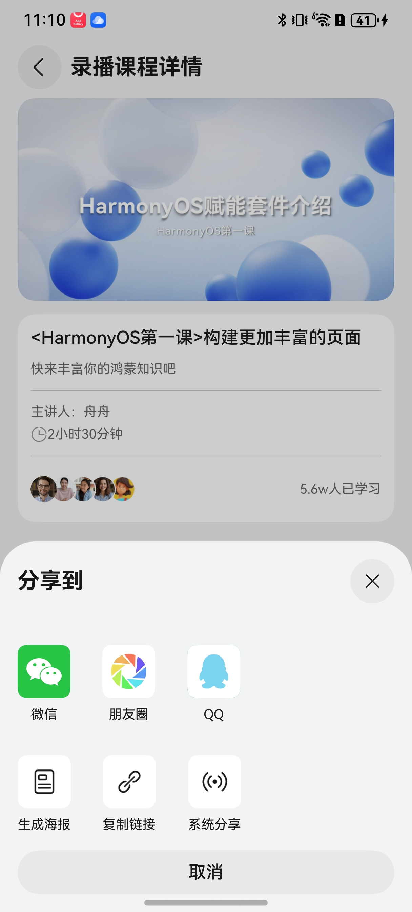
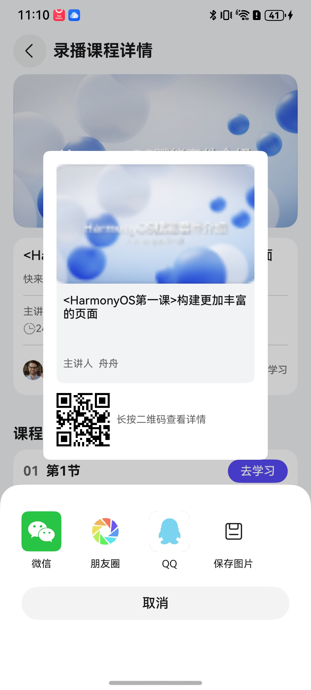

# 分享组件快速入门

## 目录

- [简介](#简介)
- [约束与限制](#约束与限制)
- [使用](#使用)
- [API参考](#API参考)
- [示例代码](#示例代码)

## 简介

本组件支持微信、朋友圈、qq、生成海报、系统分享等分享功能。

| 分享                                             | 生成海报                                         |
| ------------------------------------------------ | ------------------------------------------------ |
|  |  |


## 约束与限制

### 环境

- DevEco Studio版本：DevEco Studio 5.0.3 Release及以上
- HarmonyOS SDK版本：HarmonyOS 5.0.3 Release SDK及以上
- 设备类型：华为手机（包括双折叠和阔折叠）
- 系统版本：HarmonyOS 5.0.1(13)及以上

### 权限

- 网络权限：ohos.permission.INTERNET

## 使用

1. 安装组件。

   如果是在DevEco Studio使用插件集成组件，则无需安装组件，请忽略此步骤。

   如果是从生态市场下载组件，请参考以下步骤安装组件。

   a. 解压下载的组件包，将包中所有文件夹拷贝至您工程根目录的XXX目录下。

   b. 在项目根目录build-profile.json5添加aggregated_share模块。

   ```
   // 项目根目录下build-profile.json5填写aggregated_share路径。其中XXX为组件存放的目录名
   "modules": [
     {
       "name": "aggregated_share",
       "srcPath": "./XXX/aggregated_share"
     }
   ]
   ```

   c. 在项目根目录oh-package.json5添加依赖。

   ```
   // XXX为组件存放的目录名称
   "dependencies": {
     "aggregated_share": "file:./XXX/aggregated_share"
   }
   ```

2. 引入组件。

   ```
   import { Share } from 'aggregated_share';
   ```
3. 在entry/src/main 目录下的module.json5文件添加配置，详细参考如下代码。
   ```
   "querySchemes": [
      "weixin",
      "wxopensdk"
    ],
   
   "skills": [
          {
            "entities": [
              "entity.system.home"
            ],
            "actions": [
              "action.system.home",
              "wxentity.action.open"
            ]
          }
        ]
   "metadata": [
      {
        /*
        * 替换应用的Client ID
        */
        "name": "client_id",
        "value": "xxx"
      }
    ]
   ```
4. 接入微信SDK。
   前往微信开放平台申请AppID并配置鸿蒙应用信息，详情参考：[鸿蒙接入指南](https://developers.weixin.qq.com/doc/oplatform/Mobile_App/Access_Guide/ohos.html)。
5. 接入QQ。
   前往QQ开放平台申请AppID并配置鸿蒙应用信息，详情参考：[鸿蒙接入指南](https://wiki.connect.qq.com/sdk%e4%b8%8b%e8%bd%bd)。

## API参考

### 接口

Share(option: [SharedOption](#SharedOption对象说明))

分享组件的参数

**参数：**

| 参数名     | 类型                                | 是否必填 | 说明         |
|:--------|:----------------------------------|:-----|:-----------|
| options | [SharedOption](#SharedOption对象说明) | 否    | 配置分享组件的参数。 |

#### SharedOption对象说明

| 参数名                | 类型                                | 是否必填 | 说明                  |
|:-------------------|:----------------------------------|:-----|:--------------------|
| shareCodeInfo      | [ShareOptions](#ShareOptions对象说明) | 是    | 生成海报二维码的相关信息        |
| shareRenderBuilder | () => void                        | 否    | 自定义插槽，可自定义分享入口图片内容等 |

#### ShareOptions对象说明

| 参数名      | 类型                  | 是否必填 | 说明      |
|:---------|:--------------------|:-----|:--------|
| id       | string              | 否    | 分享课程的id |
| title    | string              | 否    | 分享课程的标题 |
| lecturer | string              | 否    | 分享课程的讲师 |
| coverUrl | string \| undefined | 否    | 分享课程的封面 |

### 事件

支持以下事件：

#### onClose

onClose: () => void = () => {}

分享弹窗关闭的回调

#### onOpen

onOpen: () => void = () => {}

分享弹窗打开的回调

## 示例代码

```ts
import { Share } from 'aggregated_share';

@Entry
@ComponentV2
export struct Index {
  @Builder
  shareCommentBuilder() {
    Image($r('app.media.icon_public_share'))
      .width(20)
      .height(20)
      .margin({ bottom: 2 })
    Text('分享')
      .fontSize($r('sys.float.Caption_M'))
      .fontColor($r('sys.color.font_primary'))
      .fontWeight(FontWeight.Medium)
  }

  build() {
  
    Column(){

      Share({
        shareCodeInfo: {
          id: 'post_1',
          title: '鸿蒙第一课',
          lecturer: '讲师： 李老师',
          coverUrl: 'coverUrl',// 分享的封面图片替换自己的
        },
        shareRenderBuilder: () => {
          this.shareCommentBuilder()
        },
      })
  }
}
}
```