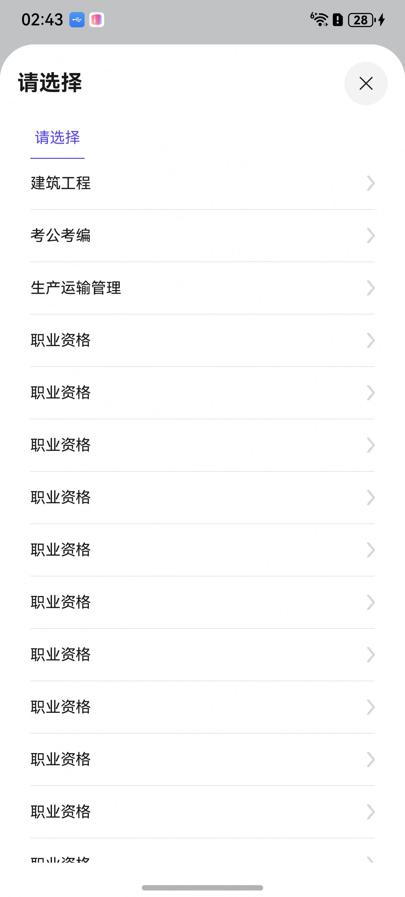

# 分类选择组件快速入门

## 目录

- [简介](#简介)
- [约束与限制](#约束与限制)
- [使用](#使用)
- [API参考](#API参考)
- [示例代码](#示例代码)

## 简介

本组件提供了一级通用分类的能力，引入一二三级嵌套所有数据。开发者可以根据实际业务需要快速实现一级分类。



## 约束与限制
### 环境
- DevEco Studio版本：DevEco Studio 5.0.3 Release及以上
- HarmonyOS SDK版本：HarmonyOS 5.0.3 Release SDK及以上
- 设备类型：华为手机（包括双折叠和阔折叠）
- 系统版本：HarmonyOS 5.0.1(13)及以上

## 使用

1. 安装组件。

   如果是在DevEco Studio使用插件集成组件，则无需安装组件，请忽略此步骤。

   如果是从生态市场下载组件，请参考以下步骤安装组件。

   a. 解压下载的组件包，将包中所有文件夹拷贝至您工程根目录的XXX目录下。

   b. 在项目根目录build-profile.json5添加classification模块。

   ```
   // 在项目根目录build-profile.json5填写classification路径。其中XXX为组件存放的目录名。
     "modules": [
       {
         "name": "classification",
         "srcPath": "./XXX/classification",
       }
     ]
   ```

   c. 在项目根目录oh-package.json5添加依赖。
   ```
   // XXX为组件存放的目录名称
   "dependencies": {
     "classification": "file:./XXX/classification"
   }
   ```


2. 引入组件句柄。
   ```
    import { RolePage, SelectRoleModel } from 'classification';
   ```

3. 调用组件，详细参数配置说明参见[API参考](#API参考)

```
import { RolePage, SelectRoleModel } from 'classification';

@Entry
@ComponentV2
struct Index {
  @Local baseSelectModel: SelectRoleModel[] = [] //示例数据

  aboutToAppear(): void {
    this.baseSelectModel = [
    // 第一条全数据
      {
        'id': '1', 'title': '建筑工程', 'list': [{
        'id': '11', 'title': '建造造价', 'list': [{
          'id': '111', 'title': '建造师', 'list': [
            {
              'id': '1111', 'title': '一级建造师', 'list': [
              { 'id': '11111', 'title': '建筑工程经济' },
              { 'id': '11112', 'title': '建筑工程政治' },
              { 'id': '11113', 'title': '建筑工程教育' },
              { 'id': '11114', 'title': '建筑工程科学' },
              { 'id': '11115', 'title': '建筑工程管理' },
              { 'id': '11116', 'title': '建筑工程统筹' }]
            },
            {
              'id': '112', 'title': '二级建造师', 'list': [
              { 'id': '11121', 'title': '二级建筑工程经济' },
              { 'id': '11122', 'title': '二级建筑工程政治' },
              { 'id': '11123', 'title': '二级建筑工程教育' },
              { 'id': '11124', 'title': '二级建筑工程科学' },
              { 'id': '11125', 'title': '二级建筑工程管理' },
              { 'id': '11126', 'title': '二级建筑工程统筹' }]
            }]
        }]
      }]
      },
      {
        'id': '2', 'title': '考公考编', 'list': [{
        'id': '22', 'title': '考公', 'list': [{
          'id': '222', 'title': '公务员', 'list': []
        }]
      }]
      },
      {
        'id': '3', 'title': '职业资格', 'list': [{
        'id': '33', 'title': '在编', 'list': [{
          'id': '333', 'title': '在编人员', 'list': []
        }]
      }]
      },
    ]
  }

  build() {
    Column() {
      // 分类组件使用
      RolePage({
        options: this.baseSelectModel,
        selectRoleText: (roleText: string) => { //角色切换
         console.log("角色切换")
        }
      })
    }
    .width('100%')
    .height('100%')
  }
}
```

    

## API参考

### 接口

RolePage(options:RolePageOptions)

分类组件。

**参数：**

| 参数名        | 类型                                      | 是否必填 | 说明               |
|------------|-----------------------------------------|------|------------------|
 |
| options       | [RolePageOptions](#RolePageOptions对象说明) | 是    | 分类下嵌套的所有数据 |

### RolePageOptions对象说明

| 参数名        | 类型                                        | 是否必填 | 说明               |
|------------|-------------------------------------------|------|------------------|
 |
| RolePageOptions       | [SelectRoleModel](#SelectRoleModel对象说明)[] | 是    | 分类下嵌套的所有数据 |


### SelectRoleModel对象说明

| 参数名        | 类型                              | 是否必填 | 说明          |
|------------|---------------------------------|------|-------------|
| id       | string                          | 是    | 一级分类对象的ID |
| title      | string                          | 是    | 标题          |
| list       | [OneLevelTabContent](#OneLevelTabContent对象说明)[] | 是    | 一级分类下包含的列表子对象的列表 |

### OneLevelTabContent对象说明

| 参数名        | 类型                                        | 是否必填 | 说明               |
|------------|-------------------------------------------|------|------------------|
| id       | string                                    | 是    | 一级分类下包含的列表子对象的ID |
| title      | string                                    | 是    | 标题               |
| list       | [TwoLevelTabContent](#TwoLevelTabContent对象说明)[] | 是    | 一级分类下包含的列表子对象的列表 |

### TwoLevelTabContent对象说明

| 参数名        | 类型                                      | 是否必填 | 说明           |
|------------|-----------------------------------------|------|--------------|
| id       | string                                  | 是    | 二级分类对象的ID    |
| title      | string                                  | 是    | 标题           |
| list       | [ThreeLevelTabContent](#ThreeLevelTabContent对象说明)[] | 是    | 二级分类对象下包含的列表 |

### ThreeLevelTabContent对象说明

| 参数名        | 类型                                       | 是否必填 | 说明           |
|------------|------------------------------------------|------|--------------|
| id       | string                                   | 是    | 三级分类对象的ID    |
| title      | string                                   | 是    | 标题           |
| list       | [RoleDetail](#RoleDetail对象说明)[]          | 是    | 三级分类对象下包含的列表 |

### RoleDetail对象说明

| 参数名        | 类型                              | 是否必填 | 说明          |
|------------|---------------------------------|------|-------------|
| id       | string                          | 是    | 最后选择的返回对象ID |
| title      | string                          | 是    | 标题          |

### 事件

支持以下事件：

#### selectRoleText

selectRoleText: (roleText: string) => void = (x: number) => {};

选中的角色。

## 示例代码

```
import { RolePage, SelectRoleModel } from 'classification';

@Entry
@ComponentV2
struct Index {
  @Local baseSelectModel: SelectRoleModel[] = [] //示例数据

  aboutToAppear(): void {
    this.baseSelectModel = [
    // 第一条全数据
      {
        'id': '1', 'title': '建筑工程', 'list': [{
        'id': '11', 'title': '建造造价', 'list': [{
          'id': '111', 'title': '建造师', 'list': [
            {
              'id': '1111', 'title': '一级建造师', 'list': [
              { 'id': '11111', 'title': '建筑工程经济' },
              { 'id': '11112', 'title': '建筑工程政治' },
              { 'id': '11113', 'title': '建筑工程教育' },
              { 'id': '11114', 'title': '建筑工程科学' },
              { 'id': '11115', 'title': '建筑工程管理' },
              { 'id': '11116', 'title': '建筑工程统筹' }]
            },
            {
              'id': '112', 'title': '二级建造师', 'list': [
              { 'id': '11121', 'title': '二级建筑工程经济' },
              { 'id': '11122', 'title': '二级建筑工程政治' },
              { 'id': '11123', 'title': '二级建筑工程教育' },
              { 'id': '11124', 'title': '二级建筑工程科学' },
              { 'id': '11125', 'title': '二级建筑工程管理' },
              { 'id': '11126', 'title': '二级建筑工程统筹' }]
            }]
        }]
      }]
      },
      {
        'id': '2', 'title': '考公考编', 'list': [{
        'id': '22', 'title': '考公', 'list': [{
          'id': '222', 'title': '公务员', 'list': []
        }]
      }]
      },
      {
        'id': '3', 'title': '职业资格', 'list': [{
        'id': '33', 'title': '在编', 'list': [{
          'id': '333', 'title': '在编人员', 'list': []
        }]
      }]
      },
    ]
  }

  build() {
    Column() {
      // 分类组件使用
      RolePage({
        options: this.baseSelectModel,
        selectRoleText: (roleText: string) => { //角色切换
         console.log("角色切换")
        }
      })
    }
    .width('100%')
    .height('100%')
  }
}
```

