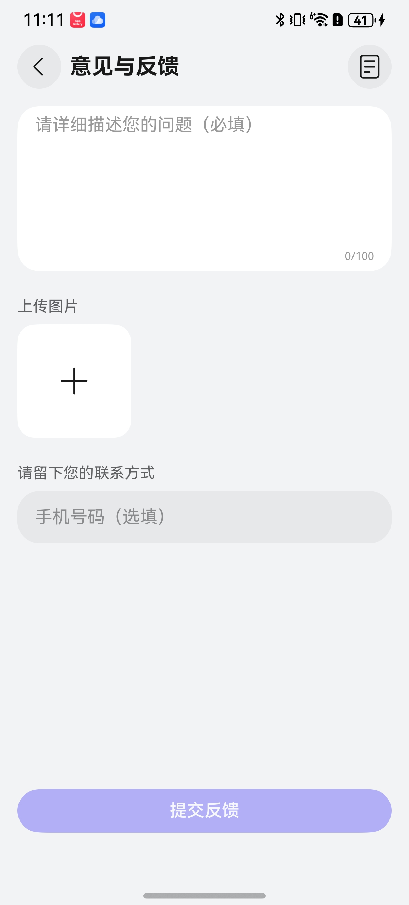

# 意见反馈组件快速入门

## 目录

- [简介](#简介)
- [约束与限制](#约束与限制)
- [使用](#使用)
- [API参考](#API参考)
- [示例代码](#示例代码)

## 简介

本组件提供了通用的自定义的意见反馈功能，数据有问题描述、多张问题截图、联系电话号码、提交时间。
使用时可以传入想要的最大问题描述长度和最大问题截图数量，在使用处点提交按钮直接获取一条意见反馈的总数据，电话号码长度为11。开发者可以根据业务需要快速实现意见反馈功能。



## 约束与限制

### 环境

- DevEco Studio版本：DevEco Studio 5.0.3 Release及以上
- HarmonyOS SDK版本：HarmonyOS 5.0.3 Release SDK及以上
- 设备类型：华为手机（包括双折叠和阔折叠）
- 系统版本：HarmonyOS 5.0.1(13)及以上
## 使用

1. 安装组件。

   如果是在DevEco Studio使用插件集成组件，则无需安装组件，请忽略此步骤。

   如果是从生态市场下载组件，请参考以下步骤安装组件。

   a. 解压下载的组件包，将包中所有文件夹拷贝至您工程根目录的XXX目录下。

   b. 在项目根目录build-profile.json5添加feed_back模块。

   ```
   // 在项目根目录build-profile.json5填写feed_back路径。其中XXX为组件存放的目录名。
      "modules": [
         {
            "name": "feed_back",
            "srcPath": "./XXX/feed_back",
         }
      ]
   ```
   c. 在项目根目录oh-package.json5添加依赖。
   ```
   // XXX为组件存放的目录名称
   "dependencies": {
      "feed_back": "file:./XXX/feed_back"
   }
   ```

2. 引入组件句柄。
   ```typescript
   import { Feedback } from 'feed_back';
   ```

3. 调用组件，详细参数配置说明参见[API参考](#API参考)
   ```
    import { Feedback } from 'feed_back'
   
    @Entry
    @ComponentV2
    export struct Index {
      build() {
        Column() {
          Feedback()
        }
        .width('100%')
        .height('100%')
        .backgroundColor($r('sys.color.background_secondary'))
        .expandSafeArea([SafeAreaType.SYSTEM], [SafeAreaEdge.TOP, SafeAreaEdge.BOTTOM])
      }
    }
   ```

## API参考

### 接口

Feedback({ maxLength?:number, maxCount?:number })

**参数：**

| 参数名       | 类型     | 是否必填 | 说明       |
|:----------|:-------|:-----|:---------|
| maxLength | number | 否    | 最大问题描述长度 |
| maxCount  | number | 否    | 最大问题截图数量 |                                                                                                                      | 是  | 应用隐私协议名称                                                                                                                        | | 否  | 应用路由栈                                                                                                                           |

### 事件

支持以下事件：

#### submitClick

submitClick:  (feedbackData: FeedbackModel) => void

点击提交按钮时返回一条完整的意见反馈数据。

## 示例代码

   ```
    import { Feedback } from 'feed_back'
   
    @Entry
    @ComponentV2
    export struct Index {
      build() {
        Column() {
          Feedback()
        }
        .width('100%')
        .height('100%')
        .backgroundColor($r('sys.color.background_secondary'))
        .expandSafeArea([SafeAreaType.SYSTEM], [SafeAreaEdge.TOP, SafeAreaEdge.BOTTOM])
      }
    }
   ```
