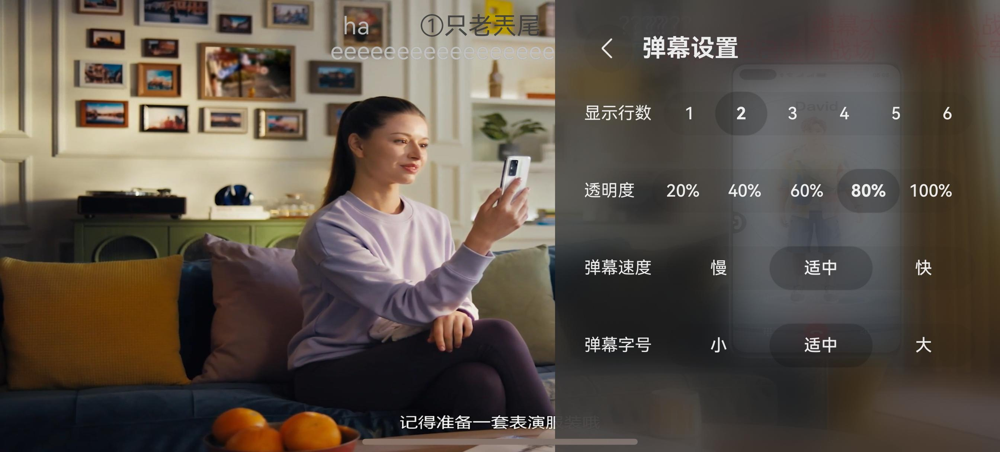

# 直播间组件快速入门

## 目录

- [简介](#简介)
- [约束与限制](#约束与限制)
- [使用](#使用)
- [API参考](#API参考)
- [示例代码](#示例代码)

## 简介
本组件提供了直播间弹幕、分享、评论等能力。

| 直播                                              | 控制层                                             |
|-------------------------------------------------|-------------------------------------------------|
|  |  |


### 环境

- DevEco Studio版本：DevEco Studio 5.0.5 Release及以上
- HarmonyOS SDK版本：HarmonyOS 5.0.5 Release SDK及以上
- 设备类型：华为手机（包括双折叠和阔折叠）
- 系统版本：HarmonyOS 5.0.5(17)及以上

### 权限

- 网络权限：ohos.permission.INTERNET

## 使用

1. 安装组件。

   如果是在DevEco Studio使用插件集成组件，则无需安装组件，请忽略此步骤。

   如果是从生态市场下载组件，请参考以下步骤安装组件。

   a. 解压下载的组件包，将包中所有文件夹拷贝至您工程根目录的XXX目录下。

   b. 在项目根目录build-profile.json5添加live_streaming模块。
   ```
   // 项目根目录下build-profile.json5填写live_streaming路径。其中XXX为组件存放的目录名
   "modules": [
     {
       "name": "live_streaming",
       "srcPath": "./XXX/live_streaming"
     }
   ]
   ```

   c. 在项目根目录oh-package.json5中添加依赖。

   ```
   // XXX为组件存放的目录名称
   "dependencies": {
     "live_streaming": "file:./XXX/live_streaming"
   }
   ```

2. 引入播放组件句柄。
   ```typescript
   import { LiveStreaming, LiveStreamingVM } from "live_streaming";
      
   ```

3. 调用组件，详细参数配置说明参见[API参考](#API参考)。
        
   ```
      LiveStreaming({
         fullScreen: (isLayoutFullScreen) => {
         this.isLayoutFullScreen = isLayoutFullScreen
         },
      })
      
   ```

## API参考

### 接口
LiveStreaming()

### 事件
支持以下事件：
#### fullScreen
fullScreen: () => void = () => {}
视频全屏、竖屏切换的回调函数。

#### shareEvent
shareEvent: () => void = () => {}
点击分享的回调函数。

#### inputEvent
inputEvent: () => void = () => {}
输入文本事件回调
## 示例代码

```
import { display, window } from '@kit.ArkUI';
import { ChatViewVM, LiveStreaming, LiveStreamingVM, MoreSheet } from 'live_streaming';

class Router {
  static stack: NavPathStack = new NavPathStack();
}

@Entry
@ComponentV2
struct LiveTest {
  @Local liveVM: LiveStreamingVM = LiveStreamingVM.instance;

  @Builder
  pageMap(name: string) {
    NavDestination() {
      if (name === 'InputComment') {
        InputCommentBuilder();
      } else {
        LivePageBuilder();
      }
    }
    .mode(['InputComment'].includes(name) ? NavDestinationMode.DIALOG : NavDestinationMode.STANDARD)
    .backgroundColor(['InputComment'].includes(name) ? 'rgba(0,0,0,0)' :
      $r('sys.color.background_secondary'))
    .hideTitleBar(true)
    .onBackPressed(() => {
      return false;
    });
  }

  aboutToAppear(): void {
    Router.stack.replacePathByName('PlayPage', {});
  }

  build() {
    Navigation(Router.stack) {
    }
    .hideNavBar(true)
    .hideToolBar(true)
    .hideTitleBar(true)
    .hideBackButton(true)
    .mode(NavigationMode.Stack)
    .navDestination(this.pageMap)
    .id(this.liveVM.navId);
  }
}

@Builder
export function LivePageBuilder() {
  LivePage();
}

@ComponentV2
struct LivePage {
  @Local isLayoutFullScreen: boolean = false;
  @Local liveVM: LiveStreamingVM = LiveStreamingVM.instance;
  @Local isShowMore: boolean = false;

  @Builder
  LiveStreamBuilder() {
    Row() {
      LiveStreaming({
        fullScreen: (isLayoutFullScreen) => {
          this.isLayoutFullScreen = isLayoutFullScreen;
        },
        inputEvent: () => {
          Router.stack.pushPathByName('InputComment', null);
        },
        downEvent: () => {
          this.isShowMore = true;
        }
      })
        .width('100%')
        .height('100%')
        .borderRadius(this.isLayoutFullScreen ? 0 : 16)
        .clip(true);
    }
    .backgroundColor('rgba(0,0,0,1)')
    .width('100%')
    .padding(this.isLayoutFullScreen ? 0 : {
      top: 10,
      bottom: 10,
      left: 16,
      right: 16
    });
  }

  @Builder
  moreBuilder() {
    MoreSheet({
      moreSetEvent: (item: string) => {
        if (item === '画中画') {
          this.liveVM.startPip();
        }
      }
    })
      .padding(12)
      .width('100%')
      .height('100%');
  }

  aboutToAppear(): void {
    this.liveVM.avatar = $r('app.media.ic_user_default');
    this.liveVM.name = 'Test';
  }

  build() {
    Column() {
      this.LiveStreamBuilder();
      Row()
        .bindSheet(this.isShowMore, this.moreBuilder(), {
          height: 250,
          dragBar: true, // 是否显示控制条
          backgroundColor: ($r('sys.color.font_on_primary')),
          showClose: true, // 是否显示关闭图标
          preferType: SheetType.CENTER,
          shouldDismiss: ((sheetDismiss: SheetDismiss) => {
            sheetDismiss.dismiss();
            this.isShowMore = false;
          })
        })
        .size({ width: 0, height: 0 });
    }
    .height('100%')
    .width('100%');
  }
}

@ComponentV2
export struct InputComment {
  @Local vm: ChatViewVM = ChatViewVM.instance;
  @Local keyboardHeight: number = 0;
  @Local inputNum: number = 0;
  @Local contentHeight: number = 30;
  @Local content: string = '';
  private uiContext: UIContext = this.getUIContext();
  textSize: SizeOptions = {};
  screenWidth: number = this.uiContext.px2vp(display.getDefaultDisplaySync().width);
  controller: TextAreaController = new TextAreaController();
  @Local bottomHeight: number = 0;

  @Builder
  ToolBar() {
    Row() {
      TextArea({ placeholder: '聊一聊吧', text: this.content, controller: this.controller })
        .width('90%')
        .height(this.contentHeight)
        .fontSize('16fp')
        .fontWeight(500)
        .lineHeight(18)
        .padding(5)
        .maxLength(30)
        .backgroundColor(Color.Transparent)
        .defaultFocus(true)
        .barState(BarState.Off)
        .onChange((value: string) => {
          this.content = value;
          this.checkMaxLength(value);
          this.contentSizeChange();
        });

      Image($r('app.media.paper_plane'))
        .width(24)
        .height(24)
        .margin({ right: 12, bottom: 5 })
        .onClick(() => {
          this.controller.stopEditing();
          this.onSubmit();
        });
    }
    .width('95%')
    .justifyContent(FlexAlign.SpaceBetween)
    .alignItems(VerticalAlign.Bottom)
    .margin(10)
    .padding({ left: 5 })
    .backgroundColor('rgba(0, 0, 0, 0.05)')
    .borderRadius(20);
  }

  aboutToAppear(): void {
    window.getLastWindow(getContext(this)).then(win => {
      this.addKeyboardHeightListener(win);
      const avoidAreaBottom = win.getWindowAvoidArea(window.AvoidAreaType.TYPE_NAVIGATION_INDICATOR);
      this.bottomHeight = avoidAreaBottom.bottomRect.height;
    });
  }

  aboutToDisappear(): void {
    window.getLastWindow(getContext(this)).then(win => {
      this.removeKeyboardHeightListener(win);
    });
  }

  build() {
    Stack() {
      Column() {
        this.ToolBar();
        Divider();
        Column()
          .height(this.keyboardHeight);
      }
      .backgroundColor(Color.White);
    }
    .height('100%')
    .width('100%')
    .alignContent(Alignment.Bottom)
    .expandSafeArea([SafeAreaType.KEYBOARD]);
  }

  onSubmit() {
    if (this.content.trim() === '') {
      this.getUIContext().getPromptAction().showToast({ message: '输入内容不可为空' });
    } else {
      this.vm.onSubmit(this.content);
    }
    this.content = '';
    let paths: string[] = Router.stack.getAllPathName();
    let isExit = paths.includes('');
    if (isExit) {
      Router.stack.pop();
    }
  }

  addKeyboardHeightListener(win: window.Window) {
    win.on('keyboardHeightChange', height => {
      if (height !== 0) {
        this.keyboardHeight = this.getUIContext().px2vp(height - this.bottomHeight);
        return;
      } else {
        this.keyboardHeight = 0;
        let paths: string[] = Router.stack.getAllPathName();
        let isExit = paths.includes('InputComment');
        if (isExit) {
          Router.stack.pop();
        }
      }
    });
  }

  removeKeyboardHeightListener(win: window.Window) {
    win.off('keyboardHeightChange');
  }

  contentSizeChange() {
    this.textSize = this.uiContext.getMeasureUtils().measureTextSize({
      textContent: this.content,
      fontSize: '16fp',
      lineHeight: 18,
      fontWeight: 500,
      constraintWidth: (this.screenWidth * 0.95 * 0.90 - 10 - 5)
    });
    this.contentHeight = Math.max(this.uiContext.px2vp(Number(this.textSize.height)), 20) + 10;
  }

  checkMaxLength(content: string) {
    if (content.trim().length >= 30) {
      this.getUIContext().getPromptAction().showToast({
        message: '最多只能输入30字',
        duration: 2000
      });
    }
  }
}

@Builder
export function InputCommentBuilder() {
  InputComment();
}

```

