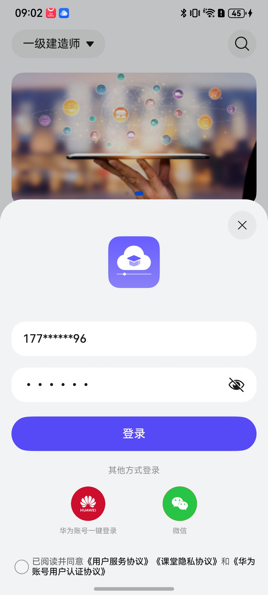
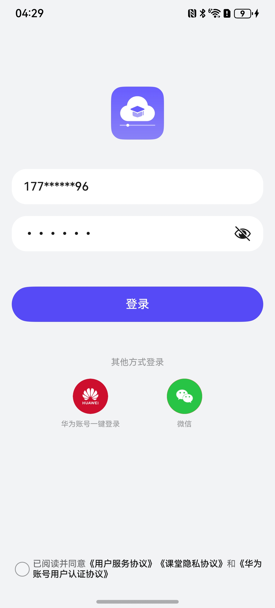

# 登录组件快速入门

## 目录

- [简介](#简介)
- [约束与限制](#约束与限制)
- [使用](#使用)
- [API参考](#API参考)
- [示例代码](#示例代码)

## 简介

本组件提供了华为账号一键登录、微信登录、手机号登录的能力，开发者可以根据业务需要快速实现应用登录。


| 半模态样式                                     | 全模态样式                                     |
| ---------------------------------------------- | ---------------------------------------------- |
|  |  |

## 约束与限制

### 环境

- DevEco Studio版本：DevEco Studio 5.0.3 Release及以上
- HarmonyOS SDK版本：HarmonyOS 5.0.3 Release SDK及以上
- 设备类型：华为手机（包括双折叠和阔折叠）
- 系统版本：HarmonyOS 5.0.1(13)及以上

## 添加配置


## 使用

1. 安装组件。

   如果是在DevEco Studio使用插件集成组件，则无需安装组件，请忽略此步骤。

   如果是从生态市场下载组件，请参考以下步骤安装组件。

   a. 解压下载的组件包，将包中所有文件夹拷贝至您工程根目录的XXX目录下。

   b. 在项目根目录build-profile.json5添加login_info模块。

   ```
   // 在项目根目录build-profile.json5填写login_info路径。其中XXX为组件存放的目录名。
     "modules": [
       {
         "name": "login_info",
         "srcPath": "./XXX/login_info",
       }
     ]
   ```
   c. 在项目根目录oh-package.json5中添加依赖。
   ```
   // XXX为组件存放的目录名称
   "dependencies": {
      "login_info": "file:./XXX/login_info"
     }
   ```

2. 引入登录组件句柄。
   ```
   import { QuickLogin } from 'login_info';
   ```

3. 配置华为账号服务。

   a. 将应用的client ID配置到entry模块的module.json5文件(entry/src/main/module.json5)，详细参考：[配置Client ID](https://developer.huawei.com/consumer/cn/doc/harmonyos-guides/account-client-id)。
   ```
   "metadata": [
      {
        "name": "client_id",
        "value": "*****"
      },
    ],
   ```
   b. [配置签名和指纹](https://developer.huawei.com/consumer/cn/doc/harmonyos-guides/account-sign-fingerprints)。

   c. [申请scope权限](https://developer.huawei.com/consumer/cn/doc/harmonyos-guides/account-config-permissions) 。


4. 微信登录请前往微信开放平台申请AppId并配置鸿蒙应用信息，详情参考[鸿蒙接入指南](https://developers.weixin.qq.com/doc/oplatform/Mobile_App/Access_Guide/ohos.html)。

5. 调用组件，详细参数配置说明参见[API参考](#API参考)。
   ```
      QuickLogin({
        icon: $r('app.media.ic_launch'),
        appName: '课堂',
        loginBtnBgColor: $r('sys.color.multi_color_01'),
        extraInfo: {
          appId: 'wxd5a474c******8fd17',
          scope: 'snsapi_userinfo,snsapi_friend,snsapi_message,snsapi_contact',
          transaction: 'test123',
          state: 'none',
        },
        // 模态消失回调
        shouldDismiss: () => {
        },
        loginFinished: (flag: boolean, unionID?: string) => {
        }
      })
   ```
6. 对于微信账号一键登录，您需要在主工程的src/main/ets/entryability下的EntryAbility文件中通过如下方式处理登录成功结果。
   ```
   onNewWant(want: Want, _launchParam: AbilityConstant.LaunchParam): void {
    if (!want.action) {
      this.handleWeChatCallIfNeed(want);
    }
   }

   private handleWeChatCallIfNeed(want: Want) {
     wXApi.handleWant(want, wXEventHandler);
   }
   
   ```

## API参考

### 接口

QuickLogin({icon:ResourceStr,loginBtnBgColor:ResourceStr,appName:string})

登录组件。

**参数：**

| 参数名             | 类型                                                         | 是否必填 | 说明                                                         |
| :----------------- | :----------------------------------------------------------- | :------- | :----------------------------------------------------------- |
| icon               | [ResourceStr](https://developer.huawei.com/consumer/cn/doc/harmonyos-references/ts-types#resourcestr) | 是       | 应用图标，参考[UX设计规范](https://developer.huawei.com/consumer/cn/doc/harmonyos-guides/account-phone-unionid-login#section2558741102912)。 |
| loginBtnBgColor    | [ResourceStr](https://developer.huawei.com/consumer/cn/doc/harmonyos-references/ts-types#resourcestr) | 是       | 一键登录按钮背景色                                           |
| appName            | string                                                       | 是       | 应用隐私协议名称                                             |
| isBindContentCover | boolean                                                      | 否       | 区分模态和半模态弹窗                                         |
| extraInfo          | [ExtraInfo](#ExtraInfo对象说明)                              | 否       | 微信登录相关参数                                             |

#### ExtraInfo对象说明

当登录方式为微信登录时，此对象必传，具体参数含义请参考[鸿蒙接入指南](https://developers.weixin.qq.com/doc/oplatform/Mobile_App/Access_Guide/ohos.html)。

| 参数名         | 类型     | 是否必填 |
|:------------|:-------|:-----|
| appId       | string | 是    |
| appKey      | string | 否    |
| scope       | string | 否    |
| transaction | string | 否    |
| state       | string | 否    |

### 事件

支持以下事件：

#### loginFinished

loginFinished: (flag: boolean, unionId?: string) => void = () => {}

登录结果回调。

#### privacyPolicy

privacyPolicy: () => void = () => {}

点击隐私协议时的跳转方法。

#### userService

userService: () => void = () => {}

点击服务协议时的跳转方法。

#### onAuthentication

onAuthentication: () => void = () => {}

点击华为用户认证协议时的跳转方法。

## 示例代码

   ```
   import { QuickLogin } from 'login_info';

   @Entry
   @Component
   export struct Index {
    build() {
     Column() {
      QuickLogin({
        icon: $r('app.media.ic_launch'),
        appName: '课堂',
        loginBtnBgColor: $r('sys.color.multi_color_01'),
        onAuthentication: () => {
          this.getUIContext().getPromptAction().showToast({ message: '认证', duration: 2000 });
        },
        privacyPolicy: () => {
          this.getUIContext().getPromptAction().showToast({ message: '协议', duration: 2000 });
        },
        userService: () => {
          this.getUIContext().getPromptAction().showToast({ message: '服务', duration: 2000 });
        },
        extraInfo: {
          appId: 'wxd5a474c******8fd17',
          scope: 'snsapi_userinfo,snsapi_friend,snsapi_message,snsapi_contact',
          transaction: 'test123',
          state: 'none',
        },
        // 模态消失回调
        shouldDismiss: () => {
          this.getUIContext().getPromptAction().showToast({ message: '消失', duration: 2000 });
        },
        loginFinished: (flag: boolean, unionID?: string) => {
          this.getUIContext().getPromptAction().showToast({ message: '登陆成功', duration: 2000 });
        }
      })
    }
    .height('100%')
    .width('100%')
   }
  }
   ```
