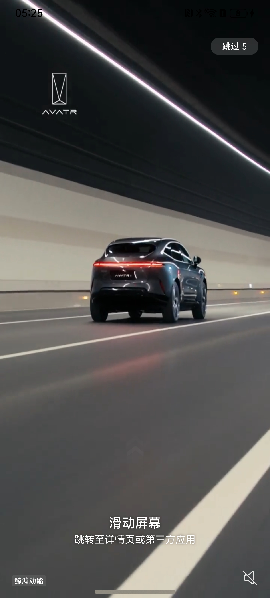

# 广告组件快速入门

## 目录

- [简介](#简介)
- [约束与限制](#约束与限制)
- [使用](#使用)
- [API参考](#API参考)
- [示例代码](#示例代码)

## 简介
本组件提供了通过华为广告平台展示开屏广告的能力，开发者可以根据业务需要实现通过开屏广告变现，也可自定义。

| 华为广告                                           | 自定义广告                                          |
|------------------------------------------------|------------------------------------------------|
|  |  |

## 约束与限制

### 环境

- DevEco Studio版本：DevEco Studio 5.0.3 Release及以上
- HarmonyOS SDK版本：HarmonyOS 5.0.3 Release SDK及以上
- 设备类型：华为手机（包括双折叠和阔折叠）
- 系统版本：HarmonyOS 5.0.1(13)及以上

### 调试
对接华为广告平台时，本组件暂不支持使用模拟器调试，请使用真机进行调试。

### 权限

- 网络权限：ohos.permission.INTERNET

## 使用

1. 安装组件。

   如果是在DevEco Studio使用插件集成组件，则无需安装组件，请忽略此步骤。

   如果是从生态市场下载组件，请参考以下步骤安装组件。

   a. 解压下载的组件包，将包中所有文件夹拷贝至您工程根目录的XXX目录下。

   b. 在项目根目录build-profile.json5添加open_ads模块。
   ```
   // 项目根目录下build-profile.json5填写open_ads路径。其中XXX为组件存放的目录名
   "modules": [
     {
       "name": "open_ads",
       "srcPath": "./XXX/open_ads"
     }
   ]
   ```

   c. 在项目根目录oh-package.json5中添加依赖。

   ```
   // XXX为组件存放的目录名称
   "dependencies": {
     "open_ads": "file:./XXX/open_ads"
   }
   ```

2. 引入广告组件句柄。
   ```typescript
   import { AdService, AdType, platformType } from 'open_ads'
   ```
3. 前往[鲸鸿动能媒体服务平台](https://developer.huawei.com/consumer/cn/doc/monetize/zhucerenzheng-0000001132395957)注册开发者账号并认证，并参考[展示位创建](https://developer.huawei.com/consumer/cn/doc/monetize/zhanshiweichuangjian-0000001132700049)创建广告展示位用于开发调试。

4. 调用组件，详细参数配置说明参见[API参考。](#API参考)
   ```
   AdService({
      platform: platformType.HUAWEI_AD,
      adId: 'testd7c5cewoj6',
      adType: AdType.AD_VIDEO,
      closeCallBack: () => {
      },
    })
   
   ```

## API参考

### 接口

AdService(platform:platformType,adId:string,adType:AdType,appId:string,appName:string,closeCallBack:() => void)

| 参数名        | 类型                                  | 是否必填 | 说明             |
| :------------ | :------------------------------------ | :------- | :--------------- |
| platform      | [platformType](#platformType枚举说明) | 是       | 广告渠道         |
| adId          | string                                | 是       | 广告位ID         |
| adType        | [AdType](#AdType枚举说明)             | 否       | 广告类型         |
| appId         | string                                | 否       | 应用ID           |
| appName       | string                                | 否       | 应用名称         |
| imageUrl      | string                                | 否       | 图片地址         |
| videoSrc      | string                                | 否       | 视频地址         |
| closeCallBack | () => void                            | 是       | 关闭广告回调函数 |

#### platformType枚举说明

| 名称        | 值 | 说明    |
|:----------|:--|:------|
| HUAWEI_AD | 0 | 华为广告  |
| CUSTOM_AD | 1 | 自定义广告 |

#### AdType枚举说明

| 名称         | 值 | 说明 |
|:-----------|:--|:---|
| AD_PICTURE | 0 | 图片 |
| AD_VIDEO   | 1 | 视频 |

### 事件

支持以下事件：

#### closeCallBack

closeCallBack: () => void = () => {}

广告关闭时的回调函数。

## 示例代码

- 华为平台广告
```
import { AdService, AdType, platformType } from 'open_ads'

@Entry
@Component
struct Index {
  build() {
    Column() {
      AdService({
        platform: platformType.HUAWEI_AD,
        adId: 'testd7c5cewoj6',
        adType: AdType.AD_VIDEO,
        closeCallBack: () => {
        },
      })
    }
  }
}
```


- 自定义广告

```
import { AdService, AdType, platformType } from 'open_ads'

@Entry
@Component
struct Index {
  build() {
    Column() {
      AdService({
        platform: platformType.CUSTOM_AD,
        adId: 'testd7c5cewoj6',
        adType: AdType.AD_VIDEO,
        closeCallBack: () => {
        },
      })
    }
  }
}
```
