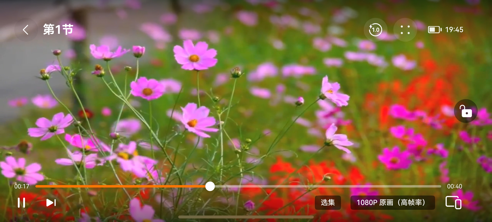
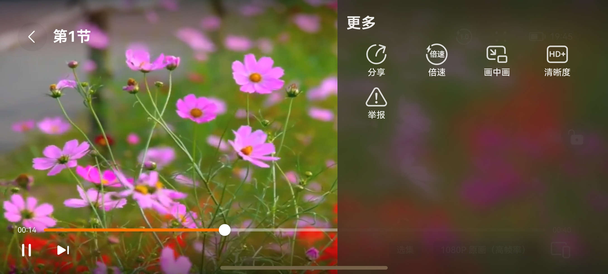
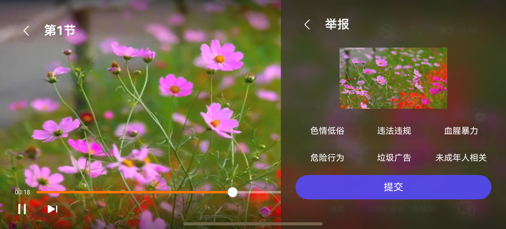
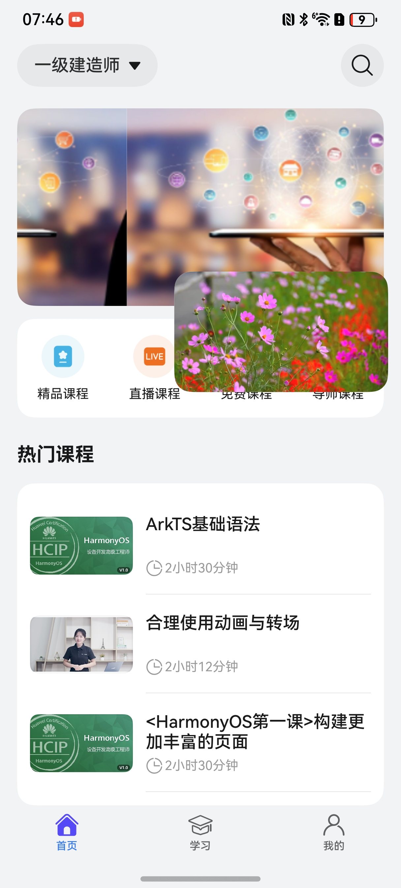

# 播放组件快速入门

## 目录

- [简介](#简介)
- [约束与限制](#约束与限制)
- [使用](#使用)
- [API参考](#API参考)
- [示例代码](#示例代码)

## 简介

本组件提供了视频播放的能力。

| 未加锁 | 加锁 | 无控制层 |
| ------ | ---- | -------- |
|        |      |          |

| 更多 | 举报 |
| ---- | ---- |
|      |      |


实现[画中画](https://developer.huawei.com/consumer/cn/doc/harmonyos-guides/pipwindow-xcomponent#section417212014278)效果：



## 约束与限制

### 环境

- DevEco Studio版本：DevEco Studio 5.0.3 Release及以上
- HarmonyOS SDK版本：HarmonyOS 5.0.3 Release SDK及以上
- 设备类型：华为手机（包括双折叠和阔折叠）
- 系统版本：HarmonyOS 5.0.1(13)及以上

### 权限

- 网络权限：ohos.permission.INTERNET

## 使用

1. 安装组件。

   如果是在DevEco Studio使用插件集成组件，则无需安装组件，请忽略此步骤。

   如果是从生态市场下载组件，请参考以下步骤安装组件。

   a. 解压下载的组件包，将包中所有文件夹拷贝至您工程根目录的XXX目录下。

   b. 在项目根目录build-profile.json5添加recorded_player模块。
   ```
   // 项目根目录下build-profile.json5填写recorded_player路径。其中XXX为组件存放的目录名
   "modules": [
     {
       "name": "recorded_player",
       "srcPath": "./XXX/recorded_player"
     }
   ]
   ```

   c. 在项目根目录oh-package.json5中添加依赖。

   ```
   // XXX为组件存放的目录名称
   "dependencies": {
     "recorded_player": "file:./XXX/recorded_player"
   }
   ```

2. 引入播放组件句柄。
   ```typescript
   import { MovieItem, PlayerComponent, PlayerVM } from 'recorded_player';
   ```
3. 调用组件，详细参数配置说明参见[API参考](#API参考)。
   ```
   PlayerComponent({
      movieItems: this.movieItems,
      playerIndex: this.indexNumber,
      fullScreen: (isLayoutFullScreen: boolean) => {},
      selectionEvent: (idx: number) => {},
      callbackTimeUpdate: (vol: number, total: number) => {}
   })
   
   ```

## API参考

### 接口

PlayerComponent(movieItems:MovieItem,playerIndex:number)

| 参数名             | 类型                              | 是否必填 | 说明           |
| :----------------- | :-------------------------------- | :------- | :------------- |
| movieItems         | [MovieItem[]](#MovieItem枚举说明) | 是       | 源数据、播放源 |
| playerIndex        | number                            | 是       | 数据索引       |
| fullScreen         | () => void                        | 否       | 横竖屏切换     |
| selectionEvent     | () => void                        | 否       | 选集回调       |
| callbackTimeUpdate | () => void                        | 否       | 播放进度回调   |

#### MovieItem枚举说明

| 参数名           | 类型     | 说明     |
|:--------------|:-------|:-------|
| movieTitle    | string | 视频标题   |
| movieUrl      | string | 视频在线地址 |
| movieId       | string | 数据id   |
| learnProgress | number | 视频进度   |

### 事件

支持以下事件：

#### fullScreen

fullScreen: () => void = () => {}

视频全屏、竖屏切换的回调函数。

#### selectionEvent

selectionEvent: () => void = () => {}

选集回调函数。

#### callbackTimeUpdate

callbackTimeUpdate: () => void = () => {}

播放进度的回调函数。

## 示例代码

```
import { MovieItem, PlayerComponent, PlayerVM } from 'recorded_player';

@Entry
@ComponentV2
struct PlayerTest {
  stack: NavPathStack = new NavPathStack();
  @Local playerVM: PlayerVM = PlayerVM.instance;

  @Builder
  pageMap(name: string) {
    NavDestination() {
      PlayPageBuilder()
    }
    .mode(NavDestinationMode.STANDARD)
    .backgroundColor($r('sys.color.background_secondary'))
    .hideTitleBar(true)
    .onBackPressed(() => {
      return false
    })
  }

  aboutToAppear(): void {
    // 设置支持切换
    this.playerVM.isSelections = true
    this.stack.replacePathByName('PlayPage', {});
  }

  build() {
    Navigation(this.stack) {
    }
    .hideNavBar(true)
    .hideToolBar(true)
    .hideTitleBar(true)
    .hideBackButton(true)
    .mode(NavigationMode.Stack)
    .navDestination(this.pageMap)
    .id(this.playerVM.navId)
  }
}

@Builder
export function PlayPageBuilder() {
  PlayPage()
}

@ComponentV2
struct PlayPage {
  @Local message: string = 'Hello World';
  movieItems: MovieItem[] = [
    new MovieItem('01', '章节1', 0,
      'https://consumer.huawei.com/content/dam/huawei-cbg-site/cn/mkt/plp/new-phones/video/pocket-series.mp4'),
    new MovieItem('02', '章节2', 0,
      'https://videocdn.bodybuilding.com/video/mp4/62000/62792m.mp4'),
    new MovieItem('03', '章节3', 0,
      'https://consumer.huawei.com/content/dam/huawei-cbg-site/cn/mkt/plp/new-phones/video/pocket-series.mp4'),
    new MovieItem('04', '章节4', 0,
      'https://videocdn.bodybuilding.com/video/mp4/62000/62792m.mp4'),
    new MovieItem('05', '章节5', 0,
      'https://consumer.huawei.com/content/dam/huawei-cbg-site/cn/mkt/plp/new-phones/video/pocket-series.mp4'),
    new MovieItem('06', '章节6', 0,
      'https://videocdn.bodybuilding.com/video/mp4/62000/62792m.mp4'),
  ];
  @Local indexNumber: number = 0;
  @Local isLayoutFullScreen: boolean = false;

  @Builder
  playerBuilder() {
    Row() {
      PlayerComponent({
        movieItems: this.movieItems,
        playerIndex: this.indexNumber,
        fullScreen: (isLayoutFullScreen: boolean) => {
          this.isLayoutFullScreen = isLayoutFullScreen
        }
      })
        .width('100%')
        .height(this.isLayoutFullScreen ? '100%' : 184)
        .borderRadius(this.isLayoutFullScreen ? 0 : 16)
        .clip(true)
    }
    .backgroundColor(Color.White)
    .width('100%')
    .padding(this.isLayoutFullScreen ? 0 : {
      top: 10,
      bottom: 10,
      left: 16,
      right: 16
    })
  }

  build() {
    Column() {
      this.playerBuilder()
    }
    .height('100%')
    .width('100%')
  }
}
```

