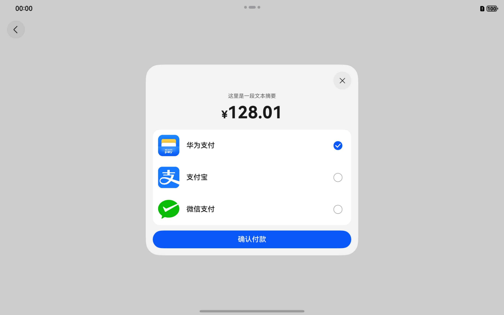

# 通用支付组件快速入门

## 目录

- [简介](#简介)
- [约束与限制](#约束与限制)
- [快速入门](#快速入门)
- [API参考](#API参考)
- [示例代码](#示例代码)

## 简介

本组件聚合了多方的支付能力。提供开箱即用的 **收银台选择器 (CashierPicker)** 以及封装完好的 **聚合支付服务接口 (aggregatedPaymentService)**，开发者无需分别适配各家支付 SDK，即可快速集成支付功能，以最简化的方式完成端侧支付体验搭建。 

<div style='overflow-x:auto'>
  <table style='min-width:800px'>
    <tr>
      <th>直板机</th>
      <th>折叠屏</th>
      <th>平板</th>
    </tr>
    <tr>
      <td valign='top'></td>
      <td valign='top'></td>
      <td valign='top'></td>
    </tr>
  </table>
</div>

## 约束与限制

### 环境

- DevEco Studio版本：DevEco Studio 5.0.5 Release及以上
- HarmonyOS SDK版本：HarmonyOS 5.0.5 Release SDK及以上
- 设备类型：华为手机（包括双折叠和阔折叠）、华为平板
- 系统版本：HarmonyOS 5.0.3(15)及以上

### 权限

- 网络权限：ohos.permission.INTERNET

### 注意事项

由于当前模拟器无法兼容支付宝SDK，若您需要在模拟器环境下进行相关测试，请参考以下步骤启用兼容版本。

1. 找到并打开支付组件根目录下的 oh-package.json5 文件。

2. 注释掉官方版本，启用兼容版本。

3. 重新同步项目。

```
{
  "dependencies": {
    "@tencent/wechat_open_sdk": "1.0.14",
    // 支付宝 SDK 官方版本 (当前仅支持真机)
    // "@cashier_alipay/cashiersdk": "15.8.39",
    // 支付宝 SDK 兼容版本 (接口一致，功能无实现，用于确保引入支付组件的应用可以在模拟器正常运行)
    "@cashier_alipay/cashiersdk": "./libs/swallow_alipay_sdk"
  }
}
```

## 快速入门

1. 安装组件

   如果是在 DevEco Studio 使用插件集成组件，则无需安装组件，请忽略此步骤。

   如果是从生态市场下载组件，请参考以下步骤安装组件。

   a. 解压下载的组件包，将包中所有文件夹拷贝至您工程根目录的 XXX 目录下。

   b. 在项目根目录 build-profile.json5 添加 aggregated_payment 模块。

    ```
    // 在项目根目录 build-profile.json5 填写 aggregated_payment 路径。其中 XXX 为组件存放的目录名
    "modules": [
      {
        "name": "aggregated_payment",
        "srcPath": "./XXX/aggregated_payment"
      }
    ]
    ```

   c. 在项目根目录 oh-package.json5 中添加依赖。

    ```
    // XXX 为组件存放的目录名称
    {
      "dependencies": {
        "aggregated_payment": "file:./XXX/aggregated_payment"
      }
    }
    ```

2. 配置组件基本能力

   a. 在 entry 模块的 src/main/module.json5 中对 querySchemes 和 actions 进行配置。

    ```
    {
      "module": {
        "querySchemes": [
          "weixin",     // 用于校验微信是否安装
          "wxopensdk",  // 用于校验是否可以通过 openLink 拉起微信（不填写将尝试采用显式跳转拉起微信）
          "alipays",    // 用于校验支付宝是否安装
          "https"       // 用于校验是否可以通过 openLink 拉起支付宝（不填写将尝试前往H5页面进行支付）
        ],
        "abilities": [
          {
            "skills": [
              {
                "actions": [
                  "wxentity.action.open" // WeChat Open SDK 官方文档约定的 Action
                ]
              }
            ]
          }
        ]
      }
    }
    ```

   b. （可选）如果上一步不填写 "wxopensdk"，则需要在 entry 模块的 EntryAbility.ets 中添加以下代码，用于显式跳转场景下接收微信的支付回调消息。

    ```
    import { UIAbility, Want } from '@kit.AbilityKit';
    import { aggregatedPaymentService } from 'aggregated_payment'; // 导入支付服务
    
    export default class EntryAbility extends UIAbility {
    
      onNewWant(want: Want): void {
        aggregatedPaymentService.handleWant(want); // 处理 Want 实例，接收可能存在的微信支付回调消息
      }
    
      onCreate(want: Want): void {
        aggregatedPaymentService.handleWant(want); // 处理 Want 实例，接收可能存在的微信支付回调消息
      }
    
    }
    ```

   c. 在 aggregated_payment 模块的 src/main/ets/common/Config.ets 中修改配置项。除 WECHAT_APP_ID 与 ALIPAY_APP_ID 外，其余配置通常保持默认即可；若尚未完成[微信支付接入](https://pay.weixin.qq.com/doc/v3/merchant/4015478291)和[支付宝接入](https://opendocs.alipay.com/open/00dn74?pathHash=d07e0d91)，也可暂时跳过。

    ```
    export class Config {
      /**
       * 在微信开放平台申请的 AppId
       *
       * 避免使用空字符串进行测试，这会导致应用向微信跳转的行为仅仅是跳转，无法触发任何与支付相关的交互或回调事件
       */
      public static readonly WECHAT_APP_ID: string = 'WECHAT_APP_ID';
    
      /**
       * 从微信跳回至发起应用时使用的 ability 名称
       */
      public static readonly WECHAT_CALLBACK_ABILITY_NAME: string = 'EntryAbility';
    
      /**
       * 微信支付 API 约定的固定值，用于支付请求参数中的 packageValue 字段
       */
      public static readonly WECHAT_PACKAGE_VALUE: string = 'Sign=WXPay';
    
      /**
       * 支付宝 APP 对应的 Scheme
       *
       * 由于 Alipay SDK 没有提供用于校验其应用是否安装的方式，因此需要依赖该字段自行实现校验
       */
      public static readonly ALIPAY_SCHEME: string = 'alipays://';
    
      /**
       * 在支付宝开放平台申请的 AppId
       *
       * 该字段可以为空，但基于 AppId 的防黑产相关安全能力将不会生效
       */
      public static readonly ALIPAY_APP_ID: string = '';
    }
    ```

3. 引入组件。

    ```
    import { aggregatedPaymentService, CashierPicker, PaymentType } from 'aggregated_payment';
    ```

4. 使用组件。

   a. 构建收银台选择器实例并采用链式调用设置事件监听。

    ```
    private cashierPicker: CashierPicker = new CashierPicker(this.getUIContext())
      .onRealPayment(async (type: PaymentType) => {
        if (type === PaymentType.ALIPAY) {
          // todo: 处理支付发起事件 (事件源：当前选择了支付宝，并点击支付按钮)
        } else if (type === PaymentType.HUAWEI) {
          // todo: 处理支付发起事件 (事件源：当前选择了华为支付，并点击支付按钮)
        } else if (type === PaymentType.WECHAT) {
          // todo: 处理支付发起事件 (事件源：当前选择了微信支付，并点击支付按钮)
        }
      })
      .onWillDismiss((reason: DismissReason) => {
        // 拦截模态页面关闭交互，屏蔽点击空白区域的关闭方式，避免误触
        if (reason !== DismissReason.TOUCH_OUTSIDE) {
          this.cashierPicker.close();
        }
      });
    ```

   b. 通过收银台选择器实例拉起模态页面。

    ```
    this.cashierPicker
      .reset() // 内部状态重置
      .setAmount(12801) // 设置支付金额，单位：分
      .setTradeSummary('这里是一行订单摘要') // 设置订单摘要 (可选，不填则不显示)
      .open();
    ```

   c. 注册支付回调。

    ```
    const callbackId: string = aggregatedPaymentService.registerPaymentCallback(
      (type: PaymentType, isSuccess: boolean) => {
        // todo: 处理支付结果
      }
    );
    ```

   d. 注销支付回调。

    ```
    // 注销指定支付回调
    aggregatedPaymentService.unregisterPaymentCallback('CALLBACK_ID');
    // 注销所有支付回调
    aggregatedPaymentService.unregisterAllPaymentCallbacks();
    ```

   e. 请求拉起华为支付。

    ```
    aggregatedPaymentService.requestPaymentByHuawei(this.getUIContext(), { orderStr: 'ORDER_STR' });
    ```

   f. 请求拉起支付宝。

    ```
    /**
     * 第一个参数中的 orderInfo 不推荐为空字符串，会导致跳转至支付宝行为仅仅是跳转，不会有支付相关的交互
     *
     * 第二个参数可额外传递 NavPathStack 实例，当支付宝未安装时，SDK 会尝试使用该实例跳转至 H5 页面继续支付
     */
    aggregatedPaymentService.requestPaymentByAliPay({ orderInfo: 'ORDER_INFO' });
    // aggregatedPaymentService.requestPaymentByAliPay({ orderInfo: 'ORDER_INFO' }, this.navPathStack); // 假设当前存在 navPathStack
    ```

   g. 请求拉起微信支付。

    ```
    // 微信支付可异步获取拉起结果，如果拉起失败，不会产生支付回调。
    const isWeChatOpenSuccess: boolean =
      await aggregatedPaymentService.requestPaymentByWeChat(this.getUIContext(), {
        partnerId: '',
        prepayId: '',
        nonceStr: '',
        timeStamp: '',
        sign: ''
      });
    ```

## API参考

### 子组件
无

### CashierPicker

**constructor(uiContext: UIContext)**

CashierPicker 的构造函数。

**参数**

| 参数名       | 类型                                                                                                            | 是否必填   | 说明        |
|-----------|---------------------------------------------------------------------------------------------------------------|--------|-----------|
| uiContext | [UIContext](https://developer.huawei.com/consumer/cn/doc/harmonyos-references/arkts-apis-uicontext-uicontext) | 是      | 应用 UI 上下文 |


**reset(): CashierPicker**

重置收银台选择器内部状态，重置项包括订单总金额、订单摘要、当前选择的支付方式。

**返回值**

| 类型                              | 说明                |
|---------------------------------|-------------------|
| [CashierPicker](#CashierPicker) | 收银台选择器实例自身，用于链式调用 |


**setAmount(value: number): CashierPicker**

设置订单总金额。

**参数**

| 参数名   | 类型     | 是否必填  | 说明                |
|-------|--------|-------|-------------------|
| value | number | 是     | 订单总金额（单位：分, 符号：¥） |

**返回值**

| 类型                              | 说明                |
|---------------------------------|-------------------|
| [CashierPicker](#CashierPicker) | 收银台选择器实例自身，用于链式调用 |


**setTradeSummary(value: string): CashierPicker**

设置订单摘要。

**参数**

| 参数名   | 类型     | 是否必填   | 说明                      |
|-------|--------|--------|-------------------------|
| value | string | 是      | 摘要文本 (默认为空字符串, 不占用任何布局) |

**返回值**

| 类型                              | 说明                |
|---------------------------------|-------------------|
| [CashierPicker](#CashierPicker) | 收银台选择器实例自身，用于链式调用 |


**onRealPayment(callback: (type: PaymentType) => void | Promise\<void\>): CashierPicker**

监听支付发起事件。

**参数**

| 参数名      | 类型                                                             | 是否必填  | 说明       |
|----------|----------------------------------------------------------------|-------|----------|
| callback | (type: [PaymentType](#PaymentType)) => void \| Promise\<void\> | 是     | 支付发起回调函数 |

**返回值**

| 类型                              | 说明                |
|---------------------------------|-------------------|
| [CashierPicker](#CashierPicker) | 收银台选择器实例自身，用于链式调用 |


**onWillDismiss(callback: (reason: DismissReason) => void): CashierPicker**

监听交互式关闭事件。

**参数**

| 参数名      | 类型                                                                                                                                                     | 是否必填  | 说明                                   |
|----------|--------------------------------------------------------------------------------------------------------------------------------------------------------|-------|--------------------------------------|
| callback | (reason: [DismissReason](https://developer.huawei.com/consumer/cn/doc/harmonyos-references/ts-universal-attributes-popup#dismissreason12枚举说明)) => void | 是     | 交互式关闭回调函数，其中 reason 为交互类型，注册后可重写默认行为 |

**返回值**

| 类型                              | 说明                |
|---------------------------------|-------------------|
| [CashierPicker](#CashierPicker) | 收银台选择器实例自身，用于链式调用 |


**open(): Promise\<boolean\>**

打开收银台选择器。

**返回值**

| 类型                 | 说明                      |
|--------------------|-------------------------|
| Promise\<boolean\> | true: 打开成功, false: 打开失败 |


**close(): void**

关闭收银台选择器。


### aggregatedPaymentService

**handleWant(want: Want): void**

当 SDK 内部使用显式跳转拉起微信时，微信后续的跳回也会使用显式跳转。若希望对该事件进行处理，则需要在 EntryAbility 的 onCreate() 和 onNewWant() 方法中调用 handleWant() 来拦截事件。

**参数**

| 参数名  | 类型                                                                                                      | 是否必填  | 说明            |
|------|---------------------------------------------------------------------------------------------------------|-------|---------------|
| want | [Want](https://developer.huawei.com/consumer/cn/doc/harmonyos-references/js-apis-app-ability-want#want) | 是     | 对象/应用间信息传递的载体 |


**requestPaymentByWeChat(uiContext: UIContext, info: WechatPaymentInfo): Promise\<boolean\>**

请求跳转至微信支付，支持异步获取拉起结果，如果拉起失败，不会产生支付回调

**参数**

| 参数名       | 类型                                                                                                            | 是否必填  | 说明          |
|-----------|---------------------------------------------------------------------------------------------------------------|-------|-------------|
| uiContext | [UIContext](https://developer.huawei.com/consumer/cn/doc/harmonyos-references/arkts-apis-uicontext-uicontext) | 是     | 应用 UI 上下文   |
| info      | [WechatPaymentInfo](#WechatPaymentInfo)                                                                       | 是     | 微信支付所需的相关参数 |

**返回值**

| 类型                 | 说明                           |
|--------------------|------------------------------|
| Promise\<boolean\> | true: 微信拉起成功, false: 微信拉起失败  |


**requestPaymentByAliPay(info: AlipayPaymentInfo, navPathStack?: NavPathStack): void**

请求跳转至支付宝，不支持获取拉起结果，拉起失败会触发支付失败的支付回调

**参数**

| 参数名          | 类型                                                                                                                              | 是否必填  | 说明                                                      |
|--------------|---------------------------------------------------------------------------------------------------------------------------------|-------|---------------------------------------------------------|
| info         | [AlipayPaymentInfo](#AlipayPaymentInfo)                                                                                         | 是     | 支付宝所需的相关参数                                              |
| navPathStack | [NavPathStack](https://developer.huawei.com/consumer/cn/doc/harmonyos-references/ts-basic-components-navigation#navpathstack10) | 是     | Navigation 导航控制器（可选），如果传递该参数，当支付宝应用未安装时将自动跳转至 H5 页面进行支付 |


**requestPaymentByHuawei(uiContext: UIContext, info: HuaweiPaymentInfo): void**

请求拉起华为支付，不支持获取拉起结果，拉起失败会触发支付失败的支付回调

**参数**

| 参数名               | 类型                                                                                                            | 是否必填  | 说明          |
|-------------------|---------------------------------------------------------------------------------------------------------------|-------|-------------|
| uiContext         | [UIContext](https://developer.huawei.com/consumer/cn/doc/harmonyos-references/arkts-apis-uicontext-uicontext) | 是     | 应用 UI 上下文   |
| HuaweiPaymentInfo | [HuaweiPaymentInfo](#HuaweiPaymentInfo)                                                                       | 是     | 华为支付所需的相关参数 |


**isWeChatInstalled(): boolean**

校验微信是否安装

**返回值**

| 类型      | 说明                    |
|---------|-----------------------|
| boolean | true: 已安装, false: 未安装 |


**isAlipayInstalled(): boolean**

校验支付宝是否安装

**返回值**

| 类型      | 说明                    |
|---------|-----------------------|
| boolean | true: 已安装, false: 未安装 |


### PaymentType

| 名称     | 说明        |
|--------|-----------|
| WECHAT | 支付类型：微信支付 |
| ALIPAY | 支付类型：支付宝  |
| HUAWEI | 支付类型：华为支付 |

### AlipayPaymentInfo

| 参数名       | 类型     | 是否必填 | 说明                                                                                                                          |
|-----------|--------|------|-----------------------------------------------------------------------------------------------------------------------------|
| orderInfo | string | 是    | 根据订单支付信息构建的字符串，详情请参考[支付宝APP支付接口](https://opendocs.alipay.com/open/cd12c885_alipay.trade.app.pay?scene=20&pathHash=ab686e33) |

### HuaweiPaymentInfo

| 参数名      | 类型     | 是否必填 | 说明                                                                                                                                              |
|----------|--------|------|-------------------------------------------------------------------------------------------------------------------------------------------------|
| orderStr | string | 是    | 根据订单支付信息构建的字符串，详情请参考[华为支付预下单（服务器开发）](https://developer.huawei.com/consumer/cn/doc/harmonyos-guides/payment-payment-process#section126982401468) |

### WechatPaymentInfo
微信支付需要分别传入各参数，其中保留字段为微信支付请求可以接收的字段，但并不影响支付核心流程。您可以视自身业务场景来灵活选择使用并对支付组件进行定制化改造。详情请参考[微信支付APP下单](https://pay.weixin.qq.com/doc/v3/merchant/4013070347)。

| 参数名         | 类型     | 是否必填 | 说明                                                               |
|-------------|--------|------|------------------------------------------------------------------|
| id          | string | 否    | 保留字段                                                             |
| openId      | string | 否    | 保留字段                                                             |
| transaction | string | 否    | 保留字段                                                             |
| signType    | string | 否    | 保留字段                                                             |
| extData     | string | 否    | 保留字段                                                             |
| partnerId   | string | 是    | 商户号 (服务器向微信支付下单时使用的 mchid 字段)                                    |
| prepayId    | string | 是    | 预支付交易会话标识 (服务器向微信支付下单后从接口获取的 prepay_id 字段)                       |
| nonceStr    | string | 是    | 随机字符串 (不长于32位)                                                   |
| timeStamp   | string | 是    | Unix时间戳 (仅支持秒级时间戳)                                               |
| sign        | string | 是    | 签名 (使用 appId、timeStamp、nonceStr、prepayId 以及商户 API 证书私钥生成的RSA签名值) |

## 示例代码

```
import { aggregatedPaymentService, CashierPicker, PaymentType } from 'aggregated_payment';

import { UIContext } from '@kit.ArkUI';
import { deviceInfo } from '@kit.BasicServicesKit';

@Entry
@ComponentV2
struct Index {

  private uiContext: UIContext = this.getUIContext();

  private navPathStack: NavPathStack = new NavPathStack();

  private cashierPicker: CashierPicker = new CashierPicker(this.uiContext)
    .onRealPayment(async (type: PaymentType) => {
      // todo: 根据支付类型向服务器请求支付所需参数
      if (type === PaymentType.ALIPAY) {
        /**
         * 请求拉起支付宝
         *
         * 临时测试时，orderInfo 不推荐传入空字符串，这会导致跳转至支付宝行为仅仅是跳转，不会有支付相关的交互
         * 未安装支付宝且参数真实时，SDK 会尝试使用 this.navPathStack 跳转至 H5 页面继续支付，该参数可不传
         */
        aggregatedPaymentService.requestPaymentByAliPay({ orderInfo: 'ORDER_INFO' }, this.navPathStack);
      } else if (type === PaymentType.HUAWEI) {
        /**
         * 请求拉起华为支付
         */
        if (deviceInfo.marketName === 'emulator') {
          this.showToast('华为支付在模拟器场景下无任何响应');
          return;
        }
        aggregatedPaymentService.requestPaymentByHuawei(this.uiContext, { orderStr: '' });
      } else if (type === PaymentType.WECHAT) {
        /**
         * 请求拉起微信支付
         *
         * 微信支持获取拉起结果，如果拉起成功，则可以进一步尝试等待支付回调。如果拉起失败，则不会有支付回调。
         */
        const isWeChatOpenSuccess: boolean =
          await aggregatedPaymentService.requestPaymentByWeChat(this.uiContext, {
            partnerId: '',
            prepayId: '',
            nonceStr: '',
            timeStamp: '',
            sign: ''
          });
        if (!isWeChatOpenSuccess) {
          this.showToast('微信拉起失败');
        }
      }
    })
    .onWillDismiss((reason: DismissReason) => {
      if (reason === DismissReason.TOUCH_OUTSIDE) {
        this.showToast('已拦截点击其它区域进行关闭的交互方式');
      } else {
        this.cashierPicker.close();
      }
    });

  public aboutToAppear(): void {
    // todo: 端侧支付回调仅可用于参考，以辅助提升支付结果判定效率，不建议完全依赖。如：实际支付成功，但支付回调没有触发。
    aggregatedPaymentService.registerPaymentCallback(
      (type: PaymentType, isSuccess: boolean) => {
        this.showToast(`收到 ${type} 支付回调，支付结果：${(isSuccess ? '成功' : '失败')}`);
      }
    );
  }

  public aboutToDisappear(): void {
    aggregatedPaymentService.unregisterAllPaymentCallbacks();
  }

  public build(): void {
    Navigation(this.navPathStack) {
      Column() {
        Button('立即支付')
          .onClick(() => {
            this.cashierPicker
              .reset() // 内部状态重置
              .setAmount(12801) // 支付金额，单位：分
              .setTradeSummary('这里是一行订单摘要') // 订单摘要 (可选，不填则不显示)
              .open();
          })
      }
      .width('100%')
      .height('100%')
      .justifyContent(FlexAlign.Center)
    }
    .hideTitleBar(true)
    .mode(NavigationMode.Stack)
  }

  private showToast(msg: string): void {
    this.uiContext.getPromptAction().showToast({ message: `Test: ${msg}` });
  }
}
```
