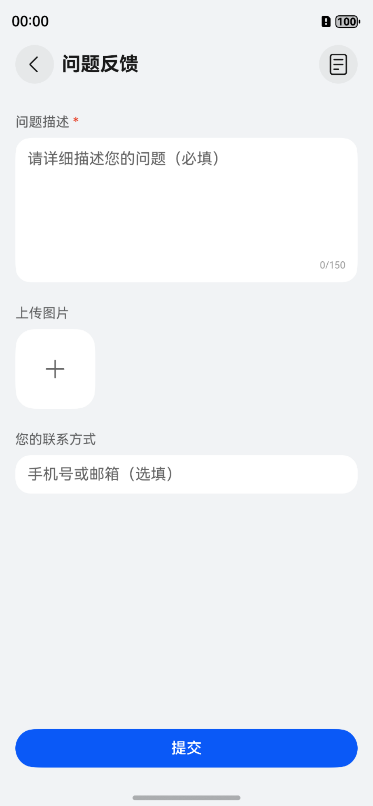
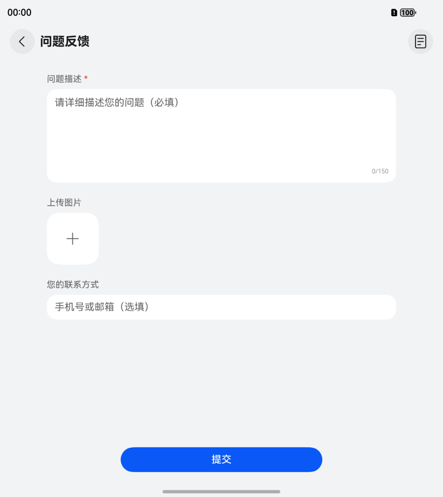
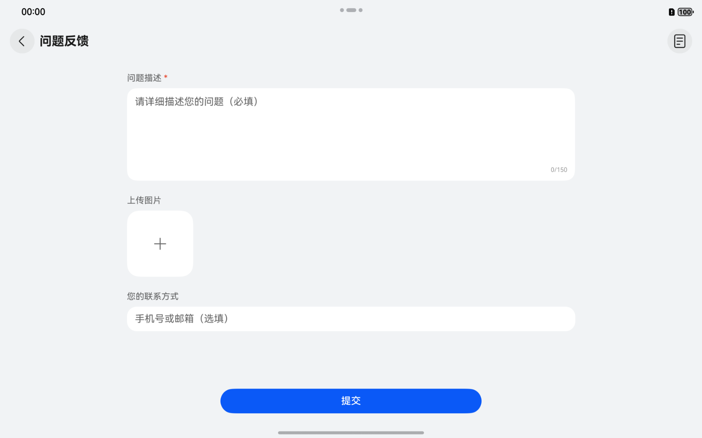
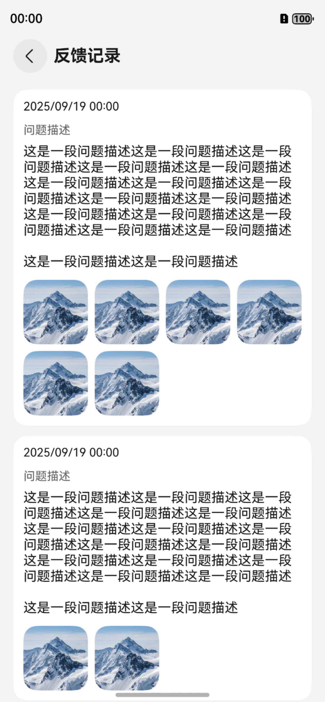
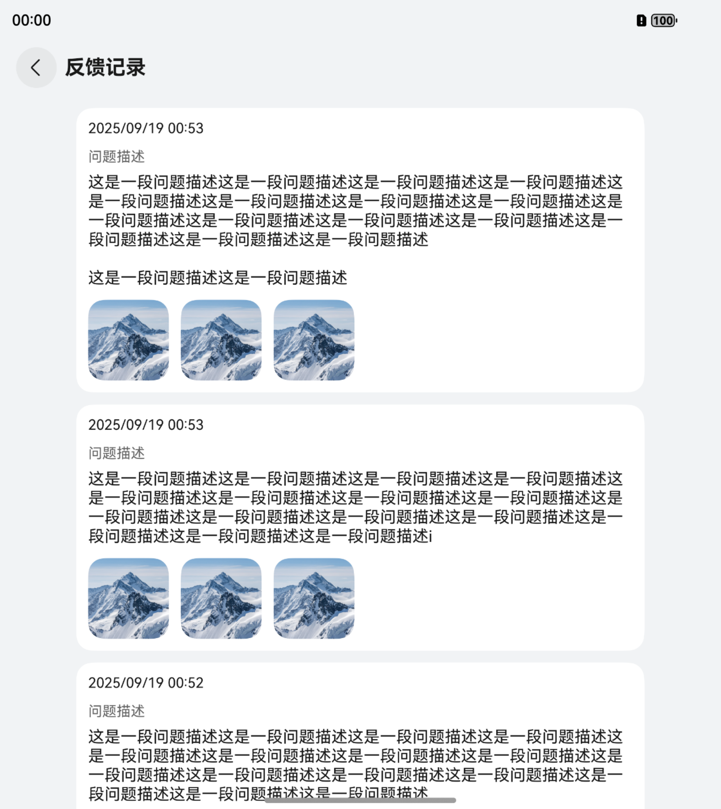
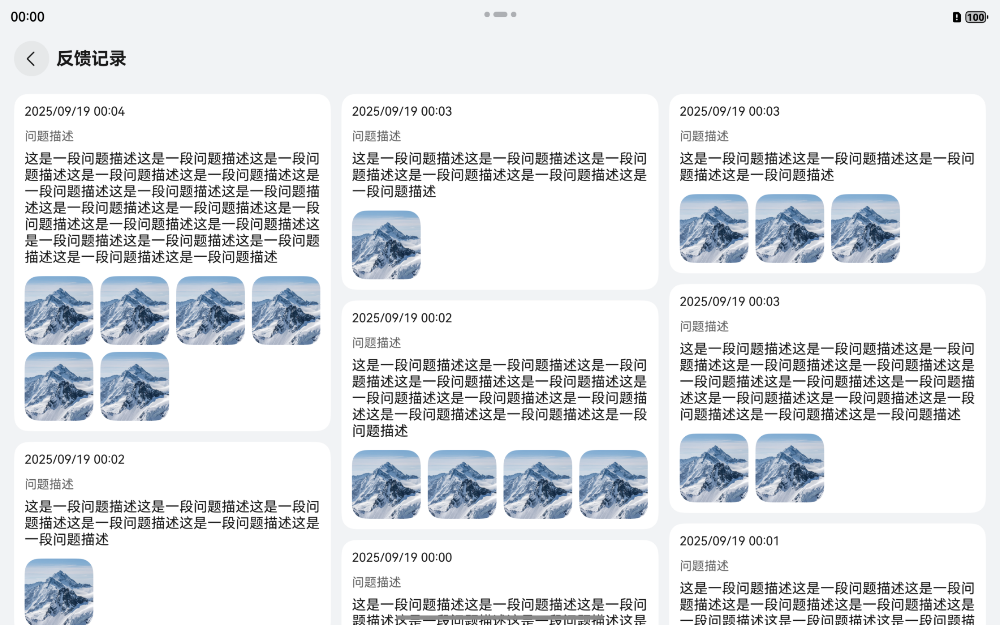

# 通用问题反馈组件快速入门

## 目录

- [简介](#简介)
- [约束与限制](#约束与限制)
- [使用](#使用)
- [API参考](#API参考)
- [示例代码](#示例代码)

## 简介

本组件提供了通用的问题反馈功能。

<div style='overflow-x:auto'>
  <table style='min-width:800px'>
    <tr>
      <th></th>
      <th>直板机</th>
      <th>折叠屏</th>
      <th>平板</th>
    </tr>
    <tr>
      <th scope='row'>问题反馈提交页</th>
      <td valign='top'></td>
      <td valign='top'></td>
      <td valign='top'></td>
    </tr>
    <tr>
      <th scope='row'>问题反馈列表页</th>
      <td valign='top'></td>
      <td valign='top'></td>
      <td valign='top'></td>
    </tr>
  </table>
</div>

## 约束与限制

### 环境

- DevEco Studio版本：DevEco Studio 5.0.5 Release及以上
- HarmonyOS SDK版本：HarmonyOS 5.0.5 Release SDK及以上
- 设备类型：华为手机（包括双折叠和阔折叠）、华为平板
- 系统版本：HarmonyOS 5.0.1(13)及以上

### 权限

- 网络权限：ohos.permission.INTERNET
- 振动权限：ohos.permission.VIBRATE

## 使用

1. 安装组件

   如果是在 DevEco Studio 使用插件集成组件，则无需安装组件，请忽略此步骤。

   如果是从生态市场下载组件，请参考以下步骤安装组件。

   a. 解压下载的组件包，将包中所有文件夹拷贝至您工程根目录的 XXX 目录下。

   b. 在项目根目录 build-profile.json5 添加 feedback 模块。

    ```
    // 在项目根目录 build-profile.json5 填写 feedback 路径。其中 XXX 为组件存放的目录名
    "modules": [
      {
        "name": "feedback",
        "srcPath": "./XXX/feedback"
      }
    ]
    ```

   c. 在项目根目录 oh-package.json5 中添加依赖。

    ```
    // XXX 为组件存放的目录名称
    {
      "dependencies": {
        "feedback": "file:./XXX/feedback"
      }
    }
    ```

2. 配置组件基本能力

   在 feedback 模块的 src/main/ets/common/Config.ets 中根据自身业务需求修改配置项。

    ```
    export class Config {
      /**
       * 启用 Mock 模式
       *
       * 该设置启用后，问题反馈相关请求将被 Axios 适配器拦截，返回 Mock 数据
       */
      public static readonly IS_MOCK_ADAPTER_ENABLE: boolean = true;
   
      /**
       * 问题描述文本可输入的最大字数
       */
      public static readonly DESC_TEXT_MAX_LENGTH: number = 150;
   
      /**
       * 问题描述文本需要输入的最小字数
       */
      public static readonly DESC_TEXT_MIN_LENGTH: number = 10;
   
      /**
       * 可选择的最大图片数量 (可设置的值上限为500)
       */
      public static readonly MAX_IMAGE_COUNT: number = 6;
   
      /**
       * 请求基础 URL, 例如 https://127.0.0.1:8443
       */
      public static readonly API_BASE_URL: string = '';
   
      /**
       * 请求超时时长
       */
      public static readonly REQUEST_TIMEOUT: number = 8 * 1000;
    }
    ```

3. 引入组件。

    ```
    import { FeedbackTrigger } from 'feedback';
    ```

## API参考

### 子组件

无

### 接口

FeedbackTrigger(options?: FeedbackTriggerOptions)
问题反馈组件

**参数：**

| 参数名     | 类型                                                    | 是否必填  | 说明           |
|---------|-------------------------------------------------------|-------|--------------|
| options | [FeedbackTriggerOptions](#FeedbackTriggerOptions对象说明) | 是     | 配置问题反馈组件的参数。 |

### FeedbackTriggerOptions对象说明

| 参数名              | 类型            | 是否必填  | 说明                    |
|:-----------------|:--------------|:------|:----------------------|
| onBeforeNavigate | () => boolean | 否     | 页面跳转前的回调，返回false将取消跳转 |

## 示例代码

```
import { FeedbackTrigger } from 'feedback';

@Entry
@ComponentV2
struct Index {

  private navPathStack: NavPathStack = new NavPathStack();

  public build(): void {
    Navigation(this.navPathStack) {
      Column() {
        // 在 FeedbackTrigger 中自定义触发样式，被点击时将自动跳转至问题反馈页面。
        FeedbackTrigger() {
          Button('问题反馈')
        }
      }
      .width('100%')
      .height('100%')
      .justifyContent(FlexAlign.Center)
    }
    .hideTitleBar(true)
    .mode(NavigationMode.Stack)
  }
}
```
