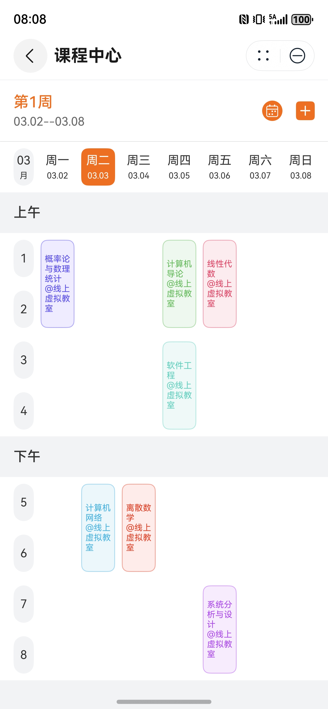
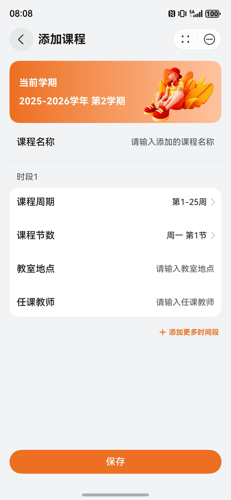
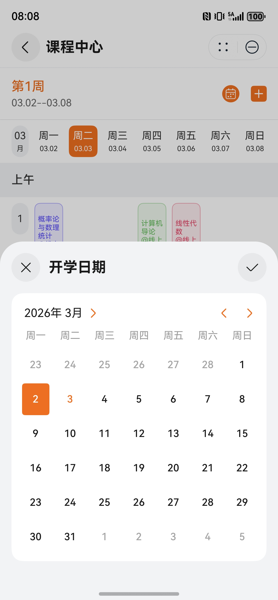

# 教育（课程助手）元服务模板快速入门

## 目录

- [功能介绍](#功能介绍)
- [约束与限制](#约束与限制)
- [快速入门](#快速入门)
- [示例效果](#示例效果)
- [开源许可协议](#开源许可协议)

## 功能介绍

您可以基于此模板直接定制元服务，也可以挑选此模板中提供的多种组件使用，从而降低您的开发难度，提高您的开发效率。

此模板提供如下组件，所有组件存放在工程根目录的components下，如果您仅需使用组件，可参考对应组件的指导链接；如果您使用此模板，请参考本文档。

| 组件                               | 描述                         | 使用指导                                                  |
|----------------------------------|----------------------------|-------------------------------------------------------|
| 课表组件（module_course_schedule）     | 提供了基于课程信息渲染课表的UI组件         | [使用指导](./components/module_course_schedule/README.md) |
| 签到组件（module_secure_checkin）      | 提供了基于可实时位置与验证码进行课堂签到的场景化组件 | [使用指导](./components/module_secure_checkin/README.md)  |
| 通用元服务关联账号组件（atomicservice_login） | 提供了元服务关联账号以及解除关联账号的功能      | [使用指导](./components/atomicservice_login/README.md)    |

本模板为课程助手类元服务提供了常用功能的开发样例，模板主要分首页和我的两大模块：

- 首页：展示今日课程、明日课程以及签到入口，支持查看学期内所有课程并对学期信息和课表数据进行编辑。
- 我的：展示个人信息。

本模板已集成华为账号、定位服务，只需做少量配置和定制即可快速实现华为账号的登录、基于位置签到等功能。

本模板主要页面及核心功能如下所示：

```
课程助手
 ├── 首页
 |    ├── 上课签到
 |    |    ├── 签到码输入
 |    |    └── 点击签到
 |    └── 课程概览卡片
 |         ├── 今日课程
 |         ├── 明日课程
 |         └── 课程中心页
 |              ├── 课表展示
 |              ├── 课表编辑
 |              └── 课程详情
 └── 我的
      ├── 账号关联
      └── 个人信息展示
```

工程目录结构如下：

```
SchoolLife
  ├─common/foundation/src/main
  │  ├───ets
  │  │   ├───common
  │  │   │       CommonConst.ets               // 公共常量
  │  │   │       CustomTypes.ets               // 自定义类型
  │  │   │       RouterConst.ets               // 路由常量
  │  │   ├───components
  │  │   │       CircleButton.ets              // 圆形按钮组件
  │  │   │       SegmentButton.ets             // 分段按钮组件
  │  │   │       TextCheckbox.ets              // 携带文本描述的选项框组件
  │  │   │       TitleBar.ets                  // 标题栏组件
  │  │   │       WeekPickerContent.ets         // 周选择器内容组件
  │  │   ├───controller
  │  │   │       WeekPicker.ets                // 周选择器
  │  │   ├───storage
  │  │   │       stores/CacheStore.ets         // 运行时缓存
  │  │   │       stores/PreferencesStore.ets   // 持久化的业务数据存储
  │  │   │       stores/UIStore.ets            // 可驱动 UI 的轻量级持久化数据存储
  │  │   │       Stores.ets                    // 各类 Store 总封装
  │  │   ├───utils
  │  │   │       AppPrivacyUtils.ets           // 隐私协议工具
  │  │   │       BytesUtils.ets                // 字节工具
  │  │   │       FileUtils.ets                 // 文件工具
  │  │   │       Logger.ets                    // 日志工具
  │  │   │       NormalizedError.ets           // 异常规范化工具
  │  │   │       RouterStack.ets               // 路由工具
  │  │   │       Toast.ets                     // 土司工具
  │  │   │       WindowListener.ets            // 视窗监听工具
  │  │   └───viewmodels
  │  │           WeekPickerVM.ets              // 周选择器 ViewModel
  │  └─resources
  │
  ├─common/network/src/main
  │   ├───ets
  │   │   ├───api
  │   │   │       AuthApi.ets                  // 认证相关 Api
  │   │   │       UserApi.ets                  // 用户相关 Api
  │   │   ├───mock
  │   │   │       MockServer.ets               // Mock 服务器
  │   │   ├───models
  │   │   │       dto/UserInfoDTO.ets          // 用户信息 DTO
  │   │   │       ApiModels.ets                // Api 模型集合
  │   │   ├───service
  │   │   │       AccountService.ets           // 账号服务
  │   │   │       UserService.ets              // 用户服务
  │   │   └───HttpClient.ets                   // HTTP 客户端
  │   └─resources
  │
  ├─components
  │   ├─atomicservice_login                    // 通用元服务关联账号组件
  │   ├─module_course_schedule                 // 课表组件
  │   └─module_secure_checkin                  // 签到组件
  │
  │─entry/src/main
  │   ├───ets
  │   │   ├───common
  │   │   │       MainEntryConfig.ets          // 根页面配置
  │   │   ├───components
  │   │   │       HomeTab.ets                  // 首页面 Tab
  │   │   │       MineTab.ets                  // 我的页面 Tab
  │   │   ├───entryability
  │   │   │       EntryAbility.ets             // 元服务入口 UIAbility
  │   │   ├───entryformability
  │   │   │       EntryFormAbility.ets         // 卡片入口 UIAbility
  │   │   ├───pages
  │   │   │       MainEntry.ets                // 根页面
  │   │   ├───viewmodels
  │   │   │       HomeTabVM.ets                // 首页面 ViewModel
  │   │   │       IntentTaskVM.ets             // 意图任务 ViewModel
  │   │   │       MainEntryVM.ets              // 根页面 ViewModel
  │   │   │       MineTabVM.ets                // 我的页面 ViewModel
  │   │   └───widget/pages
  │   │   │       SchoolLifeWidgetCard.ets     // 服务卡片
  │   └─resources
  │
  └─features/school_timetable/src/main   
      └───ets
      │   ├───common
      │   │       CustomTypes.ets              // 自定义类型
      │   ├───components
      │   │       CourseOverviewCard.ets       // 课程概览卡片组件
      │   │       FunctionalRow.ets            // 功能行组件
      │   │       PeriodRangePickerContent.ets // 课程节数范围选择器内容组件
      │   ├───controller
      │   │       PeriodRangePicker.ets        // 课程节数范围选择器
      │   ├───pages
      │   │       CourseDetailPage.ets         // 课程详情页
      │   │       CourseFormPage.ets           // 课程表单页
      │   │       TimetablePage.ets            // 课表页
      │   └───viewmodels
      │           CourseArrangementVM.ets      // 课程安排 ViewModel
      │           CourseDetailPageVM.ets       // 课程详情页 ViewModel
      │           CourseFormPageVM.ets         // 课程表单页 ViewModel
      │           CourseVM.ets                 // 课程 ViewModel
      │           PeriodRangePickerVM.ets      // 课程节数范围选择器 ViewModel
      │           TimetablePageVM.ets          // 课表页 ViewModel
      └─resources
```

## 约束与限制

### 环境

- DevEco Studio版本：DevEco Studio 6.0.2 Release及以上
- HarmonyOS SDK版本：HarmonyOS 6.0.2 Release SDK及以上
- 设备类型：华为手机（包括双折叠和阔折叠）
- 系统版本：HarmonyOS 5.1.0(18)及以上

### 权限

- 网络权限：ohos.permission.INTERNET
- 振动权限：ohos.permission.VIBRATE

## 快速入门

###  配置工程

在运行此模板前，需要完成以下配置：

1. 在AppGallery Connect创建元服务，将包名配置到模板中。

   a. 参考[创建元服务](https://developer.huawei.com/consumer/cn/doc/app/agc-help-create-atomic-service-0000002247795706)为元服务创建APP ID，并将APP ID与元服务进行关联。

   b. 返回应用列表页面，查看元服务的包名。

   c. 将模板工程根目录下AppScope/app.json5文件中的bundleName替换为创建元服务的包名。

2. 配置华为账号服务。

   a. 将元服务的client ID配置到entry/src/main路径下的module.json5文件，详细参考：[配置Client ID](https://developer.huawei.com/consumer/cn/doc/atomic-guides/account-atomic-client-id)。

   b. 如需获取用户真实手机号，需要申请相应的权限，详细参考：[申请账号权限](https://developer.huawei.com/consumer/cn/doc/atomic-guides/account-guide-atomic-permissions)，并在端侧使用快速验证手机号码Button进行[验证获取手机号码](https://developer.huawei.com/consumer/cn/doc/atomic-guides/account-guide-atomic-get-phonenumber)。

3. 对元服务进行[手工签名](https://developer.huawei.com/consumer/cn/doc/harmonyos-guides/ide-signing#section297715173233)。

4. 添加手工签名所用证书对应的公钥指纹。详细参考：[配置公钥指纹](https://developer.huawei.com/consumer/cn/doc/app/agc-help-cert-fingerprint-0000002278002933)。

###  运行调试工程

1. 连接调试手机和PC。

2. 菜单选择“Run > Run 'entry' ”或者“Run > Debug 'entry' ”，运行或调试模板工程。

## 示例效果

| 首页                                          | 我的                                         | 课表                                          | 添加课程                                         | 开学日期                                         |
|---------------------------------------------|--------------------------------------------|---------------------------------------------|----------------------------------------------|----------------------------------------------|
|  |  |  |  |  |

## 开源许可协议

该代码经过[Apache 2.0 授权许可](http://www.apache.org/licenses/LICENSE-2.0)。