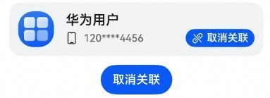
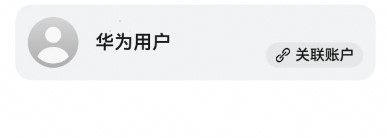

# 通用元服务关联账号组件快速入门

## 目录

- [简介](#简介)
- [约束与限制](#约束与限制)
- [使用](#使用)
- [API参考](#API参考)
- [示例代码](#示例代码)

## 简介

本组件提供元服务关联账号，解除关联的功能。

<div style='overflow-x:auto'>
  <table style='min-width:800px'>
    <tr>
      <th>关联号码</th>
      <th>未关联号码</th>
    </tr>
    <tr>
      <td valign='top'></td>
      <td valign='top'></td>
    </tr>
  </table>
</div>

## 约束与限制

### 环境

* DevEco Studio版本：DevEco Studio 5.0.4 Release及以上
* HarmonyOS SDK版本：HarmonyOS 5.0.4 Release SDK及以上
* 设备类型：华为手机（包括双折叠和阔折叠）、平板
* 系统版本：HarmonyOS 5.0.1(13)及以上

### 权限

- 网络权限：ohos.permission.INTERNET

## 使用

1. 安装组件。

   如果是在DevEco Studio使用插件集成组件，则无需安装组件，请忽略此步骤。

   如果是从生态市场下载组件，请参考以下步骤安装组件。

   a. 解压下载的组件包，将包中所有文件夹拷贝至您工程根目录的XXX目录下。

   b. 在项目根目录build-profile.json5添加atomicservice_login模块。

   ```
   // 项目根目录下build-profile.json5填写atomicservice_login路径。其中XXX为组件存放的目录名
   "modules": [
     {
       "name": "atomicservice_login",
       "srcPath": "./XXX/atomicservice_login"
     }
   ]
   ```

   c. 在项目根目录oh-package.json5添加依赖。

   ```
   // XXX为组件存放的目录名称
   "dependencies": {
     "atomicservice_login": "file:./XXX/atomicservice_login"
   }
   ```

2. 引入通用元服务关联账号组件句柄。

   ```
   import { AccountUtils, AtomicserviceLogin, ApiController, CancelAuthState, UserInfo } from "atomicservice_login";
   ```

3. 将元服务的client ID配置到项目entry模块的module.json5文件，详细参考：[配置Client ID](https://developer.huawei.com/consumer/cn/doc/atomic-guides/account-atomic-client-id)。

   ```
   "metadata": [
      {
        // 替换应用的clientID
        "name": "client_id",
        "value": "xxx"
      }
    ],
   ```

4. 如需获取用户真实手机号，需要申请phone权限，详细参考：[申请账号权限](https://developer.huawei.com/consumer/cn/doc/atomic-guides/account-guide-atomic-permissions) ，并在端侧使用快速验证手机号码Button进行[验证获取手机号码](https://developer.huawei.com/consumer/cn/doc/atomic-guides/account-guide-atomic-get-phonenumber)。

5. 调用组件，详细参数配置说明参见[API参考](#API参考)。

## API参考

### 接口

AtomicserviceLogin(option: [AtomicserviceLoginOptions](#AtomicserviceLoginOptions对象说明))

通用元服务关联账号组件

**参数：**

| 参数名     | 类型                                                          | 是否必填 | 说明              |
|:--------|:------------------------------------------------------------|:-----|:----------------|
| options | [AtomicserviceLoginOptions](#AtomicserviceLoginOptions对象说明) | 否    | 通用元服务关联账号组件的参数。 |

#### AtomicserviceLoginOptions对象说明

| 参数名        | 类型                                      | 是否必填 | 说明                |
|:-----------|:----------------------------------------|:-----|:------------------|
| userInfo   | [userInfoOptions](#userInfoOptions对象说明) | 是    | 用户信息              |
| isLink     | boolean                                 | 否    | 是否关联，默认为false，未关联 |
| initValue  | ResourceStr                             | 否    | 用户名初始信息，默认为'华为用户' |
| controller | [ApiController](#ApiController对象说明)     | 否    | 控制器               |
| linkStatusBuilderParam           |   () => void                                      | 否    | 关联时昵称与手机号码显示样式    |

**接口：**

| 实例名          | 接口名                                                                                                              | 说明       |
|:-------------|:-----------------------------------------------------------------------------------------------------------------|:---------|
| AccountUtils | silentLogin(callback: (data: authentication.LoginWithHuaweiIDCredential \| undefined) => void): Promise<Boolean> | 静默登录以及回调 |


#### userInfoOptions对象说明

| 名称          | 类型     | 是否必填 | 说明       |
|:------------|:-------|:-----|:---------|
| authCode    | string | 否    | 用户凭证     |
| avatar      | string | 否    | 用户的头像    |
| idToken     | string | 否    | 用户的token |
| phoneNumber | string | 否    | 用户的手机号   |
| userName    | string | 否    | 用户的昵称    |

#### ApiController对象说明

| 名称     | 类型                                         | 是否必填 | 说明       |
|:-------|:-------------------------------------------|:-----|:---------|
| unlink | (unBindPhone: () => Promise<void>) => void | 否    | 取消手机号码关联 |


### 事件

支持以下事件：

#### bindPhone

bindPhone: (code: string | undefined) => void = () => {}

关联手机号码的回调，返回用户的临时登录凭证（Authorization Code），可通过临时登录凭证获取真实手机号，临时登录凭证时效5分钟，具体操作可参考“[服务端开发](https://developer.huawei.com/consumer/cn/doc/atomic-guides/account-guide-atomic-get-phonenumber#section380015370555)”章节。

#### onGetPhoneError

onGetPhoneError: (err: BusinessError) => void = () => {}

关联手机号码失败的回调

#### CancelAuthState枚举说明

| 名称      | 值 | 说明     |
|:--------|:--|:-------|
| SUCCESS | 1 | 取消授权成功 |
| ERROR   | 2 | 取消授权错误 |

#### unBindPhone

unBindPhone: () => Promise<void> = () => new Promise(() => {})

取消手机号码关联的回调

## 示例代码

```ts
import { AtomicserviceLogin, ApiController, UserInfo } from "atomicservice_login";

@Entry
@ComponentV2
struct AtomicserviceLoginPage {
  @Local userInfo: UserInfo = new UserInfo()
  @Local isLink: boolean = false
  @Local controller: ApiController = new ApiController()

  unBindPhone = async (): Promise<void> => {
    this.isLink = false
    this.userInfo = new UserInfo()
  }

  build() {
    NavDestination() {
      Column() {
        AtomicserviceLogin({
          userInfo: this.userInfo,
          isLink: this.isLink,
          controller: this.controller,
          bindPhone: (code: string | undefined) => {
            this.isLink = true
            this.userInfo.userName = '华为用户'
            this.userInfo.avatar = $r('app.media.startIcon')  // todo 替换为开发者需要的资源
            this.getUIContext().getPromptAction().showToast({message: '请通过临时登录凭证获取真实手机号'})
          },
          onGetPhoneError: (err) => {
            if (err.code === 1001502014) {
              this.getUIContext().getPromptAction().showToast({message: '元服务未获取phone权限或用户授权，此为模拟关联。'})
              this.isLink = true
              this.userInfo.phoneNumber = '120****4456'
              this.userInfo.userName = '华为用户'
              this.userInfo.avatar = $r('app.media.startIcon')  // todo 替换为开发者需要的资源
            }
          },
          unBindPhone: this.unBindPhone,
        })
      }
      .backgroundColor($r('sys.color.background_secondary'))
      .borderRadius(16)
      .margin({ right: 16, left: 16 })
    }
  }
}
```