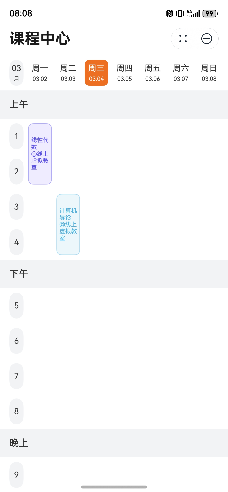

# 课表组件快速入门

## 目录

- [简介](#简介)
- [约束与限制](#约束与限制)
- [使用](#使用)
- [API参考](#API参考)
- [示例代码](#示例代码)

## 简介

本组件支持根据课程信息及相关配置进行课表UI渲染。



## 约束与限制

### 环境

* DevEco Studio版本：DevEco Studio 5.0.3 Release及以上
* HarmonyOS SDK版本：HarmonyOS 5.0.3 Release SDK及以上
* 设备类型：华为手机（包括双折叠和阔折叠）
* 系统版本：HarmonyOS 5.0.3(15)及以上

### 权限

无

## 使用

1. 安装组件。

   如果是在DevEco Studio使用插件集成组件，则无需安装组件，请忽略此步骤。

   如果是从生态市场下载组件，请参考以下步骤安装组件。

   a. 解压下载的组件包，将包中所有文件夹拷贝至您工程根目录的XXX目录下。

   b. 在项目根目录build-profile.json5添加module_course_schedule模块。

   ```
   // 项目根目录下build-profile.json5填写module_course_schedule路径。其中XXX为组件存放的目录名
   "modules": [
     {
       "name": "module_course_schedule",
       "srcPath": "./XXX/module_course_schedule"
     }
   ]
   ```

   c. 在项目根目录 oh-package.json5 中添加依赖。

   ```
   // XXX 为组件存放的目录名称
   "dependencies": {
     "module_course_schedule": "file:./XXX/module_course_schedule"
   }
   ```

2. 引入组件。

   ```
   import {
     Period,             // 课程节次数据结构
     Course,             // 课程数据结构
     Timetable,          // 课表数据结构
     TimetableVM,        // 课表 ViewModel
     TimetableUtils,     // 课表工具
     ColorPalette,       // 调色盘工具
     WeekMaskUtils,      // 周掩码工具
     WeekSelectMode,     // 周选择模式 (单周/双周/每周/自定义)
     DayPart,            // 时段 (上午/下午/晚上)
     CourseSchedulePanel // 课表 UI 面板
   } from 'module_course_schedule';
   ```

3. 调用组件，详细参数配置说明参见[API参考](#API参考)。

## API参考

### CourseSchedulePanel(option: CourseSchedulePanelOptions)

**CourseSchedulePanelOptions对象说明**

| 参数名           | 类型                                                                                                        | 是否必填 | 说明           |
|:--------------|:----------------------------------------------------------------------------------------------------------|:-----|:-------------|
| timetable     | [TimetableVM](#TimetableVM)                                                                               | 是    | 课表 ViewModel |
| bgColor       | [ResourceColor](https://developer.huawei.com/consumer/cn/doc/harmonyos-references/ts-types#resourcecolor) | 否    | 背景色          |
| onCourseClick | (courseId: string) => void                                                                                | 否    | 课程点击回调事件     |

### TimetableUtils

#### getTimeRangeLabel(timetable: Timetable, start: number, end: number): string

根据课表节数配置及目标起止节数，获取其对应的时分范围描述。

**参数：**

| 参数名       | 类型                      | 是否必填  | 说明     |
|-----------|-------------------------|-------|--------|
| timetable | [Timetable](#Timetable) | 是     | 课表源数据  |
| start     | number                  | 是     | 起始节数索引 |
| end       | number                  | 是     | 终止节数索引 |

**返回值：**

| 类型     | 说明                   |
|--------|----------------------|
| string | 时分范围描述 'hh:mm-hh:mm' |

#### getWeekNumByDate(timetable: Timetable, date: Date, needClamp: boolean = true): number

结合课表，获取目标日期相对于锚点日期属于第几周。

**参数：**

| 参数名       | 类型                      | 是否必填  | 说明                    |
|-----------|-------------------------|-------|-----------------------|
| timetable | [Timetable](#Timetable) | 是     | 课表源数据                 |
| date      | Date                    | 是     | 目标日期                  |
| needClamp | boolean                 | 否     | 是否将得到的周数规范化，防止超出学期总周数 |

**返回值：**

| 类型     | 说明                            |
|--------|-------------------------------|
| number | 相对周数 (1: 第一周, 2: 第二周, 3: ...) |

#### isArrangementOnDate(timetable: Timetable, arrangement: CourseArrangement, date: Date): boolean

判断一个课程安排在指定日期是否生效。

**参数：**

| 参数名         | 类型                                      | 是否必填  | 说明    |
|-------------|-----------------------------------------|-------|-------|
| timetable   | [Timetable](#Timetable)                 | 是     | 课表源数据 |
| arrangement | [CourseArrangement](#CourseArrangement) | 是     | 课程安排  |
| date        | Date                                    | 是     | 指定日期  |

**返回值：**

| 类型      | 说明                       |
|---------|--------------------------|
| boolean | 是否生效 (true: 是, false: 否) |

#### clampWeekNum(timetable: Timetable, week: number): number

将某一周数规范化到课表的有效范围内。

**参数：**

| 参数名       | 类型                      | 是否必填  | 说明    |
|-----------|-------------------------|-------|-------|
| timetable | [Timetable](#Timetable) | 是     | 课表源数据 |
| week      | number                  | 是     | 周数    |

**返回值：**

| 类型     | 说明                               |
|--------|----------------------------------|
| number | 规范化后的周数 (1: 第一周, 2: 第二周, 3: ...) |

#### splitPeriodRangeByDayPart(timetable: Timetable, start: number, end: number): DayPartPeriodSegment[]

将给定起止节数按照课表时段分割。

**参数：**

| 参数名       | 类型                      | 是否必填  | 说明     |
|-----------|-------------------------|-------|--------|
| timetable | [Timetable](#Timetable) | 是     | 课表源数据  |
| start     | number                  | 是     | 起始节数索引 |
| end       | number                  | 是     | 终止节数索引 |

**返回值：**

| 类型                                            | 说明         |
|-----------------------------------------------|------------|
| [DayPartPeriodSegment](#DayPartPeriodSegment) | 切分后的课程节次段落 |

#### getCourseOverviewListByDate(timetable: Timetable, date: Date): CourseOverviewItem[]

获取指定日期的课程概览列表。

**参数：**

| 参数名       | 类型                      | 是否必填  | 说明    |
|-----------|-------------------------|-------|-------|
| timetable | [Timetable](#Timetable) | 是     | 课表源数据 |
| date      | Date                    | 是     | 目标日期  |

**返回值：**

| 类型                                          | 说明                        |
|---------------------------------------------|---------------------------|
| [CourseOverviewItem](#CourseOverviewItem)[] | 当日全部课程概览列表，顺序按照课程起始节次从低到高 |

#### getCourseOverviewListByWeekNum(timetable: Timetable, weekNum: number): CourseOverviewItem[]

获取指定周的课程概览列表。

**参数：**

| 参数名       | 类型                      | 是否必填  | 说明    |
|-----------|-------------------------|-------|-------|
| timetable | [Timetable](#Timetable) | 是     | 课表源数据 |
| weekNum   | number                  | 是     | 第几周   |

**返回值：**

| 类型                                          | 说明            |
|---------------------------------------------|---------------|
| [CourseOverviewItem](#CourseOverviewItem)[] | 该周全部课程概览列表，无序 |

#### getCourseOverviewList(timetable: Timetable, filter: (arrangement: CourseArrangement) => boolean)

获取课程概览列表。

**参数：**

| 参数名       | 类型                                                                | 是否必填  | 说明      |
|-----------|-------------------------------------------------------------------|-------|---------|
| timetable | [Timetable](#Timetable)                                           | 是     | 课表源数据   |
| filter    | (arrangement: [CourseArrangement](#CourseArrangement)) => boolean | 是     | 课程安排过滤器 |

**返回值：**

| 类型                                          | 说明         |
|---------------------------------------------|------------|
| [CourseOverviewItem](#CourseOverviewItem)[] | 过滤后的课程概览列表 |

#### isArrangementTimeConflict(a: CourseArrangement, b: CourseArrangement): boolean

判断两个课程安排是否存在时间冲突。

**参数：**

| 参数名  | 类型                                      | 是否必填  | 说明    |
|------|-----------------------------------------|-------|-------|
| a    | [CourseArrangement](#CourseArrangement) | 是     | 课程安排a |
| b    | [CourseArrangement](#CourseArrangement) | 是     | 课程安排b |

**返回值：**

| 类型      | 说明                       |
|---------|--------------------------|
| boolean | true: 存在冲突, false: 不存在冲突 |

#### hasSelfArrangementConflict(course: Course): boolean

判断一门课程自身的所有课程安排是否存在时间冲突。

**参数：**

| 参数名    | 类型                | 是否必填  | 说明   |
|--------|-------------------|-------|------|
| course | [Course](#Course) | 是     | 课程数据 |

**返回值：**

| 类型      | 说明                       |
|---------|--------------------------|
| boolean | true: 存在冲突, false: 不存在冲突 |

#### isCourseTimeConflict(a: Course, b: Course): boolean

判断两门课程的课程安排彼此是否存在时间冲突。

**参数：**

| 参数名  | 类型                | 是否必填  | 说明    |
|------|-------------------|-------|-------|
| a    | [Course](#Course) | 是     | 课程数据a |
| b    | [Course](#Course) | 是     | 课程数据b |

**返回值：**

| 类型      | 说明                       |
|---------|--------------------------|
| boolean | true: 存在冲突, false: 不存在冲突 |

#### upsertCourse(timetable: Timetable, course: Course): boolean

向课表新增课程或覆盖 id 相同的课程。

**参数：**

| 参数名       | 类型                      | 是否必填  | 说明    |
|-----------|-------------------------|-------|-------|
| timetable | [Timetable](#Timetable) | 是     | 课表源数据 |
| course    | [Course](#Course)       | 是     | 课程数据  |

**返回值：**

| 类型      | 说明                                    |
|---------|---------------------------------------|
| boolean | true: 本次新增发生了覆盖行为, false: 本次新增未覆盖任何课程 |

#### getSemesterLabelByDate(anchorDate: Date): string

根据锚点日期获取学期描述。

**参数：**

| 参数名        | 类型   | 是否必填  | 说明   |
|------------|------|-------|------|
| anchorDate | Date | 是     | 锚点日期 |

**返回值：**

| 类型     | 说明   |
|--------|------|
| string | 学期描述 |

#### deepClone(timetable: Timetable): Timetable

对课表源数据进行深拷贝。

**参数：**

| 参数名       | 类型                      | 是否必填  | 说明    |
|-----------|-------------------------|-------|-------|
| timetable | [Timetable](#Timetable) | 是     | 课表源数据 |

**返回值：**

| 类型                      | 说明         |
|-------------------------|------------|
| [Timetable](#Timetable) | 深拷贝得到的课表数据 |

### WeekMaskUtils

#### getWeekMaskBySelectMode(mode: WeekSelectMode, weekCount: number): number

根据周选择模式和总周数获取对应掩码。

**参数：**

| 参数名       | 类型                                | 是否必填  | 说明                           |
|-----------|-----------------------------------|-------|------------------------------|
| mode      | [WeekSelectMode](#WeekSelectMode) | 是     | 周选择模式                        |
| weekCount | number                            | 是     | 总共有几周 (1 <= weekCount <= 31) |

**返回值：**

| 类型     | 说明    |
|--------|-------|
| number | 周选择掩码 |

#### getWeekSelectModeByMask(weekMask: number, weekCount: number): WeekSelectMode

根据周选择掩码和总周数获取对应选择模式。

**参数：**

| 参数名       | 类型     | 是否必填  | 说明                           |
|-----------|--------|-------|------------------------------|
| weekMask  | number | 是     | 周选择掩码                        |
| weekCount | number | 是     | 总共有几周 (1 <= weekCount <= 31) |

**返回值：**

| 类型                                | 说明    |
|-----------------------------------|-------|
| [WeekSelectMode](#WeekSelectMode) | 周选择模式 |

#### getWeekLabelByMask(weekMask: number, weekCount: number): string

根据周选择掩码和总周数获取对应文本描述。

**参数：**

| 参数名       | 类型     | 是否必填  | 说明                           |
|-----------|--------|-------|------------------------------|
| weekMask  | number | 是     | 周选择掩码                        |
| weekCount | number | 是     | 总共有几周 (1 <= weekCount <= 31) |

**返回值：**

| 类型     | 说明      |
|--------|---------|
| string | 周选择文本描述 |

#### isWeekInMask(weekMask: number, week: number): boolean

校验某一周是否属于某一选择掩码。

**参数：**

| 参数名      | 类型     | 是否必填  | 说明    |
|----------|--------|-------|-------|
| weekMask | number | 是     | 周选择掩码 |
| week     | number | 是     | 周数    |

**返回值：**

| 类型      | 说明                   |
|---------|----------------------|
| boolean | true: 属于, false: 不属于 |

#### addWeekToMask(weekMask: number, week: number): number

将指定周加入选择掩码。

**参数：**

| 参数名      | 类型     | 是否必填  | 说明    |
|----------|--------|-------|-------|
| weekMask | number | 是     | 周选择掩码 |
| week     | number | 是     | 周数    |

**返回值：**

| 类型     | 说明    |
|--------|-------|
| number | 周选择掩码 |

#### removeWeekFromMask(weekMask: number, week: number): number

将指定周从选择掩码中移除。

**参数：**

| 参数名      | 类型     | 是否必填  | 说明    |
|----------|--------|-------|-------|
| weekMask | number | 是     | 周选择掩码 |
| week     | number | 是     | 周数    |

**返回值：**

| 类型     | 说明    |
|--------|-------|
| number | 周选择掩码 |

### DateUtils

#### isSameYear(a: Date, b: Date): boolean

判断两个日期是否为同年。

**参数：**

| 参数名 | 类型     | 是否必填  | 说明  |
|-----|--------|-------|-----|
| a   | number | 是     | 日期a |
| b   | number | 是     | 日期b |

**返回值：**

| 类型      | 说明                       |
|---------|--------------------------|
| boolean | 判断结果 (true: 是, false: 否) |

#### isSameMonth(a: Date, b: Date): boolean

判断两个日期是否为同年同月。

**参数：**

| 参数名 | 类型     | 是否必填  | 说明  |
|-----|--------|-------|-----|
| a   | number | 是     | 日期a |
| b   | number | 是     | 日期b |

**返回值：**

| 类型      | 说明                       |
|---------|--------------------------|
| boolean | 判断结果 (true: 是, false: 否) |

#### isSameDay(a: Date, b: Date): boolean

判断两个日期是否为同年同月同日。

**参数：**

| 参数名 | 类型     | 是否必填  | 说明  |
|-----|--------|-------|-----|
| a   | number | 是     | 日期a |
| b   | number | 是     | 日期b |

**返回值：**

| 类型      | 说明                       |
|---------|--------------------------|
| boolean | 判断结果 (true: 是, false: 否) |

#### getDayPartLabel(part: DayPart): string

根据时段类型获取对应描述。

**参数：**

| 参数名  | 类型                  | 是否必填  | 说明   |
|------|---------------------|-------|------|
| part | [DayPart](#DayPart) | 是     | 时段类型 |

**返回值：**

| 类型     | 说明              |
|--------|-----------------|
| string | 时段描述 (上午/下午/晚上) |

#### getWeekdayLabelByDayOfWeek(dayOfWeek: number): string

将 dayOfWeek(0=周日..6=周六) 转为星期文本。

**参数：**

| 参数名       | 类型     | 是否必填  | 说明         |
|-----------|--------|-------|------------|
| dayOfWeek | number | 是     | 0=周日..6=周六 |

**返回值：**

| 类型     | 说明           |
|--------|--------------|
| string | 星期文本，示例：'周一' |

#### getMonday(date: Date): Date

获取传入日期所在周的星期一。

**参数：**

| 参数名  | 类型   | 是否必填  | 说明  |
|------|------|-------|-----|
| date | Date | 是     | 日期  |

**返回值：**

| 类型   | 说明          |
|------|-------------|
| Date | 传入日期所在周的星期一 |

#### getMinuteOfDay(date: Date): number

获取传入日期自零点起经过的分钟数。

**参数：**

| 参数名  | 类型   | 是否必填  | 说明  |
|------|------|-------|-----|
| date | Date | 是     | 日期  |

**返回值：**

| 类型     | 说明                      |
|--------|-------------------------|
| number | 自零点起经过的分钟数，区间：[0, 1440) |

#### formatTimeByMinute(minuteOfDay: number): string

将自零点起经过的分钟数格式化为时间字符串。

**参数：**

| 参数名         | 类型     | 是否必填  | 说明         |
|-------------|--------|-------|------------|
| minuteOfDay | number | 是     | 自零点起经过的分钟数 |

**返回值：**

| 类型     | 说明               |
|--------|------------------|
| string | 时间字符串，示例：'09:30' |

#### formatDateYmdDot(date: Date): string

将传入日期格式化为 yyyy.mm.dd 风格字符串。

**参数：**

| 参数名  | 类型   | 是否必填  | 说明  |
|------|------|-------|-----|
| date | Date | 是     | 日期  |

**返回值：**

| 类型     | 说明         |
|--------|------------|
| string | 格式化后的日期字符串 |

#### formatDateMdDot(date: Date): string

将传入日期格式化为 mm.dd 风格字符串。

**参数：**

| 参数名  | 类型   | 是否必填  | 说明  |
|------|------|-------|-----|
| date | Date | 是     | 日期  |

**返回值：**

| 类型     | 说明         |
|--------|------------|
| string | 格式化后的日期字符串 |

#### formatWeekRangeMonToSun(date: Date): string

将传入日期所在周格式化为周范围字符串 (不显示年份)。

**参数：**

| 参数名  | 类型   | 是否必填  | 说明  |
|------|------|-------|-----|
| date | Date | 是     | 日期  |

**返回值：**

| 类型     | 说明                       |
|--------|--------------------------|
| string | 周范围字符串，示例：'12.29--01.04' |

### ColorPalette

#### getColor(index: number, alpha: number = 1.0): string

根据索引获取颜色值。

**参数：**

| 参数名   | 类型     | 是否必填  | 说明   |
|-------|--------|-------|------|
| index | number | 是     | 颜色索引 |
| alpha | number | 否     | 透明度  |

**返回值：**

| 类型     | 说明            |
|--------|---------------|
| string | 16进制 ARGB 颜色值 |

#### nextColor(alpha: number = 1.0): string

获取下一个颜色。

**参数：**

| 参数名   | 类型     | 是否必填  | 说明  |
|-------|--------|-------|-----|
| alpha | number | 否     | 透明度 |

**返回值：**

| 类型     | 说明            |
|--------|---------------|
| string | 16进制 ARGB 颜色值 |

#### setIndexByColor(hexColor: string): void

根据颜色值设置索引。(用于恢复工具记录的索引位置)

**参数：**

| 参数名      | 类型     | 是否必填  | 说明            |
|----------|--------|-------|---------------|
| hexColor | string | 是     | 16进制 ARGB 颜色值 |

#### applyAlpha(hexColor: string, alpha: number): string

为颜色设置透明度。

**参数：**

| 参数名      | 类型     | 是否必填  | 说明                |
|----------|--------|-------|-------------------|
| hexColor | string | 是     | 16进制 RGB/ARGB 颜色值 |
| alpha    | number | 是     | 透明度               |

**返回值：**

| 类型     | 说明            |
|--------|---------------|
| string | 16进制 ARGB 颜色值 |

### TimetableVM

#### constructor(timetable: Timetable, weekNum: number)

TimetableVM的构造函数。

**参数：**

| 参数名       | 类型                      | 是否必填  | 说明     |
|-----------|-------------------------|-------|--------|
| timetable | [Timetable](#Timetable) | 是     | 课表源数据  |
| weekNum   | number                  | 是     | 当前为第几周 |

#### updateTimetable(timetable: Timetable): void

更新课表源数据。

**参数：**

| 参数名       | 类型                      | 是否必填  | 说明    |
|-----------|-------------------------|-------|-------|
| timetable | [Timetable](#Timetable) | 是     | 课表源数据 |

#### updateWeekNum(weekNum: number): void

更新周数。

**参数：**

| 参数名     | 类型     | 是否必填  | 说明     |
|---------|--------|-------|--------|
| weekNum | number | 是     | 当前为第几周 |

### WeekSelectMode

周选择模式枚举。

| 名称     | 说明  |
|--------|-----|
| All    | 全选  |
| Odd    | 单周  |
| Even   | 双周  |
| Custom | 自定义 |

### DayPart

时段枚举。

| 名称        | 说明  |
|-----------|-----|
| Morning   | 早上  |
| Afternoon | 下午  |
| Evening   | 晚上  |

### Timetable

课表结构体。

| 字段名      | 类型                    | 是否必填  | 说明                  |
|----------|-----------------------|-------|---------------------|
| id       | string                | 是     | 唯一标识                |
| semester | [Semester](#Semester) | 是     | 学期信息                |
| periods  | [Period](#Period)[]   | 是     | 节次时间表，按照索引顺序，0 为第一节 |
| courses  | [Course](#Course)[]   | 是     | 课程数据                |

### Semester

学期信息结构体。

| 字段名          | 类型     | 是否必填  | 说明                               |
|--------------|--------|-------|----------------------------------|
| label        | string | 是     | 学期描述                             |
| anchorTimeMs | number | 是     | 学期的基准/锚点时间戳，即开学后第一节课所在的日期，并非开学日期 |
| weekCount    | number | 是     | 该学期共有多少周 (受当前设计约束，不可以超过 31 周)    |

### Period

课程节次结构体。

| 字段名      | 类型                  | 是否必填  | 说明                       |
|----------|---------------------|-------|--------------------------|
| dayPart  | [DayPart](#DayPart) | 是     | 所处时段，上午、下午、晚上            |
| startMin | number              | 是     | 起始时间 [0, 60 * 24)        |
| endMin   | number              | 是     | 结束时间 (startMin, 60 * 24) |

### Course

课程结构体。

| 字段名          | 类型                                      | 是否必填  | 说明   |
|--------------|-----------------------------------------|-------|------|
| id           | string                                  | 是     | 唯一标识 |
| name         | string                                  | 是     | 课程名  |
| color        | string                                  | 是     | 课程颜色 |
| arrangements | [CourseArrangement](#CourseArrangement) | 是     | 课程安排 |

### CourseArrangement

课程安排结构体。

| 字段名         | 类型     | 是否必填  | 说明                         |
|-------------|--------|-------|----------------------------|
| id          | string | 是     | 唯一标识                       |
| courseId    | string | 是     | 所属课程唯一标识                   |
| dayOfWeek   | number | 是     | 课程在星期几 (0: 周日, 1: 周一...)   |
| periodStart | number | 是     | 起始节数索引 (0: 第一节, 1: 第二节...) |
| periodEnd   | number | 是     | 终止节数索引                     |
| location    | string | 是     | 授课地点                       |
| teacher     | string | 是     | 授课教师                       |
| weekMask    | number | 是     | 周选择掩码 (即课程属于哪些周)           |

### CourseOverviewItem

课程预览项结构体。

| 字段名            | 类型     | 是否必填  | 说明                         |
|----------------|--------|-------|----------------------------|
| courseId       | string | 是     | 所属课表id                     |
| arrangementId  | string | 是     | 所属课程安排id                   |
| name           | string | 是     | 课程名                        |
| dayOfWeek      | number | 是     | 课程在星期几 (0: 周日, 1: 周一...)   |
| periodStart    | number | 是     | 起始节数索引 (0: 第一节, 1: 第二节...) |
| periodEnd      | number | 是     | 终止节数索引                     |
| location       | string | 是     | 授课地点                       |
| teacher        | string | 是     | 授课教师                       |
| dayPartLabel   | string | 是     | 时段描述                       |
| timeRangeLabel | string | 是     | 起止时间文本 (例如 10:00-11:30)    |
| color          | string | 是     | 课程颜色                       |

### DayPartPeriodSegment

按照时段切分的课程节次段落结构体。

| 字段名         | 类型                  | 是否必填  | 说明                         |
|-------------|---------------------|-------|----------------------------|
| periodStart | number              | 是     | 起始节数索引 (0: 第一节, 1: 第二节...) |
| periodEnd   | number              | 是     | 终止节数索引                     |
| dayPart     | [DayPart](#DayPart) | 是     | 所处时段，上午、下午、晚上              |

### DayPartBlock

时段块结构体。

| 字段名           | 类型       | 是否必填  | 说明    |
|---------------|----------|-------|-------|
| dayPartLabel  | string   | 是     | 时段描述  |
| periodIndices | number[] | 是     | 节数索引表 |

## 示例代码

```
import {
  Period,             // 课程节次数据结构
  Course,             // 课程数据结构
  Timetable,          // 课表数据结构
  TimetableVM,        // 课表 ViewModel
  TimetableUtils,     // 课表工具
  ColorPalette,       // 调色盘工具
  WeekMaskUtils,      // 周掩码工具
  WeekSelectMode,     // 周选择模式 (单周/双周/每周/自定义)
  DayPart,            // 时段 (上午/下午/晚上)
  CourseSchedulePanel // 课表 UI 面板
} from 'module_course_schedule';
import { util } from '@kit.ArkTS';

const WEEK_COUNT: number = 25;
const PERIODS: Period[] = [
  // 08:00 ~ 08:45
  {
    dayPart: DayPart.Morning,
    startMin: 480,
    endMin: 525
  },
  // 08:50 ~ 09:35
  {
    dayPart: DayPart.Morning,
    startMin: 530,
    endMin: 575
  },
  // 09:55 ~ 10:40
  {
    dayPart: DayPart.Morning,
    startMin: 595,
    endMin: 640
  },
  // 10:45 ~ 11:30
  {
    dayPart: DayPart.Morning,
    startMin: 645,
    endMin: 690
  },
  // 13:00 ~ 13:45
  {
    dayPart: DayPart.Afternoon,
    startMin: 780,
    endMin: 825
  },
  // 13:50 ~ 14:35
  {
    dayPart: DayPart.Afternoon,
    startMin: 830,
    endMin: 875
  },
  // 14:55 ~ 15:40
  {
    dayPart: DayPart.Afternoon,
    startMin: 895,
    endMin: 940
  },
  // 15:45 ~ 16:30
  {
    dayPart: DayPart.Afternoon,
    startMin: 945,
    endMin: 990
  },
  // 17:05 ~ 17:50
  {
    dayPart: DayPart.Evening,
    startMin: 1025,
    endMin: 1070
  },
  // 17:55 ~ 18:40
  {
    dayPart: DayPart.Evening,
    startMin: 1075,
    endMin: 1120
  }
];
const COURSE_LIST: Course[] = [
  {
    id: '1001',
    name: '线性代数',
    color: ColorPalette.nextColor(),
    arrangements: [
      {
        id: util.generateRandomUUID(false),
        courseId: '1001',
        dayOfWeek: 1,
        periodStart: 0,
        periodEnd: 1,
        location: '线上虚拟教室',
        teacher: '',
        weekMask: WeekMaskUtils.getWeekMaskBySelectMode(WeekSelectMode.All, WEEK_COUNT)
      }
    ]
  },
  {
    id: '1002',
    name: '计算机导论',
    color: ColorPalette.nextColor(),
    arrangements: [
      {
        id: util.generateRandomUUID(false),
        courseId: '1002',
        dayOfWeek: 2,
        periodStart: 2,
        periodEnd: 3,
        location: '线上虚拟教室',
        teacher: '',
        weekMask: WeekMaskUtils.getWeekMaskBySelectMode(WeekSelectMode.All, WEEK_COUNT)
      }
    ]
  }
];

@Entry
@ComponentV2
struct Index {

  private timetable: TimetableVM = (() => {
    const today: Date = new Date();
    today.setHours(0, 0, 0, 0);
    const data: Timetable = {
      id: util.generateRandomUUID(false),
      semester: {
        label: TimetableUtils.getSemesterLabelByDate(today),
        anchorTimeMs: today.getTime(),
        weekCount: WEEK_COUNT
      },
      periods: PERIODS,
      courses: COURSE_LIST
    };
    return new TimetableVM(data, TimetableUtils.getWeekNumByDate(data, today));
  })();

  public build(): void {
    Navigation() {
      Scroll() {
        Column() {
          CourseSchedulePanel({
            timetable: this.timetable,
            onCourseClick: (courseId: string) => {
              this.showToast('id: ' + courseId);
            }
          })
        }
        .constraintSize({ minHeight: '100%' })
      }
      .layoutWeight(1)
      .scrollBar(BarState.Off)
      .edgeEffect(EdgeEffect.Spring, { alwaysEnabled: true })
      .backgroundColor($r('sys.color.background_secondary'))
      .expandSafeArea([SafeAreaType.SYSTEM, SafeAreaType.CUTOUT], [SafeAreaEdge.BOTTOM])
    }
    .title('课程中心')
    .titleMode(NavigationTitleMode.Mini)
    .hideBackButton(true)
    .mode(NavigationMode.Stack)
  }

  private showToast(msg: string): void {
    try {
      this.getUIContext().getPromptAction().showToast({ message: msg });
    } catch (e) {
      console.error(e);
    }
  }
}
```
