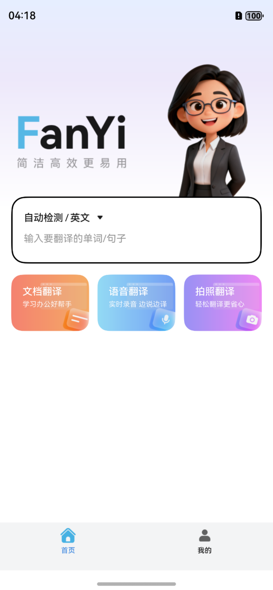
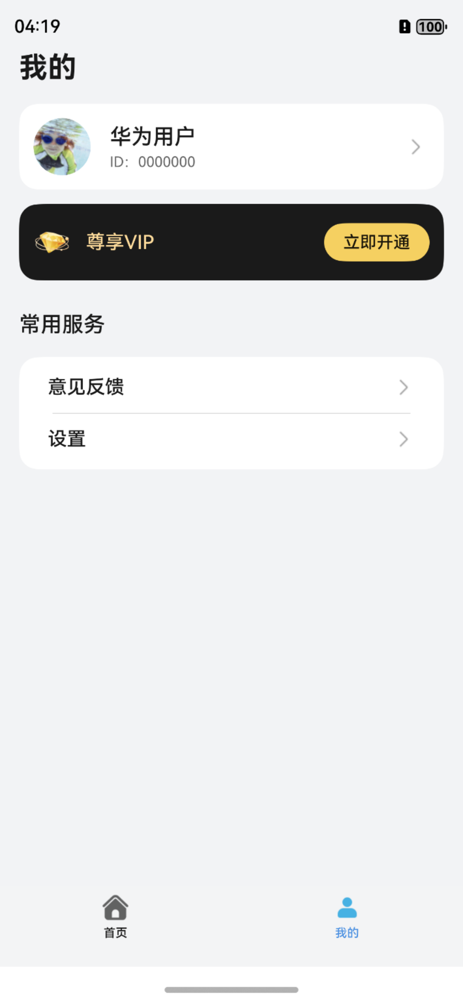
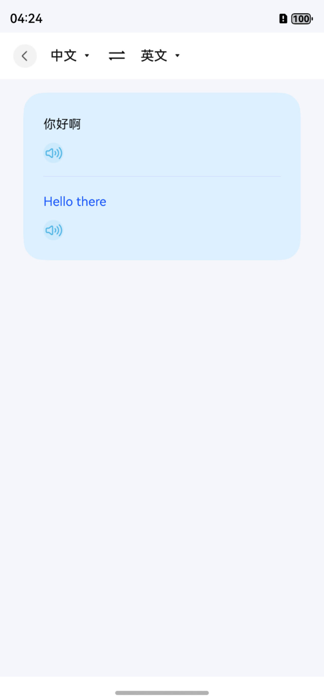
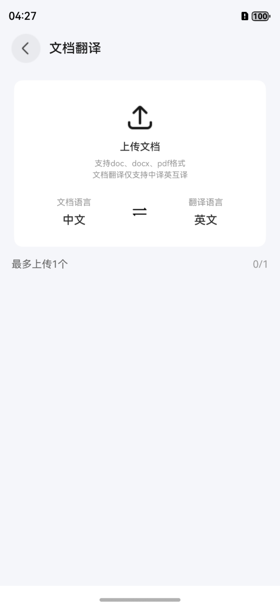
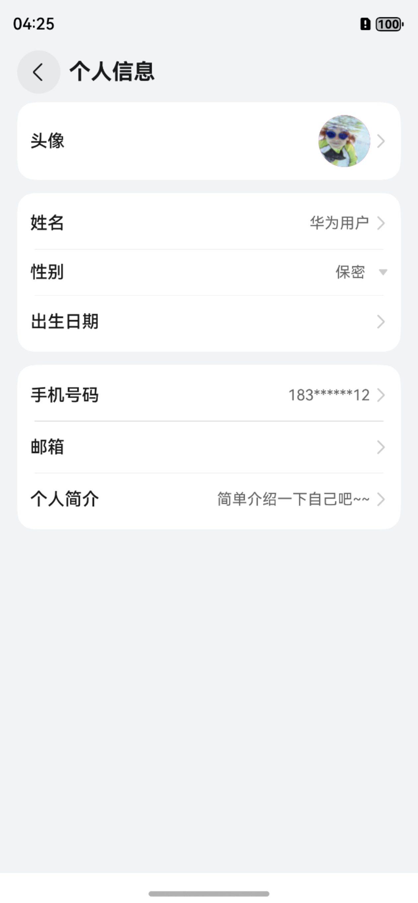
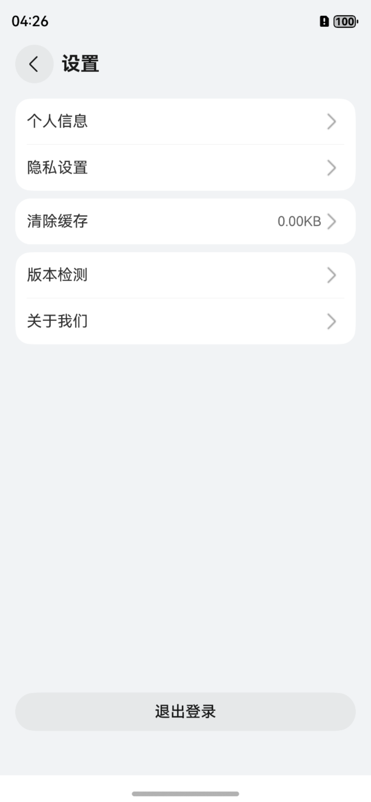

# 教育（翻译）应用模板快速入门

## 目录

- [功能介绍](#功能介绍)
- [约束与限制](#约束与限制)
- [快速入门](#快速入门)
- [示例效果](#示例效果)
- [开源许可协议](#开源许可协议)

## 功能介绍

您可以基于此模板直接定制应用，也可以挑选此模板中提供的多种组件使用，从而降低您的开发难度，提高您的开发效率。

本模板提供如下组件，所有组件存放在工程根目录的components下，如果您仅需使用组件，可参考对应组件的指导链接；如果您使用此模板，请参考本文档。

| 组件                                  | 描述                                       | 使用指导                                               |
|:------------------------------------|:-----------------------------------------|:-----------------------------------------------------|
| 通用朗读组件（text_reader）                 | 提供文本转语音朗读功能                       | [使用指导](components/text_reader/README.md)          |
| 会员中心组件（vip_center）                  | 提供VIP会员开通、续费、权益展示等功能          | [使用指导](components/vip_center/README.md)           |
| 通用登录组件（aggregated_login）            | 提供华为账号一键登录及其他方式登录             | [使用指导](components/aggregated_login/README.md)     |
| 通用问题反馈组件（feedback）                  | 提供通用的问题反馈功能                        | [使用指导](components/feedback/README.md)             |
| 检测应用更新组件（check_app_update）          | 提供检测应用是否存在新版本功能                 | [使用指导](components/check_app_update/README.md)     |
| 通用个人信息组件（collect_personal_info）     | 支持编辑头像、昵称、姓名、性别等个人信息        | [使用指导](components/collect_personal_info/README.md)|

本模板为翻译类应用提供了完整的开发框架，模板主要分翻译和我的两大模块。

本模板主要功能模块：

* 翻译：提供文本翻译、语音翻译、拍照翻译、文档翻译等多种翻译方式，支持14种语言互译，包含翻译历史记录、结果朗读等功能。

* 我的：提供个人信息管理、VIP会员中心、意见反馈、设置等功能。

本模板已集成华为账号登录、百度翻译API、语音识别、文本朗读等服务，只需做少量配置和定制即可快速实现翻译应用的核心功能。

|                          翻译                          |                           我的                           |
|:----------------------------------------------------:|:------------------------------------------------------:|
|  |  |

本模板主要页面及核心功能如下所示：

```text
翻译应用模板
  ├──翻译模块
  │   ├──文本翻译
  │   │   ├── 多语言支持（14种语言）
  │   │   ├── 自动语言检测
  │   │   ├── 翻译历史记录
  │   │   └── 翻译结果朗读
  │   │
  │   ├──语音翻译
  │   │   ├── 实时语音识别
  │   │   ├── 语音转文字
  │   │   └── 自动翻译
  │   │
  │   ├──拍照翻译
  │   │   ├── 相机拍照
  │   │   ├── 相册选择
  │   │   ├── 图片文字识别
  │   │   └── 图片翻译结果展示
  │   │
  │   └──文档翻译
  │       ├── 文档上传
  │       ├── 文档预览
  │       └── 翻译进度展示
  │
  └──个人中心
      ├──登录
      │   ├── 华为账号登录
      │   └── 用户隐私协议同意
      │
      ├──VIP会员
      │   ├── 会员权益展示
      │   ├── 会员开通
      │   └── VIP语言解锁
      │
      ├──个人信息
      │   ├── 头像、昵称
      │   └── 个人资料编辑
      │
      └──常用服务
          ├── 意见反馈
          └── 设置
              ├── 隐私设置
              ├── 清除缓存
              ├── 关于我们
              └── 退出登录
```

本模板工程代码结构如下所示：

```text
翻译应用模板
├──commons                                                // 公共模块
│  ├──common                                              // 基础模块
│  │    ├──constant                                       // 通用常量（Constants、RouterMap等）
│  │    ├──model                                          // 数据模型（UserInfo、BreakpointModel等）
│  │    ├──ui                                             // 通用UI组件（CommonHeader等）
│  │    └──util                                           // 通用工具方法
│  │
│  ├──OHRouter                                            // 路由模块（页面管理、路由跳转）
│
├──components                                             // 组件模块
│  ├──text_reader                                         // 通用朗读组件
│  ├──voice_input                                         // 语音输入组件
│  ├──choose_language                                     // 语言选择组件
│  ├──vip_center                                          // 会员中心组件
│  ├──aggregated_login                                    // 通用登录组件
│  ├──feedback                                            // 通用问题反馈组件
│  ├──check_app_update                                    // 检测应用更新组件
│  └──collect_personal_info                               // 通用个人信息组件
│
├──sdk                                                    // SDK模块
│  └──baidu_translate                                     // 百度翻译SDK
│       ├──control                                        // 翻译控制器
│       │   ├──BaiduTranslation.ets                       // 文本翻译
│       │   ├──BaiduImageTranslation.ets                  // 图片翻译
│       │   └──BaiduDocumentTranslation.ets               // 文档翻译
│       └──utils                                          // 工具类
│
├──features                                               // 功能模块
│  ├──Home                                                // 翻译模块
│  │    ├──comp                                           // 组件
│  │    ├──model                                          // 数据模型
│  │    ├──viewmodel                                      // 视图模型
│  │    ├──views                                          // 视图页面
│  │    │   ├──TranslateHomePage.ets                      // 翻译首页
│  │    │   ├──TranslateDialogPage.ets                    // 文本翻译页
│  │    │   ├──TranslateDetailPage.ets                    // 翻译详情页
│  │    │   ├──CameraTranslatePage.ets                    // 拍照翻译页
│  │    │   ├──DocumentTranslatePage.ets                  // 文档翻译页
│  │    │   └──DocumentPreviewPage.ets                    // 文档预览页
│  │    └──utils                                          // 工具类
│  │
│  └──person                                              // 个人中心模块
│       ├──comp                                           // 组件
│       ├──viewmodel                                      // 视图模型
│       └──views                                          // 视图页面
│           ├──MinePage.ets                               // 我的页面
│           ├──LoginPage.ets                              // 登录页面
│           ├──VipCenterPage.ets                          // VIP中心页面
│           ├──SetupPage.ets                              // 设置页面
│           ├──EditPersonalCenterPage.ets                 // 编辑个人中心
│           ├──PrivacySettingsPage.ets                    // 隐私设置页面
│           └──PrivacyAgreementPage.ets                   // 隐私协议页面
│
└──products                                               // 产品模块
   └──entry/src/main/ets                                  // 入口模块
        ├──entryability                                   // 入口能力
        │   └──EntryAbility.ets                           // 应用入口
        └──pages                                          // 页面
            └──Index.ets                                  // 首页
```

## 约束与限制

### 环境

- DevEco Studio版本：DevEco Studio 5.0.5 Release及以上
- HarmonyOS SDK版本：HarmonyOS 5.0.3(15) Release SDK及以上
- 设备类型：华为手机（包括双折叠和阔折叠）
- 系统版本：HarmonyOS 5.0.3及以上

### 权限

- 网络权限：ohos.permission.INTERNET
- 麦克风权限：ohos.permission.MICROPHONE

## 快速入门

### 配置工程

在运行此模板前，需要完成以下配置：

1. 在AppGallery Connect创建应用，将包名配置到模板中。
   a. 参考[创建HarmonyOS应用](https://developer.huawei.com/consumer/cn/doc/app/agc-help-create-app-0000002247955506)为应用创建APP ID，并将APP ID与应用进行关联。
   b. 返回应用列表页面，查看应用的包名。
   c. 将模板工程根目录下AppScope/app.json5文件中的bundleName替换为创建应用的包名。

2. 配置华为账号服务。
   a. 将应用的Client ID配置到products/entry/src/main路径下的module.json5文件中，详细参考：[配置Client ID](https://developer.huawei.com/consumer/cn/doc/harmonyos-guides/account-client-id)。
   b. 申请华为账号登录所需权限，详细参考：[申请账号权限](https://developer.huawei.com/consumer/cn/doc/harmonyos-guides/account-config-permissions)。

3. 配置百度翻译API。
   a. 前往[百度翻译开放平台](https://fanyi-api.baidu.com/)注册账号并创建应用。
   b. 获取APP ID和密钥，配置到sdk/baidu_translate模块中。

4. 对应用进行[手工签名](https://developer.huawei.com/consumer/cn/doc/harmonyos-guides/ide-signing#section297715173233)。

5. 添加手工签名所用证书对应的公钥指纹，详细参考：[配置公钥指纹](https://developer.huawei.com/consumer/cn/doc/app/agc-help-cert-fingerprint-0000002278002933)。

### 运行调试工程

1. 连接调试手机和PC。

2. 菜单选择"Run > Run 'entry' "或者"Run > Debug 'entry' "，运行或调试模板工程。

## 示例效果

### 翻译功能

|                          翻译首页                          |                                   文本翻译                                    |                                     文档翻译                                      |
|:------------------------------------------------------:|:-------------------------------------------------------------------------:|:-----------------------------------------------------------------------------:|
|  |  |  |

### 个人中心模块

|                             个人信息                             |                              设置                              |
|:------------------------------------------------------------:|:------------------------------------------------------------:|
|  |  |

## 开源许可协议

该代码经过[Apache 2.0 授权许可](http://www.apache.org/licenses/LICENSE-2.0)。
