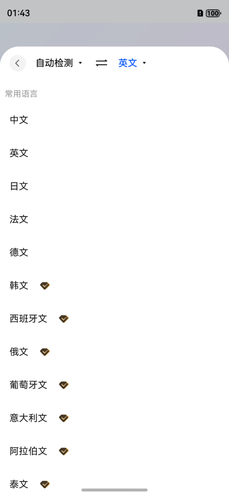
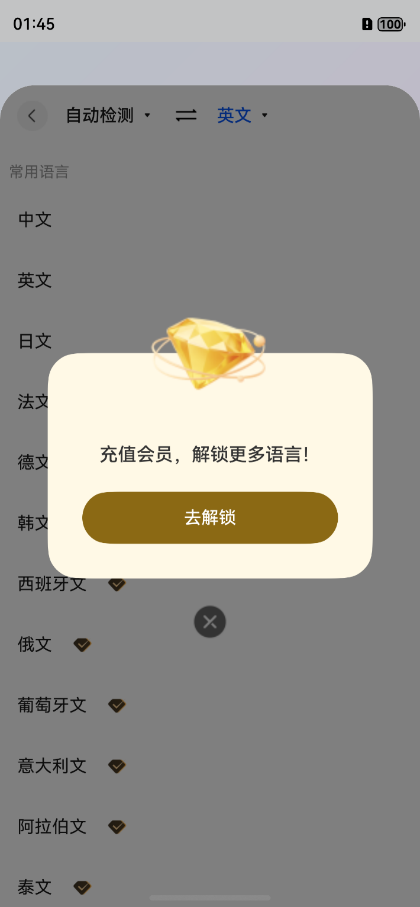

# 语言选择组件快速入门

## 目录
- [简介](#简介)
- [约束与限制](#约束与限制)
- [使用](#使用)
- [API参考](#API参考)
- [示例代码](#示例代码)

## 简介

本组件提供多语言选择能力，支持14种常用语言，包含自动检测功能，支持VIP语言锁定与解锁提示，提供语言交换功能。

|                              语言选择页面                               |                            VIP升级弹窗                            |
|:-----------------------------------------------------------------:|:-------------------------------------------------------------:|
|  |  |

主要功能：
- **语言列表选择**：支持14种语言，包含常用语言快捷入口
- **自动检测**：源语言支持"自动检测"选项，配合翻译API可自动识别输入文本的语言
- **VIP语言锁定**：非VIP用户选择VIP语言时弹出升级提示
- **语言交换**：一键交换源语言和目标语言（自动检测模式下不可交换）

## 约束与限制

### 环境

- DevEco Studio版本：DevEco Studio 5.0.5 Release及以上
- HarmonyOS SDK版本：HarmonyOS 5.0.3(15) Release SDK及以上
- 设备类型：华为手机（包括双折叠和阔折叠）
- 系统版本：HarmonyOS 5.0.3及以上

### 权限

无

## 使用

1. 安装组件。
   如果是在DevEco Studio使用插件集成组件，则无需安装组件，请忽略此步骤。
   如果是从生态市场下载组件，请参考以下步骤安装组件。
   a. 解压下载的组件包，将包中所有文件夹拷贝至您工程根目录的components目录下。
   b. 在项目根目录build-profile.json5添加choose_language模块。
   ```json
   "modules": [
     {
       "name": "choose_language",
       "srcPath": "./components/choose_language"
     }
   ]
   ```
   c. 在项目根目录oh-package.json5添加依赖。
   ```json
   "dependencies": {
     "choose_language": "file:./components/choose_language"
   }
   ```

2. 引入组件。
   ```typescript
   import { LanguagePickerPage, LanguageViewModel, LanguageType } from 'choose_language';
   ```

3. 调用组件，详细参数配置说明参见[API参考](#API参考)。

## API参考

### 接口

#### LanguagePickerPage

LanguagePickerPage(options: [LanguagePickerOptions](#LanguagePickerOptions对象说明))

语言选择页面组件，提供完整的语言选择界面。

**参数：**

| 参数名 | 类型 | 是否必填 | 说明 |
|:------|:-----|:-------|:-----|
| options | [LanguagePickerOptions](#LanguagePickerOptions对象说明) | 是 | 语言选择器的参数 |

### LanguagePickerOptions对象说明

| 参数名 | 类型 | 是否必填 | 说明 |
|:------|:-----|:-------|:-----|
| viewModel | LanguageViewModel | 是 | 语言视图模型，管理语言选择状态 |
| onClose | () => void | 否 | 关闭页面回调，用户选择语言或点击返回时触发 |
| onVipUpgrade | () => void | 否 | VIP升级回调，用户点击VIP语言时触发 |

### LanguageViewModel

语言选择视图模型，管理语言选择的状态和逻辑。

**属性：**

| 属性名 | 类型 | 说明 |
|:------|:-----|:-----|
| sourceLanguage | { code: string, name: string, isVip: boolean } | 源语言，默认为 { code: 'auto', name: '自动检测', isVip: false } |
| targetLanguage | { code: string, name: string, isVip: boolean } | 目标语言，默认为 { code: 'en', name: '英文', isVip: false } |
| isVipUser | boolean | 用户VIP状态 |
| editingType | 'source' \| 'target' | 当前编辑的语言类型 |

**方法：**

| 方法名 | 参数 | 说明 |
|:------|:-----|:-----|
| setEditingType | type: LanguageType | 设置编辑类型，决定用户选择的是源语言还是目标语言 |
| setVipStatus | isVip: boolean | 设置VIP状态 |
| swapLanguages | - | 交换源语言和目标语言 |
| canSwap | - | 检查是否可以交换（自动检测模式下不可交换） |

### Language对象说明

| 名称 | 类型 | 说明 |
|:-----|:-----|:-----|
| code | string | 语言代码，如'zh-CN'、'en-US' |
| name | string | 显示名称，如'中文'、'英文' |
| isVip | boolean | 是否需要VIP会员 |

### 支持的语言

| 语言代码 | 名称 | 是否VIP |
|:--------|:-----|:-------|
| auto | 自动检测 | 否 |
| zh-CN | 中文 | 否 |
| en-US | 英文 | 否 |
| ja-JP | 日文 | 否 |
| fr-FR | 法文 | 否 |
| de-DE | 德文 | 否 |
| ko-KR | 韩文 | 是 |
| es-ES | 西班牙文 | 是 |
| ru-RU | 俄文 | 是 |
| pt-PT | 葡萄牙文 | 是 |
| it-IT | 意大利文 | 是 |
| ar-SA | 阿拉伯文 | 是 |
| th-TH | 泰文 | 是 |
| vi-VN | 越南文 | 是 |

## 示例代码

直接复制以下代码到 Index.ets 即可运行：

```typescript
import { LanguagePickerPage, LanguageViewModel, LanguageType } from 'choose_language';

@Entry
@ComponentV2
struct Index {
   // 创建语言视图模型
   @Local languageVm: LanguageViewModel = new LanguageViewModel();
   // 控制语言选择弹窗显示
   @Local showLanguagePicker: boolean = false;

   build() {
      Column() {
         Text('语言选择组件演示')
            .fontSize(20)
            .fontWeight(FontWeight.Bold)
            .margin({ bottom: 40 })

         // 显示当前选择的语言
         Column({ space: 8 }) {
            Text(`源语言：${this.languageVm.sourceLanguage.name}`)
               .fontSize(16)
            Text(`目标语言：${this.languageVm.targetLanguage.name}`)
               .fontSize(16)
            Text(`VIP状态：${this.languageVm.isVipUser ? '已开通' : '未开通'}`)
               .fontSize(16)
               .fontColor(this.languageVm.isVipUser ? '#FF9500' : '#999999')
         }
         .padding(16)
            .backgroundColor('#F5F5F5')
            .borderRadius(12)
            .width('90%')

         Blank()

         // 底部按钮
         Column({ space: 12 }) {
            // 点击按钮选择源语言
            Button('选择源语言')
               .width('80%')
               .height(48)
               .onClick(() => {
                  this.languageVm.setEditingType(LanguageType.SOURCE);
                  this.showLanguagePicker = true;
               })

            // 点击按钮选择目标语言
            Button('选择目标语言')
               .width('80%')
               .height(48)
               .onClick(() => {
                  this.languageVm.setEditingType(LanguageType.TARGET);
                  this.showLanguagePicker = true;
               })

            // 交换源语言和目标语言
            Button('交换语言')
               .width('80%')
               .height(48)
               .backgroundColor('#E8F4FF')
               .fontColor('#007AFF')
               .onClick(() => {
                  if (this.languageVm.canSwap()) {
                     this.languageVm.swapLanguages();
                  }
               })

            // 切换VIP状态
            Button(this.languageVm.isVipUser ? '关闭VIP' : '开通VIP')
               .width('80%')
               .height(48)
               .backgroundColor(this.languageVm.isVipUser ? '#F5F5F5' : '#FF9500')
               .fontColor(this.languageVm.isVipUser ? '#333333' : '#FFFFFF')
               .onClick(() => {
                  this.languageVm.setVipStatus(!this.languageVm.isVipUser);
               })
         }
         .margin({ bottom: 40 })
      }
      .width('100%')
         .height('100%')
         .padding({ top: 60 })
            // 绑定语言选择弹窗
         .bindSheet($$this.showLanguagePicker, this.languagePickerSheet(), {
            height: '85%',
            showClose: false,
            dragBar: true,
            backgroundColor: Color.White
         })
   }

   // 定义语言选择弹窗内容
   @Builder
   languagePickerSheet() {
      LanguagePickerPage({
         viewModel: this.languageVm,
         onClose: () => {
            this.showLanguagePicker = false;
         },
         onVipUpgrade: () => {
            this.showLanguagePicker = false;
            // 处理VIP升级，这里模拟直接开通
            this.languageVm.setVipStatus(true);
         }
      })
   }
}
```
## 注意事项

1. **编辑类型**：调用语言选择前需通过 `setEditingType` 设置编辑类型（SOURCE 或 TARGET），决定用户选择的是源语言还是目标语言。
2. **VIP状态**：通过 `setVipStatus` 设置用户VIP状态，非VIP用户选择VIP语言时会触发 `onVipUpgrade` 回调。
3. **语言交换**：自动检测模式下无法交换语言，`canSwap()` 方法会返回 false。
4. **语言代码格式**：本组件使用标准语言代码格式（如 `zh-CN`、`en-US`、`ru-RU`），如需与百度翻译等第三方 API 对接，需自行转换语言代码格式。
5. **目标语言限制**：目标语言不能设置为"自动检测"，调用 `setTargetLanguage` 传入 `auto` 代码时会被忽略。
