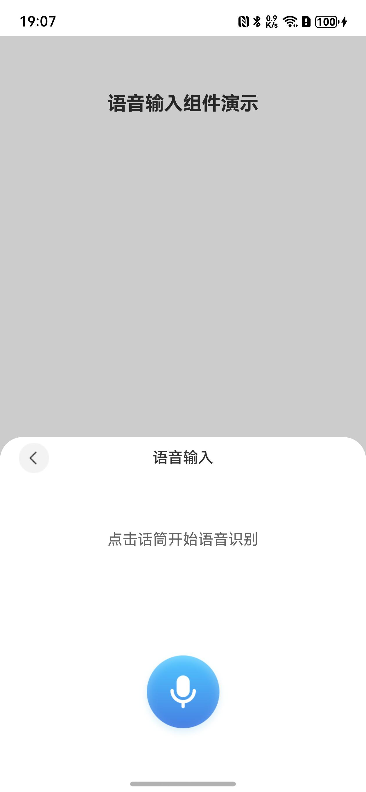
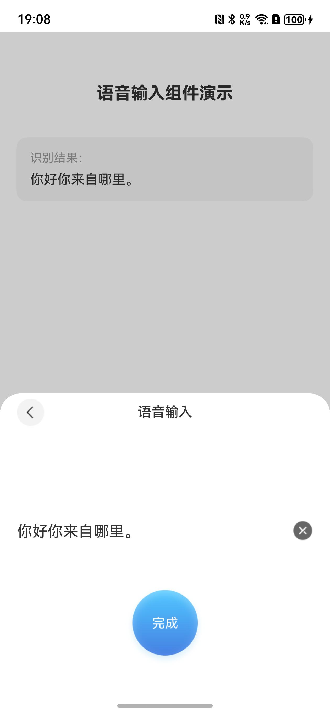

# 语音输入组件快速入门

## 目录

- [简介](#简介)
- [约束与限制](#约束与限制)
- [使用](#使用)
- [API参考](#API参考)
- [示例代码](#示例代码)

## 简介

本组件提供语音输入能力，用于实时语音识别并转换为文本。提供实时波纹动画反馈，适用于语音输入、语音搜索等场景。

|                             语音输入                             |                             识别结果                              |
|:------------------------------------------------------------:|:-------------------------------------------------------------:|
|  |  |

主要功能：
- **实时语音识别**：支持实时语音转文字
- **波纹动画反馈**：录音时显示音量波纹动画
- **识别结果返回**：通过路由pop返回识别的文本内容

## 约束与限制

### 环境

- DevEco Studio版本：DevEco Studio 5.0.5 Release及以上
- HarmonyOS SDK版本：HarmonyOS 5.0.3(15) Release SDK及以上
- 设备类型：华为手机（包括双折叠和阔折叠）
- 系统版本：HarmonyOS 5.0.3及以上

### 权限

本组件需要以下权限：

| 权限名称 | 权限说明 | 授权方式 |
|:--------|:--------|:--------|
| ohos.permission.MICROPHONE | 麦克风权限，用于语音采集 | user_grant（运行时动态申请） |


## 使用

1. 安装组件。
   如果是在DevEco Studio使用插件集成组件，则无需安装组件，请忽略此步骤。
   如果是从生态市场下载组件，请参考以下步骤安装组件。
   a. 解压下载的组件包，将包中所有文件夹拷贝至您工程根目录的components目录下。
   b. 在项目根目录build-profile.json5添加voice_input模块。
   ```json
   "modules": [
     {
       "name": "voice_input",
       "srcPath": "./components/voice_input"
     }
   ]
   ```
   c. 在项目根目录oh-package.json5添加依赖。
   ```json
   "dependencies": {
     "voice_input": "file:./components/voice_input"
   }
   ```
   d. 在entry模块的module.json5中声明麦克风权限。
   ```json
   {
     "module": {
       "requestPermissions": [
         {
           "name": "ohos.permission.MICROPHONE",
           "reason": "$string:microphone_reason",
           "usedScene": {
             "abilities": ["EntryAbility"],
             "when": "inuse"
           }
         }
       ]
     }
   }
   ```

2. 引入组件。
   ```typescript
   import { VoiceInputPageBuilder } from 'voice_input';
   ```

3. 调用组件，详细参数配置说明参见[API参考](#API参考)。
   ```typescript
   // 跳转到语音输入页面
   this.pathStack.pushPathByName('VoiceInputPage', null, (popInfo: PopInfo) => {
     const result = popInfo.result as VoiceInputResult;
     if (result?.text) {
       // 处理识别结果
     }
   });
   ```


## API参考

### 接口

#### VoiceInputPageBuilder

VoiceInputPageBuilder()

语音输入页面构建器，用于在Navigation的navDestination中注册路由。

#### VoiceInputPage

VoiceInputPage()

语音输入页面组件，提供完整的语音输入功能。

### VoiceInputResult对象说明

路由pop返回的结果对象。

| 名称 | 类型 | 说明 |
|:-----|:-----|:-----|
| text | string | 识别的文本内容 |

### VoiceInputViewModel

语音输入ViewModel，可单独使用语音识别能力。

| 属性/方法 | 类型 | 说明 |
|:---------|:-----|:-----|
| resultText | string | 识别结果文本 |
| volumeList | number[] | 音量波纹高度数组，用于显示波纹动画 |
| startListening(context) | void | 开始语音识别，需传入UIAbilityContext |
| stopListening() | Promise\<void\> | 停止语音识别 |
| clearResult() | void | 清除识别结果 |
| shutdown() | void | 释放资源，页面销毁时调用 |


## 示例代码

```typescript
import { VoiceInputPageBuilder } from 'voice_input';

// 返回结果接口
interface VoiceInputResult {
  text?: string;
}

@Entry
@ComponentV2
struct VoiceInputSample {
  @Local pathStack: NavPathStack = new NavPathStack();
  @Local resultText: string = '';

  build() {
    Navigation(this.pathStack) {
      Column({ space: 20 }) {
        Text('语音输入组件演示')
          .fontSize(20)
          .fontWeight(FontWeight.Bold)

        // 显示识别结果
        if (this.resultText) {
          Column({ space: 8 }) {
            Text('识别结果：')
              .fontSize(14)
              .fontColor('#999999')
            Text(this.resultText)
              .fontSize(16)
              .fontColor('#333333')
          }
          .padding(16)
          .backgroundColor('#F5F5F5')
          .borderRadius(12)
          .width('90%')
          .alignItems(HorizontalAlign.Start)
        }

        Blank()

        // 语音输入按钮
        Button('开始语音输入')
          .width('80%')
          .height(48)
          .margin({ bottom: 40 })
          .onClick(() => {
            this.pathStack.pushPathByName('VoiceInputPage', null, (popInfo: PopInfo) => {
              const result = popInfo.result as VoiceInputResult;
              if (result?.text) {
                this.resultText = result.text;
              }
            });
          })
      }
      .width('100%')
      .height('100%')
      .padding({ top: 60 })
      .justifyContent(FlexAlign.Start)
    }
    .navDestination(this.pageMap)
    .hideTitleBar(true)
  }

  @Builder
  pageMap(name: string) {
    if (name === 'VoiceInputPage') {
      VoiceInputPageBuilder()
    }
  }
}
```


## 注意事项

1. **权限申请**：使用前需确保已在module.json5中声明麦克风权限，组件会在首次使用时自动申请权限。
2. **路由注册**：需要在Navigation的navDestination中注册VoiceInputPageBuilder，路由名称为'VoiceInputPage'。
3. **结果处理**：组件通过路由pop返回识别结果，在pushPathByName的回调中处理返回的文本。
4. **资源释放**：组件内部会在页面销毁时自动释放语音识别资源，无需手动处理。
5. **识别结果清除**：识别结果显示后，可点击右侧关闭图标清除当前结果，重新开始录音。
