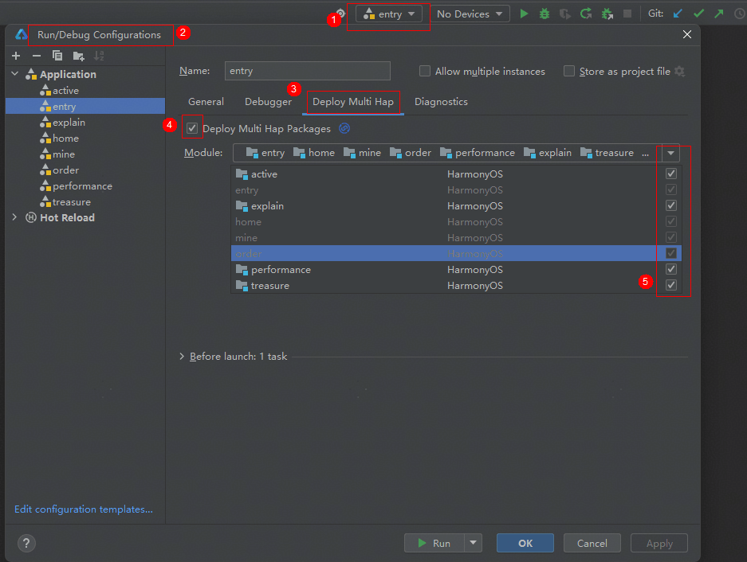

# 生活服务（博物馆）元服务模板快速入门

## 目录

- [功能介绍](#功能介绍)
- [约束与限制](#约束与限制)
- [快速入门](#快速入门)
- [示例效果](#示例效果)
- [开源许可协议](#开源许可协议)

## 功能介绍

您可以基于此模板直接定制元服务，也可以挑选此模板中提供的多种组件使用，从而降低您的开发难度，提高您的开发效率。

此模板提供如下组件，所有组件存放在工程根目录的components下，如果您仅需使用组件，可参考对应组件的指导链接；如果您使用此模板，请参考本文档。

| 组件                                   | 描述                                                         | 使用指导                                                  |
| -------------------------------------- | ------------------------------------------------------------ | --------------------------------------------------------- |
| 日历选择组件（module_calendar_picker） | 提供了支持指定日期可选范围、以及设置相关提示文字的功能       | [使用指导](./components/module_calendar_picker/README.md) |
| 卡片轮播组件（module_card_swiper）     | 提供了随轮播切换，卡片大小变化、文字描述跟随切换的功能       | [使用指导](./components/module_card_swiper/README.md)     |
| 馆藏珍品组件（module_page_swiper）     | 提供了馆藏珍品组件、支持珍品滑动浏览以及背景图缩小展示详情等功能 | [使用指导](./components/module_page_swiper/README.md)     |
| 常用人管理组件（module_person_manage） | 提供了支持常用人新增、编辑以及常用人选择的功能               | [使用指导](./components/module_person_manage/README.md)   |

本模板为博物馆票务类元服务提供了常用功能的开发样例，模板主要分首页、我的预订和我的三大模块：

* 首页：提供用户信息、推荐展览的展示，支持常用参观人编辑、参观预约、特展购票、讲解服务、省博介绍、场馆地图、停车缴费、活动预约、馆藏珍品等的查看。

* 我的预定：展示门票、活动、讲解不同类型的订单，以及订单的处理。

* 我的：支持账号关联、个人信息的编辑及隐私政策的查看。

本模板已集成华为账号、地图、支付等服务，只需做少量配置和定制即可快速实现华为账号的登录及展览预定等功能。

| 首页                           | 我的预订                             | 我的                           |
|------------------------------|----------------------------------|------------------------------|
|  |  |  |

本模板主要页面及核心功能如下所示：

```ts
博物馆模板
 |-- 首页
 |    |-- 顶部图片
 |    |-- 用户信息
 |    |    └-- 常用参观人
 |    |         └-- 常用参观人编辑
 |    |
 |    |-- 基础服务
 |    |    |-- 参观预约
 |    |    |    |-- 时间选择
 |    |    |    |-- 订单信息确认
 |    |    |    └-- 参观预约
 |    |    └-- 特展购票
 |    |         |-- 展览列表
 |    |         |-- 展览详情
 |    |         |-- 预订特展
 |    |         └-- 提交订单
 |    |-- 更多功能
 |    |   |-- 讲解服务
 |    |   |     |-- 讲解服务轮播
 |    |   |     |-- 场次选择
 |    |   |     |-- 订单信息确认
 |    |   |     └-- 提交订单
 |    |   |
 |    |   |-- 省博介绍
 |    |   |    └-- 博物馆详情
 |    |   |-- 场馆地图
 |    |   |    └-- 地图
 |    |   └-- 停车缴费
 |    |        └-- 缴费政策
 |    |
 |    |-- 馆藏珍品
 |    |   |-- 珍品浏览
 |    |   └-- 珍品详情
 |    |-- 活动预约
 |    |   |-- 活动列表
 |    |   |-- 活动详情
 |    |   |-- 订单信息完善
 |    |   └-- 提交订单
 |    └-- 推荐展览
 |        └-- 展览详情
 |
 |-- 我的预定
 |    |-- 门票订单
 |    |    |-- 订单列表
 |    |    |-- 订单支付
 |    |    └-- 订单取消
 |    |-- 活动订单
 |    |    |-- 订单列表
 |    |    |-- 订单支付
 |    |    └-- 订单取消
 |    └-- 讲解订单
 |        |-- 订单列表
 |        |-- 订单支付
 |        └-- 订单取消
 |
 └-- 我的
      |-- 顶部图片
      |-- 用户信息
      |-- 关联账号
      |-- 个人信息
      |    └-- 信息编辑
      |-- 隐私政策    
      └-- 推荐展览    
```

本模板工程代码结构如下所示：

```ts
MuseumTicket
  |- commons                                       // 公共层
  |   |- commonlib/src/main/ets                    // 公共工具模块(har)
  |   |    |- components 
  |   |    |     BaseHeader.ets                    // 一级页面标题组件
  |   |    |     TitleBar.ets                      // 二级页面暗色风格标题组件
  |   |    |     TitleBuilder.ets                  // 二级页面标题自定义内容  
  |   |    |- constants 
  |   |    |     CommonContants.ets                // 公共常量
  |   |    |     CommonEnum.ets                    // 公共枚举
  |   |    |- types 
  |   |    |     Types.ets                         // 公共类型
  |   |    └- utils 
  |   |          AccountUtil.ets                   // 账号管理工具
  |   |          FormatUtil.ets                    // 日历、图片等格式管理工具
  |   |          Logger.ets                        // 日志管理工具
  |   |          NextDaysUtil.ets                  // 生成模拟时间工具
  |   |          PermissionUtil.ets                // 权限管理工具
  |   |          PopViewUtils.ets                  // 公共弹窗
  |   |          PreferenceUtil.ets                // Preference存储和获取
  |   |          RouterModule.ets                  // 路由管理类
  |   |          WindowUtil.ets                    // 窗口管理工具
  |   |           
  |   |   
  |   └- network/src/main/ets                      // 网络模块(har)
  |        |- apis                                 // 网络接口  
  |        |- mocks                                // 数据mock
  |        |- constants                            // api路径常量    
  |        |- models                               // 网络库封装    
  |        └- types                                // 请求和响应类型 
  |
  |
  |- components                                    // 可分可合组件
  |   |- module_calendar_picker/src/main/ets       // 日历选择组件模块(har)
  |   |    |- common 
  |   |    |     Constant.ets                      // 公共常量
  |   |    |     Model.ets                         // 公共模型定义
  |   |    |- components 
  |   |    |     MonthView.ets                     // 月视图组件
  |   |    |     UICalendarDialog.ets              // 弹窗组件
  |   |    |     UICalendarPicker.ets              // 日历选择组件
  |   |    |     
  |   |    └- viewmodel 
  |   |          UICalendarVM.ets                  // 日历选择组件对应vm层
  |   |           
  |   |- module_card_swiper/src/main/ets           // 卡片轮播组件模块(har)
  |   |    |- components 
  |   |    |     CardSwiper.ets                    // 卡片轮播组件
  |   |    |     
  |   |    └- types 
  |   |          Index.ets                         // 类型定义  
  |   |
  |   |- module_page_swiper/src/main/ets           // 馆藏珍品组件模块(har)
  |   |    |- components 
  |   |    |     PageSwiper.ets                    // 馆藏珍品组件
  |   |    |     
  |   |    └- types 
  |   |          Index.ets                         // 类型定义
  |   |
  |   └- module_person_manage/src/main/ets         // 常用人管理组件模块(har)
  |        |- common 
  |        |     CommonConst.ets                   // 公共常量
  |        |     CommonUtil.ets                    // 常用方法工具类
  |        |     PersonCard.ets                    // 常用人卡片组件
  |        |     TitleBuilder.ets                  // 页面标题自定内容
  |        |     Types.ets                         // 类型定义
  |        |- http 
  |        |     Api.ets                           // mock数据Api
  |        |- pages 
  |        |     CommonPersonPage.ets              // 常用人页面
  |        |     PersonEditPage.ets                // 常用人新增编辑页面
  |        |- viewModels 
  |        |     CommonPersonPageVM.ets            // 常用人页面vm层
  |        |     PersonEditPageVM.ets              // 常用人新增编辑页面vm层    
  |        └- PersonManage.ets                     // 常用人管理组件
  |
  |                                            
  └- features                                      // 特性层
  |   |- active/src/main/ets                       // 活动预约模块(hsp)
  |   |    |- components                           // 抽离组件
  |   |    |    ActiveCard.ets                     // 活动卡片组件         
  |   |    |- pages                               
  |   |    |    ActiveDetail.ets                   // 活动详情页
  |   |    |    ActivePage.ets                     // 活动列表页
  |   |    |    ActiveSuccess.ets                  // 活动预约成功页
  |   |    |    JoinActivePage.ets                 // 参加活动页
  |   |    |- types                                // interface类型定义
  |   |    └- viewmodels                           // 与页面一一对应的vm层          
  |   |
  |   |- explain/src/main/ets                      // 讲解服务模块(hsp)       
  |   |    |- pages                               
  |   |    |    ExplainOrderPage.ets               // 讲解预约页
  |   |    |    ExplainPage.ets                    // 讲解展示页
  |   |    |    ExplainSuccess.ets                 // 讲解预约成功页
  |   |    |- types                                // interface类型定义
  |   |    └- viewmodels                           // 与页面一一对应的vm层          
  |   |       
  |   |- home/src/main/ets                         // 首页模块(hsp)
  |   |    |- components                           // 抽离组件         
  |   |    |- pages                               
  |   |    |    HomePage.ets                       // 首页
  |   |    |    IntroducePage.ets                  // 省博介绍详情页
  |   |    |    MapPage.ets                        // 场馆地图详情页
  |   |    |    ParkingPage.ets                    // 停车缴费详情页
  |   |    |- types                                // interface类型定义
  |   |    └- viewmodels                           
  |   |         HomePageVM.ets                     // 首页、省博介绍、停车缴费对应vm层
  |   |         MapPageVM.ets                      // 场馆地图对应vm层          
  |   |     
  |   |- mine/src/main/ets                         // 我的模块(hsp)
  |   |    |- components                           // 抽离组件      
  |   |    |- pages                               
  |   |    |    MinePage.ets                       // 我的页面
  |   |    |    PrivacyPage.ets                    // 隐私政策详情页
  |   |    |    ProfileEditPage.ets                // 个人信息编辑页
  |   |    |- types                                // interface类型定义
  |   |    └- viewmodels                           // 与页面一一对应的vm层  
  |   |  
  |   |- order/src/main/ets                        // 预订模块(hsp)
  |   |    |- components                           // 抽离组件     
  |   |    |- constants                            // 常量定义  
  |   |    |- pages                               
  |   |    |    ActiveOrderDetail.ets              // 活动订单详情页
  |   |    |    ActiveOrders.ets                   // 活动订单页
  |   |    |    ExplainOrderDetail.ets             // 讲解订单详情页
  |   |    |    ExplainOrders.ets                  // 讲解订单页
  |   |    |    MyBook.ets                         // 我的预订页
  |   |    |    OrderInfo.ets                      // 免费约展预约信息页
  |   |    |    OrderSuccess.ets                   // 免费约展预约成功页
  |   |    |    OrderTicket.ets                    // 免费约展预约页
  |   |    |    TicketDetail.ets                   // 门票订单详情页
  |   |    |    TicketOrders.ets                   // 门票订单页
  |   |    |- types                                // interface类型定义
  |   |    └- viewmodels                             
  |   |         ActiveOrderDetailVM.ets            // 活动订单详情页对应vm层
  |   |         ActiveOrdersVM.ets                 // 活动订单页对应vm层
  |   |         ExplainOrderDetailVM.ets           // 讲解订单详情页对应vm层
  |   |         ExplainOrdersVM.ets                // 讲解订单页对应vm层
  |   |         MyBookVM.ets                       // 我的预订页对应vm层
  |   |         OrderTicketVM.ets                  // 免费约展相关的VM层
  |   |         TicketOrdersVM.ets                 // 门票订单相关的VM层
  |   |
  |   |- treasure/src/main/ets                     // 馆藏珍品模块(hsp)  
  |   |    |- pages                               
  |   |    |    TreasurePage.ets                   // 馆藏珍品页面
  |   |    └- viewmodels                           // 与页面一一对应的vm层 
  |   |             
  |   | 
  |   └- performance/src/main/ets                  // 特展模块(hsp)
  |        |- components                           // 抽离组件    
  |        |- pages                               
  |        |    BuyInfo.ets                        // 购票信息页
  |        |    BuySuccess.ets                     // 购票成功页
  |        |    BuyTicket.ets                      // 购票页
  |        |    PerformanceDetail.ets              // 特展详情页
  |        |    PerformancePage.ets                // 特展列表页
  |        |- types                                // interface类型定义
  |        └- viewmodels                             
  |             BuyVM.ets                          // 购票相关的VM层
  |             PerformanceVM.ets                  // 特展相关的VM层
  |             
  └- products/entry                                // 应用层主包(hap)  
      └-  src/main/ets                                               
           |- entryability                         // 应用程序入口                                       
           |- entryformability                     // 服务卡片程序入口                                  
           |- pages                              
           |    EmptyPage.ets                      // 入口页面
           |    MainEntry.ets                      // 主页面
           |- types                                // interface接口定义
           |- viewmodels                           // 与页面一一对应的vm层          
           └- widget                               // 卡片页面                  
       
  
```

## 约束与限制

### 环境

* DevEco Studio版本：DevEco Studio 5.0.0 Release及以上
* HarmonyOS SDK版本：HarmonyOS 5.0.0 Release SDK及以上
* 设备类型：华为手机（包括双折叠和阔折叠）
* 系统版本：HarmonyOS 5.0.0(12)及以上

### 权限

* 网络权限：ohos.permission.INTERNET

## 快速入门

### 配置工程

在运行此模板前，需要完成以下配置：

1. 在AppGallery Connect创建元服务，将包名配置到模板中。

   a. 参考[创建元服务](https://developer.huawei.com/consumer/cn/doc/app/agc-help-create-atomic-service-0000002247795706)为元服务创建APP ID，并将APP ID与元服务进行关联。

   b. 返回应用列表页面，查看元服务的包名。

   c. 将模板工程根目录下AppScope/app.json5文件中的bundleName替换为创建元服务的包名。

2. 配置服务器域名。

   本模板接口均采用mock数据，由于元服务包体大小有限制，部分图片资源将从云端拉取，所以需为模板项目[配置服务器域名](https://developer.huawei.com/consumer/cn/doc/atomic-guides/agc-help-harmonyos-server-domain)，“httpRequest合法域名”需要配置为：`https://agc-storage-drcn.platform.dbankcloud.cn`

3. 配置华为账号服务。

   a. 将元服务的client ID配置到/products/entry/src/main路径下的module.json5文件，详细参考：[配置Client ID](https://developer.huawei.com/consumer/cn/doc/atomic-guides/account-atomic-client-id)。

   b. 如需获取用户真实手机号，需要申请phone权限，详细参考：[配置scope权限](https://developer.huawei.com/consumer/cn/doc/atomic-guides/account-guide-atomic-permissions)，并在端侧使用快速验证手机号码Button进行[验证获取手机号码](https://developer.huawei.com/consumer/cn/doc/atomic-guides/account-guide-atomic-get-phonenumber)。

4. 配置地图服务。

   a. 将元服务的client ID配置到/products/entry/src/main路径下的module.json5文件，如果华为账号服务已配置，可跳过此步骤。

   b. [开通地图服务](https://developer.huawei.com/consumer/cn/doc/harmonyos-guides/map-config-agc)。

5. 配置支付服务。

   华为支付当前仅支持商户接入，在使用服务前，需要完成商户入网、开发服务等相关配置，本模板仅提供了端侧集成的示例。详细参考：[支付服务接入准备](https://developer.huawei.com/consumer/cn/doc/harmonyos-guides/payment-preparations)

6. 对元服务进行[手工签名](https://developer.huawei.com/consumer/cn/doc/harmonyos-guides/ide-signing#section297715173233)。

7. 添加手工签名所用证书对应的公钥指纹。详细参考：[配置应用签名证书指纹](https://developer.huawei.com/consumer/cn/doc/app/agc-help-cert-fingerprint-0000002278002933)

### 运行调试工程

1. 用USB线连接调试手机和PC。

2. 配置多模块调试：由于本模板存在多个模块，运行时需确保所有模块安装至调试设备。

   a. 运行模块选择“entry”。

   b. 下拉框选择“Edit Configurations”，在“Run/Debug Configurations”界面，选择“Deploy Multi Hap”页签，勾选上模板中所有模块。

   

   c. 点击"Run"，运行模板工程。

## 示例效果

[功能展示录屏](./screenshots/功能展示录屏.mp4)

## 开源许可协议

该代码经过[Apache 2.0 授权许可](http://www.apache.org/licenses/LICENSE-2.0)。
