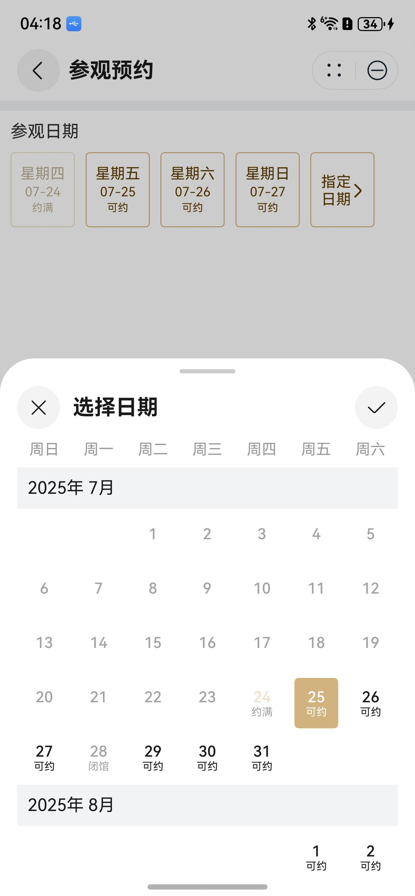

# 预约日期选择组件快速入门

## 目录

- [简介](#简介)
- [约束与限制](#约束与限制)
- [快速入门](#快速入门)
- [API参考](#API参考)
- [示例代码](#示例代码)

## 简介

本组件提供了显示当前日期、设置可选时间段、设置禁用时间段以及配置对应提示文字的功能。



## 约束与限制

### 环境

* DevEco Studio版本：DevEco Studio 5.0.0 Release及以上
* HarmonyOS SDK版本：HarmonyOS 5.0.0 Release SDK及以上
* 设备类型：华为手机（包括双折叠和阔折叠）
* 系统版本：HarmonyOS 5.0.0(12)及以上

## 快速入门

1. 安装组件。

   如果是在DevEco Studio使用插件集成组件，则无需安装组件，请忽略此步骤。

   如果是从生态市场下载组件，请参考以下步骤安装组件。

   a. 解压下载的组件包，将包中所有文件夹拷贝至您工程根目录的XXX目录下。

   b. 在项目根目录build-profile.json5添加module_calendar_picker模块。

    ```
    // 在项目根目录build-profile.json5填写module_calendar_picker路径。其中XXX为组件存放的目录名
    "modules": [
        {
        "name": "module_calendar_picker",
        "srcPath": "./XXX/module_calendar_picker",
        }
    ]
    ```
   c. 在项目根目录oh-package.json5中添加依赖。
    ```
    // XXX为组件存放的目录名称
    "dependencies": {
      "module_calendar_picker": "file:./XXX/module_calendar_picker"
    }
    ```

2. 在entry模块下的/src/main/ets/entryability/EntryAbility.ets进行初始化。

   ```
   import { UIBase } from 'module_calendar_picker';
    onWindowStageCreate(windowStage: window.WindowStage): void {
    UIBase.init(windowStage);
    }

   ```


3. 引入组件

   ```
    import { UICalendarPicker, TypePicker, DialogType, SwiperDirection } from 'module_calendar_picker';
   ```

## API参考

### 子组件

可以包含单个子组件

### 接口

#### UICalendarPicker(option: UICalendarPickerOptions)

预约日期选择组件。

**参数：**

| 参数名  | 类型                                                        | 是否必填 | 说明                     |
| ------- | ----------------------------------------------------------- | -------- | ------------------------ |
| options | [UICalendarPickerOptions](#UICalendarPickerOptions对象说明) | 否       | 配置预约日期选择组件的参数。 |

#### UICalendarPickerOptions对象说明

| 参数名 | 类型             | 是否必填 | 说明             |
| :------------------------------------------------- | :----------------------------------------------------------- | :-------------------------------------------------- | :----------------------------------------------------------- |
| type                                               | [TypePicker](#TypePicker枚举说明)                            | 否                                                  | 日期选择器类型，默认值是SINGLE单日期                         |
| dialogType                                         | [DialogType](#DialogType枚举说明)                            | 否                                                  | 弹窗类型，支持常规弹窗和半模态弹窗，默认值DialogType.SHEET   |
| swiperDirection                                    | [SwiperDirection](#SwiperDirection枚举说明)                  | 否                                                  | 滑动方向，支持左右滑动和上下滑动，仅半模态弹窗支持上下滑动，默认值SwiperDirection.HORIZONTAL |
| customColor                                        | [ResourceColor](https://developer.huawei.com/consumer/cn/doc/harmonyos-references/ts-types#resourcecolor) | 否                                                  | 定制颜色，涉及所选日期背景色、当日字体、箭头、年月滚轮       |
| customFontColor                                    | [ResourceColor](https://developer.huawei.com/consumer/cn/doc/harmonyos-references/ts-types#resourcecolor) | 否                                                  | 定制未选中文字颜色                                           |
| startDayOfWeek                                     | number                                                       | 否                                                  | 一周起始天，默认值是0，星期天，取值范围0 - 6之间的整数       |
| startYear                                          | number                                                       | 否                                                  | 切换年月的起始年份，默认是1900                               |
| endYear                                            | number                                                       | 否                                                  | 切换年月的结束年份，默认是2100                               |
| rangeLimit                                         | Date[]                                                       | 否                                                  | 设置可选范围，取数组第一项作为可选范围的开始日期，第二项作为可选范围的结束日期 |
| disabledDates                                      | [DateItem](#DateItem对象说明)[]                              | 否                                                  | 设置禁选日期，仅针对单日期、多日期生效                       |
| ableDates                                          | [DateItem](#DateItem对象说明)[]                              | 否                                                  | 设置可选日期，仅针对单日期、多日期生效,传入该值会将未在该日期中的其它日期禁用 |
| disableDayLabel                                    | [ResourceStr](https://developer.huawei.com/consumer/cn/doc/harmonyos-references/ts-types#resourcestr) | 否                                                  | 设置禁选日期下方的文字                                       |
| maxGap                                             | number                                                       | 否                                                  | 设置起止日期之间的最大跨度，仅时间段类型生效                 |
| enableSelectTime                                   | boolean                                                      | 否                                                  | 开启时间选择，默认值否，仅单日期类型以及横向滑动SwiperDirection.HORIZONTAL时生效 |
| isMilitaryTime                                     | boolean                                                      | 否                                                  | 时间选择是否24小时制，默认值否                               |
| sheetTitle                                         | [ResourceStr](https://developer.huawei.com/consumer/cn/doc/harmonyos-references/ts-types#resourcestr) | 否                                                  | 设置半模态弹窗标题文字                                       |
| sheetH                                             | [SheetSize](https://developer.huawei.com/consumer/cn/doc/harmonyos-references/ts-universal-attributes-sheet-transition#sheetsize%E6%9E%9A%E4%B8%BE%E8%AF%B4%E6%98%8E) \| [Length](https://developer.huawei.com/consumer/cn/doc/harmonyos-references/ts-types#length) | 否                                                  | 设置半模态弹窗高度，仅横向滑动SwiperDirection.HORIZONTAL生效 |
| detents                                            | [([SheetSize](https://developer.huawei.com/consumer/cn/doc/harmonyos-references/ts-universal-attributes-sheet-transition#sheetsize%E6%9E%9A%E4%B8%BE%E8%AF%B4%E6%98%8E) \| [Length](https://developer.huawei.com/consumer/cn/doc/harmonyos-references/ts-types#length)), ([SheetSize](https://developer.huawei.com/consumer/cn/doc/harmonyos-references/ts-universal-attributes-sheet-transition#sheetsize%E6%9E%9A%E4%B8%BE%E8%AF%B4%E6%98%8E) \| [Length](https://developer.huawei.com/consumer/cn/doc/harmonyos-references/ts-types#length))?, ([SheetSize](https://developer.huawei.com/consumer/cn/doc/harmonyos-references/ts-universal-attributes-sheet-transition#sheetsize%E6%9E%9A%E4%B8%BE%E8%AF%B4%E6%98%8E) \| [Length](https://developer.huawei.com/consumer/cn/doc/harmonyos-references/ts-types#length))?] | 否                                                  | 设置半模态弹窗高度档位，仅纵向滑动SwiperDirection.VERTICAL生效 |
| selected                                           | Date                                                         | 否                                                  | 选中的单日期，无默认值                                       |
| selectDates                                        | Date[]                                                       | 否                                                  | 选中的多日期、时间段。时间段只取前两个日期作为开始和结束日期。无默认值 |
| yOffset                                            | number                                                       | 否                                                  | 常规弹窗垂直方向偏移量，默认垂直居中对齐                     |
| customBuildPanel                                   | [CustomBuilder](https://developer.huawei.com/consumer/cn/doc/harmonyos-references/ts-types#custombuilder8) | 否                                                  | 自定义触发弹窗的控件                                         |

#### DateItem对象说明

| 参数名 | 类型 | 是否必填 | 说明 |
|:------------------------------------------------|:-----------------------------------------------|:----------------------------------------------|:-----------------------------------------------|
| date                                            | Date                                           | 是                                             | 日期                                             |
| label                                           | string                                         | 是                                             | 对应文字描述                                         |

#### TypePicker枚举说明

| 名称 | 描述 |
|:------------------------------------------------|:------------------------------------------------|
| SINGLE                                          | 单日期                                             |
| MULTIPLE                                        | 多日期                                             |
| RANGE                                           | 时间段                                             |

#### DialogType枚举说明

| 名称 | 描述 |
|:------------------------------------------------|:------------------------------------------------|
| DIALOG                                          | 常规弹窗                                            |
| SHEET                                           | 半模态弹窗                                           |

#### SwiperDirection枚举说明

| 名称 | 描述 |
|:------------------------------------------------|:------------------------------------------------|
| HORIZONTAL                                      | 水平方向                                            |
| VERTICAL                                        | 垂直方向                                            |

### 事件

| 名称      | 功能描述 |
|:-----------------------------------------------------|:--------------------------------------------------|
| onSelected(callback: (date: Date \| Date[]) => void) | 确认选择的回调                                           |
| cancel(callback: () => void)                         | 取消选择的回调                                           |
| onClickDate(callback: (date: Date) => void)          | 点击日期的回调                                           |

### 支持情况说明

针对是否支持选择时间、设置禁选日期、设置可选范围、设置最大跨度，不同类型的日期选择器支持情况说明如下：

| 类型 |时间选择enableSelectTime | 禁选disabledDates | 可选范围rangeLimit | 跨度maxGap|
|:------------------------------------------------|:-----------------------------------------------------------------|--------------------------------------------------------------|------------------------------------------------------------|------------------------------------------------------|
| 单日期                                             | √                                                                | √                                                            | √                                                          | x                                                    |
| 多日期                                             | x                                                                | √                                                            | √                                                          | x                                                    |
| 时间段                                             | x                                                                | x                                                            | √                                                          | √                                                    |

### 异常情形说明

| 异常情形 | 对应结果 |
|:--------------------------------------------------|:--------------------------------------------------|
| 一周起始天不合法                                          | 取值默认值0                                            |
| 起始年份小于1900                                        | 取默认值1900                                          |
| 结束年份大于2100                                        | 取默认值2100                                          |
| 起始年份晚于结束年份                                        | 起始年份、结束年份均为默认值                                    |
| 针对单日期选择，选中日期早于起始年份                                | 选中日期非法，置空处理，当前视图为系统时间所在月                          |
| 针对单日期选择，选中日期晚于结束年份                                | 选中日期非法，置空处理，当前视图为系统时间所在月                          |
| 针对单日期选择，起始年份晚于当前系统日期，选中日期未设置                      | 当前视图为起始年份第一个月                                     |
| 针对单日期选择，结束年份早于当前系统日期，选中日期未设置                      | 当前视图为结束年份最后一个月                                    |
| 针对多日期选择，部分选中日期不在起止年份间                             | 过滤掉不在起止年份间的日期，当前视图为第一个有效日期所在月                     |
| 针对多日期选择，全部选中日期不在起止年份间                             | 过滤所有非法日期，当前视图为系统时间所在月                             |
| 针对时间段选择，开始日期不早于结束日期                               | 默认值非法，置空处理，当前视图为系统时间所在月                           |
| 针对时间段选择，开始日期或结束日期不在起止年份之间                         | 默认值非法，置空处理，当前视图为系统时间所在月                           |
| 针对可选范围rangeLimit，开始时间不早于结束时间                      | 非法传参，参数不生效                                        |

## 示例代码

```
import { UICalendarPicker, TypePicker, DialogType, SwiperDirection, DatesItem } from 'module_calendar_picker';


@Entry
@ComponentV2
struct Index {
  selected: Date = new Date();
  disableData: DatesItem[] = [{ label: '约满', date: new Date('2025-07-25') }];
  ableData: DatesItem[] = [{ label: '可约', date: new Date('2025-07-26') }];

  @Builder
  customPanelBuilder() {
    Row() {
      Text('指定日期')
        .fontColor('#603C00')
        .width(28)
        .fontSize($r('sys.float.ohos_id_text_size_body2'));
    }
    .height(70).alignItems(VerticalAlign.Center).justifyContent(FlexAlign.Center).width(60);
  }

  build() {
    Column() {
      Column() {
        UICalendarPicker({
          type: TypePicker.SINGLE,
          dialogType: DialogType.SHEET,
          enableSelectTime: true,
          customColor: '#D1B380',
          swiperDirection: SwiperDirection.VERTICAL,
          selected: this.selected,
          disabledDates: this.disableData,
          ableDates: this.ableData,
          customBuildPanel: (): void => {
            this.customPanelBuilder();
          },
          onSelected: (res) => {
            console.log('选择日期', res);
          },
        });
      }
      ;
    };
  }
}
```
