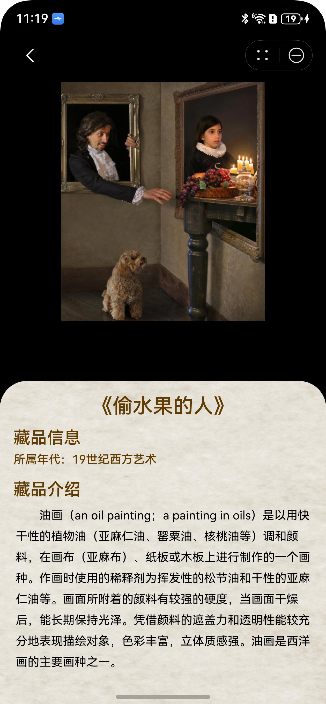

# 馆藏珍品组件快速入门

## 目录

- [简介](#简介)
- [约束与限制](#约束与限制)
- [快速入门](#快速入门)
- [API参考](#API参考)
- [示例代码](#示例代码)

## 简介

本组件提供了馆藏珍品浏览、珍品详情查看的能力。



## 约束与限制

### 环境

* DevEco Studio版本：DevEco Studio 5.0.0 Release及以上
* HarmonyOS SDK版本：HarmonyOS 5.0.0 Release SDK及以上
* 设备类型：华为手机（包括双折叠和阔折叠）
* 系统版本：HarmonyOS 5.0.0(12)及以上

## 快速入门

1. 安装组件。

   如果是在DevEvo Studio使用插件集成组件，则无需安装组件，请忽略此步骤。

   如果是从生态市场下载组件，请参考以下步骤安装组件。

   a. 解压下载的组件包，将包中所有文件夹拷贝至您工程根目录的XXX目录下。

   b. 在项目根目录build-profile.json5添加module_page_swiper模块。

    ```
    // 在项目根目录build-profile.json5填写module_page_swiper路径。其中XXX为组件存放的目录名
    "modules": [
        {
        "name": "module_page_swiper",
        "srcPath": "./XXX/module_page_swiper",
        }
    ]
    ```
   c. 在项目根目录oh-package.json5中添加依赖。
    ```
    // XXX为组件存放的目录名称
    "dependencies": {
      "module_page_swiper": "file:./XXX/module_page_swiper"
    }
    ```

2. 引入组件。

   ```
   import { PageSwiper } from 'module_page_swiper';
   ```

## API参考

### 子组件

可以包含单个子组件

### 接口

PageSwiper(options?: PageSwiperOptions)

馆藏珍品组件。

**参数：**

| 参数名  | 类型                                            | 是否必填 | 说明                     |
| ------- | ----------------------------------------------- | -------- | ------------------------ |
| options | [PageSwiperOptions](#PageSwiperOptions对象说明) | 否       | 配置馆藏珍品组件的参数。 |

### PageSwiperOptions对象说明

| 名称                 | 类型                                                         | 是否必填 | 说明                                 |
| -------------------- | ------------------------------------------------------------ | -------- | ------------------------------------ |
| swiperData           | [SwiperItem](#SwiperItem对象说明)[]                          | 否       | 馆藏珍品信息                         |
| tips                 | string                                                       | 否       | 滑动提示                             |
| defaultIndex         | number                                                       | 否       | 默认展示的项，默认值为0              |
| sheetBg              | [ResourceStr](https://developer.huawei.com/consumer/cn/doc/harmonyos-references/ts-types#resourcestr) | 否       | 弹出模态框背景图                     |
| isShowTips           | boolean                                                      | 否       | 是否默认展示滑动提示语，默认值为true |
| pageSwiperController | [PageSwiperController](#PageSwiperController)                | 否       | 组件控制器                           |
| customContent        | [CustomBuilder](https://developer.huawei.com/consumer/cn/doc/harmonyos-references/ts-types#custombuilder8) | 否       | 自定义底部插槽                       |

### SwiperItem对象说明

| 名称         | 类型                                                         | 是否必填 | 说明     |
| ------------ | ------------------------------------------------------------ | -------- | -------- |
| img          | [ResourceStr](https://developer.huawei.com/consumer/cn/doc/harmonyos-references/ts-types#resourcestr) | 是       | 图片资源 |
| name         | string                                                       | 是       | 珍品名称 |
| age          | string                                                       | 否       | 所属年代 |
| introduction | string                                                       | 否       | 珍品介绍 |

### PageSwiperController

PageSwiper组件的控制器，用于控制组件进行珍品图片的放大缩小。

#### zoom

zoom(): void

放大珍品图片

#### shrink

shrink(): void

缩小珍品图片

### 事件

支持以下事件：

#### onBackgroundChange

onBackgroundChange: (isScale: boolean,index:number) => void = () => {}

珍品图片放大缩小时触发。isScale为true时图片为放大，false时，图片为缩小；index当前图片对应的项。

## 示例代码

```
import { PageSwiper, SwiperItem } from 'module_page_swiper';


@Entry
@ComponentV2
struct Index {
  @Local
  swiperData: SwiperItem[] = [
    {
      name: '偷水果的人',
      introduction: '油画（an oil painting；a painting in oils）是以用快干性的植物油' +
        '（亚麻仁油、罂粟油、核桃油等）调和颜料，在画布（亚麻布）、纸板或木板上进行制作的一个画种。作' +
        '画时使用的稀释剂为挥发性的松节油和干性的亚麻仁油等。画面所附着的颜料有较强的硬度，当画面干燥后，' +
        '能长期保持光泽。凭借颜料的遮盖力和透明性能较充分地表现描绘对象，色彩丰富，立体质感强。油画是西洋画的主要画种之一。',
      age: '19世界西方艺术',
      img: $r('app.media.treasure_bg1'),
    },
    {
      name: '佛教壁画',
      introduction: '始绘于前秦，延续至元代，跨越千年。内容以佛教故事为主，融合多元文化，画风从古朴到绚丽，技艺精湛，色彩斑斓，是世界艺术宝库中的璀璨明珠。',
      img: $r('app.media.treasure_bg2'),
      age: '古代佛教文化',
    },
  ];
  sheetBg: ResourceStr = $r('app.media.sheet_bg');

  build() {
    Navigation() {
      Stack() {
        PageSwiper({
          swiperData: this.swiperData,
          isShowTips: true,
          sheetBg: this.sheetBg,
          onBackgroundChange: (isScale: boolean, index: number) => {
            console.log('图片变化了');
          },
        });
      }
      .alignContent(Alignment.Top);

    }
    .expandSafeArea([SafeAreaType.SYSTEM], [SafeAreaEdge.TOP])
    .hideTitleBar(true)
    .systemBarStyle({
      statusBarContentColor: '#FFFFFF',
    });
  }
}

```