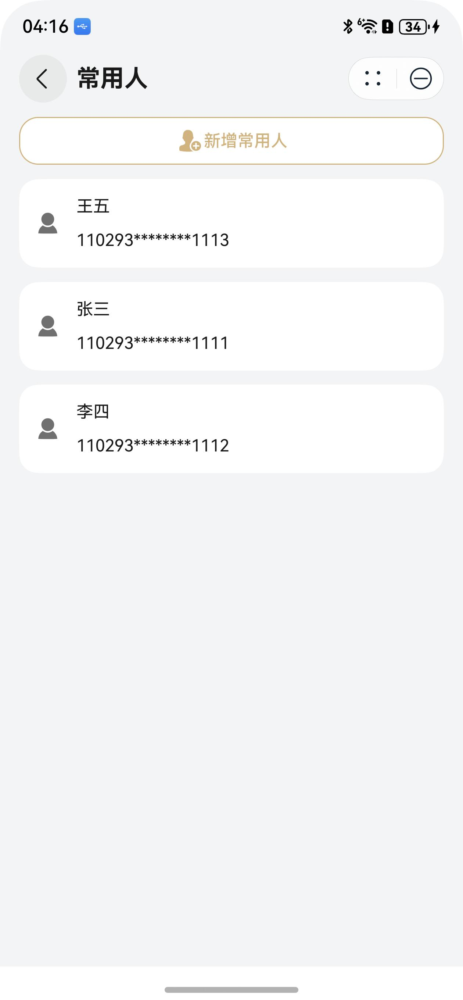

# 常用人管理组件快速入门

## 目录

- [简介](#简介)
- [约束与限制](#约束与限制)
- [快速入门](#快速入门)
- [API参考](#API参考)
- [示例代码](#示例代码)

## 简介

本组件提供了常用人新增、编辑、删除及以常用人单个选择、多个选择的能力。



## 约束与限制

### 环境

* DevEco Studio版本：DevEco Studio 5.0.0 Release及以上
* HarmonyOS SDK版本：HarmonyOS 5.0.0 Release SDK及以上
* 设备类型：华为手机（包括双折叠和阔折叠）
* 系统版本：HarmonyOS 5.0.0(12)及以上

## 快速入门

1. 安装组件。

   如果是在DevEco Studio使用插件集成组件，则无需安装组件，请忽略此步骤。

   如果是从生态市场下载组件，请参考以下步骤安装组件。

   a. 解压下载的组件包，将包中所有文件夹拷贝至您工程根目录的XXX目录下。

   b. 在项目根目录build-profile.json5添加module_person_manage模块。

    ```
    // 在项目根目录build-profile.json5填写module_person_manage路径。其中XXX为组件存放的目录名
    "modules": [
        {
        "name": "module_person_manage",
        "srcPath": "./XXX/module_person_manage",
        }
    ]
    ```
   c. 在项目根目录oh-package.json5中添加依赖。
    ```
    // XXX为组件存放的目录名称
    "dependencies": {
      "module_person_manage": "file:./XXX/module_person_manage"
    }
    ```

2. 引入组件。

   ```
   import { PersonManage, SelectMode, Contact } from 'module_person_manage';
   ```

## API参考

### 子组件

可以包含单个子组件

### 接口

PersonManage(options?: PersonManageOptions)

常用人管理组件。

**参数：**

| 参数名  | 类型                                                | 是否必填 | 说明                       |
| ------- | --------------------------------------------------- | -------- | -------------------------- |
| options | [PersonManageOptions](#PersonManageOptions对象说明) | 否       | 配置常用人管理组件的参数。 |

### PersonManageOptions对象说明

| 参数名           | 类型                                                         | 是否必填 | 说明                                  |
| :--------------- | :----------------------------------------------------------- | :------- | :------------------------------------ |
| navPathStack     | [NavPathStack](https://developer.huawei.com/consumer/cn/doc/harmonyos-references/ts-basic-components-navigation#navpathstack10) | 否       | Navigation路由栈实例                  |
| selectMode       | [SelectMode](#SelectMode枚举说明)                            | 否       | 选择模式                              |
| onSelect         | (data: [Contact](#Contact)\|[Contact](#Contact)[] ) => void  | 否       | 选择常用人后的回调                    |
| onBeforeNavigate | () => boolean                                                | 否       | 页面跳转前的回调，返回false将取消跳转 |
| disableId        | string[]                                                                                                                        | 否  | personID数组，禁用多选模式下的常用人。personID详见[Contact](#Contact)属性说明。 |

### SelectMode枚举说明

| 名称 | 描述 |
|:------------------------------------------------|:------------------------------------------------|
| NO_SELECT                                       | 可编辑删除，无法选择                                      |
| SINGLE_SELECT                                   | 单选                                              |
| MORE_SELECT                                     | 多选                                              |

### Contact

表示常用人数据的结构体，用于页面组件传入、组件内部管理，或作为网络接口的请求/响应格式。

| 字段名     | 类型     | 是否必填 | 说明             |
| ---------- | -------- | -------- | ---------------- |
| personID | string | 是       | 常用人唯一标识符 |
| cardType | string | 是       | 证件类型         |
| name     | string | 是       | 姓名             |
| phone    | string | 是       | 电话号码         |
| cardID   | string | 是       | 证件号码         |

## 示例代码

```
import { PersonManage, Contact, SelectMode } from 'module_person_manage';

@Entry
@ComponentV2
struct Index {
   private navPathStack: NavPathStack = new NavPathStack();

   public build(): void {
      Navigation(this.navPathStack) {
      Column() {
         PersonManage({
            navPathStack: this.navPathStack,
            selectMode: SelectMode.MORE_SELECT,
            onSelect: (data: Contact | Contact[]) => {
               console.log('常用人', data);
            },
            onBeforeNavigate: () => {
               return true;
            },
         }) {
            Button('常用人管理');
         };
      }
      .width('100%')
      .height('100%')
      .justifyContent(FlexAlign.Center);
   }
      .hideTitleBar(true);
}
}
```
