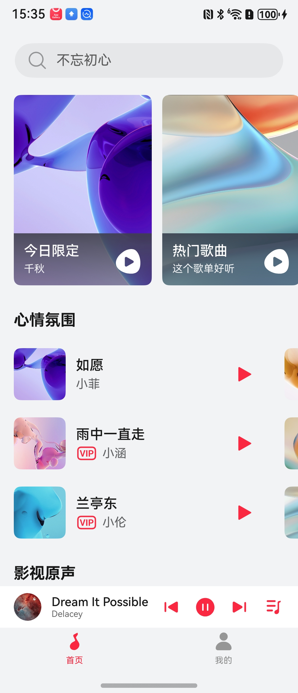
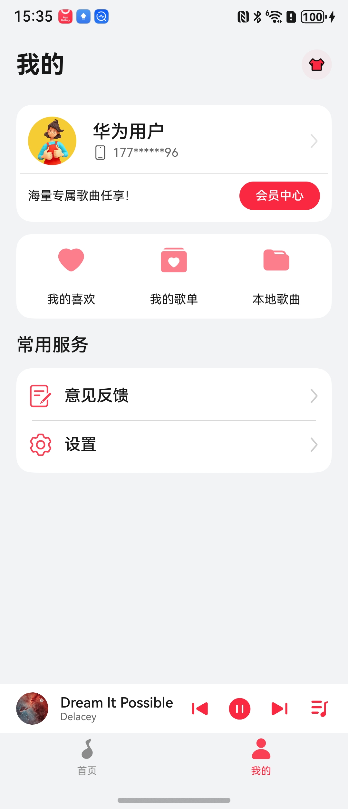

# 音乐应用模板快速入门

## 目录

- [功能介绍](#功能介绍)
- [约束与限制](#约束与限制)
- [快速入门](#快速入门)
- [示例效果](#示例效果)
- [开源许可协议](#开源许可协议)

## 功能介绍

您可以基于此模板直接定制应用，也可以挑选此模板中提供的多种组件使用，从而降低您的开发难度，提高您的开发效率。

此模板提供如下组件，所有组件存放在工程根目录的components下，如果您仅需使用组件，可参考对应组件的指导链接；如果您使用此模板，请参考本文档。

| 组件                       | 描述                                       | 使用指导                                     |
| :----------------------- | :--------------------------------------- | :--------------------------------------- |
| 音乐播放组件（module_musicplay） | 支持播放、暂停、切换播放模式、上下一首切换、播控中心、播放列表、封面、歌词、收藏、加入歌单、下载、分享 | [使用指导](components/module_musicplay/README.md) |


本模板为音乐类应用提供了常用功能的开发样例，模板主要分首和我的两大模块：

* 首页：提供推荐在线歌单、热门歌曲、搜索、播放条等功能。

* 我的：提供个人主页查看、我的喜欢、我的歌单、本地歌曲、意见反馈、设置等功能。

本模板已集成华为账号、广告、微信登录、主题切换、MV播放、会员中心、图片预览、支付、分享等服务，只需做少量配置和定制即可快速实现华为账号的登录、广告、支付、分享等功能。

| 首页                                       | 我的                                       |
| ---------------------------------------- | ---------------------------------------- |
|  |  |

本模板主要页面及核心功能如下所示：

```text
音乐模板
  ├──首页                           
  │   ├──顶部栏-搜索  
  │   │   ├── 历史搜索                          
  │   │   ├── 猜你喜欢
  │   │   └── 热搜榜              
  │   │                    
  │   │
  │   ├──在线歌单    
  │   │   ├── 今日限定                                             
  │   │   ├── 热门歌曲 
  │   │   ├── 多元旋律
  │   │   ├── 入坑必听
  │   │   ├── 南京热门
  │   │   └── 国风流行
  │   │
  │   ├──心情氛围
  │   │   └── 推荐歌曲
  │   │
  │   ├──影视原声
  │   │   └── 多个不同歌单
  │   │
  │   ├──回忆歌单       
  │   │   └── 推荐歌曲
  │   │
  │   ├──国风流行
  │   │   └── 多个不同歌单 
  │   │     
  │   ├──播放条
  │   │	  ├── 圆形唱片
  │   │	  ├── 播放控制
  │   │	  └── 播放列表
  │   ├──播放页  
  │   ├──mv播放
  │   ├──封面
  │   ├──歌词
  │   ├──音质切换
  │   ├──收藏
  │   ├──加入歌单
  │   ├──下载
  │   ├──分享
  │   ├──切换模型
  │   ├──播放控制
  │   └──歌曲列表
  │               
  └──我的                           
      ├──登录  
      │   ├── 华为账号一键登录                          
      │   ├── 微信登录                                                   
      │   ├── 账密登录
      │   └── 用户隐私协议同意                       
      │         
      ├──个人主页         
      │   ├── 头像、昵称、简介
      │   ├── 会员中心
      │                    
      ├──分类导航栏    
      │   ├── 我的喜欢                                        
      │   ├── 我的歌单                   
      │   └── 本地歌曲                         
      │
      └──常用服务                                        
          ├── 意见反馈                   
          └── 设置
               ├── 个人信息
               │    └── 个人信息修改
               ├── 未成年模式           
               ├── 隐私管理  
               ├── 歌曲下载品质设置             
               ├── 歌曲存放地址           
               ├── 关于我们
               ├── 清理缓存
               └── 退出登录                               
```

本模板工程代码结构如下所示：

```text
music
├──commons
│  ├──lib_account/src/main/ets                            // 账号登录模块             
│  │    ├──components
│  │    │   └──AgreePrivacyBox.ets                        // 隐私同意勾选         
│  │    ├──pages  
│  │    │   ├──HuaweiLoginPage.ets                        // 华为账号登录页面
│  │    │   ├──OtherLoginPage.ets                         // 其他方式登录页面
│  │    │   └──ProtocolWebView.ets                        // 协议H5                  
│  │    └──utils  
│  │        ├──HuaweiAuthUtils.ets                        // 华为认证工具类
│  │        ├──LoginSheetUtils.ets                        // 统一登录半模态弹窗
│  │        └──WXApiUtils.ets                             // 微信登录事件处理类 
│  │
│  ├──lib_common/src/main/ets                             // 基础模块             
│  │    ├──constants                                      // 通用常量 
│  │    ├──datasource                                     // 懒加载数据模型
│  │    ├──dialogs                                        // 通用弹窗 
│  │    ├──models                                         // 状态观测模型
│  │    └──utils                                          // 通用方法              
│  │
│  ├──lib_music_api/src/main/ets                           // 服务端api模块             
│  │    ├──constants                                      // 常量文件    
│  │    ├──database                                       // 数据库 
│  │    ├──observedmodels                                 // 状态模型  
│  │    ├──params                                         // 请求响应参数 
│  │    └──services                                       // 服务api    
│  │ 
│  └──lib_widget/src/main/ets                             // 通用UI模块             
│       └──components
│           ├──EmptyBuilder.ets                           // 空白组件
│           └──NavHeaderBar.ets                           // 自定义标题栏
│
├──components
│  ├──module_advertisement                                // 广告组件      
│  ├──module_aggregated_payment                           // 支付组件
│  ├──module_base_apis                                    // 集成能力组件
│  ├──module_feedback                                     // 意见反馈组件 
│  ├──module_imagepreview                                 // 图片预览组件
│  ├──module_musicplay                                    // 音乐播放器组件
│  ├──module_share                                        // 分享组件  
│  ├──module_theme                                        // 主题组件
│  ├──module_uivideo                                      // 视频 UIVideo组件
│  └──module_vip_center                                   // 会员中心
│      
├──features
│  ├──business_home/src/main/ets                          // 首页模块             
│  │    ├──components
│  │    ├──DynamicGrid.ets                                // 首页推荐歌曲组件
│  │    ├──PlaylistCard.ets                               // 动态卡片
│  │    ├──PlaylistCards.ets                              // 顶部推荐歌单卡片
│  │    ├──PlaylistSection.ets                            // 在线歌单卡片
│  │    ├──SearchComponent.ets                            // 搜索
│  │    ├──SongItemComponent.ets                          // 推荐歌曲集合              
│  │    ├──pages
│  │    │   ├──HomePage.ets                               // 首页页面
│  │    │   ├──SearchPage.ets                             // 搜索页面
│  │    │   └──SongListPage.ets                           // 歌单歌曲列表页面
│  │    └──viewmodels
│  │        └──HomeViewModel.ets                          // 首页数据模型
│  │           
│  ├──business_mine/src/main/ets                          // 我的模块  
│  │    ├──common
│  │    │   ├──AuthorDataSource.ets                       // 用户数据模型
│  │    │   └──SondDataSource.ets                         // 懒加载数据模型      
│  │    │  
│  │    ├──components
│  │    │   ├──CollectedMusic.ets                         // 收藏自定义组件
│  │    │   └──CollectedSongItem.ets                      // 本地和收藏歌曲列表行   
│  │    │
│  │    └──pages 
│  │    │    ├──AddOnePlayList.ets                        // 新增歌单页
│  │    │    ├──LocalSongsPage.ets                        // 本地歌曲页
│  │    │    ├──MarkPage.ets                              // 收藏页
│  │    │    ├──MineMusicPage.ets                         // 我的歌单页
│  │    │    ├──MineOnePlayList.ets                       // 我的歌单列表
│  │    │    ├──MinePage.ets                              // 我的主页面
│  │    │    ├──ThemePage.ets                             // 皮肤页面
│  │    │    └──VipCenterPage.ets                         // 会员中心页面     
│  │    │
│  │    └──viewmodels 
│  │         ├──MarkVM.ets                                // 收藏数据模型
│  │         ├──MineVM.ets                                // 我的页面数据模型
│  │         └──MyPlatListVM.ets                          // 我的歌单数据模型     
│  │
│  └──business_setting/src/main/ets                       // 设置模块             
│       ├──components
│       │   ├──SettingCard.ets                            // 设置卡片
│       │   └──SettingSelectDialog.ets                    // 设置选项弹窗               
│       └──pages
│           ├──SettingAbout.ets                           // 关于页面
│           ├──SettingH5.ets                              // H5页面
│           ├──SettingPage.ets                            // 设置页面
│           ├──SettingPersonal.ets                        // 编辑个人信息页面
│           ├──SettingPrivacy.ets                         // 隐私设置页面 
│           ├──SettingSystemPrivilege.ets                 // 隐私管理页面
│           └──SettingTeenagersPage.ets                   // 未成年模式页面
│    
│
└──products
   └──phone/src/main/ets                                  // phone模块
        ├──common                        
        │   ├──AppTheme.ets                               // 应用主题色
        │   └──Constants.ets                              // 业务常量
        ├──components                    
        │   └──CustomTabBar.ets                           // 应用底部Tab
        ├──pages   
        │   ├──AgreeDialogPage.ets                        // 隐私同意弹窗
        │   ├──Index.ets                                  // 入口页面
        │   ├──IndexPage.ets                              // 应用主页面
        │   ├──MvPlayerPage.ets                           // MV播放页面
        │   ├──PrivacyPage.ets                            // 查看隐私协议页面
        │   ├──SafePage.ets                               // 隐私同意页面
        │   ├──SplashPage.ets                             // 开屏广告页面
        │   ├──StartGuidePage.ets                         // 首次安装引导页
        │   └──StartPage.ets                                                              
        ├──phoneability                                    
        │    └──PhoneAbility.ets                           // EntryAbility
        │ 
        ├──phonebackupability 
        │    └──PhoneBackupAbility.ets                     // EntryBackupAbility
        │ 
        └──viewmodels 
            ├──IndexPageVM.ets                              // 首页视图模型
            ├──IndexVM.ets                                  // 首页视图模型
            └──SafePageVM.ets                               // 隐私同意视图模型
```

## 约束与限制

### 环境

- DevEco Studio版本：DevEco Studio 5.0.5 Release及以上
- HarmonyOS SDK版本：HarmonyOS 5.0.5 Release SDK及以上
- 设备类型：华为手机
- 系统版本：HarmonyOS 5.0.5(17)及以上

### 权限

- 后台持续运行权限: ohos.permission.KEEP_BACKGROUND_RUNNING
- 跨应用关联权限: ohos.permission.APP_TRACKING_CONSENT
- Internet网络权限: ohos.permission.INTERNET

### 调试

由于模板引入会员中心组件，只能在真机上运行。如想在模拟器上运行可以将“module_vip_center”和“module_aggregated_payment”两个组件模块移除。

## 快速入门

### 配置工程

在运行此模板前，需要完成以下配置：

1. 在AppGallery Connect创建应用，将包名配置到模板中。

   a. 参考[创建HarmonyOS应用](https://developer.huawei.com/consumer/cn/doc/app/agc-help-create-app-0000002247955506)
   为应用创建APP ID，并将APP ID与应用进行关联。

   b. 返回应用列表页面，查看应用的包名。

   c. 将模板工程根目录下AppScope/app.json5文件中的bundleName替换为创建应用的包名。

2. 配置华为账号服务。

   a. 将应用的Client ID配置到products/phone/src/main路径下的module.json5文件中，
   详细参考：[配置Client ID](https://developer.huawei.com/consumer/cn/doc/harmonyos-guides/account-client-id)。

   b. 申请华为账号一键登录所需的quickLoginMobilePhone权限，详细参考：[配置scope权限](https://developer.huawei.com/consumer/cn/doc/harmonyos-guides/account-config-permissions)。

3. 配置广告服务。

   a. 如果仅调测广告，可使用测试广告位ID：开屏广告：testd7c5cewoj6、横幅广告：testw6vs28auh3。

   b. 申请正式的广告位ID。
   登录[鲸鸿动能媒体服务平台](https://developer.huawei.com/consumer/cn/service/ads/publisher/html/index.html?lang=zh)
   进行申请，具体操作详情请参见[展示位创建](https://developer.huawei.com/consumer/cn/doc/distribution/monetize/zhanshiweichuangjian-0000001132700049)。

4. 接入微信SDK。
   前往微信开放平台申请AppID并配置鸿蒙应用信息，详情参考：[鸿蒙接入指南](https://developers.weixin.qq.com/doc/oplatform/Mobile_App/Access_Guide/ohos.html)。

5. 接入QQ。
   前往QQ开放平台申请AppID并配置鸿蒙应用信息，详情参考：[鸿蒙接入指南](https://wiki.connect.qq.com/sdk%e4%b8%8b%e8%bd%bd)。

6. 对应用进行[手工签名](https://developer.huawei.com/consumer/cn/doc/harmonyos-guides/ide-signing#section297715173233)。

7. 添加手工签名所用证书对应的公钥指纹，详细参考：[配置应用签名证书指纹](https://developer.huawei.com/consumer/cn/doc/app/agc-help-cert-fingerprint-0000002278002933)

### 运行调试工程

1. 连接调试手机和PC。

2. 菜单选择“Run > Run 'phone' ”或者“Run > Debug 'phone' ”，运行或调试模板工程。

## 示例效果

1. [首页](./screenshots/home.jpg)
2. [播放](./screenshots/music.jpg)
3. [我的](./screenshots/mine.jpg)


## 开源许可协议

该代码经过[Apache 2.0 授权许可](http://www.apache.org/licenses/LICENSE-2.0)。
