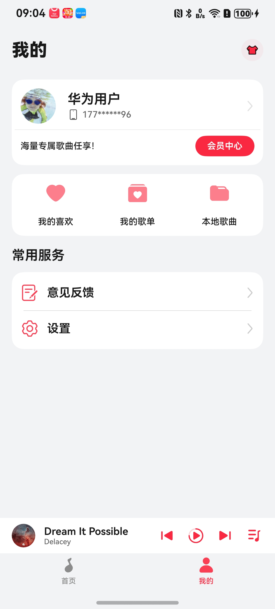
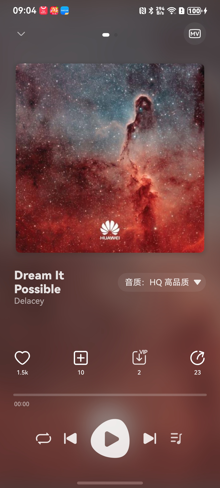

# 音乐播放组件快速入门

## 目录

- [简介](#简介)
- [约束与限制](#约束与限制)
- [快速入门](#快速入门)
- [API参考](#API参考)
- [示例代码](#示例代码)

## 简介

本组件提供了音乐播放控制面板，支持播放、暂停、下一曲、上一曲、调整播放进度、播放模式切换、播放列表、收藏歌曲、下载、播放封面、播放mv、播放歌词等功能。






## 约束与限制

### 环境

- DevEco Studio版本：DevEco Studio 5.0.5 Release及以上
- HarmonyOS SDK版本：HarmonyOS 5.0.5 Release SDK及以上
- 设备类型：华为手机
- 系统版本：HarmonyOS 5.0.5(17)及以上

### 权限

- 网络权限：ohos.permission.INTERNET

- 后台持续运行权限: ohos.permission.KEEP_BACKGROUND_RUNNING


## 快速入门

1. 安装组件。

   如果是在DevEco Studio使用插件集成组件，则无需安装组件，请忽略此步骤。

   如果是从生态市场下载组件，请参考以下步骤安装组件。

   a. 解压下载的组件包，将包中所有文件夹拷贝至您工程根目录的XXX目录下。

   b. 在项目根目录build-profile.json5添加module_musicplay和module_share模块。

   ```typescript
    // 在项目根目录build-profile.json5填写module_musicplay路径。其中XXX为组件存放的目录名
    "modules": [
       {
         "name": "module_musicplay",
         "srcPath": "./XXX/module_musicplay",
       },
       {
         "name": "module_share",
         "srcPath": "./XXX/module_share"
       }
    ]
   ```
   c. 在项目根目录oh-package.json5添加依赖。

   ```
     "dependencies": {
       "module_musicplay": "file:./XXX/module_musicplay"
     }
   }
   ```


2. 开启全局沉浸式布局。
   
    a. 在EntryAbility的onWindowStageCreate中设置窗口属性,windowStage 窗口舞台对象，用于获取和设置窗口相关属性。将setWinConfig方法放在EntryAbility的onWindowStageCreate中

   ```
   private async setWinConfig(windowStage: window.WindowStage) {
       AppStorage.setOrCreate('context', this.context);
       AppStorage.setOrCreate('windowStage', windowStage);
   
       // 获取主窗口对象并设置全屏模式
       let windowClass: window.Window = windowStage.getMainWindowSync();
       await windowClass.setWindowLayoutFullScreen(true);
   
       // 存储窗口高度信息到全局存储中
       AppStorage.setOrCreate('windowHeight', windowClass.getWindowProperties().windowRect.height);
   
       // 获取并存储导航指示器区域高度信息
       let naviBarArea = windowClass.getWindowAvoidArea(window.AvoidAreaType.TYPE_NAVIGATION_INDICATOR);
       let naviIndicatorHeight = px2vp(naviBarArea.bottomRect.height);
       AppStorage.setOrCreate('naviIndicatorHeight', naviIndicatorHeight);
   
       // 获取并存储状态栏区域高度信息
       let statusBarArea = windowClass.getWindowAvoidArea(window.AvoidAreaType.TYPE_SYSTEM);
       let statusBarHeight = px2vp(statusBarArea.topRect.height);
       AppStorage.setOrCreate('statusBarHeight', statusBarHeight);
    }
   
   ```

3. 配置主模块的module.json5。

   a. 在 `module.json5` 中正确声明长时任务类型。

   ```
   {
     "module": {
       "abilities": [
         {
           "backgroundModes": ["audioPlayback"],// 按需配置支持的类型
         }
       ]
     }
   }
   ```

   b. 在 `module.json5` 中添加EntryBackupAbility。

   ```
   "extensionAbilities": [
     {
       "name": "EntryBackupAbility",
       "srcEntry": "./ets/entrybackupability/EntryBackupAbility.ets",
       "type": "backup",
       "exported": false,
       "metadata": [
         {
           "name": "ohos.extension.backup",
           "resource": "$profile:backup_config"
         }
       ],
     }
   ],
   ```

   c. 在backup_config.json中设置backup_config.allowToBackupRestore=true。

   ```
   {
     "allowToBackupRestore": true
   }
   ```

   d. 在 `module.json5` 中添加权限声明。

   ```
   "requestPermissions": [
     {
       "name": "ohos.permission.KEEP_BACKGROUND_RUNNING",
       "reason": "$string:reason_background",
       "usedScene": {
         "abilities": [
           "PhoneAbility"
         ],
         "when": "always"
       }
     },
     {
       "name": "ohos.permission.INTERNET",
     }
   ],
   ```

4. 在EntryAbility的onCreate中注册控制播放的回调函数。   

   ```
   //收藏操作回调(播放器以内)
   MediaService.getInstance().setCollectCallback((data: Record<string, string>) => {
     let state: string = data.state;
     //弹框提示
     promptAction.showToast({ message: '收藏' });
   })
   // 播放MV回调
   MediaService.getInstance().setPlayMvCallback((mvUrl: string) => {
     promptAction.showToast({ message: '播放MV' });
   })

   // 下载歌曲回调
   MediaService.getInstance().setDownloadSongCallback((src: string) => {
     promptAction.showToast({ message: '下载' });
   })

   // 加入歌单回调
   MediaService.getInstance().setAddPalyListCallback((songId: string) => {
     promptAction.showToast({ message: '加入歌单' });
   })

   // 从播放页打开登录页面
   MediaService.getInstance().setOpenLoginCallback(() => {
     promptAction.showToast({ message: '打开登录' });
   })
   ```

5. 引入组件。 
    ```
    import { MusicPlayController } from 'module_musicplay';
    ```
6. 调用组件，详细参数配置说明参见[API参考](#参数)。

   ```typescript
   MusicPlayController()
   ```


## API参考

### 子组件

无

### 接口

播放组件
```
MusicPlayController()
```

收藏（单歌曲）

```
getMusicModel().addCollect(song:SongItem)
```

取消收藏（单歌曲）

```
getMusicModel().removeCollect(song:SongItem)
```

向播放列表头插入一首歌曲且播放（单歌曲）

```
MediaService.getInstance().playSong(song:SongItem);
```

播放全部歌曲（替换播放列表且从第一首歌播放）

```
MediaService.getInstance().playAllSongs(Songs,true)
```

加入播放列表不播放（单歌曲）

```
MediaService.getInstance().addToSongList(song:SongItem)
```

清空播放列表

```
MediaService.getInstance().clearPlayList()
```

从播放列表移除歌曲

```
MediaService.getInstance().removeSongById(id)
```


音乐播放控制组件。

**参数：**

| 参数名             | 类型     | 是否必填 | 说明     |
| --------------- | ------ | ---- | ------ |
| themeColor      | string | 否    | 主题色    |
| playBarBgColor  | string | 否    | 播放条背景色 |
| titleFontColor  | string | 否    | 歌名颜色   |
| singerFontColor | string | 否    | 歌手颜色   |

**参数：**

| 参数名  | 类型                                       | 是否必填 | 说明       |
| ---- | ---------------------------------------- | ---- | -------- |
| song | [SongItem](http://localhost:63342/markdownPreview/1653119435/markdown-preview-index-1079329774.html?_ijt=s56771328birktlhf1v4tm17pr#ShareOptions%E5%AF%B9%E8%B1%A1%E8%AF%B4%E6%98%8E) | 否    | 歌曲信息的参数。 |

### SongItem对象说明 

| 参数名         | 类型      | 是否必填 | 说明                |
| ----------- | ------- | ---- | ----------------- |
| id          | string  | 是    | id                |
| title       | string  | 是    | 歌曲名称              |
| singer      | string  | 是    | 歌手                |
| mark        | string  | 是    | 歌曲标识              |
| label       | string  | 是    | 封面                |
| src         | string  | 是    | 歌曲默认链接            |
| srcMedium   | string  | 否    | 歌曲列表（音质为MEDIUM）   |
| srcHigh     | string  | 否    | 歌曲列表（音质为HIGH）     |
| srcLossless | string  | 否    | 歌曲列表（音质为LOSSLESS） |
| lyric       | string  | 是    | 歌词                |
| isCollected | boolean | 是    | 是否收藏              |
| isLocal     | boolean | 是    | 是否本地歌曲            |
| mvUrl       | string  | 是    | mv链接              |
| isVip       | boolean | 是    | 是否vip             |


## 示例代码

使用案例

```
import { getMusicModel, MediaService, MusicModel, MusicPlayController, SongItem } from 'module_musicplay';

export function getSongListData(): SongItem[] {
  return [
    {
      id: '1',
      title: 'Dream It Possible',
      singer: 'Delacey',
      mark: '1',
      label: '', // todo: 自行配置网络歌曲封面地址
      src: 'https://agc-storage-drcn.platform.dbankcloud.cn/v0/default-bucket-5xjsz/music%2FDelacey%20-%20Dream%20It%20Possible.flac?token=7ccf8833-c1c9-44ce-8ab6-52ee84dcbbd7', // todo: 自行配置网络歌曲地址或rawfile目录下的歌曲
      lyric: 'lrcfiles/DreamItPossible.lrc', // todo: 自行配置网络歌曲歌词
      isCollected: false,
      isLocal: false,
      mvUrl: 'https://www-file.huawei.com/admin/asset/v1/pro/view/a20e0965e56a4dc498fc33ee23750c0d.mp4',
      isVip: false,
      collectedCount: 2,
      playlistCount: 10,
      downloadCount: 2,
      shareCount: 5
    },
    {
      id: '2',
      title: '我不知道',
      singer: '名佚',
      mark: '2',
      label: '',
      src: 'https://agc-storage-drcn.platform.dbankcloud.cn/v0/default-bucket-5xjsz/music%2Fworld.wav?token=d84bfd1d-1c57-4695-be0c-cd18c4577992',
      lyric: '',
      isCollected: false,
      isLocal: false,
      mvUrl: 'https://www-file.huawei.com/admin/asset/v1/pro/view/a20e0965e56a4dc498fc33ee23750c0d.mp4',
      isVip: false,
      collectedCount: 1,
      playlistCount: 10,
      downloadCount: 2,
      shareCount: 5
    },
    {
      id: '3',
      title: '不忘初心',
      singer: '张三',
      mark: '1',
      label: '',
      src: 'https://agc-storage-drcn.platform.dbankcloud.cn/v0/default-bucket-5xjsz/music%2Fpower.wav?token=7a964de8-544a-40aa-a57e-54c2ee98cb47',
      lyric: '',
      isCollected: false,
      isLocal: false,
      mvUrl: 'https://www-file.huawei.com/admin/asset/v1/pro/view/a20e0965e56a4dc498fc33ee23750c0d.mp4',
      isVip: false,
      collectedCount: 1,
      playlistCount: 10,
      downloadCount: 2,
      shareCount: 5
    }
  ];
}

@Entry
@ComponentV2
struct Index {
  pageInfo: NavPathStack = new NavPathStack()
  @Local musicModel: MusicModel = getMusicModel();
  @Local song:SongItem | undefined = undefined; //列举歌曲
  aboutToAppear(): void {
    // todo: 初始化歌曲数据
    this.initSongData()
    this.playDefaultSong()
  }

  /**
   * 初始化歌曲数据
   * 该函数用于初始化歌曲列表数据并设置音频播放器
   * @returns Promise<void> 异步函数，无返回值
   */
  async initSongData() {
    let initSongs: SongItem[] = getSongListData()
    MediaService.getInstance().initAudioPlayer(initSongs, initSongs[0]); //初始化播放器
  }


  //播放默认歌曲
  playDefaultSong() {
    if (!this.song && this.musicModel.songList.length > 0) {
      this.musicModel.setCurrentSong(this.musicModel.songList[0]);
      MediaService.getInstance().addToSongList(this.song)
      this.song = this.musicModel.songList[this.musicModel.songList.length-1];
    }
  }

  build() {
    Navigation(this.pageInfo) {
      Column({space:5}) {
        Blank()
        MusicPlayController()
      }
      .width('100%')
      .height('100%')
      .padding({top: 80})
      .backgroundColor('#F1F3F5')
      .justifyContent(FlexAlign.Start)
      .alignItems(HorizontalAlign.Center)
      .padding({
        bottom: 28
        ,top:100
      })
    }
    .hideTitleBar(true)
  }
}
```


## 开源许可协议

该代码经过[Apache 2.0 授权许可](http://www.apache.org/licenses/LICENSE-2.0)。