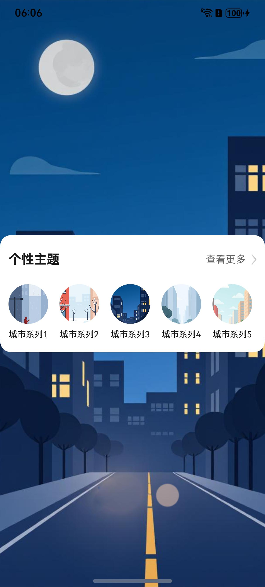

# 主题组件快速入门

## 目录

- [简介](#简介)
- [约束与限制](#约束与限制)
- [使用](#使用)
- [API参考](#API参考)
- [示例代码](#示例代码)

## 简介

本组件提供了展示当前选中主题、所有主题以及浏览切换主题的相关能力。



## 约束与限制
### 环境
* DevEco Studio版本：DevEco Studio 5.0.5 Release及以上
* HarmonyOS SDK版本：HarmonyOS 5.0.5 Release SDK及以上
* 设备类型：华为手机（包括双折叠和阔折叠）
* 系统版本：HarmonyOS 5.0.5(17)及以上

## 使用

1. 安装组件。

   如果是在DevEco Studio使用插件集成组件，则无需安装组件，请忽略此步骤。

   如果是从生态市场下载组件，请参考以下步骤安装组件。

   a. 解压下载的组件包，将包中所有文件夹拷贝至您工程根目录的XXX目录下。

   b. 在项目根目录build-profile.json5添加module_theme模块。

    ```
    // 项目根目录下build-profile.json5填写module_theme路径。其中XXX为组件存放的目录名
   "modules": [
      {
      "name": "module_theme",
      "srcPath": "./XXX/module_theme"
      }
   ]
    ```

   c. 在项目根目录oh-package.json5中添加依赖。
    ```
    // XXX为组件存放的目录名
    "dependencies": {
        "module_theme": "file:./XXX/module_theme"
    }
    ```

2. 引入组件句柄。
    ```
   import { ThemeController, ThemesCard } from 'module_theme';
   ```

3. 开启全局沉浸式布局。
    ```
    const win = await window.getLastWindow(getContext());
    win.setWindowLayoutFullScreen(true);
    ```

4. 使用主题卡片组件。详细参数配置说明参见[API参考](#API参考)。
    ```
   ThemesCard({ stack: this.stack })
   ```


## API参考

### 子组件

无

### 接口

ThemesCard(options?: ThemesCardOptions)

主题卡片组件。

**参数：**

| 参数名     | 类型                                          | 是否必填 | 说明           |
|---------|---------------------------------------------|------|--------------|
| options | [ThemesCardOptions](#ThemesCardOptions对象说明) | 是    | 配置主题卡片组件的参数。 |

### ThemesCardOptions对象说明

| 名称      | 类型                                                                                                                                                                                           | 是否必填 | 说明           |
|---------|----------------------------------------------------------------------------------------------------------------------------------------------------------------------------------------------|------|--------------|
| stack   | [NavPathStack](https://developer.huawei.com/consumer/cn/doc/harmonyos-references/ts-basic-components-navigation#navpathstack10)                                                              | 是    | 页面跳转所需的路由栈对象 |
| bgColor | [ResourceColor](https://developer.huawei.com/consumer/cn/doc/harmonyos-references/ts-types#resourcecolor)                                                                                    | 否    | 卡片背景颜色       |
| radius  | [Length](https://developer.huawei.com/consumer/cn/doc/harmonyos-references/ts-types#length)                                                                                                  | 否    | 卡片圆角         |
| pad     | [Padding](https://developer.huawei.com/consumer/cn/doc/harmonyos-references/ts-types#padding) \| [Length](https://developer.huawei.com/consumer/cn/doc/harmonyos-references/ts-types#length) | 否    | 卡片内边距        |

### ThemeController

主题控制器，用于切换与获取当前选择的主题。

**字段：**

| 名称       | 类型                                                         | 说明                                                         |
| ---------- | ------------------------------------------------------------ | ------------------------------------------------------------ |
| themePic   | [Resource](https://developer.huawei.com/consumer/cn/doc/harmonyos-references/ts-types#resource) | 当前主题展示图片。每次获取时，会根据当前时间从当前主题的图片中选择一张。 |
| themeColor | string                                                       | 当前主题展示颜色。                                           |
| themePics  | [Resource](https://developer.huawei.com/consumer/cn/doc/harmonyos-references/ts-types#resource)[] | 当前主题所有图片。                                           |
| themeLabel | string                                                       | 当前主题文字标签。                                           |

**方法：**

| 名称                           | 说明             |
|------------------------------|----------------|
| getThemeId()                 | 获取当前主题Id       |
| getThemeById(id: number)     | 通过Id获取对应主题     |
| getThemePicsById(id: number) | 通过Id获取对应主题所有图片 |
| change(id: number)           | 通过Id修改对应主题     |


## 示例代码

本示例通过ThemesCard实现主题的浏览与选择。

```
import { window } from '@kit.ArkUI';
import { ThemeController, ThemesCard } from 'module_theme';

@Entry
@ComponentV2
struct Theme {
  stack: NavPathStack = new NavPathStack();
  @Local fullScreen: boolean = false;

  async aboutToAppear() {
    const win = await window.getLastWindow(getContext());
    win.setWindowLayoutFullScreen(true);
    this.fullScreen = true;
  }

  build() {
    if (this.fullScreen) {
      Navigation(this.stack) {
        Column() {
          ThemesCard({ stack: this.stack })
        }
        .backgroundImage(ThemeController.themePic)
        .backgroundImageSize(ImageSize.Cover)
        .justifyContent(FlexAlign.Center)
        .width('100%')
        .height('100%')
      }
      .hideTitleBar(true)
    }
  }
}
```