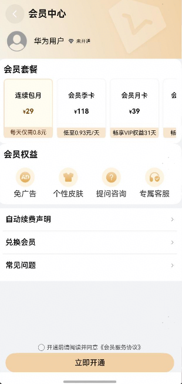

# 会员中心组件快速入门

## 目录

- [简介](#简介)
- [约束与限制](#约束与限制)
- [快速入门](#快速入门)
- [API参考](#API参考)
- [示例代码](#示例代码)

## 简介

本组件提供了用户会员开通功能，**其中开通会员中的华为支付、支付宝支付、微信之后功能暂未对接三方sdk的支付能力，所开通数据均为mock数据，实际开发中可以做借鉴使用，具体支付请对接实际业务**


| 组件                              | 描述                                       | 使用指导                                     |
| :------------------------------ | :--------------------------------------- | :--------------------------------------- |
| 支付组件（module_aggregated_payment） | 支持支付宝支付、华为支付和微信支付                        | [使用指导](components/module_aggregated_payment/README.md) |
| 集成能力组件（module_base_apis）        | 支持展示当前日期日历、自定义选中颜色、选中图标形状、周首日、是否展示休息日、是否展示农历、是否显示头部、自定义头部项插槽、节日、节气展示颜色等相关的能力 | [使用指导](components/module_base_apis/README.md) |



## 约束与限制

### 环境

- DevEco Studio版本：DevEco Studio 5.0.4 Release及以上
- HarmonyOS SDK版本：HarmonyOS 5.0.4 Release SDK及以上
- 设备类型：华为手机（包括双折叠和阔折叠）
- 系统版本：HarmonyOS 5.0.4(16)及以上

## 快速入门

1. 安装组件。

   如果是在DevEco Studio使用插件集成组件，则无需安装组件，请忽略此步骤。

   如果是从生态市场下载组件，请参考以下步骤安装组件。

   a. 解压下载的组件包，将包中所有文件夹拷贝至您工程根目录的XXX目录下。

   b. 在项目根目录build-profile.json5添加vip_center和base_apis以及aggregated_payment模块。

   ```typescript
    // 在项目根目录build-profile.json5填写vip_center和base_apis以及aggregated_payment路径。其中XXX为组件存放的目录名
    "modules": [
        {
        "name": "vip_center",
        "srcPath": "./XXX/vip_center",
        },
        {
        "name": "base_apis",
        "srcPath": "./XXX/base_apis",
        },
        {
        "name": "aggregated_payment",
        "srcPath": "./XXX/aggregated_payment",
        }
    ]
    ```
   c. 在项目根目录oh-package.json5中添加依赖。
    ```typescript
    // XXX为组件存放的目录名称
    "dependencies": {
      "vip_center": "file:./XXX/vip_center"
    }
   ```

2. 引入组件。

   ```typescript
   import { VipCenter } from 'vip_center';
   ```

3. 调用组件，详细参数配置说明参见[API参考](#API参考)。

   ```typescript
   import { VipCenter } from 'vip_center';
   import { promptAction } from '@kit.ArkUI';
   
   @Entry
   @Component
   struct Index {
     pageInfo: NavPathStack = new NavPathStack()
   
     build() {
       Navigation(this.pageInfo) {
         VipCenter({
           userName:'张三',
           avatar:'',
           routerModule:this.pageInfo,
           onVipOpen: () => {
             promptAction.showToast({ message: '兑换成功' })
           },
         })
       }
        .hideTitleBar(true)
     }
   }
   ```

## API参考

### 子组件

无

### 接口

VipCenter(options?: VipCenterOptions)

用户信息组件。

**参数：**

| 参数名  | 类型                                          | 必填 | 说明           |
| ------- | --------------------------------------------- | ---- | -------------- |
| options | [VipCenterOptions](#VipCenterOptions对象说明) | 否   | 会员开通组件。 |

### VipCenterOptions对象说明

| 名称       | 类型      | 必填 | 说明     |
| :--------- |:--------| ---- |--------|
| userName | string  | 否   | 用户名称   |
| avatar | string  | 否   | 用户头像   |
| isVip | boolean | 否   | 是否会员   |
| vipType | string    | 否   | 会员类型   |
| routerModule | [NavPathStack](https://developer.huawei.com/consumer/cn/doc/harmonyos-references/ts-basic-components-navigation#navpathstack10) | 是   | 传入当前组件所在路由栈 |
### 事件

支持以下事件：

#### onVipOpen

onLogin(callback: () => void)

开通事件