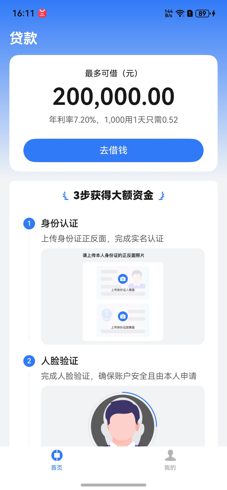
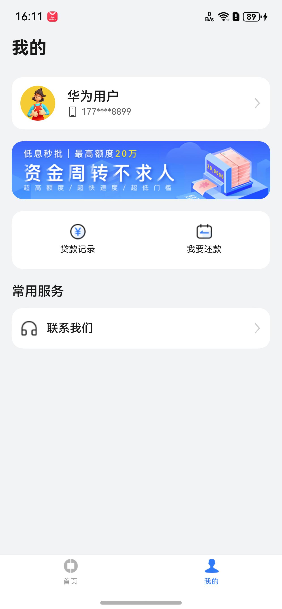

# 金融理财（贷款）应用模板快速入门

## 目录

- [功能介绍](#功能介绍)
- [约束与限制](#约束与限制)
- [快速入门](#快速入门)
- [开源许可协议](#开源许可协议)

## 功能介绍

您可以基于此模板直接定制应用，也可以挑选此模板中提供的多种组件使用，从而降低您的开发难度，提高您的开发效率。

此模板提供如下组件，所有组件存放在工程根目录的components下，如果您仅需使用组件，可参考对应组件的指导链接；如果您使用此模板，请参考本文档。

| 组件                                 | 描述                            | 使用指导                                                  |
|:-----------------------------------|:------------------------------|:------------------------------------------------------|
| 人脸活体检测组件（module_face_verification） | 支持人脸识别，并返回此次识别主体是否为真人活体或者为非活体 | [使用指导](components/module_face_verification/README.md) |
| 贷款信息表单提交组件（module_loan_form）       | 支持提交问题反馈、查看反馈记录               | [使用指导](components/module_loan_form/README.md)         |
| 在线客服组件（module_customer_service）           | 支持模拟在线客服页面模拟与客服聊天             | [使用指导](components/module_customer_service/README.md)  |
| 图片预览组件（module_imagepreview）    | 支持图片预览的功能，包括滑动预览、双指放大缩小图片        | [使用指导](components/module_imagepreview/README.md)  |


本模板为贷款类应用提供了常用功能的开发样例，模板主要分两大模块：

* 首页：提供贷款申请卡片入口、贷款步骤、平台介绍banner入口等功能。
* 我的：支持个人用户信息卡片、额度申请banner入口、贷款记录入口、我要还款入口、联系我们。


本模板已集成华为账号、微信登录、华为支付、微信支付、支付宝支付等服务，只需做少量配置和定制即可快速实现华为账号的登录、贷款申请与还款等功能。

| 首页                                            | 我的                                            |
|-----------------------------------------------|-----------------------------------------------|
|  |  |

本模板主要页面及核心功能如下所示：

```text
贷款模板
  ├── 首页                           
  │   ├── 顶部贷款申请入口卡片
  │   │     └── 额度申请
  │   │
  │   ├── 步骤引导    
  │   │
  │   └── 平台介绍Banner    
  │         └── 图文                                             
  │
  └── 我的                           
      ├── 用户信息卡片  
      │     ├── 头像
      │     ├── 昵称
      │     ├── 账户安全中心
      │     │     ├── 换绑手机号
      │     │     └── 注销账号
      │     │
      │     └── 退出账号              
      │         
      └── 额度申请banner入口        
      │     └── 额度申请
      │         
      ├── 额度申请banner入口  
      │     └── 身份证识别、人脸识别、贷款信息表单填写   
      │
      ├── 贷款记录    
      │     └── 贷款申请记录列表
      │          └── 贷款详情  
      │      
      ├── 我要还款 
      │     └── 待还贷款列表
      │           └── 贷款待还款计划
      │                 └── 我要还款
      │
      └── 常用服务
            └── 联系我们
                  ├── 意见反馈
                  ├── 诈骗举报
                  ├── 在线客服
                  ├── 电话客服
                  └── 常见问题、贷款相关、防骗指南
```

本模板工程代码结构如下所示：

```text

loans
├──commons
│  ├──lib_account/src/main/ets                            // 账号登录模块             
│  │    ├──components
│  │    │   └──AgreePrivacyBox.ets                        // 隐私同意勾选      
│  │    │            
│  │    ├──pages  
│  │    │   ├──HuaweiLoginPage.ets                        // 华为账号登录页面
│  │    │   ├──OtherLoginPage.ets                         // 其他方式登录页面
│  │    │   └──ProtocolWebView.ets                        // 协议H5   
│  │    │               
│  │    └──utils  
│  │        ├──HuaweiAuthUtils.ets                        // 华为认证工具类
│  │        ├──LoginSheetUtils.ets                        // 统一登录半模态弹窗
│  │        └──WXApiUtils.ets                             // 微信登录事件处理类 
│  │
│  ├──lib_common/src/main/ets                             // 基础模块             
│  │    ├──constants                                      // 通用常量 
│  │    ├──datasource                                     // 懒加载数据模型
│  │    ├──dialogs                                        // 通用弹窗 
│  │    ├──models                                         // 状态观测模型
│  │    └──utils                                          // 通用方法     
│  │
│  ├──lib_loan_api/src/main/ets                           // 服务端api模块             
│  │    ├──constants                                      // 常量文件    
│  │    ├──database                                       // 数据库 
│  │    ├──observedmodels                                 // 状态模型  
│  │    ├──params                                         // 请求响应参数 
│  │    ├──services                                       // 服务api  
│  │    └──utils                                          // 工具utils 
│  │  
│  └──lib_widget/src/main/ets                             // 通用UI模块             
│       └──components
│           ├──ButtonGroup.ets                            // 组合按钮
│           ├──CustomBadge.ets                            // 自定义信息标记组件
│           ├──EmptyBuilder.ets                           // 空白组件
│           └──NavHeaderBar.ets                           // 自定义标题栏
│
├──components
│  ├──aggregated_payment                                  // 支付组件                     
│  ├──module_card_verification                            // 身份证识别组件
│  ├──module_feedback                                     // 意见反馈组件 
│  ├──module_customer_service                             // 在线客服聊天组件
│  ├──module_face_verification                            // 人脸活体检测组件
│  ├──module_imagepreview                                 // 图片预览组件
│  ├──module_loan_form                                    // 贷款信息表单提交组件
│  └──module_ui_base                                      // 基础UI模块组件            
│      
├──features
│  ├──business_home/src/main/ets                          // 首页模块             
│  │    ├──components
│  │    │    └──home
│  │    │     ├──HomeIntroduceCard.ets                    // 额度申请入口卡片                 
│  │    │     ├──StepCard.ets                             // 申请步骤条组件                  
│  │    │     ├──StepIntroduceCard.ets                    // 申请步骤介绍页面                  
│  │    │     └──UnderReviewCard.ets                      // 审核中页面 
│  │    │                 
│  │    └──pages
│  │         ├──HomePage.ets                              //首页页面
│  │         ├──LearnMorePage.ets                         //平台更多介绍页面
│  │         └──VerifyPage.ets                            // 额度申请
│  │
│  ├──business_mine/src/main/ets                          // 我的模块             
│  │    ├──constants
│  │    │   └──Constants.ets                              // 常量    
│  │    │    
│  │    ├──pages
│  │    │   ├──BillingDetailsPage.ets                     // 账单详情页面
│  │    │   ├──LoanDetailsPage.ets                        // 贷款详情页面
│  │    │   ├──LoanRecordPage.ets                         // 贷款记录页面
│  │    │   ├──MinePage.ets                               // 我的页面
│  │    │   ├──PendingRepayment.ets                       // 待还款账单页面
│  │    │   └──RepaymentPage.ets                          // 我要还款页面  
│  │    │    
│  │    ├──types
│  │    │   └──Types.ets                                  // 我的GridItem类型  
│  │    │
│  │    └──viewmodels
│  │        ├──LoanRecordVm.ets                           // 贷款记录视图模型
│  │        ├──MineVM.ets                                 // 我的视图模型
│  │        └──RepaymentVM.ets                            // 还款视图模型               
│  │
│  └──business_setting/src/main/ets                       // 设置模块             
│       ├──components
│       │   ├──SettingCard.ets                            // 设置卡片
│       │   └──SettingSelectDialog.ets                    // 设置选项弹窗  
│       │ 
│       ├──types
│       │   └──Types.ets                                  // 设置模块数据类型 
│       │     
│       ├──viewmodels
│       │   ├──ContactVM.ets.ets                          // 联系我们视图模型
│       │   ├──FraudReportVM.ets.ets                      // 诈骗视图模型
│       │   ├──SettingPersonalVM.ets.ets                  // 设置个人信息视图模型
│       │   └──SettingVM.ets                              // 设置视图模型    
│       │ 
│       └──pages
│           ├──ConfirmCancellation.ets                    // 注销账号
│           ├──ContactPage.ets                            // 联系我们
│           ├──CustomerService.ets                        // 在线客服页面
│           ├──DeleteAccount.ets                          // 注销账号提示页面
│           ├──FraudReportPage.ets                        // 诈骗举报页面
│           ├──ProblemDetails.ets                         // 问题详情
│           ├──SettingAccountSecurity.ets                 // 账户安全中心
│           ├──SettingChangePhone.ets                     // 换绑手机号
│           ├──SettingChangePhoneNext.ets                 // 换绑手机号验证页面
│           └──SettingPersonal.ets                        // 个人信息   
│
└──products
   └──phone/src/main/ets                                  // phone模块
        ├──common                        
        │   ├──AppTheme.ets                               // 应用主题色
        │   └──Constants.ets                              // 业务常量
        │
        ├──components                    
        │   └──CustomTabBar.ets                           // 应用底部Tab
        │
        └──pages   
            ├──AgreeDialogPage.ets                        // 隐私同意弹窗
            ├──Index.ets                                  // 入口页面
            ├──IndexPage.ets                              // 应用主页面
            ├──PrivacyPage.ets                            // 查看隐私协议页面
            ├──SafePage.ets                               // 隐私同意页面
            └──StartPage.ets                              // 应用启动页面
```

## 约束与限制

### 环境

- DevEco Studio版本：DevEco Studio 5.0.5 Release及以上
- HarmonyOS SDK版本：HarmonyOS 5.0.5 Release SDK及以上
- 设备类型：华为手机（包括双折叠和阔折叠）
- 系统版本：HarmonyOS 5.0.5(17)及以上

### 权限

- 相机权限: ohos.permission.CAMERA

### 调试

由于模板引入支付组件，只能在真机上运行。如需在模拟器上运行可以将“module_aggregated_payment”组件模块移除。

## 快速入门

### 配置工程

在运行此模板前，需要完成以下配置：

1. 在AppGallery Connect创建应用，将包名配置到模板中。

   a. 参考[创建HarmonyOS应用](https://developer.huawei.com/consumer/cn/doc/app/agc-help-create-app-0000002247955506)为应用创建APP ID，并将APP ID与应用进行关联。

   b. 返回应用列表页面，查看应用的包名。

   c. 将模板工程根目录下AppScope/app.json5文件中的bundleName替换为创建应用的包名。

2. 配置华为账号服务。

   a. 将应用的Client ID配置到products/phone/src/main路径下的module.json5文件中，详细参考：[配置Client ID](https://developer.huawei.com/consumer/cn/doc/harmonyos-guides/account-client-id)。

   b. 申请华为账号一键登录所需的权限，详细参考：[申请账号权限](https://developer.huawei.com/consumer/cn/doc/harmonyos-guides/account-config-permissions)。

3. 对应用进行[手工签名](https://developer.huawei.com/consumer/cn/doc/harmonyos-guides/ide-signing#section297715173233)。

4. 添加手工签名所用证书对应的公钥指纹，详细参考：[配置公钥指纹](https://developer.huawei.com/consumer/cn/doc/app/agc-help-cert-fingerprint-0000002278002933)

### 运行调试工程

1. 连接调试手机和PC。

2. 菜单选择“Run > Run 'phone' ”或者“Run > Debug 'phone' ”，运行或调试模板工程。


## 开源许可协议

该代码经过[Apache 2.0 授权许可](http://www.apache.org/licenses/LICENSE-2.0)。
