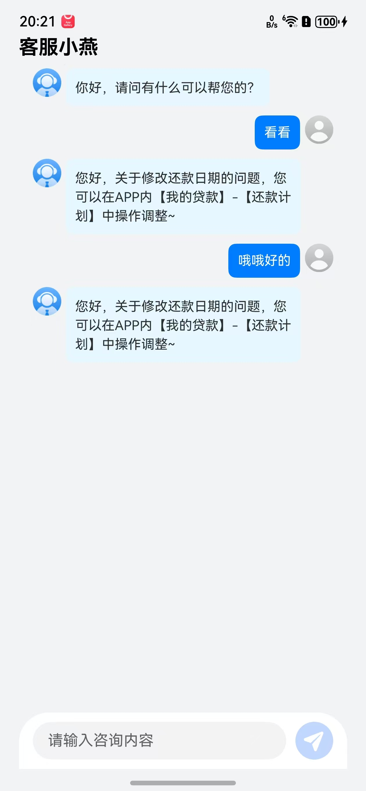

# 在线客服组件

## 目录

- [简介](#简介)
- [快速入门](#快速入门)
- [API参考](#API参考)
- [示例代码](#示例代码)

## 简介

本组件提供了在线客服的功能。




### 环境
* DevEco Studio版本：DevEco Studio 5.0.5 Release及以上
* HarmonyOS SDK版本：HarmonyOS 5.0.5 Release SDK及以上
* 设备类型：华为手机（包括双折叠和阔折叠）
* 系统版本：HarmonyOS 5.0.5(17)及以上


## 快速入门

1. 安装组件。

   如果是在DevEco Studio使用插件集成组件，则无需安装组件，请忽略此步骤。

   如果是从生态市场下载组件，请参考以下步骤安装组件。

   a. 解压下载的组件包，将包中所有文件夹拷贝至您工程根目录的XXX目录下。

   b. 在项目根目录build-profile.json5添加module_customer_service模块。

   ```ts
   // 在项目根目录build-profile.json5填写module_customer_service。其中XXX为组件存放的目录名。
   "modules": [
      {
         "name": "module_customer_service",
         "srcPath": "./XXX/module_customer_service",
      }
    ]
    ```

    c. 在项目根目录oh-package.json5中添加依赖。
    ```ts
    // XXX为组件存放的目录名称
    "dependencies": {
      "module_customer_service": "file:./XXX/module_customer_service"
     }

     ```

2. 引入在线客服组件句柄。
   ```typescript
   import { CustomerServicePage } from 'module_customer_service';
   ```
3. 调用组件，详见[示例代码](#示例代码)。详细参数配置说明参见[API参考](#API参考)。

    ```ts
   CustomerServicePage()
   ```
## API参考
### 接口
CustomerServicePage(options?:[CustomerServiceOptions](#CustomerServiceOptions函数说明))

在线客服组件。

### CustomerServiceOptions函数说明

| 名称                            | 类型        | 是否必填 | 说明        |
|-------------------------------|-----------|------|-----------|
| customerServicecancelCallBack | （）=>void  | 是    | 返回页面的回调函数 | 

## 示例代码

```ts
import { CustomerServicePage } from 'module_customer_service';
import { router } from '@kit.ArkUI';

@Entry
@Component
struct Pagechat {
  @State message: string = 'Hello World';

  build() {
    NavDestination() {
      Row() {
        Text('客服小燕')
          .fontSize(21)
          .fontColor(Color.Black)
          .fontWeight(FontWeight.Bold)
          .width('100%')
          .textAlign(TextAlign.Start)
      }
      .width('100%')
      .justifyContent(FlexAlign.Start)
      .expandSafeArea([SafeAreaType.KEYBOARD, SafeAreaType.SYSTEM])

      CustomerServicePage({
        customerServicecancelCallBack: () => {
          router.back()
        }
      })
    }
    .padding({left: 20, right: 20})
    .hideTitleBar(true)
    .height('100%')
    .backgroundColor('#F1F3F5')
  }
}

```
