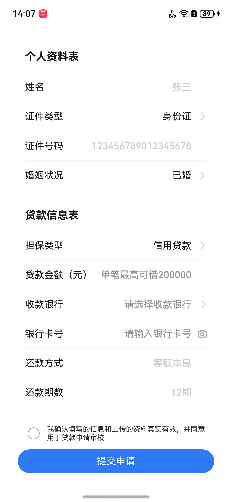

# 贷款信息表单提交组件快速入门

## 目录

- [简介](#简介)
- [快速入门](#快速入门)
- [API参考](#API参考)
- [示例代码](#示例代码)


## 简介

本组件为贷款信息表单提交组件，可进行贷款所需的用户信息的收集包括姓名、身份证号、性别、银行卡的填写与拍照识别卡号等，可以通过回调拿到这些信息。
用户姓名为使用组件时传入的值，不可编辑；当证件类型选择为身份证时，证件号码由使用组件时传入，不可编辑；当证件类型选择为护照时，证件号码可编辑。





### 环境

* DevEco Studio版本：DevEco Studio 5.0.5 Release及以上
* HarmonyOS SDK版本：HarmonyOS 5.0.5 Release SDK及以上
* 设备类型：华为手机（包括双折叠和阔折叠）
* 系统版本：HarmonyOS 5.0.5(17)及以上


## 快速入门

1. 安装组件。

   如果是在DevEco Studio使用插件集成组件，则无需安装组件，请忽略此步骤。

   如果是从生态市场下载组件，请参考以下步骤安装组件。

   a. 解压下载的组件包，将包中所有文件夹拷贝至您工程根目录的XXX目录下。

   b. 在项目根目录build-profile.json5添加module_loan_form模块。

   ```ts
   // 项目根目录下build-profile.json5填写module_loan_form路径。其中XXX为组件存放的目录名
   "modules": [
     {
       "name": "module_loan_form",
       "srcPath": "./XXX/module_loan_form"
     }
   ]
   ```

   c. 在项目根目录oh-package.json5中添加依赖。

   ```ts
   // 在项目根目录oh-package.json5中添加依赖
   "dependencies": {
     "module_loan_form": "file:./XXX/module_loan_form",
   }
   ```


2. 引入组件和识别的结果数据类型。

   ```ts
   import { LoanForm, LoanFormVM } from 'module_loan_form'
   ```

3. 调用组件，详见[示例代码](#示例代码)。详细参数配置说明参见[API参考](#API参考)。

     ```ts
   LoanForm()
   ```


## API参考
### 接口
LoanForm(options:[LoanFormOptions](#LoanFormOptions对象说明))

贷款信息表单组件。

### LoanFormOptions对象说明

| 名称                  | 类型                                                        | 是否必填 | 说明                             |
|---------------------|-----------------------------------------------------------| -------- |--------------------------------|
| idCardName          | string                                                    | 是       | 外部需要传入的姓名                      |
| idCardNumber        | string                                                    | 是       | 外部需要传入的身份证号码                   |
| maxLoanAmount       | number                                                    | 是       | 当前可贷款的最大金额（用户填写的贷款金额超出此数值后会提示） |
| LoanFormCallBack | (loanFormVMData: [LoanFormVM](#LoanFormVM数据说明))=>void | 是       | 身份证正反面识别信息结果的回调函数              |


###  LoanFormVM数据说明

| 名称                      | 类型        | 是否必填 | 说明   |
|-------------------------|-----------|------|------|
| userRealName                    | string    | /    | 姓名   |
| idNumber                     | string    | /    | 身份证号码 |
| passPortNumber             | string    | /    | 护照号  |
| bankAccountNumber                   | string    |/    | 银行卡号 |
| selectBankBrand                   | string    |/    | 收款银行 |
| marryType                   | string    |/    | 婚姻状况 |
| ensureType                   | string    |/    | 担保类型 |
| myLoanAmount                   | string    |/    | 用户申请金额 |
| loanTerms                   | string    |/    | 贷款期数 |
| repaymentMethod                   | string    |/    | 还款方式 |


## 示例代码

```ts


import { LoanForm, LoanFormVM } from 'module_loan_form'


@Entry
@ComponentV2
struct Index {
  @Local myFormInfo: LoanFormVM | undefined = undefined
  build() {
    Column() {
      LoanForm({
        idCardName:'张三',
        idCardNumber:'412725185310105555',
        maxLoanAmount:200000,
        LoanFormCallBack:(loanFormVMData: LoanFormVM)=>{
          console.log('LoanFormCallBack',JSON.stringify(loanFormVMData))
          this.myFormInfo = loanFormVMData
        }
      })
    }
    .width('100%')
    .height('100%')
    .padding(20)
  }
}  
```

