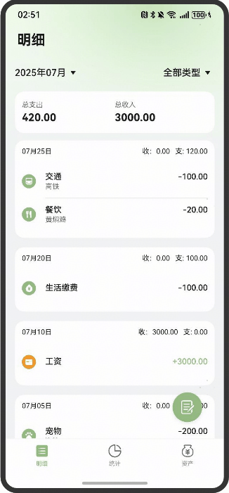

# 金融理财（记账）应用模板快速入门

## 目录

- [功能介绍](#功能介绍)
- [约束和限制](#约束和限制)
- [快速入门](#快速入门)
- [示例效果](#示例效果)
- [开源许可协议](#开源许可协议)


## 功能介绍

您可以基于此模板直接定制应用，也可以挑选此模板中提供的多种组件使用，从而降低您的开发难度，提高您的开发效率。

此模板提供如下组件，所有组件存放在工程根目录的components下，如果您仅需使用组件，可参考对应组件的指导链接；如果您使用此模板，请参考本文档。

| 组件                   | 描述                                                         | 使用指导                                        |
| ---------------------- | ------------------------------------------------------------ | ----------------------------------------------- |
| 资产卡片(asset_card)   | 提供了资产列表卡片和资产总览卡片，支持隐匿展示，自定义样式等相关能力。 | [使用指导](./components/asset_card/README.md)   |
| 资产管理(asset_manage) | 提供了资产管理和资产类型管理组件，支持作为组件嵌入或作为模态弹框拉起。 | [使用指导](./components/asset_manage/README.md) |
| 账单卡片(bill_card)    | 提供了账单卡片、账单总览卡片和账单详情卡片。支持自定义样式、事件处理等能力。 | [使用指导](./components/bill_card/README.md)    |
| 账单图表(bill_chart)   | 提供了多种类型的图表展示账单数据分析。包括饼图、金额排行图、月度柱状图、数据报表、日历视图。 | [使用指导](./components/bill_chart/README.md)   |
| 账单管理(bill_manage)  | 提供了账单管理和账单来源管理组件，支持作为组件嵌入或作为模态弹框拉起。 | [使用指导](./components/bill_manage/README.md)  |


本模板为记账类应用提供了常用功能的开发样例，模板主要分首页、统计和资产三大模块：

- 首页：主要展示账单列表，支持根据月份和类型进行账单筛选，支持点击悬浮按钮添加账单，编辑账单类型等常用功能。

- 统计：根据账单展示统计图表，支持根据月份筛选，支持展示饼图、金额排行、月度柱状图、统计报表、日历图等。

- 资产：主要展示资产列表，支持用户添加、编辑资产信息，支持在对应资产内完成记账等功能。

**本模版当前采用本地数据库存储账单、分类等数据，应用卸载后数据会被清空并且无法找回。**

| 首页                                                  | 统计                                                       | 资产                                                   |
| ----------------------------------------------------- | ---------------------------------------------------------- | ------------------------------------------------------ |
|  |  |  |

本模板主要页面及核心功能如下所示：

```ts
记账模板
 |-- 首页
 |    |-- 账单查询
 |    |-- 新增账单
 |    |-- 账单类型管理
 |    |-- 编辑账单
 |    |-- 删除账单
 |    └-- 账单详情查看
 |-- 统计
 |    |-- 账单报表查看
 |    |-- 账单分类查看
 |    └-- 日历视图
 └-- 资产
      |-- 资产查询
      |-- 新增资产
      |-- 编辑资产
      |-- 删除资产
      └-- 资产内记账
```

本模板工程代码结构如下所示：

```ts
MoneyTrack
|--commons                                      // 公共能力层
|   └--commonlib                                // 基础能力包
|     └--src/main
|         |--ets
|         |   |--components                     // 公共组件
|         |   |--constants                      // 公共静态变量
|         |   |--dialogs                        // 公共弹窗
|         |   └--utils                          // 公共方法
|         |
|         └-- resources                         // 全局资源
|
|--components                                   // 可分可合组件包
|   |-- asset_base                              // 资产通用基础包
|   |-- asset_card                              // 资产卡片
|   |-- asset_manage                            // 资产管理
|   |-- bill_base                               // 账单通用基础包
|   |-- bill_card                               // 账单卡片
|   |-- bill_chart                              // 账单图表
|   |-- bill_data_processing                    // 账单数据处理
|   └-- bill_manage                             // 账单管理
|
|--features                                     // 基础特性层
|   |-- assets                                  // 资产
|   |   └--src/main/ets/views
|   |      |--AssetDetailPage.ets               // 资产详情页
|   |      └--AssetsView.ets                    // 资产页
|   |-- home                                    // 首页明细
|   |   └--src/main/ets/views
|   |      |--BillDetailPage.ets                // 账单详情页
|   |      └--HomeView.ets                      // 首页
|   └-- statistics                              // 统计
|       └--src/main/ets/views
|          |--BillByResourceView.ets            // 分类账单详情
|          └--StatisticsView.ets                // 统计页
└--products                                     // 设备入口层
    └-- entry
        └--src/main/ets
           |-- pages
           |   └-- MainEntry.ets                // 主入口
           └-- widgets
               |-- MiddleCard.ets               // 2*4中号卡片
               └-- MiniCard.ets                 // 2*2小号卡片
```


## 约束和限制

### 环境

- DevEco Studio版本：DevEco Studio 5.0.2 Release及以上
- HarmonyOS SDK版本：HarmonyOS 5.0.2 Release SDK及以上
- 设备类型：华为手机（包括双折叠和阔折叠）
- 系统版本：HarmonyOS 5.0.2(14)及以上

## 快速入门

### 运行调试工程

1. 连接调试手机和PC。

2. 对应用进行[自动签名](https://developer.huawei.com/consumer/cn/doc/harmonyos-guides/ide-signing#section18815157237)。

3. 菜单选择“Run > Run 'entry' ”或者“Run > Debug 'entry' ”，运行或调试模板工程。


## 示例效果




## 开源许可协议

该代码经过[Apache 2.0 授权许可](http://www.apache.org/licenses/LICENSE-2.0)。