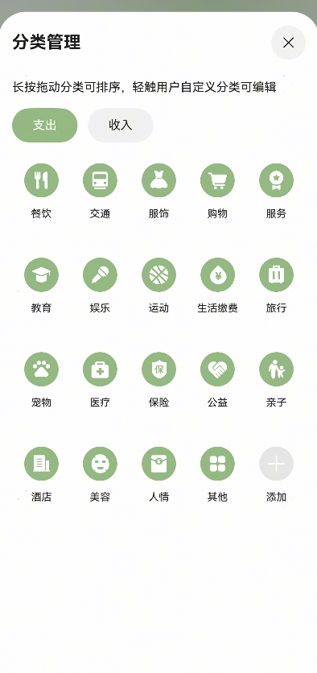

# 账单管理组件快速入门

- [简介](#简介)
- [约束与限制](#约束与限制)
- [快速入门](#快速入门)
- [API参考](#API参考)
- [示例代码](#示例代码)


## 简介

本组件提供以下两个账单管理页面：

- BillManageSheet用于管理账单信息，支持初始化账单数据、处理确认操作和资源管理操作。

- ResourceManageSheet用于管理账单来源分类的组件，支持处理弹出操作以及删除操作的成功回调。

| BillManageSheet                                              | ResourceManageSheet                                          |
| ------------------------------------------------------------ | ------------------------------------------------------------ |
|  |  |


## 约束与限制

### 环境

* DevEco Studio版本：DevEco Studio 5.0.2 Release及以上
* HarmonyOS SDK版本：HarmonyOS 5.0.2 Release SDK及以上
* 设备类型：华为手机（包括双折叠和阔折叠）
* 系统版本：HarmonyOS 5.0.2(14)及以上


## 快速入门

1. 安装组件。

   如果是在DevEvo Studio使用插件集成组件，则无需安装组件，请忽略此步骤。

   如果是从生态市场下载组件，请参考以下步骤安装组件。

   a. 解压下载的组件包，将包中所有文件夹拷贝至您工程根目录的XXX目录下。
   b. 在项目根目录build-profile.json5添加bill_base和bill_manage模块。

   ```typescript
   // 在项目根目录build-profile.json5填写bill_base和bill_manage路径。其中XXX为组件存放的目录名
     "modules": [
       {
         "name": "bill_base",
         "srcPath": "./XXX/bill_base"
       },
       {
         "name": "bill_manage",
         "srcPath": "./XXX/bill_manage"
       }
     ]
   ```

2. 在根目录oh-package.json5中添加依赖。

   ```typescript
   // XXX为组件存放的目录名称
   "dependencies": {
     "bill_manage": "file:./XXX/bill_manage",
     "bill_base": "file:./XXX/bill_base"
   }
   ```

3. 使用BillManageSheet组件。

   a. 引入组件句柄。

   ```ts
   import { BillManageSheet, billManageSheetBuilder } from 'bill_manage';
   ```

   b. 调用组件，详见[示例1](#示例1 （新增、编辑账单）)。

4. 使用ResourceManageSheet组件。

   a. 引入组件句柄。

   ```ts
   import { ResourceManageSheet, resourceManageSheetBuilder } from 'bill_manage';
   ```

   b. 调用组件，详见[示例2](示例2 （新增账单来源分类，删除分类）)。


## API参考

### 接口

#### BillManageSheet(option?:BillManageSheetOptions)

创建、编辑账单组件。

**参数：**

| 参数名 | 类型                                                      | 是否必填 | 说明                           |
| ------ | --------------------------------------------------------- | -------- | ------------------------------ |
| option | [BillManageSheetOptions](#BillManageSheetOptions对象说明) | 否       | 配置创建、编辑账单组件的参数。 |


#### ResourceManageSheet(option?:ResourceManageSheetOptions)

创建、编辑来源分类组件。

**参数：**

| 参数名 | 类型                                                         | 是否必填 | 说明                               |
| ------ | ------------------------------------------------------------ | -------- | ---------------------------------- |
| option | [ResourceManageSheetOptions](#ResourceManageSheetOptions对象说明) | 否       | 配置创建、编辑来源分类组件的参数。 |


### BillManageSheetOptions对象说明

| 名称                 | 类型                                                        | 是否必填 | 说明                                             |
| -------------------- | ----------------------------------------------------------- | -------- | ------------------------------------------------ |
| initBill             | [BillManageModel](#BillManageModel对象说明) \| undefined    | 否       | 初始化账单数据，用于展示或编辑现有账单。         |
| handleConfirm        | (data: [BillManageModel](#BillManageModel对象说明)) => void | 否       | 确认操作事件回调函数，接收用户交易数据 `data`。  |
| handleResourceManage | () => void                                                  | 否       | 资源管理操作事件回调函数，用于处理资源管理逻辑。 |


### ResourceManageSheetOptions对象说明

| 名称                | 类型                  | 说明                                                         |
| ------------------- | --------------------- | ------------------------------------------------------------ |
| handleAddSuccess    | () => void            | 处理弹出操作的事件回调函数。                                 |
| handleDeleteSuccess | (key: number) => void | 处理删除操作成功时的事件回调函数，接收被删除项的唯一标识 `key`。 |


### BillManageModel对象说明

| 名称          | 类型                                            | 是否必填 | 说明                                     |
| ------------- | ----------------------------------------------- | -------- | ---------------------------------------- |
| accountId     | number                                          | 是       | 账户 ID，标识当前账单所属的账户。        |
| type          | [BalanceChangeType](#BalanceChangeType枚举说明) | 是       | 交易类型，表示账单的类型（如收入或支出） |
| transactionId | number \| undefined                             | 否       | 交易 ID，用于标识具体的交易记录，可选    |
| resource      | number                                          | 是       | 资源 ID，表示账单相关的资源信息。        |
| amount        | number                                          | 是       | 交易金额，表示账单的金额。               |
| date          | string                                          | 是       | 交易日期，格式为 `yyyy-mm-dd`。          |
| note          | string \| undefined                             | 否       | 备注信息，用于记录账单的额外说明，可选。 |
| assetId       | number \| undefined                             | 否       | 资产 ID，表示账单相关的资产信息，可选。  |


### BalanceChangeType枚举说明

| 名称    | 值        | 说明 |
| ------- | --------- | ---- |
| EXPENSE | 'expense' | 支出 |
| INCOME  | 'income'  | 收入 |


## 示例代码

### 示例1 （新增、编辑账单）

```ts
import { BillManageModel, billManageSheetBuilder } from 'bill_manage';
import { promptAction } from '@kit.ArkUI';

@Entry
@ComponentV2
struct BillManageSheetExample1 {
  @Local showSheet: boolean = false;
  @Local bill: BillManageModel | undefined = undefined;

  build() {
    Column({ space: 24 }) {
      Row() {
        Button(this.bill ? '编辑账单' : '创建账单')
          .onClick(() => {
            this.showSheet = !this.showSheet;
          });
        if (this.bill) {
          Button('删除账单')
            .onClick(() => {
              this.bill = undefined;
              promptAction.showToast({ message: '删除账单成功！' });
            });
        }
      };

      if (this.bill) {
        Column() {
          Text('账单');
          Text('日期： ' + this.bill.date);
          Text('来源： ' + this.bill.resource);
          Text('金额： ' + this.bill.amount);
        }
        .alignItems(HorizontalAlign.Start);
      }

    }
    .bindSheet($$this.showSheet,
      billManageSheetBuilder({
        initBill: this.bill,
        handleConfirm: (data) => {
          this.bill = data;
          this.showSheet = false;
        },
        handleResourceManage: () => {
          promptAction.showToast({ message: '详见ResourceManageSheet组件' });
        },
      }), {
        title: { title: '选择资产类型' },
        detents: [SheetSize.FIT_CONTENT],
        preferType:SheetType.BOTTOM,
      });
  }
}


```


### 示例2 （新增账单来源分类，删除分类）

```ts
import { promptAction } from '@kit.ArkUI';
import { BillManageModel, billManageSheetBuilder, resourceManageSheetBuilder } from 'bill_manage';
import { ResourceUtil } from 'bill_base';

@Entry
@ComponentV2
struct ResourceManageSheetExample1 {
  @Local showSheet: boolean = false;
  @Local showResourceSheet: boolean = false;
  @Local bill: BillManageModel | undefined = undefined;

  @Computed
  get resourceName() {
    if (!this.bill) {
      return '';
    }
    const item = ResourceUtil.getResourceItem(this.bill.resource);
    return item.name ?? '';
  }

  build() {
    Column({ space: 24 }) {
      Row() {
        Button(this.bill ? '编辑账单' : '创建账单')
          .onClick(() => {
            this.showSheet = !this.showSheet;
          });
        if (this.bill) {
          Button('删除账单')
            .onClick(() => {
              this.bill = undefined;
              promptAction.showToast({ message: '删除账单成功！' });
            });
        }
      };

      if (this.bill) {
        Column() {
          Text('账单');
          Text('日期： ' + this.bill.date);
          Text('来源： ' + this.resourceName);
          Text('金额： ' + this.bill.amount);
        }
        .alignItems(HorizontalAlign.Start);
      }
      Column()
        .bindSheet($$this.showResourceSheet,
          resourceManageSheetBuilder({
            handleDeleteSuccess: (key) => {
              if (this.bill?.resource === key) {
                this.bill = undefined;
              }
            },
          }),
          {
            title: { title: '分类管理' },
            detents: [SheetSize.FIT_CONTENT],
            backgroundColor: '#fff',
          },
        );
    }
    .bindSheet($$this.showSheet,
      billManageSheetBuilder({
        initBill: this.bill,
        handleConfirm: (data) => {
          this.bill = data;
          this.showSheet = false;
        },
        handleResourceManage: () => {
          this.showResourceSheet = true;
        },
      }), {
        title: { title: '选择资产类型' },
        detents: [SheetSize.FIT_CONTENT],
      });
  }
}
```


