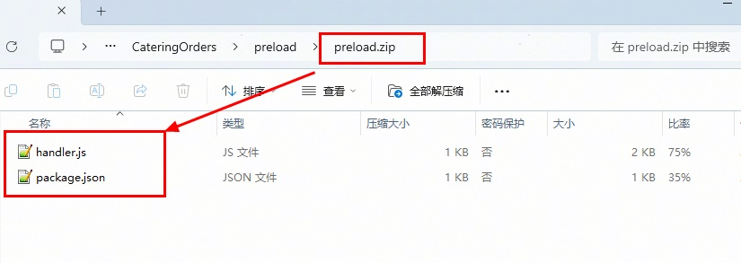
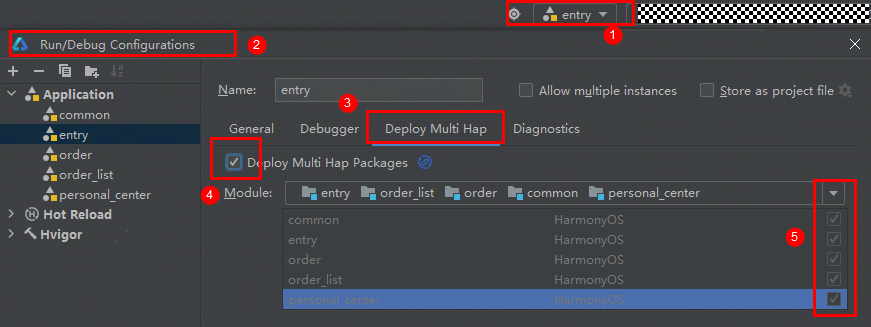
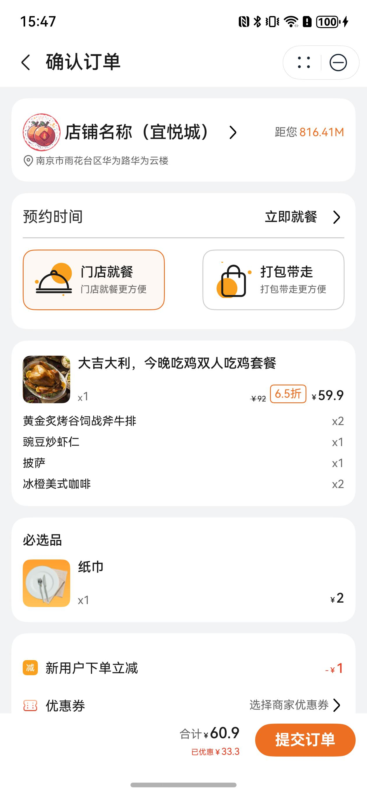

# 美食（点餐）元服务模板快速入门

## 目录

- [功能介绍](#功能介绍)
- [约束与限制](#约束与限制)
- [快速入门](#快速入门)
- [示例效果](#示例效果)
- [开源许可协议](#开源许可协议)

## 功能介绍

您可以基于此模板直接定制元服务，也可以挑选此模板中提供的多种组件使用，从而降低您的开发难度，提高您的开发效率。

此模板提供如下组件，所有组件存放在工程根目录的components下，如果您仅需使用组件，可参考对应组件的指导链接；如果您使用此模板，请参考本文档。

| 组件                       | 描述                    | 使用指导                                          |
|--------------------------|-----------------------|-----------------------------------------------|
| 点餐商品详情组件（goods_detail）   | 本组件提供了展示多种类型的点餐商品详情功能 | [使用指导](components/goods_detail/README.md)     |
| 钱包组件（my_wallet）          | 本组件提供了钱包充值和查看充值记录的功能  | [使用指导](components/my_wallet/README.md)        |
| 选择店铺组件（select_store）     | 本组件提供了店铺选择功能          | [使用指导](components/select_store/README.md)     |
| 超值加购组件（snack_sized_deal） | 本组件提供了下单时增加超值商品加购的功能  | [使用指导](components/snack_sized_deal/README.md) |

本模板为餐饮点餐类元服务提供了常用功能的开发样例，模板主要分点餐、订单和我的三大模块：

- 点餐：提供店铺、预约下单、优惠券、商品详情、购物车的展示，支持超值加购和提交订单。
- 订单：支持对不同状态下订单的管理。
- 我的：展示账号相关信息，支持钱包查看与充值、优惠券管理和积分展示，以及帮助中心。

本模板已集成预加载、华为账号、地图、华为支付、通话等服务，只需做少量配置和定制即可快速实现页面的快速加载、华为账号的登录、商家位置定位导航、购买餐饮和联系商家等功能。

| 点餐                                                                 | 订单                                                               | 我的                                                                |
|--------------------------------------------------------------------|------------------------------------------------------------------|-------------------------------------------------------------------|
|  |  |  |

本模板主要页面及核心功能清单如下所示：

```ts
餐饮点餐模板
 |-- 点餐
 |    |-- 店铺信息
 |    |    |-- 店铺选择
 |    |    |-- 店铺详情
 |    |    |-- 店铺位置和导航
 |    |    └-- 店铺电话
 |    |-- 优惠券
 |    |    |-- 店铺优惠
 |    |    └-- 优惠券列表
 |    |-- 商品列表
 |    |    |-- 搜索商品
 |    |    |-- 商品详情
 |    |    |-- 商品规格
 |    |    └-- 加入购物车
 |    |-- 购物车
 |    |    |-- 清空购物车
 |    |    |-- 修改购物车商品
 |    |    └-- 下单
 |    └-- 提交订单
 |         └-- 超值加购
 |         └-- 钱包支付
 |         └-- 订单提交
 |-- 订单列表
 |    └-- 订单详情
 |    └-- 订单支付
 └-- 我的
      |-- 用户信息
      |    |-- 修改头像
      |    └-- 关联解绑账号
      |-- 我的中心
      |    |-- 我的钱包
      |    |    |-- 钱包充值
      |    |    └-- 充值记录
      |    |-- 我的优惠券
      |    └-- 我的积分
      └-- 帮助中心
           |-- 常见问题
           └-- 客服电话
```

本模板工程代码结构如下所示：

```
CateringOrders
  ├─commons/common/src/main
  │  ├─ets
  │  │  ├─cardManager
  │  │  │      CardManager.ets                // 卡片管理
  │  │  │      EntryContext.ets               // 应用上下文
  │  │  │      SubscriberClass.ets            // 卡片公共事件
  │  │  ├─components
  │  │  │      NavHeaderBar.ets               // navigation页面抬头
  │  │  │      CommonConfirmDialog.ets        // 确认弹窗
  │  │  │      LoadingDialog.ets              // 加载中弹窗
  │  │  ├─constants
  │  │  │      Common.ets                     // 公共常量
  │  │  ├─mapper
  │  │  │      Index.ets                      // 数据映射
  │  │  ├─models
  │  │  │      RouterModel.ets                // 路由参数对象
  │  │  │      StorageModel.ets               // AppStorage参数对象
  │  │  │      TabBarModel.ets                // 底部导航栏对象
  │  │  └─utils
  │  │         AsWebRichText.ets              // asweb富文本展示
  │  │         Logger.ets                     // 日志方法
  │  │         PermissionUtil.ets             // 权限申请方法
  │  │         RouterModule.ets               // 路由工具方法
  │  │         Utils.ets                      // 公共方法
  │  └─resources
  ├─commons/network/src/main
  │  ├─ets
  │  │  ├─apis
  │  │  │      APIList.ets                    // 网络请求API
  │  │  │      AxiosHttp.ets                  // 网络请求封装
  │  │  │      AxiosModel.ets                 // 网络请求对象
  │  │  │      HttpRequest.ets                // 网络请求
  │  │  ├─constants
  │  │  │      Index.ets                      // 网络请求常量
  │  │  ├─mocks
  │  │  │  └─MockData
  │  │  │         Order.ets                   // 点餐mock数据
  │  │  │         Store.ets                   // 店铺mock数据
  │  │  │         User.ets                    // 用户mock数据
  │  │  │      AxiosMock.ets                  // mock请求
  │  │  │      RequestMock.ets                // mock API
  │  │  └─types
  │  │         Order.ets                      // 点餐抽象类
  │  │         Request.ets                    // 请求参数抽象类
  │  │         Response.ets                   // 响应参数抽象类
  │  │         Store.ets                      // 店铺抽象类
  │  │         User.ets                       // 用户抽象类
  │  └─resources
  │─components/base_ui/src/main   
  │  ├─ets
  │  │  ├─components
  │  │  │      BusinessTimeDialog.ets         // 店铺休息组件
  │  │  │      CallTelSheetBuilder.ets        // 拨号组件
  │  │  │      CouponCardComp.ets             // 优惠券组件
  │  │  │      OrderGoodsCard.ets             // 订单商品组件
  │  │  │      PayTypeDialog.ets              // 支付弹窗组件
  │  │  │      SheetHeaderComp.ets            // 半模态标题组件
  │  │  ├─constants
  │  │  │      Index.ets                      // 常量数据
  │  │  ├─models
  │  │  │      Index.ets                      // 数据类型
  │  │  └─utils
  │  │         Index.ets                      // 工具方法
  │─components/goods_detail/src/main   
  │  ├─ets
  │  │  ├─components
  │  │  │      GoodsDetail                    // 商品详情组件
  │  │  ├─constants
  │  │  │      Index.ets                      // 常量数据
  │  │  └─models
  │  │         Index.ets                     // 数据类型
  │─components/my_wallet/src/main   
  │  ├─ets
  │  │  ├─components
  │  │  │      MyWallet                       // 我的钱包组件
  │  │  │      RechargeRecordComp             // 充值记录组件
  │  │  ├─models
  │  │  │      Index.ets                      // 数据类型
  │  │  └─utils
  │  │         Logger.ets                     // 日志方法
  │─components/select_store/src/main   
  │  ├─ets
  │  │  ├─components
  │  │  │      HwMapComp                      // 华为地图组件
  │  │  │      SelectStore                    // 选择店铺组件
  │  │  │      StoreCard                      // 店铺卡片组件
  │  │  └─models
  │  │         Index.ets                      // 数据类型
  │─components/snack_sized_deal/src/main   
  │  ├─ets
  │  │  ├─components
  │  │  │      SnackSizedDeal                 // 超值加购组件
  │  │  ├─constants
  │  │  │      Index.ets                      // 常量数据
  │  │  └─models
  │  │         Index.ets                      // 数据类型
  │─features/order/src/main   
  │  ├─ets
  │  │  ├─api
  │  │  │      Index.ets                      // 接口请求封装
  │  │  ├─components
  │  │  │      CustomSelectDialog.ets         // 数据选择半模态弹窗
  │  │  │      GoodInfoComp.ets               // 商品信息组件
  │  │  │      MyCarComp.ets                  // 购物车组件
  │  │  │      MyCarListComp.ets              // 购物车列表组件
  │  │  │      OrderListComp.ets              // 订单内商品列表组件
  │  │  │      TitleComp.ets                  // 点餐标题栏组件
  │  │  ├─constants
  │  │  │      OrderConstant.ets              // 常量数据
  │  │  ├─mapper
  │  │  │      Index.ets                      // 数据映射
  │  │  ├─models
  │  │  │      Index.ets                      // 数据类型
  │  │  │      MustGoodsController.ets        // 必选品控制对象
  │  │  └─pages
  │  │         ConfirmOrderPage.ets           // 确认订单页面
  │  │         GoodDetailPage.ets             // 商品详情页面
  │  │         MerchantDetailPage.ets         // 店铺详情页面
  │  │         OrderPage.ets                  // 点餐页面
  │  │         PreviewImagePage.ets           // 图片预览页面
  │  │         RemarksPage.ets                // 添加备注页面
  │  │         SelectCouponPage.ets           // 选择优惠券页面
  │  │         SelectStorePage.ets            // 选择店铺页面
  │  │         SnackSizedDealPage.ets         // 超值加购页面
  │  └─resources
  │─features/order_list/src/main   
  │  ├─ets
  │  │  ├─api
  │  │  │      Index.ets                      // 接口请求封装
  │  │  ├─components
  │  │  │      ButtonListComp.ets             // 卡片按钮组件
  │  │  │      CommonTab.ets                  // 订单列表tab组件
  │  │  │      OrderCard.ets                  // 订单卡片组件
  │  │  │      OrderTypeComp.ets              // 订单详情顶部组件
  │  │  │      PaymentDetailsComp.ets         // 订单支付详情组件
  │  │  │      ReductionCardComp.ets          // 订单优惠详情组件
  │  │  │      StoreInfoCardComp.ets          // 商户卡片组件
  │  │  ├─mapper
  │  │  │      Index.ets                      // 数据映射
  │  │  ├─models
  │  │  │      Index.ets                      // 订单列表里的数据对象
  │  │  └─pages
  │  │         HwMapPage.ets                  // 商户位置页面
  │  │         OrderDetailPage.ets            // 订单详情页面
  │  │         OrderListPage.ets              // 订单列表页面
  │  └─resources
  │─features/personal_center/src/main   
  │  ├─ets
  │  │  ├─api
  │  │  │      Index.ets                      // 接口请求封装
  │  │  └─pages
  │  │         AnswerPage.ets                 // 常见问题页面
  │  │         FrequentQuestionPage.ets       // 问题答复页面
  │  │         MyCouponsPage.ets              // 我的优惠券页面
  │  │         MyWalletPage.ets               // 我的页面
  │  │         PersonalCenterPage.ets         // 我的钱包页面
  │  │         RechargeRecordPage.ets         // 钱包充值记录页面
  │  │         WalletTermsPage.ets            // 会员储值协议页面
  │  └─resources
  │─preload
  │      handler.js                           // 预加载函数
  │      package.json                         // 预加载函数信息
  └─products/phone/src/main   
     ├─ets
  │  │  ├─api
  │  │  │      Index.ets                      // 接口请求封装
     │  ├─components
     │  │      CustomTabBar.ets               // 自定义底部tab栏组件
     │  ├─entryability
     │  │      EntryAbility.ets               // 应用程序入口
     │  ├─entryformability
     │  │      EntryFormAbility.ets           // 卡片程序入口
  │  │  ├─mapper
  │  │  │      Index.ets                      // 数据映射
     │  ├─pages
     │  │      HomePage.ets                   // 主页面
     │  │      Index.ets                      // 入口页面
     │  └─widget/pages
     │         WidgetCard.ets                 // 卡片页面
     └─resources
```
## 约束与限制

### 环境

* DevEco Studio版本：DevEco Studio 5.0.4 Release及以上
* HarmonyOS SDK版本：HarmonyOS 5.0.4 Release SDK及以上
* 设备类型：华为手机（包括双折叠和阔折叠）
* 系统版本：HarmonyOS 5.0.4(16)及以上

### 权限要求

- 获取位置权限：ohos.permission.APPROXIMATELY_LOCATION、ohos.permission.LOCATION
- 网络权限：ohos.permission.INTERNET

## 快速入门

### 配置工程

在运行此模板前，需要完成以下配置：

1. 在AppGallery Connect创建元服务，将包名配置到模板中。

   a. 参考[创建元服务](https://developer.huawei.com/consumer/cn/doc/app/agc-help-create-atomic-service-0000002247795706)为元服务创建APP ID，并将APP ID与元服务进行关联。

   b. 返回应用列表页面，查看元服务的包名。

   c. 将模板工程根目录下AppScope/app.json5文件中的bundleName替换为创建元服务的包名。

2. 配置服务器域名。

   本模板接口均采用mock数据，由于元服务包体大小有限制，部分图片资源将从云端拉取，所以需为模板项目[配置服务器域名](https://developer.huawei.com/consumer/cn/doc/atomic-guides/agc-help-harmonyos-server-domain)，“httpRequest合法域名”需要配置为：`https://agc-storage-drcn.platform.dbankcloud.cn`

3. 配置华为账号服务。

   a. 将元服务的client ID配置到products/phone[entry]/src/main模块的[module.json5](./products/phone/src/main/module.json5)文件，详细参考：[配置Client ID](https://developer.huawei.com/consumer/cn/doc/atomic-guides/account-atomic-client-id)。

   b. 如需获取用户真实手机号，需要申请phone权限，详细参考：[配置scope权限](https://developer.huawei.com/consumer/cn/doc/atomic-guides/account-guide-atomic-permissions)。在端侧使用快速验证手机号码Button进行[验证获取手机号码](https://developer.huawei.com/consumer/cn/doc/atomic-guides/account-guide-atomic-get-phonenumber)。

4. [开通地图服务](https://developer.huawei.com/consumer/cn/doc/harmonyos-guides/map-config-agc)。

5. 配置支付服务。

   华为支付当前仅支持商户接入，在使用服务前，需要完成商户入网、开发服务等相关配置，本模板仅提供了端侧集成的示例。详细参考：[支付服务接入准备](https://developer.huawei.com/consumer/cn/doc/harmonyos-guides/payment-preparations)。

6. 配置预加载服务。

   a. [开通预加载](https://developer.huawei.com/consumer/cn/doc/harmonyos-guides/cloudfoundation-enable-prefetch)。

   b. [开通云函数](https://developer.huawei.com/consumer/cn/doc/harmonyos-guides/cloudfoundation-enable-function)。

   c. 打包云函数包：**进入工程preload目录**，将目录下的文件压缩为zip文件，zip压缩包内不能含有目录。

   

   d. [创建云函数](https://developer.huawei.com/consumer/cn/doc/harmonyos-guides/cloudfoundation-create-and-config-function)。

    * “函数名称”为“preload”
    * “触发方式”为“事件调用”
    * “触发器类型”为“HTTP触发器”，其他保持默认
    * “代码输入类型”为“*.zip文件”，代码文件上传上一步打包的zip文件

   e. [配置安装预加载](https://developer.huawei.com/consumer/cn/doc/harmonyos-guides/cloudfoundation-prefetch-config)：安装预加载函数名称配置为上一步创建的云函数

7. 对元服务进行[手工签名](https://developer.huawei.com/consumer/cn/doc/harmonyos-guides/ide-signing)。

8. 添加手工签名所用证书对应的公钥指纹。详细参考：[配置应用签名证书指纹](https://developer.huawei.com/consumer/cn/doc/app/agc-help-cert-fingerprint-0000002278002933)。

9. （可选）如果从应用自己服务器请求数据，需要配置服务器请求信息。

   a. 打开CateringOrders\network\src\main\ets\constants\Index.ets文件，将BASE_URL修改为请求服务器的地址。

   b. 打开CateringOrders\network\src\main\ets\apis\HttpRequest.ets文件，将config.params配置为请求中的固定参数列表。

### 运行调试工程

1. 连接调试手机和PC。

2. 配置多模块调试：由于本模板存在多个模块，运行时需确保所有模块安装至调试设备。

   a. 运行模块选择“entry”。

   b. 下拉框选择“Edit Configurations”，在“Run/Debug Configurations”界面，选择“Deploy Multi Hap”页签，勾选上模板中所有模块。
  
   

   c. 点击"Run"，运行模板工程。

## 示例效果

| 商品详情                                                             | 套餐详情                                                             | 确认订单                                                             |              
|------------------------------------------------------------------|------------------------------------------------------------------|------------------------------------------------------------------|
|  |  |  | 

## 开源许可协议

该代码经过[Apache 2.0 授权许可](http://www.apache.org/licenses/LICENSE-2.0)。
