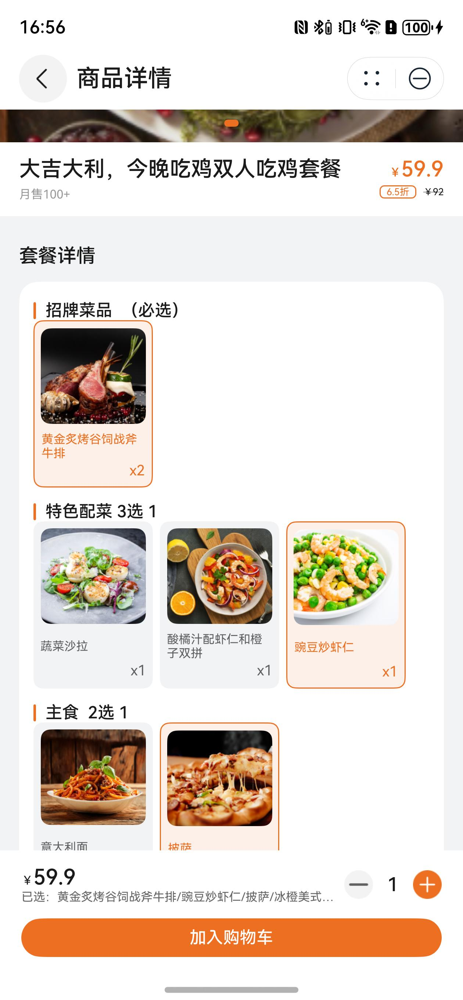

# 点餐商品详情组件快速入门

## 目录

- [简介](#简介)
- [约束与限制](#约束与限制)
- [使用](#使用)
- [API参考](#API参考)
- [示例代码](#示例代码)

## 简介

本组件提供了展示多种类型点餐商品详情的功能。

| 无规格商品                                                  | 选规格商品                                                  | 套餐商品                                                   |
|--------------------------------------------------------|--------------------------------------------------------|--------------------------------------------------------|
|  |  |  |

## 约束与限制

### 环境

* DevEco Studio版本：DevEco Studio 5.0.4 Release及以上
* HarmonyOS SDK版本：HarmonyOS 5.0.4 Release SDK及以上
* 设备类型：华为手机（包括双折叠和阔折叠）
* 系统版本：HarmonyOS 5.0.4(16)及以上

### 权限

- 网络权限：ohos.permission.INTERNET

## 使用

1. 安装组件。  
   如果是在DevEco Studio使用插件集成组件，则无需安装组件，请忽略此步骤。
   如果是从生态市场下载组件，请参考以下步骤安装组件。  
   a. 解压下载的组件包，将包中所有文件夹拷贝至您工程根目录的xxx目录下。  
   b. 在项目根目录build-profile.json5并添加goods_detail模块。

   ```typescript
   // 在项目根目录的build-profile.json5填写goods_detail路径。其中xxx为组件存在的目录名
   "modules": [
     {
       "name": "goods_detail",
       "srcPath": "./xxx/goods_detail",
     }
   ]
   ```

   c. 在项目根目录oh-package.json5中添加依赖

   ```typescript
   // xxx为组件存放的目录名称
   "dependencies": {
     "goods_detail": "file:./xxx/goods_detail"
   }
   ```

2. 引入组件。

   ```typescript
   import { GoodsDetail } from 'goods_detail';
   ```

3. 在主工程的src/main路径下的module.json5文件的requestPermissions字段中添加如下权限：

   ```typescript
     "requestPermissions": [
      ...
      {
        "name": "ohos.permission.INTERNET",
        "reason": "$string:app_name",
        "usedScene": {
          "abilities": [
            "FormAbility"
          ],
          "when": "inuse"
        }
      }
      ...
    ],
   ```
   
4. 调用组件，详细参数配置说明参见[API参考](#API参考)。

   ```typescript
     GoodsDetail({
       goodsInfo: this.goodsInfo,
       goodSpecList: this.goodSpecList,
       goodSinglePrice: this.goodSinglePrice,
       selectSpecArr: this.selectSpecArr,
       clickAddCarCb: (goodNum: number) => {
         // 点击添加购物车事件
       },
       getSelectSpec: (item: SpecItemResp, index: number) => {
         // 选择规格事件
       },
     })
   ```

## API参考

### 接口

GoodsDetail(options?: GoodsDetailOptions)

点餐商品详情组件。

**参数：**

| 参数名     | 类型                                            | 是否必填 | 说明       |
|---------|-----------------------------------------------|------|----------|
| options | [GoodsDetailOptions](#GoodsDetailOptions对象说明) | 是    | 点餐商品详情的参数。 |

### GoodsDetailOptions对象说明

| 名称              | 类型                                        | 是否必填 | 说明     |
|-----------------|-------------------------------------------|------|--------|
| goodsInfo       | [Goods](#Goods对象说明)                       | 是    | 商品信息   |
| goodSpecList    | [SpecCatalogResp](#SpecCatalogResp对象说明)[] | 否    | 规格信息   |
| selectSpecArr   | [PackageSpecResp](#PackageSpecResp对象说明)[] | 否    | 已选规格信息 |
| goodSinglePrice | number                                    | 否    | 规格商品单价 |

### Goods对象说明

| 名称       | 类型                                        | 是否必填 | 说明     |
|----------|-------------------------------------------|------|--------|
| id       | string                                    | 是    | 商品序号   |
| name     | string                                    | 是    | 商品名称   |
| logo     | string                                    | 是    | 商品图标   |
| bigImg   | string[]                                  | 是    | 商品大图   |
| money    | number                                    | 是    | 商品现价   |
| money2   | number                                    | 否    | 商品原价   |
| discount | string                                    | 否    | 商品折扣   |
| content  | string                                    | 是    | 商品介绍   |
| sales    | number                                    | 是    | 商品销售数量 |
| specType | number                                    | 否    | 商品类别   |
| details  | string                                    | 否    | 商品详情   |
| num      | number                                    | 否    | 商品数量   |
| isMust   | number                                    | 否    | 是否必选商品 |
| spec     | [SpecCatalogResp](#SpecCatalogResp对象说明)[] | 否    | 商品规格   |
| boxMoney | number                                    | 否    | 商品打包费  |

### SpecCatalogResp对象说明

| 名称        | 类型                                  | 必填 | 说明        |
|-----------|-------------------------------------|----|-----------|
| specId    | string                              | 是  | 规格序号      |
| specName  | string                              | 是  | 规格名称      |
| specValId | string                              | 是  | 规格内容默认值序号 |
| specVal   | [SpecItemResp](#SpecItemResp对象说明)[] | 是  | 规格内容      |

### SpecItemResp对象说明

| 名称          | 类型     | 是否必填 | 说明       |
|-------------|--------|------|----------|
| specValId   | string | 是    | 规格内容序号   |
| specValName | string | 是    | 规格内容值    |
| specValLogo | string | 否    | 套餐规格商品图标 |
| specValNum  | string | 否    | 套餐规格商品数量 |

### PackageSpecResp对象说明

| 名称       | 类型     | 是否必填 | 说明     |
|----------|--------|------|--------|
| specName | string | 是    | 规格内容   |
| specNum  | number | 是    | 规格内容数量 |

### 事件

支持以下事件：

#### clickAddCarCb

clickAddCarCb(callback: (goodNum: number) => void)

点击添加购物车事件

#### getSelectSpec

getSelectSpec(callback: (item: [SpecItemResp](#SpecItemResp对象说明), index: number) => void)

选择规格事件

## 示例代码

### 示例1（无规格商品）

本示例展示无规格商品详情页。

```typescript
import { Goods, GoodsDetail, GoodsSpecResp, PackageSpecResp, SpecCatalogResp, SpecItemResp } from 'goods_detail';
import { promptAction } from '@kit.ArkUI';

@Entry
@ComponentV2
struct Index {
   @Local goodsInfo: Goods = new Goods();
   @Local goodSpecList: Array<SpecCatalogResp> = [];
   @Local selectSpecArr: Array<PackageSpecResp> = [];
   @Local selectSpecInfo?: GoodsSpecResp = undefined;
   @Local goodSinglePrice: number = 0;

   aboutToAppear(): void {
      this.goodsInfo.id = '1'
      this.goodsInfo.name = '商品名称'
      this.goodsInfo.logo = 'CateringOrderTemplate/good_logo1.png';
      this.goodsInfo.bigImg = ['CateringOrderTemplate/good_logo1-1.png', 'CateringOrderTemplate/good_logo1-2.png',
         'CateringOrderTemplate/good_logo1-3.png']
      this.goodsInfo.money = 16.4
      this.goodsInfo.money2 = 16.4
      this.goodsInfo.content = '圆形奶油面包'
      this.goodsInfo.sales = 200
      this.goodsInfo.specType = 1
      this.goodsInfo.details = 'CateringOrderTemplate/good_logo1-1.png'
      this.goodsInfo.num = 200
      this.goodsInfo.isMust = 0
      this.goodsInfo.spec = []
      this.goodsInfo.boxMoney = 1
      this.goodsInfo.discount = ''
      this.goodSinglePrice = 16.4
   }

   build() {
      Column({ space: 20 }) {
         GoodsDetail({
            goodsInfo: this.goodsInfo,
            goodSpecList: this.goodSpecList,
            goodSinglePrice: this.goodSinglePrice,
            selectSpecArr: this.selectSpecArr,
            clickAddCarCb: (goodNum: number) => {
               promptAction.showToast({ message: '添加购物车~' })
            },
            getSelectSpec: (item: SpecItemResp, index: number) => {
               promptAction.showToast({ message: '切换规格查询~' })
            },
         })
      }
      .height('100%')
      .width('100%')
      .backgroundColor($r('sys.color.background_secondary'))
   }
}
```

### 示例2（有规格商品）

本示例展示有规格商品详情页。

```typescript
import { Goods, GoodsDetail, GoodsSpecResp, PackageSpecResp, SpecCatalogResp, SpecItemResp } from 'goods_detail';
import { promptAction } from '@kit.ArkUI';

@Entry
@ComponentV2
struct Index {
   @Local goodsInfo: Goods = new Goods();
   @Local goodSpecList: Array<SpecCatalogResp> = [];
   @Local selectSpecArr: Array<PackageSpecResp> = [];
   @Local selectSpecInfo?: GoodsSpecResp = undefined;
   @Local goodSinglePrice: number = 0;

   aboutToAppear(): void {
      this.goodsInfo.id = '1'
      this.goodsInfo.name = '商品名称'
      this.goodsInfo.logo = 'CateringOrderTemplate/good_logo1.png';
      this.goodsInfo.bigImg = ['CateringOrderTemplate/good_logo1-1.png', 'CateringOrderTemplate/good_logo1-2.png']
      this.goodsInfo.money = 16.4
      this.goodsInfo.money2 = 16.4
      this.goodsInfo.content = '圆形奶油面包'
      this.goodsInfo.sales = 200
      this.goodsInfo.specType = 2
      this.goodsInfo.details = 'CateringOrderTemplate/good_logo1-1.png'
      this.goodsInfo.num = 200
      this.goodsInfo.isMust = 0
      this.goodsInfo.spec = []
      this.goodsInfo.boxMoney = 1
      this.goodsInfo.discount = ''
      this.goodSinglePrice = 16.4

      this.goodSpecList =
      [{
         specId: '1',
         specName: '奶油',
         specValId: '11',
         specVal: [{
            specValId: '11',
            specValName: '动物奶油',
            specValLogo: '',
            specValNum: '1',
         }, {
            specValId: '12',
            specValName: '植物奶油',
            specValLogo: '',
            specValNum: '1',
         }],
      }, {
         specId: '2',
         specName: '糖类选择',
         specValId: '22',
         specVal: [{
            specValId: '21',
            specValName: '蔗糖',
            specValLogo: '',
            specValNum: '1',
         }, {
            specValId: '22',
            specValName: '赤鲜糖醇（0糖）',
            specValLogo: '',
            specValNum: '1',
         }],
      }, {
         specId: '3',
         specName: '尺寸',
         specValId: '31',
         specVal: [{
            specValId: '31',
            specValName: '6寸',
            specValLogo: '',
            specValNum: '1',
         }, {
            specValId: '32',
            specValName: '9寸',
            specValLogo: '',
            specValNum: '1',
         }, {
            specValId: '33',
            specValName: '12寸',
            specValLogo: '',
            specValNum: '1',
         }],
      }]
      this.goodsInfo.spec = this.goodSpecList

      this.selectSpecArr = this.goodSpecList.map((item: SpecCatalogResp) => {
         let goodSpec = item.specVal.find((spec: SpecItemResp) => item.specValId === spec.specValId);
         let result: PackageSpecResp =
            { specName: goodSpec?.specValName || '', specNum: Number(goodSpec?.specValNum ?? 1) };
         return result;
      });
   }

   build() {
      Column({ space: 20 }) {
         GoodsDetail({
            goodsInfo: this.goodsInfo,
            goodSpecList: this.goodSpecList,
            goodSinglePrice: this.goodSinglePrice,
            selectSpecArr: this.selectSpecArr,
            clickAddCarCb: (goodNum: number) => {
               promptAction.showToast({ message: '添加购物车~' })
            },
            getSelectSpec: (item: SpecItemResp, index: number) => {

               this.getSelectSpec(item, index)
            },
         })
      }
      .height('100%')
      .width('100%')
      .backgroundColor($r('sys.color.background_secondary'))
   }

   getSelectSpec(item: SpecItemResp, index: number) {
      let pkgSpec: PackageSpecResp = {
         specName: item.specValName,
         specNum: Number(item.specValNum),
      };
      this.selectSpecArr[index] = pkgSpec;
      promptAction.showToast({ message: '切换规格~' })
   }
}
```

### 示例3（套餐商品）

本示例展示套餐商品详情页。

```typescript
import { Goods, GoodsDetail, GoodsSpecResp, PackageSpecResp, SpecCatalogResp, SpecItemResp } from 'goods_detail';
import { promptAction } from '@kit.ArkUI';

@Entry
@ComponentV2
struct Index {
   @Local goodsInfo: Goods = new Goods();
   @Local goodSpecList: Array<SpecCatalogResp> = [];
   @Local selectSpecArr: Array<PackageSpecResp> = [];
   @Local selectSpecInfo?: GoodsSpecResp = undefined;
   @Local goodSinglePrice: number = 0;

   aboutToAppear(): void {
      this.goodsInfo.id = '1'
      this.goodsInfo.name = '商品名称'
      this.goodsInfo.logo = 'CateringOrderTemplate/good_logo1.png';
      this.goodsInfo.bigImg = ['CateringOrderTemplate/good_logo1-1.png', 'CateringOrderTemplate/good_logo1-2.png']
      this.goodsInfo.money = 16.4
      this.goodsInfo.money2 = 16.4
      this.goodsInfo.content = '圆形奶油面包'
      this.goodsInfo.sales = 200
      this.goodsInfo.specType = 3
      this.goodsInfo.details = 'CateringOrderTemplate/good_logo1-1.png'
      this.goodsInfo.num = 200
      this.goodsInfo.isMust = 0
      this.goodsInfo.spec = []
      this.goodsInfo.boxMoney = 1
      this.goodsInfo.discount = ''
      this.goodSinglePrice = 16.4

      this.goodSpecList =
      [{
         specId: '1',
         specName: '招牌菜品  （必选）',
         specValId: '11',
         specVal: [{
            specValId: '11',
            specValName: '黄金炙烤谷饲战斧牛排',
            specValLogo: 'CateringOrderTemplate/good_spec_logo1.png',
            specValNum: '2',
         }],
      }, {
         specId: '2',
         specName: '特色配菜 3选 1',
         specValId: '23',
         specVal: [{
            specValId: '21',
            specValName: '蔬菜沙拉',
            specValLogo: 'CateringOrderTemplate/good_spec_logo2.png',
            specValNum: '1',
         }, {
            specValId: '22',
            specValName: '酸橘汁配虾仁和橙子双拼',
            specValLogo: 'CateringOrderTemplate/good_spec_logo3.png',
            specValNum: '1',
         }, {
            specValId: '23',
            specValName: '豌豆炒虾仁',
            specValLogo: 'CateringOrderTemplate/good_spec_logo4.png',
            specValNum: '1',
         }],
      }, {
         specId: '3',
         specName: '主食  2选 1',
         specValId: '32',
         specVal: [{
            specValId: '31',
            specValName: '意大利面',
            specValLogo: 'CateringOrderTemplate/good_spec_logo5.png',
            specValNum: '2',
         }, {
            specValId: '32',
            specValName: '披萨',
            specValLogo: 'CateringOrderTemplate/good_spec_logo6.png',
            specValNum: '1',
         }],
      }, {
         specId: '4',
         specName: '甜品  4选 1',
         specValId: '43',
         specVal: [{
            specValId: '41',
            specValName: '蜂蜜柚子茶',
            specValLogo: 'CateringOrderTemplate/good_spec_logo7.png',
            specValNum: '1',
         }, {
            specValId: '42',
            specValName: '鲜榨果汁（口味备注，默认随机）...',
            specValLogo: 'CateringOrderTemplate/good_spec_logo8.png',
            specValNum: '2',
         }, {
            specValId: '43',
            specValName: '冰橙美式咖啡',
            specValLogo: 'CateringOrderTemplate/good_spec_logo9.png',
            specValNum: '2',
         }, {
            specValId: '44',
            specValName: '柠檬红茶',
            specValLogo: 'CateringOrderTemplate/good_spec_logo10.png',
            specValNum: '1',
         }],
      }]
      this.goodsInfo.spec = this.goodSpecList

      this.selectSpecArr = this.goodSpecList.map((item: SpecCatalogResp) => {
         let goodSpec = item.specVal.find((spec: SpecItemResp) => item.specValId === spec.specValId);
         let result: PackageSpecResp =
            { specName: goodSpec?.specValName || '', specNum: Number(goodSpec?.specValNum ?? 1) };
         return result;
      });
   }

   build() {
      Column({ space: 20 }) {
         GoodsDetail({
            goodsInfo: this.goodsInfo,
            goodSpecList: this.goodSpecList,
            goodSinglePrice: this.goodSinglePrice,
            selectSpecArr: this.selectSpecArr,
            clickAddCarCb: (goodNum: number) => {
               promptAction.showToast({ message: '添加购物车~' })
            },
            getSelectSpec: (item: SpecItemResp, index: number) => {

               this.getSelectSpec(item, index)
            },
         })
      }
      .height('100%')
      .width('100%')
      .padding({ top: 45 })
   }

   getSelectSpec(item: SpecItemResp, index: number) {
      let pkgSpec: PackageSpecResp = {
         specName: item.specValName,
         specNum: Number(item.specValNum),
      };
      this.selectSpecArr[index] = pkgSpec;
      promptAction.showToast({ message: '切换规格~' })
   }
}
```