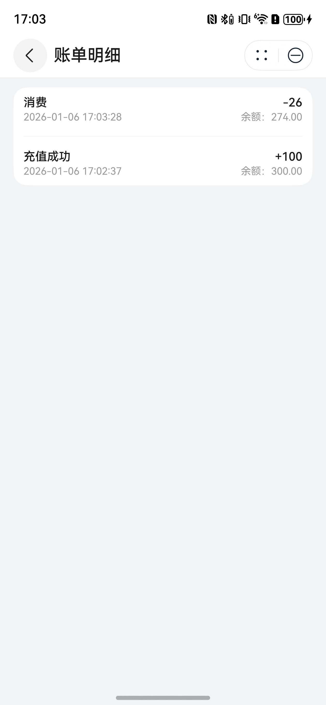

# 钱包组件快速入门

## 目录

- [简介](#简介)
- [约束与限制](#约束与限制)
- [使用](#使用)
- [API参考](#API参考)
- [示例代码](#示例代码)

## 简介

本组件提供了钱包充值和查看账单明细的功能，可以使用华为支付充值钱包并查看账单明细。

| 钱包充值                                                   | 账单明细                                                   |
|--------------------------------------------------------|--------------------------------------------------------|
|  |  |


## 约束与限制

### 环境

* DevEco Studio版本：DevEco Studio 5.0.4 Release及以上
* HarmonyOS SDK版本：HarmonyOS 5.0.4 Release SDK及以上
* 设备类型：华为手机（包括双折叠和阔折叠）
* 系统版本：HarmonyOS 5.0.4(16)及以上

### 权限

- 无

## 使用

1. 安装组件。  
   如果是在DevEco Studio使用插件集成组件，则无需安装组件，请忽略此步骤。
   如果是从生态市场下载组件，请参考以下步骤安装组件。  
   a. 解压下载的组件包，将包中所有文件夹拷贝至您工程根目录的xxx目录下。  
   b. 在项目根目录build-profile.json5并添加my_wallet模块。

   ```typescript
   // 在项目根目录的build-profile.json5填写my_wallet路径。其中xxx为组件存在的目录名
   "modules": [
     {
       "name": "my_wallet",
       "srcPath": "./xxx/my_wallet",
     }
   ]
   ```

   c. 在项目根目录oh-package.json5中添加依赖

   ```typescript
   // xxx为组件存放的目录名称
   "dependencies": {
     "my_wallet": "file:./xxx/my_wallet"
   }
   ```

2. 引入组件。

   ```typescript
   import { MyWallet, RechargeRecordComp } from 'my_wallet';
   ```

3. 调用组件，详细参数配置说明参见[API参考](#API参考)。

   ```typescript
   // 钱包充值页面
   MyWallet({
     wallet: this.userInfoModel.userInfo.wallet,
     rechargeTierList: this.rechargeTierList,
     selectTier: this.selectTier,
     goRechargeCb: (): void => RouterModule.push(RouterMap.RECHARGE_RECORD_PAGE),
     changeSelectCb: (selectTier: RechargeTier) => {
       // 切换充值金额档次
     },
     goWalletTermsCb: () => {
       // 跳转协议页面
     },
     goPayCb: () => {
       // 去付款
     },
   })
   // 账单明细
   RechargeRecordComp({ rechargeRecordList: this.rechargeRecordList })
   ```

## API参考

### 接口

MyWallet(options?: MyWalletOptions)

钱包充值组件。

**参数：**

| 参数名     | 类型                                      | 是否必填 | 说明       |
|---------|-----------------------------------------|------|----------|
| options | [MyWalletOptions](#MyWalletOptions对象说明) | 是    | 钱包充值的参数。 |

RechargeRecordComp(options?: RechargeRecordCompOptions)

账单明细组件。

**参数：**

| 参数名     | 类型                                                          | 是否必填 | 说明       |
|---------|-------------------------------------------------------------|------|----------|
| options | [RechargeRecordCompOptions](#RechargeRecordCompOptions对象说明) | 是    | 账单明细的参数。 |

### MyWalletOptions对象说明

| 名称               | 类型                                  | 是否必填 | 说明     |
|------------------|-------------------------------------|------|--------|
| wallet           | number                              | 是    | 钱包金额   |
| rechargeTierList | [RechargeTier](#RechargeTier对象说明)[] | 是    | 充值档次列表 |
| selectTier       | [RechargeTier](#RechargeTier对象说明)   | 否    | 已选充值档次 |

### RechargeRecordCompOptions对象说明

| 名称                 | 类型                                      | 是否必填 | 说明     |
|--------------------|-----------------------------------------|------|--------|
| rechargeRecordList | [RechargeRecord](#RechargeRecord对象说明)[] | 是    | 账单明细列表 |

### RechargeTier对象说明

| 名称        | 类型     | 是否必填 | 说明     |
|-----------|--------|------|--------|
| id        | string | 是    | 充值档次序号 |
| name      | string | 是    | 充值档次名称 |
| payMoney  | number | 是    | 付款金额   |
| realMoney | number | 是    | 充值金额   |
| desc      | string | 是    | 充值档次描述 |
| type      | number | 是    | 充值档次类型 |

### RechargeRecord对象说明

| 名称            | 类型     | 是否必填 | 说明                |
|---------------|--------|------|-------------------|
| id            | string | 是    | 充值档次序号            |
| recordType    | number | 是    | 金额变动类型 1：充值  2：消费 |
| rechargeMoney | number | 是    | 充值金额              |
| balance       | number | 是    | 当前余额              |
| time          | number | 是    | 充值时间              |

### 事件

支持以下事件：

#### goRechargeCb

goRechargeCb(callback: () => void)

跳转账单明细页面

#### changeSelectCb

changeSelectCb(callback: (selectTier: [RechargeTier](#RechargeTier对象说明)) => void)

切换充值金额档次

#### goWalletTermsCb

goWalletTermsCb(callback: () => void)

跳转协议页面

#### goPayCb

goPayCb(callback: () => void)

去付款

## 示例代码

### 示例1（钱包充值）

本示例展示钱包充值页面。

```typescript
import { MyWallet, RechargeTier } from 'my_wallet';

@Entry
@ComponentV2
struct Index {
   @Local rechargeTierList: Array<RechargeTier> = [];
   @Local selectTier: RechargeTier = new RechargeTier()

   aboutToAppear(): void {
      this.rechargeTierList = [{
         id: '1',
         name: '满100减10',
         payMoney: 90,
         realMoney: 100,
         desc: '满100减10',
         type: 1,
      }, {
         id: '2',
         name: '满200减50',
         payMoney: 150,
         realMoney: 200,
         desc: '满200减50',
         type: 1,
      }, {
         id: '3',
         name: '满300减80',
         payMoney: 220,
         realMoney: 300,
         desc: '满300减80',
         type: 1,
      }, {
         id: '4',
         name: '满500减100',
         payMoney: 400,
         realMoney: 500,
         desc: '满500减100',
         type: 1,
      }]
   }

   build() {
      Column({ space: 20 }) {
         MyWallet({
            wallet: 200,
            rechargeTierList: this.rechargeTierList,
            selectTier: this.selectTier,
            goRechargeCb: (): void => {
               this.getUIContext().getPromptAction().showToast({ message: '跳转账单明细页面' })
            },
            changeSelectCb: (selectTier: RechargeTier) => {
               this.selectTier = selectTier
            },
            goWalletTermsCb: () => {
               this.getUIContext().getPromptAction().showToast({ message: '跳转协议页面' })
            },
            goPayCb: () => {
               this.getUIContext().getPromptAction().showToast({ message: '去支付' })
            },
         })
      }
      .height('100%')
      .width('100%')
      .padding(16)
      .backgroundColor($r('sys.color.background_secondary'))
   }
}
```

### 示例2（账单明细）

本示例展示钱包钱包页面。

```typescript
import { RechargeRecord, RechargeRecordComp, RechargeTier } from 'my_wallet';

@Entry
@ComponentV2
struct Index {
   @Local rechargeRecordList: Array<RechargeRecord> = [];
   @Local selectTier: RechargeTier = new RechargeTier()

   aboutToAppear(): void {
      for (let index = 0; index < 10; index++) {
         let record: RechargeRecord = {
            id: `${index}`,
            recordType: index % 2 + 1,
            rechargeMoney: index * 100,
            balance: index * 100,
            time: new Date().getTime(),
         }
         this.rechargeRecordList.push(record)
      }
   }
   
   build() {
      Column({ space: 20 }) {
         RechargeRecordComp({ rechargeRecordList: this.rechargeRecordList })
            .height('100%')
            .width('100%')
            .padding(16)
            .backgroundColor($r('sys.color.background_secondary'))
      }
      .padding({ top: 45 })
   }
}
```