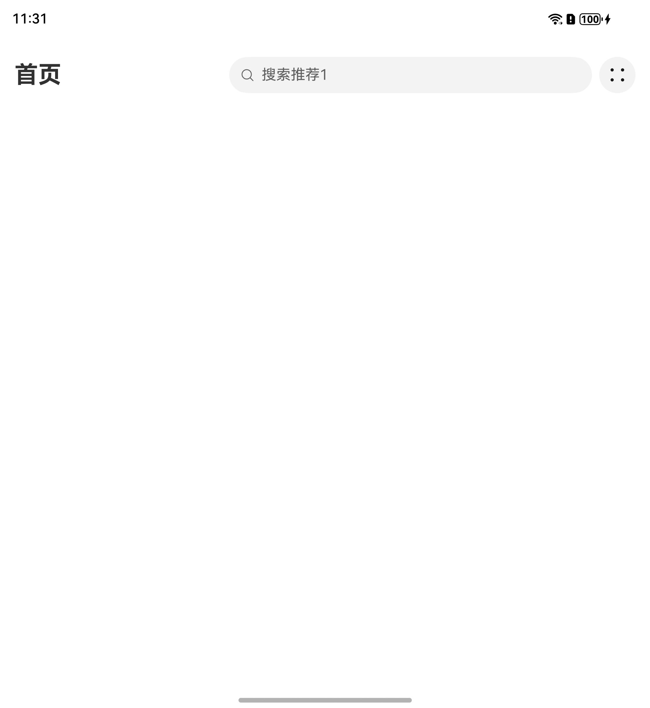
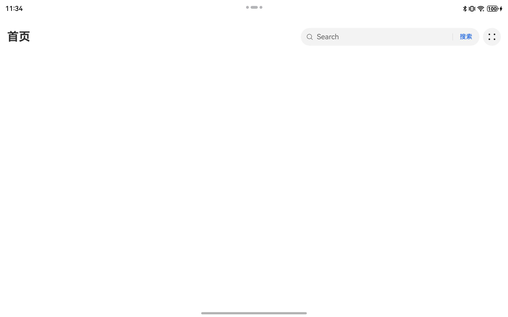
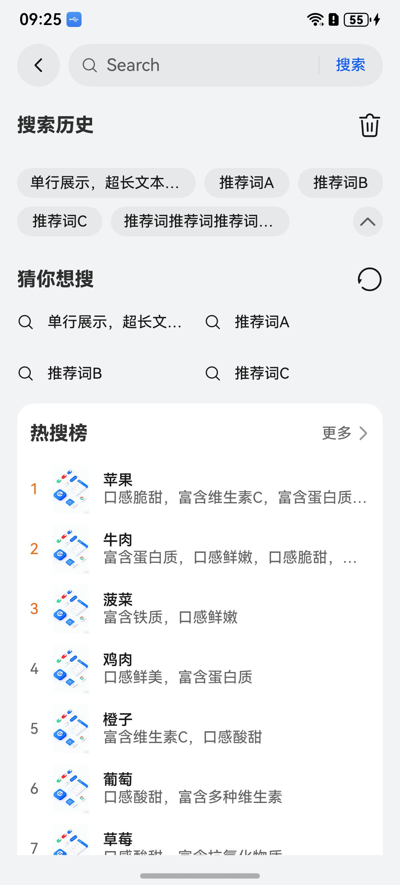
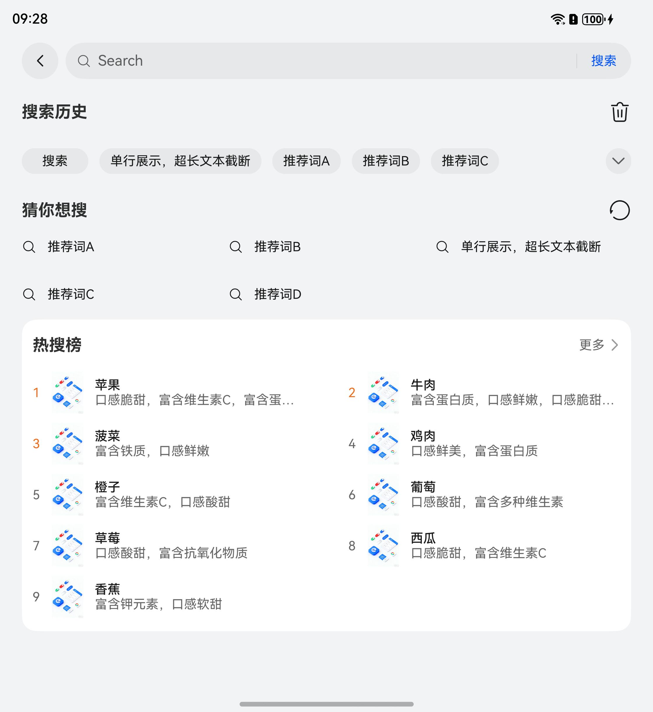
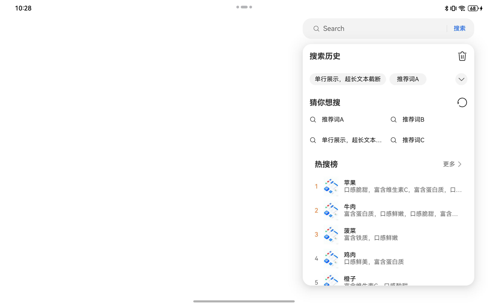
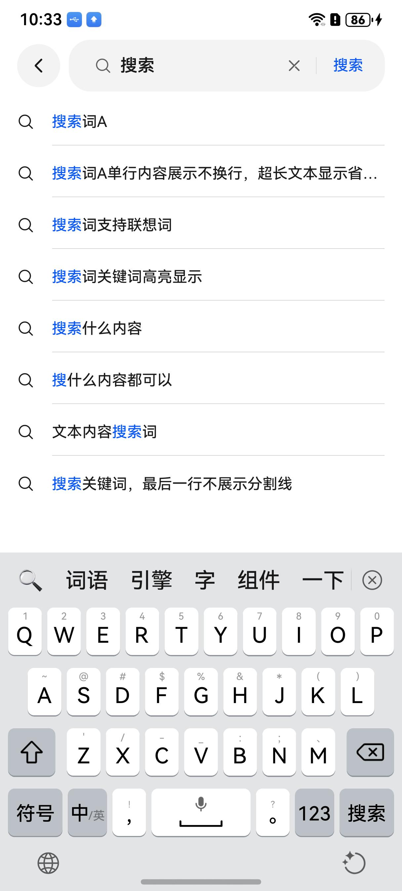
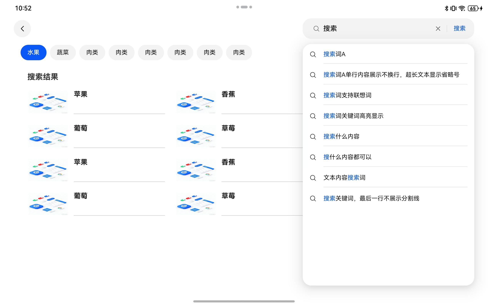
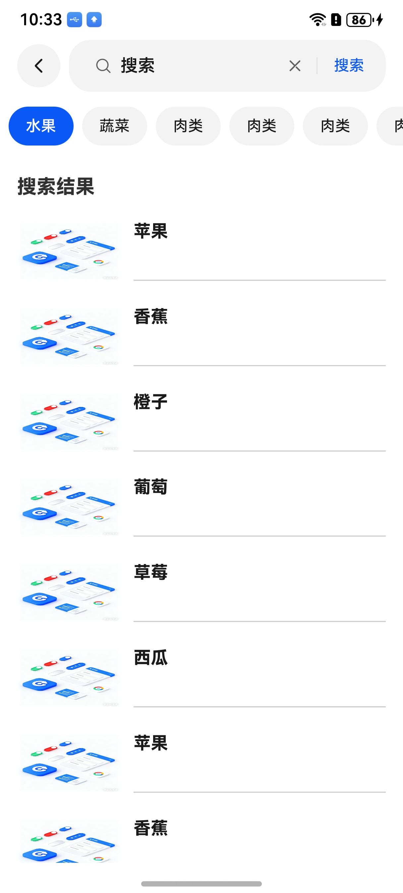
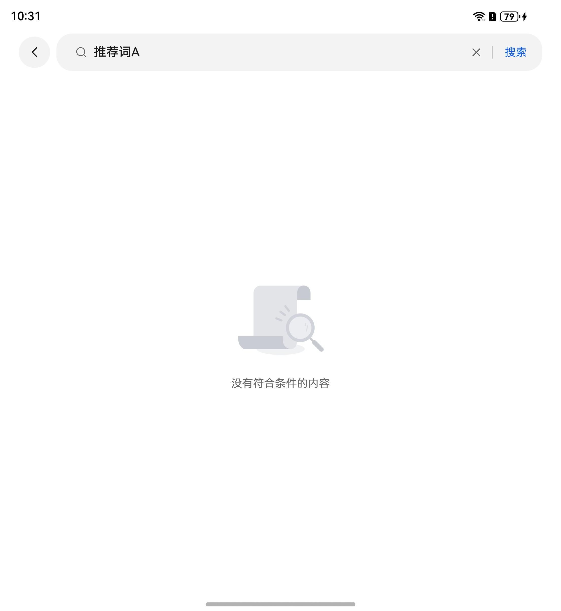
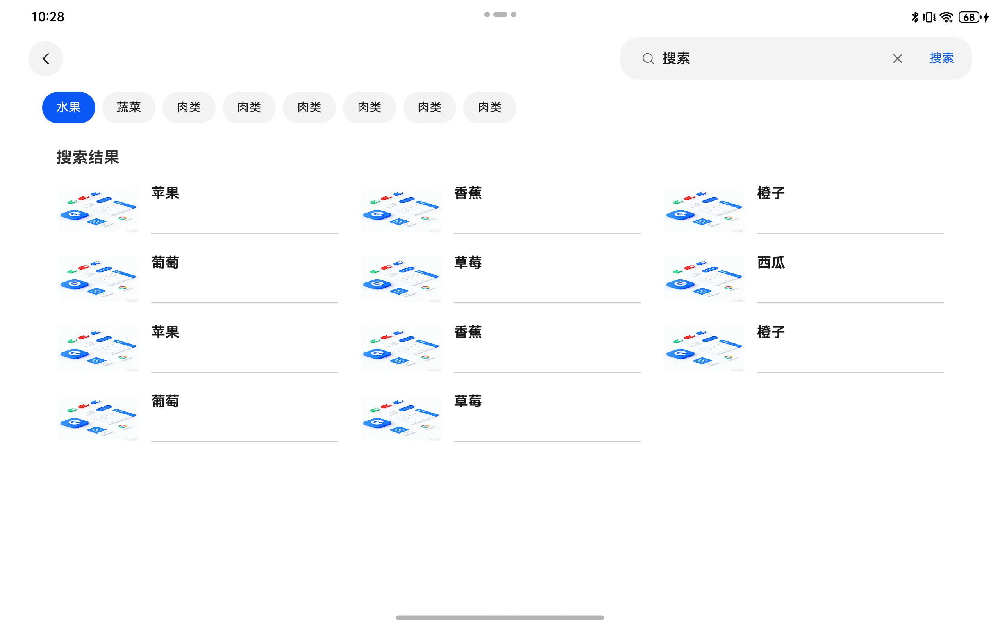

# 通用搜索组件快速入门

## 目录

- [简介](#简介)
- [约束与限制](#约束与限制)
- [使用](#使用)
- [API参考](#API参考)
- [示例代码](#示例代码)

## 简介

本组件提供了搜索功能，包括搜索历史，可选的猜你想搜和热搜榜，搜索联想，搜索结果，支持一多适配，平板提供可选的浅层窗口模式。

<div style='overflow-x:auto'>
  <table style='min-width:800px'>
    <tr>
      <th></th>
      <th>直板机</th>
      <th>折叠屏</th>
      <th>平板（浅层窗口）</th>
    </tr>
    <tr>
      <th scope='row'>搜索入口</th>
      <td valign='top'></td>
      <td valign='top'></td>
      <td valign='top'></td>
    </tr>
    <tr>
      <th scope='row'>搜索首页</th>
      <td valign='top'></td>
      <td valign='top'></td>
      <td valign='top'></td>
    </tr>
    <tr>
      <th scope='row'>搜索联想</th>
      <td valign='top'></td>
      <td valign='top'></td>
      <td valign='top'></td>
    </tr>
    <tr>
      <th scope='row'>搜索结果</th>
      <td valign='top'></td>
      <td valign='top'></td>
      <td valign='top'></td>
    </tr>
  </table>
</div>

## 约束与限制

### 环境

- DevEco Studio版本：DevEco Studio 5.0.5 Release及以上
- HarmonyOS SDK版本：HarmonyOS 5.0.5 Release SDK及以上
- 设备类型：华为手机（包括双折叠和阔折叠）、华为平板
- 系统版本：HarmonyOS 5.0.0(12) 及以上
- 
### 权限

- 无

## 使用

1. 安装组件。

   如果是在DevEco Studio使用插件集成组件，则无需安装组件，请忽略此步骤。

   如果是从生态市场下载组件，请参考以下步骤安装组件。

   a. 解压下载的组件包，将包中所有文件夹拷贝至您工程根目录的XXX目录下。

   b. 在项目根目录build-profile.json5添加search模块。

    ```
    // 在项目根目录build-profile.json5填写search路径。其中XXX为组件存放的目录名
    "modules": [
        {
        "name": "search",
        "srcPath": "./XXX/search",
        }
    ]
    ```
   c. 在项目根目录oh-package.json5中添加依赖。
    ```
    // XXX为组件存放的目录名称
    "dependencies": {
      "search": "file:./XXX/search"
    }
    ```

2. 引入搜索组件句柄。

   ```
   import { PresentationType, SearchItem, SearchView, SearchViewController } from 'search';
   ```

3. 调用组件，详细参数配置说明参见[API参考](#API参考)。

## API参考

### 接口

SearchView(options?: SearchOptions)

搜索组件。

**参数：**

| 参数名     | 类型                                  | 是否必填 | 说明     |
|:--------|:------------------------------------|:-----|:-------|
| options | [SearchOptions](#SearchOptions对象说明) | 是    | 搜索组件参数 |

### SearchOptions对象说明

| 参数名                        | 类型                                                                                                                                                                                                   | 是否必填 | 说明                                                                                |
|:---------------------------|:-----------------------------------------------------------------------------------------------------------------------------------------------------------------------------------------------------|:-----|:----------------------------------------------------------------------------------|
| routerStack                | [NavPathStack](https://developer.huawei.com/consumer/cn/doc/harmonyos-references/ts-basic-components-navigation#navpathstack10)                                                                      | 是    | 当前组件所在路由栈，用于管理导航路径                                                                |
| controller                 | [SearchViewController](#SearchViewController类型说明)                                                                                                                                                    | 是    | 搜索视图控制器                                                                           |
| presentationType           | [PresentationType](#PresentationType枚举说明)                                                                                                                                                            | 否    | 非浅层窗口模式下入口页的搜索入口展示形态，默认值为PresentationType.SEARCH_ICON                             |
| entranceText               | string[]                                                                                                                                                                                             | 否    | 非浅层窗口模式下入口页的搜索框的提示文本，将循环展示参数的内容，默认值为 \['Search']，浅层窗口模式下搜索框的提示文本即为`placeholder`的值 |
| placeholder                | string[]                                                                                                                                                                                             | 否    | 搜索框的提示文本，将循环展示参数的内容，默认值为 \['Search']                                              |
| themeColor                 | [ResourceColor](https://developer.huawei.com/consumer/cn/doc/harmonyos-references/ts-types#resourcecolor)                                                                                            | 否    | 设置主题颜色，默认值为 '#0A59F7'                                                             |
| showFilterTag              | boolean                                                                                                                                                                                              | 否    | 是否显示过滤标签，默认为true                                                                  |
| showGuessLike              | boolean                                                                                                                                                                                              | 否    | 是否显示猜你喜欢，默认为true                                                                  |
| showHotSearch              | boolean                                                                                                                                                                                              | 否    | 是否显示热门搜索，默认为true                                                                  |
| isShallowWindow            | boolean                                                                                                                                                                                              | 否    | 平板设备时是否设置为浅层窗口模式，默认为false                                                         |
| tabBarScroller             | Scroller                                                                                                                                                                                             | 否    | 搜索标签滚动控制器                                                                         |
| searchResultScroller       | Scroller                                                                                                                                                                                             | 否    | 搜索结果内容滚动控制器                                                                       |
| suggestionItemBuilderParam | [WrappedBuilder](https://developer.huawei.com/consumer/cn/doc/harmonyos-guides/arkts-wrapbuilder)<\[string, number\]>                                                                                | 否    | 搜索联想项的构建函数，注：wrapBuilder方法只能传入全局@Builder方法                                        |
| guessItemBuilderParam      | [WrappedBuilder](https://developer.huawei.com/consumer/cn/doc/harmonyos-guides/arkts-wrapbuilder)<\[string\]>                                                                                        | 否    | 猜你喜欢项的构建函数，注：wrapBuilder方法只能传入全局@Builder方法                                        |
| hotItemBuilderParam        | [WrappedBuilder](https://developer.huawei.com/consumer/cn/doc/harmonyos-guides/arkts-wrapbuilder)<\[[SearchItem](#SearchItem类型说明), number\]>                                                         | 否    | 热搜榜的构建函数，注：wrapBuilder方法只能传入全局@Builder方法                                          |
| resultItemBuilderParam     | [WrappedBuilder](https://developer.huawei.com/consumer/cn/doc/harmonyos-guides/arkts-wrapbuilder)<\[[SearchItem](#SearchItem类型说明)\]>                                                                 | 否    | 搜索结果项的构建函数，注：wrapBuilder方法只能传入全局@Builder方法                                        |
| handleSearch               | (keyWord: string \| [SearchWordItem](#SearchWordItem类型说明) \| [SearchItem](#SearchItem类型说明), searchSource: [SearchSource](#SearchSource枚举说明)) => Promise<[FilterTagAndList](#FilterTagAndList类型说明)[]> | 否    | 获取搜索结果，默认值为SearchApis.getSearchResultsList                                        |
| searchSuggestion           | (keyWord: string) => Promise<[[SearchWordItem](#SearchItem类型说明)[], string[]]>                                                                                                                        | 否    | 获取搜索联想，默认值为`SearchApis.getSearchSuggestion`                                       |
| onClickGetMore             | () => void                                                                                                                                                                                           | 否    | 获取热搜榜更多内容                                                                         |
| onClickResultItem          | (listItem: [SearchItem](#SearchItem类型说明)) => void                                                                                                                                                    | 否    | 处理点击搜索结果项                                                                         |
| queryHistoryList           | () => Promise<[SearchWordItem](#SearchItem类型说明)[]>                                                                                                                                                   | 否    | 获取历史搜索列表，默认值为`SearchApis.getHistoryList`                                          |
| deleteHistoryList          | () => Promise<[SearchWordItem](#SearchItem类型说明)[]>                                                                                                                                                   | 否    | 获取点击删除后的历史搜索列表，默认值为`SearchApis.deleteHistoryList`                                 |
| queryGuessList             | () => Promise<[SearchWordItem](#SearchItem类型说明)[]>                                                                                                                                                   | 否    | 获取猜你想搜列表，默认值为`SearchApis.getGuessLikeList`                                        |
| queryHotSearchList         | () => Promise<[SearchItem](#SearchItem类型说明)[]>                                                                                                                                                       | 否    | 获取热搜榜列表，默认值为`SearchApis.getHotSearchList`                                         |
| onWillJump                 | () => void                                                                                                                                                                                           | 否    | 页面跳转前事件处理                                                                         |

### SearchViewController类型说明

| 参数名           | 类型            | 是否必填 | 说明                   |
|:--------------|:--------------|:-----|:---------------------|
| onBackPressed | () => boolean | 否    | 返回逻辑函数，侧滑返回触发清空搜索框内容 |
| closePop      | () => void    | 否    | 关闭弹窗函数，在父组件绑定函数可关闭弹窗 |

### PresentationType枚举说明

| 名称          | 值 | 说明                          |
|:------------|:--|:----------------------------|
| SEARCH_BOX  | 0 | 有提示文本的搜索框                   |
| SEARCH_ICON | 1 | 圆形搜索图标，此时`entranceText`参数无效 |

### SearchWordItem类型说明

| 名称        | 类型               | 是否必填 | 说明   |
|:----------|:-----------------|:-----|:-----|
| content   | string           | 是    | 词条内容 |
| id        | number \| string | 是    | 词条id |

### SearchItem类型说明

| 名称          | 类型                          | 是否必填 | 说明     |
|:------------|:----------------------------|:-----|:-------|
| title       | string                      | 是    | 标题     |
| index       | string                      | 否    | 索引     |
| id          | number \| string            | 否    | id     |
| image       | ResourceStr                 | 否    | 图片资源   |
| hotRate     | number                      | 否    | 热度评分   |
| intro       | string                      | 否    | 简介     |
| subTitle    | string                      | 否    | 子标题    |
| price       | number                      | 否    | 价格     |
| vipPrice    | number                      | 否    | 会员价    |
| soldNum     | number                      | 否    | 售出数量   |
| type        | string                      | 否    | 类型     |
| classId     | string                      | 否    | 分类ID   |
| subIndex    | number                      | 否    | 辅助标记索引 |
| store       | [StoreInfo](#StoreInfo对象说明) | 否    | 店铺信息   |
| packageName | string                      | 否    | 包名     |

### StoreInfo对象说明

| 名称             | 类型      | 是否必填 | 说明       |
|----------------|---------|------|----------|
| id             | string  | 是    | 店铺序号     |
| name           | string  | 是    | 店铺名称     |
| address        | string  | 是    | 店铺地址     |
| time1          | string  | 是    | 店铺营业开始时间 |
| time2          | string  | 是    | 店铺营业结束时间 |
| tel            | string  | 是    | 店铺电话     |
| logo           | string  | 是    | 店铺图标     |
| coordinates    | string  | 是    | 店铺位置     |
| distance       | number  | 是    | 店铺距离     |
| distanceStr    | string  | 是    | 店铺距离字符串  |

### SearchSource枚举说明

| 名称         | 值 | 说明   |
|:-----------|:--|:-----|
| USER_INPUT | 0 | 用户输入 |
| HISTORY    | 1 | 历史搜索 |
| RECOMMEND  | 2 | 猜你想搜 |
| HOT_SEARCH | 3 | 热搜榜  |
| SUGGESTION | 4 | 联想词条 |

### FilterTagAndList类型说明

| 参数名      | 类型                              | 是否必填 | 说明           |
|:---------|:--------------------------------|:-----|--------------|
| label    | string                          | 是    | 过滤标签         |
| id       | string                          | 是    | id           |
| itemList | [SearchItem](#SearchItem类型说明)[] | 是    | 该标签下的搜索结果项列表 |


### SearchApis

搜索功能相关的API服务，获取纯端mock数据。

#### static getHistoryList(): Promise<SearchWordItem[]>

获取搜索历史记录列表。

#### static addHistoryList(historyWord: string, searchId?: number | string): Promise<void>

添加搜索记录到历史记录列表中。

#### static deleteHistoryList(): Promise<SearchWordItem[]>

清空搜索历史记录列表。

#### static getGuessLikeList(): Promise<SearchWordItem[]>

获取推荐搜索列表，列表内容会根据刷新次数交替变化。

#### static getHotSearchList(): Promise<SearchItem[]>

获取热门搜索列表。

#### static getSearchResultsList(value: string | SearchWordItem | SearchItem, searchSource: SearchSource): Promise<FilterTagAndList[]>

根据搜索内容获取搜索结果列表，仅在搜索关键词为'搜索'时有搜索结果内容。

#### static getSearchSuggestion(value: string): Promise<[SearchWordItem[], string[]]>

根据输入内容获取搜索联想列表。

#### static static _simulateDelay<T>(data: T, delay: number = 200): Promise<T>

模拟网络延迟，返回一个延迟的Promise。

## 示例代码

```
import { PresentationType, SearchItem, SearchView, SearchViewController } from 'search';

@Entry
@ComponentV2
struct Index {
  @Local navPathStack: NavPathStack = new NavPathStack();
  @Local breakpoint: string = '';
  controller: SearchViewController = new SearchViewController();

  onBackPress(): boolean | void {
    return this.controller.onBackPressed();
  }

  build() {
    Navigation(this.navPathStack) {
      GridRow({ columns: 1 }) {
        GridCol({ span: 1 }) {
          Row() {
            Text('首页').fontSize(26).fontWeight(700).height(40)
            Blank().layoutWeight(1)
            Row({ space: 10 }) {
              SearchView({
                presentationType: this.breakpoint === 'sm' ? PresentationType.SEARCH_ICON : PresentationType.SEARCH_BOX,
                entranceText: ['搜索推荐1', '搜索推荐2', '搜索推荐3'],
                routerStack: this.navPathStack,
                controller: this.controller,
                isShallowWindow: true,
                onClickGetMore: () => {
                  this.getUIContext().getPromptAction().showToast({ message: '前往更多页，暂未开发' })
                },
                onClickResultItem: (listItem: SearchItem) => {
                  this.getUIContext().getPromptAction().showToast({ message: '前往详情页，暂未开发' })
                },
              })
              Button({ type: ButtonType.Circle }) {
                SymbolGlyph($r('sys.symbol.dot_grid_2x2')).fontSize(24)
              }
              .width(40).height(40).backgroundColor($r('sys.color.comp_background_tertiary'))
            }
          }
          .height('100%')
          .width('100%')
          .padding(16)
          .alignItems(VerticalAlign.Top)
          .onClick(() => {
            this.controller.closePop();
          })
        }
      }
      .onBreakpointChange((bp) => {
        this.breakpoint = bp;
      })
    }
    .hideTitleBar(true)
    .mode(NavigationMode.Stack)
  }
}
```
