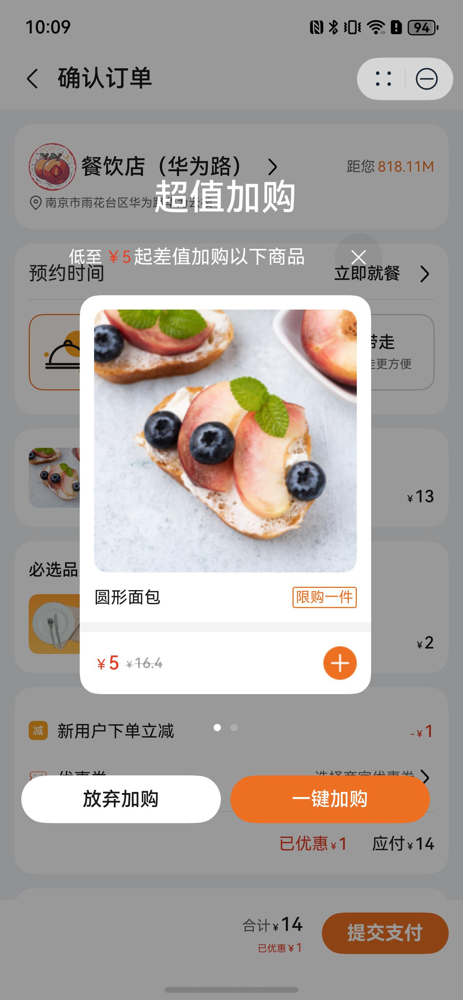

# 超值加购组件快速入门

## 目录

- [简介](#简介)
- [约束与限制](#约束与限制)
- [使用](#使用)
- [API参考](#API参考)
- [示例代码](#示例代码)

## 简介

本组件提供了下单时增加超值商品加购的功能。



## 约束与限制

### 环境

* DevEco Studio版本：DevEco Studio 5.0.4 Release及以上
* HarmonyOS SDK版本：HarmonyOS 5.0.4 Release SDK及以上
* 设备类型：华为手机（包括双折叠和阔折叠）
* 系统版本：HarmonyOS 5.0.4(16)及以上

### 权限

- 网络权限：ohos.permission.INTERNET

## 使用

1. 安装组件。  
   如果是在DevEco Studio使用插件集成组件，则无需安装组件，请忽略此步骤。
   如果是从生态市场下载组件，请参考以下步骤安装组件。  
   a. 解压下载的组件包，将包中所有文件夹拷贝至您工程根目录的xxx目录下。  
   b. 在项目根目录build-profile.json5并添加snack_sized_deal模块。

   ```typescript
   // 在项目根目录的build-profile.json5填写snack_sized_deal路径。其中xxx为组件存在的目录名
   "modules": [
     {
       "name": "snack_sized_deal",
       "srcPath": "./xxx/snack_sized_deal",
     }
   ]
   ```

   c. 在项目根目录oh-package.json5中添加依赖

   ```typescript
   // xxx为组件存放的目录名称
   "dependencies": {
     "snack_sized_deal": "file:./xxx/snack_sized_deal"
   }
   ```

2. 引入组件。

   ```typescript
   import { SnackSizedDeal } from 'snack_sized_deal';
   ```

3. 在主工程的src/main路径下的module.json5文件的requestPermissions字段中添加如下权限：

   ```typescript
     "requestPermissions": [
      ...
      {
        "name": "ohos.permission.INTERNET",
        "reason": "$string:app_name",
        "usedScene": {
          "abilities": [
            "FormAbility"
          ],
          "when": "inuse"
        }
      }
      ...
    ],
   ```

4. 调用组件，详细参数配置说明参见[API参考](#API参考)。

   ```typescript
   SnackSizedDeal({
     goodsList: this.goodsList,
     closeDialog: (addGoodsList?: Goods[]) => {
       this.closeDialog(addGoodsList)
     },
   })
   ```

## API参考

### 接口

SnackSizedDeal(options?: SnackSizedDealOptions)

超值加购组件。

**参数：**

| 参数名     | 类型                                                  | 是否必填 | 说明       |
|---------|-----------------------------------------------------|------|----------|
| options | [SnackSizedDealOptions](#SnackSizedDealOptions对象说明) | 是    | 超值加购的参数。 |

### SnackSizedDealOptions对象说明

| 名称        | 类型                    | 是否必填 | 说明   |
|-----------|-----------------------|------|------|
| goodsList | [Goods](#Goods对象说明)[] | 是    | 商品信息 |

### Goods对象说明

| 名称       | 类型                                        | 是否必填 | 说明     |
|----------|-------------------------------------------|------|--------|
| id       | string                                    | 是    | 商品序号   |
| name     | string                                    | 是    | 商品名称   |
| logo     | string                                    | 是    | 商品图标   |
| bigImg   | string[]                                  | 是    | 商品大图   |
| money    | number                                    | 是    | 商品现价   |
| money2   | number                                    | 是    | 商品原价   |
| discount | string                                    | 否    | 商品折扣   |
| content  | string                                    | 是    | 商品介绍   |
| sales    | number                                    | 是    | 商品销售数量 |
| specType | number                                    | 否    | 商品类别   |
| details  | string                                    | 否    | 商品详情   |
| num      | number                                    | 否    | 商品数量   |
| isMust   | number                                    | 否    | 是否必选商品 |
| spec     | [SpecCatalogResp](#SpecCatalogResp对象说明)[] | 否    | 商品规格   |
| boxMoney | number                                    | 否    | 商品打包费  |

### SpecCatalogResp对象说明

| 名称        | 类型                                  | 必填 | 说明        |
|-----------|-------------------------------------|----|-----------|
| specId    | string                              | 是  | 规格序号      |
| specName  | string                              | 是  | 规格名称      |
| specValId | string                              | 是  | 规格内容默认值序号 |
| specVal   | [SpecItemResp](#SpecItemResp对象说明)[] | 是  | 规格内容      |

### SpecItemResp对象说明

| 名称          | 类型     | 是否必填 | 说明       |
|-------------|--------|------|----------|
| specValId   | string | 是    | 规格内容序号   |
| specValName | string | 是    | 规格内容值    |
| specValLogo | string | 否    | 套餐规格商品图标 |
| specValNum  | string | 否    | 套餐规格商品数量 |

### 事件

支持以下事件：

#### closeDialog

closeDialog(callback: (addGoodsList: [Goods](#Goods对象说明)[]) => void)

关闭弹窗回调事件

## 示例代码

```typescript
import { Goods, SnackSizedDeal } from 'snack_sized_deal';

@Entry
@ComponentV2
struct Index {
   @Local goodsList: Goods[] = [];

   aboutToAppear(): void {
      const goods1: Goods = {
         id: '1',
         name: '圆形面包',
         logo: 'CateringOrderTemplate/good_logo1.png',
         bigImg: ['CateringOrderTemplate/good_logo1-1.png', 'CateringOrderTemplate/good_logo1-2.png'],
         money: 5,
         money2: 16.4,
         discount: '',
         content: '圆形奶油面包',
         sales: 200,
         specType: 4,
         details: 'CateringOrderTemplate/good_logo1-1.png',
         num: 200,
         isMust: 0,
         spec: [],
         boxMoney: 1,
      }
      this.goodsList.push(goods1)
      const goods2: Goods = {
         id: '2',
         name: '冰橙美式咖啡',
         logo: 'CateringOrderTemplate/good_logo2.png',
         bigImg: ['CateringOrderTemplate/good_logo2.png'],
         money: 5,
         money2: 25,
         discount: '',
         content: '冰橙美式咖啡',
         sales: 200,
         specType: 4,
         details: 'CateringOrderTemplate/good_logo2.png',
         num: 200,
         isMust: 0,
         spec: [],
         boxMoney: 1,
      }
      this.goodsList.push(goods2)
   }

   build() {
      RelativeContainer() {
         SnackSizedDeal({
            goodsList: this.goodsList,
            closeDialog: (addGoodsList?: Goods[]) => {
               this.getUIContext().getPromptAction().showToast({ message: '带参数跳转页面' })
            },
         })
      }
      .height('100%')
      .width('100%')
      .padding({ top: 45 })
      .backgroundColor(`#66000000`)
   }
}
```