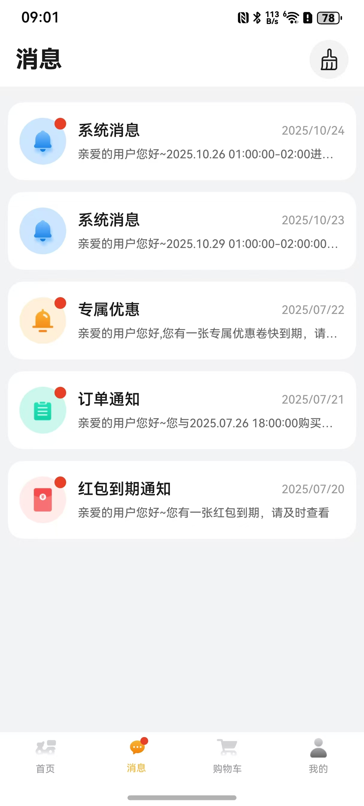
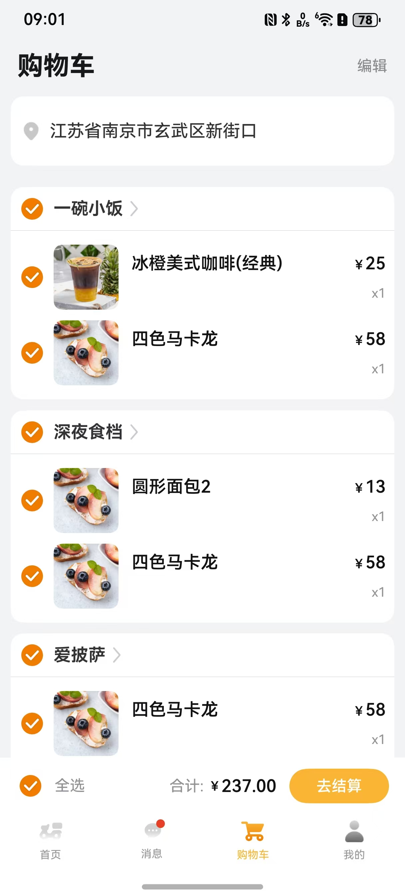
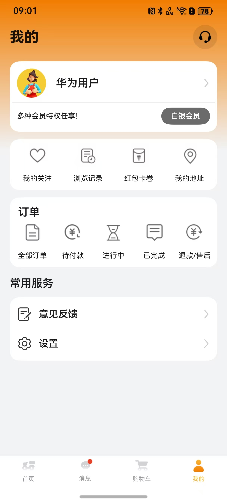

# 美食（外卖）应用模板快速入门

## 目录

- [功能介绍](#功能介绍)
- [约束与限制](#约束与限制)
- [快速入门](#快速入门)
- [示例效果](#示例效果)
- [开源许可协议](#开源许可协议)

## 功能介绍

您可以基于此模板直接定制应用，也可以挑选此模板中提供的多种组件使用，从而降低您的开发难度，提高您的开发效率。


本模板为外卖类应用提供了常用功能的开发样例，模板主要分首页、消息、购物车和我的四大模块：

* 首页：提供推荐店铺信息、搜索、定位、分类、筛选、轮播图等功能。

* 消息：提供系统消息、订单通知等消息推送功能。

* 购物车：支持收货地址选择、购物车结算。

* 我的：提供登录、订单查询、会员信息、我的客服、我的关注/浏览记录/红包卡券/我的地址、意见反馈、设置等功能。

本模板已集成华为账号、支付宝登录、微信登录等服务，只需做少量配置和定制即可快速实现华为账号的登录、外卖等功能。

| 首页                                           | 消息                                              | 购物车                                                 | 我的                                           |
|----------------------------------------------|-------------------------------------------------|-----------------------------------------------------|----------------------------------------------|
|  |  |  |  |

本模板主要页面及核心功能如下所示：

```text
外卖模板
  ├──首页      
  │   ├──顶部栏-定位    
  │   │   ├── 我的收货地址
  │   │   └── 收货地址搜索  
  │   │                 
  │   ├──顶部栏-搜索  
  │   │   ├── 历史搜索                          
  │   │   └── 猜你想搜                      
  │   │          
  │   ├──轮播图    
  │   │
  │   ├──菜系分类                            
  │   │   └── 地方菜系、汉堡披萨、甜食饮品、快食简餐
  │   │
  │   └──推荐店铺    
  │       ├── 筛选                                             
  │       ├── 店铺信息流                         
  │       ├── 点餐
  │       ├── 查看店铺评价
  │       ├── 查看商家信息
  │       ├── 收藏                    
  │       ├── 店铺优惠券领取
  │       └── 结算 
  │
  ├──消息                          
  │   ├──顶部栏  
  │   │   └── 一键已读                       
  │   │         
  │   └──消息列表         
  │       ├── 消息详情
  │       └── 消息未读提醒                            
  │                        
  ├──购物车                           
  │   ├──收货地址选择                    
  │   │         
  │   ├──购物车商品列表                                     
  │   │                    
  │   └──去结算    
  │       ├── 配送/自取                                             
  │       ├── 配送时间选择                         
  │       ├── 优惠券使用                                 
  │       └── 订单备注                     
  │
  └──我的       
      ├──我的客服  
      │   ├── 热门问题                          
      │   ├── 客服热线                                                   
      │   └── 问题详情                        
      ├──登录  
      │   ├── 华为账号一键登录                          
      │   ├── 微信登录                                                   
      │   ├── 支付宝登录                                                   
      │   ├── 手机号登录
      │   └── 用户隐私协议同意                       
      │         
      ├──个人信息         
      │   └── 头像、昵称
      │                    
      ├──分类导航栏    
      │   ├── 我的关注                                        
      │   ├── 浏览记录                   
      │   ├── 红包卡券                             
      │   └── 我的地址
      │
      ├──订单
      │   ├── 全部订单
      │   ├── 待付款
      │   ├── 进行中
      │   ├── 已完成
      │   └── 退款/售后              
      │
      └──常用服务                                   
          ├── 意见反馈                   
          └── 设置
               ├── 编辑个人信息             
               ├── 关于我们                     
               ├── 清理缓存           
               ├── 注销账号 
               └── 退出登录                               
```

本模板工程代码结构如下所示：

```text
takeaway
├──commons
│  ├──lib_account/src/main/ets                            // 账号登录模块             
│  │    ├──components
│  │    │   └──AgreePrivacyBox.ets                        // 隐私同意勾选       
│  │    ├──constants                                      // 通用常量
│  │    ├──pages  
│  │    │   ├──HuaweiLoginPage.ets                        // 华为账号登录页面
│  │    │   ├──OtherLoginPage.ets                         // 其他方式登录页面
│  │    │   └──ProtocolWebView.ets                        // 协议H5                  
│  │    └──utils  
│  │        ├──HuaweiAuthUtils.ets                        // 华为认证工具类
│  │        ├──LoginSheetUtils.ets                        // 统一登录半模态弹窗
│  │        └──WXApiUtils.ets                             // 微信登录事件处理类 
│  │
│  ├──lib_common/src/main/ets                             // 基础模块             
│  │    ├──constants                                      // 通用常量 
│  │    ├──datasource                                     // 懒加载数据模型
│  │    ├──dialogs                                        // 通用弹窗 
│  │    ├──models                                         // 状态观测模型
│  │    ├──push                                           // 推送
│  │    └──utils                                          // 通用方法     
│  │
│  ├──lib_native_components/src/main/ets                  // 动态布局-原生模块             
│  │    ├──components
│  │    │   ├──CommonDivider.ets                          // 分割线组件
│  │    │   ├──CommonTextInput.ets                        // 文本框组件
│  │    │   ├──Highlight.ets                              // 高亮组件
│  │    │   ├──SelectAddressBuilder.ets                   // 收货地址选择组件
│  │    │   ├──SelectDeliveryTime.ets                     // 配送时间选择组件
│  │    │   └──UniformStoreCard.ets                       // 店铺信息卡片组件   
│  │    └─utils 
│  │        ├──Modifier.ets                               // 样式modifier
│  │        └──Utils.ets                                  // 工具方法             
│  │
│  ├──lib_product_waterflow/src/main/ets                  // 瀑布流模块             
│  │    ├──commons                                        // 常量文件    
│  │    ├──components                                     
│  │    │   ├──FilterComponents.ets                       // 筛选组件
│  │    │   └──ProductWaterFlow.ets                       // 瀑布流组件
│  │    ├──https                                          // 店铺筛选接口  
│  │    └──utils                                          // 工具utils 
│  │
│  ├──lib_takeaway_api/src/main/ets                       // 服务端api模块             
│  │    ├──constants                                      // 常量文件    
│  │    ├──database                                       // 数据库 
│  │    ├──observedmodels                                 // 状态模型  
│  │    ├──params                                         // 请求响应参数 
│  │    ├──services                                       // 服务api  
│  │    └──utils                                          // 工具utils 
│  │ 
│  └──lib_widget/src/main/ets                             // 通用UI模块             
│       │──components
│       │   ├──CommonLoading.ets                          // 通用加载组件
│       │   ├──CommonScroll.ets                           // 通用滚动组件
│       │   ├──ContainerColumn.ets                        // 通用列组件
│       │   ├──CustomBadge.ets                            // 通用角标组件
│       │   ├──EmptyBuilder.ets                           // 空白组件
│       │   └──NavHeaderBar.ets                           // 自定义标题栏
│       └──constants                                      // 通用常量
│
├──components
│  ├──aggregated_payment                                  // 支付组件                     
│  ├──module_address_search                               // 地址搜索联想补全组件
│  ├──module_feedback                                     // 意见反馈组件 
│  ├──module_imagepreview                                 // 图片预览组件
│  ├──module_store_comments                               // 店铺评价组件
│  ├──module_store_map                                    // 商铺地图组件
│  └──module_ui_base                                      // 通用UI组件            
│      
├──features
│  ├──business_car/src/main/ets                           // 购物车模块             
│  │    ├──components
│  │    │   ├──CarGoodsCard.ets.ets                       // 购物车商品卡片                  
│  │    │   └──NoCarCard.ets                              // 空购物车卡片                  
│  │    └──pages
│  │        └──CarPage.ets                                // 购物车页面
│  │
│  ├──business_coupons/src/main/ets                       // 优惠券模块             
│  │    ├──components
│  │    │   ├──CouponCardComp.ets                         // 优惠券卡片                  
│  │    │   ├──SelectCoupon.ets                           // 优惠券选择                  
│  │    │   └──TabComp.ets                                // 优惠券tab                  
│  │    └──pages
│  │        └──MyCouponsPage.ets                          // 红包卡券页面
│  │
│  ├──business_home/src/main/ets                          // 首页模块             
│  │    ├──components
│  │    │   ├──FilterComponentsDialog.ets                 // 筛选组件                  
│  │    │   ├──HomePageContent.ets                        // 首页内容                  
│  │    │   ├──StoreSearch.ets                            // 店铺搜索                  
│  │    │   └──TabComp.ets                                // 首页tab
│  │    └──pages
│  │        ├──AddressSearchPage.ets                      // 地址搜索页面                  
│  │        ├──HomePage.ets                               // 首页                  
│  │        ├──MyAddressSearchPage.ets                    // 我的地址搜索页面                  
│  │        └──StoreCategoryPage.ets                      // 店铺分类页面
│  │
│  ├──business_member/src/main/ets                        // 会员模块             
│  │    ├─components
│  │    │   └──PrivilegeCard.ets                          // 会员权益卡片                 
│  │    └──pages 
│  │        └──MineMemberCenter.ets                       // 会员中心页面                  
│  │
│  ├──business_message/src/main/ets                       // 消息模块             
│  │    ├─components
│  │    │   ├──MessageItem.ets                            // 消息列表项                  
│  │    │   └──SetReadIcon.ets                            // 设置已读图标                 
│  │    └──pages 
│  │        ├──MessageInfoPage.ets                        // 消息详情页面                 
│  │        └──MessagePage.ets                            // 消息页面    
│  │
│  ├──business_mine/src/main/ets                          // 我的模块             
│  │    ├──components
│  │    │   ├──BaseQAComponent.ets                        // 问答组件
│  │    │   ├──BaseStoreListCard.ets                      // 店铺列表卡片
│  │    │   ├──CancelDialogBuilder.ets                    // 取消对话框
│  │    │   └──CommonCascade.ets                          // 级联选择                
│  │    └──pages 
│  │        ├──AddressPage.ets                            // 评论页面
│  │        ├──BrowsingHistoryPage.ets                    // 浏览历史页面
│  │        ├──EditAddressPage.ets                        // 编辑地址页面
│  │        ├──FollowPage.ets                             // 关注页面
│  │        ├──MineCustomerServiceDetailPage.ets          // 客服详情页面
│  │        ├──MineCustomerServicePage.ets                // 客服页面
│  │        └──MinePage.ets                               // 我的页面              
│  │
│  ├──business_order/src/main/ets                         // 订单模块             
│  │    ├──components
│  │    │   ├──NoOrderCard.ets                            // 无订单卡片
│  │    │   ├──OrderCountdown.ets                         // 订单倒计时
│  │    │   ├──OrderFormItem.ets                          // 订单列表项
│  │    │   ├──OrderInfoCard.ets                          // 订单信息卡片
│  │    │   └──PaymentChannelSheet.ets                    // 支付方式弹窗               
│  │    └──pages
│  │        ├──OrderInfoPage.ets                          // 订单详情页面
│  │        ├──OrderListPage.ets                          // 订单列表页面
│  │        ├──OrderSearchPage.ets                        // 订单搜索页面
│  │        ├──OrderStoreCommentsPage.ets                 // 店铺评论页面
│  │        ├──OrderStoreMapPage.ets                      // 店铺地图页面
│  │        └──OrderSubmitPage.ets                        // 订单提交支付页面 
│  │
│  ├──business_setting/src/main/ets                       // 设置模块             
│  │    ├──components
│  │    │   ├──SettingCard.ets                            // 设置卡片
│  │    │   └──SettingSelectDialog.ets                    // 设置选项弹窗               
│  │    └──pages
│  │        ├──SettingAbout.ets                           // 关于页面
│  │        ├──SettingPage.ets                            // 设置页面
│  │        └──SettingPersonal.ets                        // 编辑个人信息页面
│  │ 
│  └──business_store/src/main/ets                         // 店铺模块             
│       ├──components
│       │   ├──GoodInfoComp.ets                           // 商品信息
│       │   ├──GoodsTypeItem.ets                          // 商品类型
│       │   ├──MyCarListComp.ets                          // 购物车列表
│       │   └──StoreGoodsListComp.ets                     // 商品列表
│       └──pages
│           └──StorePage.ets                              // 店铺页面
│
└──products
   └──phone/src/main/ets                                  // phone模块
        ├──common                        
        │   ├──AppTheme.ets                               // 应用主题色
        │   └──Constants.ets                              // 业务常量
        ├──components                    
        │   └──CustomTabBar.ets                           // 应用底部Tab
        └──pages   
            ├──AgreeDialogPage.ets                        // 隐私同意弹窗
            ├──Index.ets                                  // 入口页面
            ├──IndexPage.ets                              // 应用主页面
            ├──PrivacyPage.ets                            // 查看隐私协议页面
            ├──SafePage.ets                               // 隐私同意页面
            └──StartPage.ets                              // 应用启动页面
 
```

## 约束与限制

### 环境

- DevEco Studio版本：DevEco Studio 5.0.5 Release及以上
- HarmonyOS SDK版本：HarmonyOS 5.0.5 Release SDK及以上
- 设备类型：华为手机
- 系统版本：HarmonyOS 5.0.5(17)及以上

### 权限

- Internet网络权限: ohos.permission.INTERNET
- 允许应用获取设备位置信息: ohos.permission.LOCATION
- 允许应用获取设备模糊位置信息: ohos.permission.APPROXIMATELY_LOCATION

### 调试

由于模板引入支付组件，只能在真机上运行。如想在模拟器上运行可以将“aggregated_payment”组件模块移除。

## 快速入门

### 配置工程

在运行此模板前，需要完成以下配置：

1. 在AppGallery Connect创建应用，将包名配置到模板中。

   a. 参考[创建HarmonyOS应用](https://developer.huawei.com/consumer/cn/doc/app/agc-help-create-app-0000002247955506)为应用创建APP ID，并将APP ID与应用进行关联。

   b. 返回应用列表页面，查看应用的包名。

   c. 将模板工程根目录下AppScope/app.json5文件中的bundleName替换为创建应用的包名。

2. 配置华为账号服务。

   a. 将应用的Client ID配置到products/phone/src/main路径下的module.json5文件中，详细参考：[配置Client ID](https://developer.huawei.com/consumer/cn/doc/harmonyos-guides/account-client-id)。

   b. 申请华为账号一键登录所需的quickLoginMobilePhone权限，详细参考：[申请账号权限](https://developer.huawei.com/consumer/cn/doc/harmonyos-guides/account-config-permissions)。

3. 接入微信SDK。
   前往微信开放平台申请AppID并配置鸿蒙应用信息，详情参考：[鸿蒙接入指南](https://developers.weixin.qq.com/doc/oplatform/Mobile_App/Access_Guide/ohos.html)。

4. 接入支付宝SDK。
   前往支付宝开放平台申请AppID并配置鸿蒙应用信息，详情参考：[鸿蒙接入指南](https://opendocs.alipay.com/open/0f71b5?pathHash=bedc38ba)。

5. 对应用进行[手工签名](https://developer.huawei.com/consumer/cn/doc/harmonyos-guides/ide-signing#section297715173233)。

6. 添加手工签名所用证书对应的公钥指纹，详细参考：[配置公钥指纹](https://developer.huawei.com/consumer/cn/doc/app/agc-help-cert-fingerprint-0000002278002933)

7. 配置支付宝登录

   a. 在根目录下创建文件夹AFServiceSDK，将[AFServiceSDK.har](https://mdn.alipayobjects.com/portal_khlfqg/afts/file/A*RcmpSLB_wy4AAAAAAAAAAAAAAQAAAQ)文件解压重命名为AFServiceSDK.har并放入该目录。

   b. 在commons/lib_account/oh-package.json5文件中添加配置 。

   ```typescript
   "dependencies": {
      "@alipay/afservicesdk": "file:../../AFServiceSDK/AFServiceSDK.har",
   }
   ```
   
   c. 在commons/lib_account/Index.ets文件中添加代码 。
   
   ```typescript
   // 支付宝登录
   export { AFAuthServiceResponse,
   AFAuthResCode,
   AFServiceCenter,
   AFServiceParams,
   AFWantParams,
   AFService,
   AFServiceTask } from '@alipay/afservicesdk'
   ```
   d. 在commons/lib_account/src/main/ets/viewmodels/LoginVM.ets中引入afservicesdk。
   ```typescript
   import {
   AFAuthResCode,
   AFAuthServiceResponse,
   AFService,
   AFServiceCenter,
   AFServiceParams,
   AFWantParams
   } from '@alipay/afservicesdk';
   ```
   e. 在commons/lib_account/src/main/ets/viewmodels/LoginVM.ets类中替换jumpAF方法。
   ```typescript
   // 添加方法
   jumpAF() {
    let canOpen = AFServiceCenter.canOpenAliPay()
    if (!canOpen) {
      promptAction.showToast({ message: '未安装支付宝' });
      return
    }
    /**
     * 构建参数
     */
    let bizParams = new Map<string, string>()
    let url =
      encodeURIComponent('https://authweb.alipay.com/auth?auth_type=PURE_OAUTH_SDK&app_id=2016051801417322&scope=auth_user&state=xxx')
    bizParams.set('url', url);

    let backWant: AFWantParams = {
      bundleName: 'com.xx.xx.xx', //todo 接入方应用包名
      moduleName: 'phone',
      abilityName: 'PhoneAbility'
    }

    let params = new AFServiceParams(bizParams, false, true, '', backWant, (response: AFAuthServiceResponse) => {
      // 授权返回值
      Logger.info(TAG, 'jump AF result: ' + response);
      if (response.responseCode === AFAuthResCode.AFAuthResSuccess) {
        this.afLogin()
      } else {
        CommonConfirmDialog.show({
          primaryTitle: '温馨提示',
          content: '拉起支付宝登录失败，是否先模拟登录成功？',
          confirm: () => {
            this.afLogin();
          },
        })
      }
    })

    AFServiceCenter.call(AFService.AFServiceAuth, params)
   }
   ```
   
   f. 在products/phone/src/main/ets/phoneability/PhoneAbility.ets文件中添加代码 。
   
   ```typescript
   import { AFServiceCenter } from 'lib_account';
   
   // onNewWant 方法添加this.handleAFService(want)
   onNewWant(want: Want): void {
    this.handleAFService(want)
   }
   
   // 添加handleAFService方法
   handleAFService(want: Want) {
    AFServiceCenter.handleResponse(want)
   }
   ```

### 运行调试工程

1. 连接调试手机和PC。

2. 菜单选择“Run > Run 'phone' ”或者“Run > Debug 'phone' ”，运行或调试模板工程。

## 示例效果

1. [首页](./screenshots/home.jpg)
2. [消息](./screenshots/message.jpg)
3. [购物车](./screenshots/cart.jpg)
4. [我的](./screenshots/mine.jpg)

## 开源许可协议

该代码经过[Apache 2.0 授权许可](http://www.apache.org/licenses/LICENSE-2.0)。
