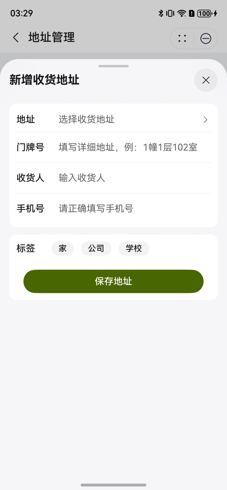

# 新增地址组件快速入门

## 目录

- [简介](#简介)
- [约束与限制](#约束与限制)
- [快速入门](#快速入门)
- [API参考](#API参考)
- [示例代码](#示例代码)

## 简介

本组件提供了新建和展示联系地址功能，可以通过地图选点获取位置信息，输入联系人信息保存后可以展示信息。



## 约束与限制

### 环境

- DevEco Studio版本：DevEco Studio 5.0.1 Release及以上
- HarmonyOS SDK版本：HarmonyOS 5.0.1 Release SDK及以上
- 设备类型：华为手机（包括双折叠和阔折叠）
- 系统版本：HarmonyOS 5.0.1(13)及以上

### 权限要求

- 获取位置权限：ohos.permission.APPROXIMATELY_LOCATION、ohos.permission.LOCATION
- 网络权限：ohos.permission.INTERNET

## 快速入门

1. 安装组件。  
   如果是在DevEco Studio使用插件集成组件，则无需安装组件，请忽略此步骤。
   如果是从生态市场下载组件，请参考以下步骤安装组件。  
   a. 解压下载的组件包，将包中所有文件夹拷贝至您工程根目录的xxx目录下。  
   b. 在项目根目录build-profile.json5并添加add_address模块。

   ```typescript
   // 在项目根目录的build-profile.json5填写add_address路径。其中xxx为组件存在的目录名
   "modules": [
     {
       "name": "add_address",
       "srcPath": "./xxx/add_address",
     }
   ]
   ```

   c. 在项目根目录oh-package.json5中添加依赖

   ```typescript
   // xxx为组件存放的目录名称
   "dependencies": {
     "add_address": "file:./xxx/add_address"
   }
   ```

2. 引入组件。

   ```typescript
   import { AddAddress, AddressCard, AddressComp } from 'add_address';
   ```

3. 在主工程的src/main路径下的module.json5文件的requestPermissions字段中添加如下权限：

   ```typescript
     "requestPermissions": [
      ...
      {
        "name": "ohos.permission.INTERNET",
        "reason": "$string:app_name",
        "usedScene": {
          "abilities": [
            "FormAbility"
          ],
          "when": "inuse"
        }
      },
      {
        "name": "ohos.permission.LOCATION",
        "reason": "$string:app_name",
        "usedScene": {
          "abilities": [
            "EntryAbility"
          ],
          "when": "inuse"
        }
      },
      {
        "name": "ohos.permission.APPROXIMATELY_LOCATION",
        "reason": "$string:app_name",
        "usedScene": {
          "abilities": [
            "EntryAbility"
          ],
          "when": "inuse"
        }
      }
      ...
    ],
   ```
4. 调用组件，详细参数配置说明参见[API参考](#API参考)。

   ```typescript
   // 展示地址信息
   AddressComp({ address: this.address })
   // 展示地址卡片
   AddressCard({ address: this.address })
   // 新增地址
   AddAddress({
      addressInfo: selectAddress,
      myLocation: this.myLocation,
      modifyAddressInfo: (addressInfo: AddressInfo) => {
        // 保存地址信息
      },
    })
   ```

## API参考

### 接口

AddressComp(options?: AddressCompOptions)

地址展示组件。

**参数：**

| 参数名     | 类型                                            | 是否必填 | 说明       |
|---------|-----------------------------------------------|------|----------|
| options | [AddressCompOptions](#AddressCompOptions对象说明) | 是    | 地址展示的参数。 |

AddressCard(options?: AddressCardOptions)

地址卡片展示组件。

**参数：**

| 参数名     | 类型                                            | 是否必填 | 说明         |
|---------|-----------------------------------------------|------|------------|
| options | [AddressCardOptions](#AddressCardOptions对象说明) | 是    | 地址卡片展示的参数。 |

AddAddress(options?: AddAddressOptions)

新增地址组件。

**参数：**

| 参数名     | 类型                                          | 是否必填 | 说明       |
|---------|---------------------------------------------|------|----------|
| options | [AddAddressOptions](#AddAddressOptions对象说明) | 是    | 新增地址的参数。 |

### AddressCompOptions对象说明

| 名称          | 类型                              | 是否必填 | 说明   |
|-------------|---------------------------------|------|------|
| addressInfo | [AddressInfo](#AddressInfo对象说明) | 是    | 地址信息 |

### AddressCardOptions对象说明

| 名称          | 类型                              | 是否必填 | 说明         |
|-------------|---------------------------------|------|------------|
| addressInfo | [AddressInfo](#AddressInfo对象说明) | 是    | 地址信息       |
| selectId    | number                          | 否    | 默认选择地址的ID。 |
| showSelect  | boolean                         | 否    | 是否展示选择按钮。  |
| disable     | boolean                         | 否    | 是否可以操作。    |
| showEdit    | boolean                         | 否    | 是否展示编辑按钮。  |

### AddAddressOptions对象说明

| 名称          | 类型                                                                                                                | 是否必填 | 说明       |
|-------------|-------------------------------------------------------------------------------------------------------------------|------|----------|
| addressInfo | [AddressInfo](#AddressInfo对象说明)                                                                                   | 否    | 选择修改地址信息 |
| myLocation  | [Location](https://developer.huawei.com/consumer/cn/doc/harmonyos-references/js-apis-geolocationmanager#location) | 是    | 我的位置信息   |

### AddressInfo对象说明

| 名称         | 类型      | 是否必填 | 说明     |
|------------|---------|------|--------|
| id         | number  | 是    | 地址序号   |
| addressPre | string  | 是    | 地址前缀   |
| addressNum | string  | 是    | 地址门牌号  |
| name       | string  | 是    | 收件人名称  |
| sex        | boolean | 是    | 收件人性别  |
| tel        | string  | 是    | 收件人电话  |
| tag        | number  | 是    | 地址分类标签 |
| latitude   | number  | 是    | 地址纬度   |
| longitude  | number  | 是    | 地址经度   |

### 事件

支持以下事件：

#### selectAddress

selectAddress(callback: (address: [AddressInfo](#AddressInfo对象说明)) => void)

选择地址回调事件

#### modifyAddressInfo

modifyAddressInfo(callback: (address: [AddressInfo](#AddressInfo对象说明)) => void)

修改地址回调事件

#### modifyAddressInfo

modifyAddressInfo(callback: (addressInfo: [AddressInfo](#AddressInfo对象说明)) => void)

保存修改地址回调事件

## 示例代码

```typescript
import { abilityAccessCtrl, common } from '@kit.AbilityKit';
import { BusinessError } from '@kit.BasicServicesKit';
import { AddAddress, AddressCard, AddressComp, AddressInfo } from 'add_address';
import { geoLocationManager } from '@kit.LocationKit';
import { promptAction } from '@kit.ArkUI';

@Entry
@ComponentV2
struct Index {
   @Local address: AddressInfo = new AddressInfo()
   @Local myLocation?: geoLocationManager.Location

   aboutToAppear(): void {
      let atManager: abilityAccessCtrl.AtManager = abilityAccessCtrl.createAtManager();
      atManager.requestPermissionsFromUser(getContext() as common.UIAbilityContext,
      ['ohos.permission.LOCATION', 'ohos.permission.APPROXIMATELY_LOCATION'])
      .then((data) => {
      let grantStatus: Array<number> = data.authResults;
      if (grantStatus.every(item => item === 0)) {
      // 授权成功
      geoLocationManager.getCurrentLocation().then((location: geoLocationManager.Location) => {
      this.myLocation = location;
   }).catch((error: Error) => {
      console.error('getCurrentLocation failed', 'getCurrentLocation error: ' + JSON.stringify(error));
   });
}
}).catch((err: BusinessError) => {
   console.error(`Failed to request permissions from user. Code is ${err.code}, message is ${err.message}`);
});
}

build() {
   Column({ space: 20 }) {
      // 展示地址信息
      AddressComp({ address: this.address })
      // 展示地址卡片
      AddressCard({ address: this.address })
      // 新增地址
      AddAddress({
         addressInfo: this.address,
         myLocation: this.myLocation,
         modifyAddressInfo: (addressInfo: AddressInfo) => {
            // 保存地址信息
            this.address = addressInfo
            promptAction.showToast({ message: '保存地址信息' })
         },
      })
   }
   .height('100%')
      .width('100%')
      .padding(16)
      .backgroundColor($r('sys.color.background_secondary'))
}
}
```