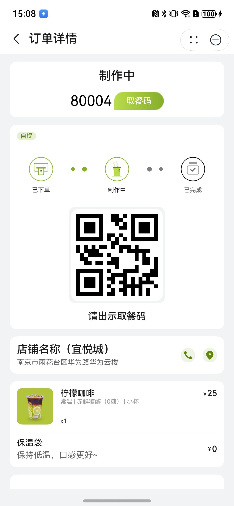
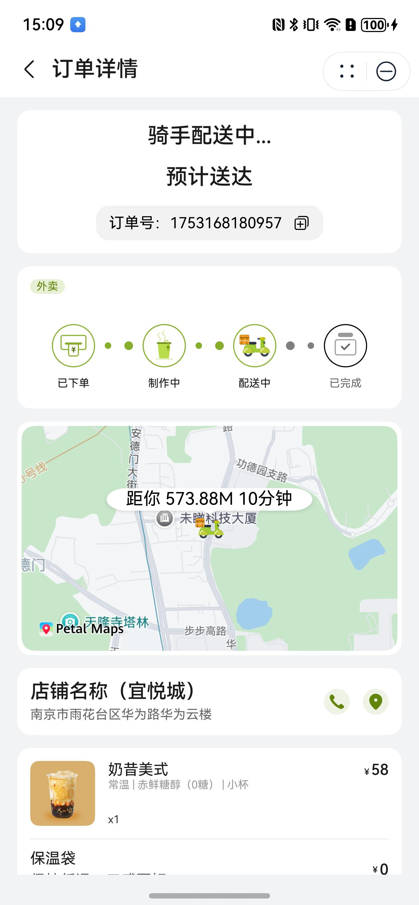

# 订单详情组件快速入门

## 目录

- [简介](#简介)
- [约束与限制](#约束与限制)
- [快速入门](#快速入门)
- [API参考](#API参考)
- [示例代码](#示例代码)

## 简介

本组件提供了订单详情展示功能，包含订单状态、制作和配送信息、店铺信息、商品列表、优惠信息和订单信息。

| 展开地图                                                   | 收起地图                                                   |
|--------------------------------------------------------|--------------------------------------------------------|
|  |  |

## 约束与限制

### 环境

* DevEco Studio版本：DevEco Studio 5.0.1 Release及以上
* HarmonyOS SDK版本：HarmonyOS 5.0.1 Release SDK及以上
* 设备类型：华为手机（包括双折叠和阔折叠）
* 系统版本：HarmonyOS 5.0.1(13)及以上

## 快速入门

1. 安装组件。  
   如果是在DevEvo Studio使用插件集成组件，则无需安装组件，请忽略此步骤。
   如果是从生态市场下载组件，请参考以下步骤安装组件。  
   a. 解压下载的组件包，将包中所有文件夹拷贝至您工程根目录的xxx目录下。  
   b. 在项目根目录build-profile.json5并添加order_detail和base_ui模块。
   ```typescript
   // 在项目根目录的build-profile.json5填写order_detail和base_ui路径。其中xxx为组件存在的目录名
   "modules": [
     {
       "name": "order_detail",
       "srcPath": "./xxx/order_detail",
     },
     {
       "name": "base_ui",
       "srcPath": "./xxx/base_ui",
     }
   ]
   ```
   c. 在项目根目录oh-package.json5中添加依赖
   ```typescript
   // xxx为组件存放的目录名称
   "dependencies": {
     "order_detail": "file:./xxx/order_detail",
     "base_ui": "file:./xxx/base_ui"
   }
   ```

2. 引入组件。

   ```typescript
   import { OrderDetail } from 'order_detail';
   ```

3. 调用组件，详细参数配置说明参见[API参考](#API参考)。

   ```typescript
   OrderDetail({
     orderInfo: this.orderDetailInfo.order,
     goods: this.orderDetailInfo.goods,
     address: this.orderDetailInfo.address,
     delivery: this.orderDetailInfo.delivery,
     confirmOrder: (): void => {
       // 下单接口调用
     },
     showPaySheet: (): void => {
       // 展示支付弹窗支付
     },
     cancelOrderCb: (): void => {
       // 取消订单  
     },
     oneMoreOrder: (): void => {
       // 再来一单跳转
     },
     callTelCb: (): void => {
       // 展示拨号弹窗  
     },
     goNavigation: (): void => {
       // 跳转地图导航
     },
   })
   ```

## API参考

### 接口

OrderDetail(options?: OrderDetailOptions)

订单详情组件。

**参数：**

| 参数名     | 类型                                            | 是否必填 | 说明      |
|---------|-----------------------------------------------|------|---------|
| options | [OrderDetailOptions](#OrderDetailOptions对象说明) | 是    | 订单详情参数。 |

### OrderDetailOptions对象说明

| 名称        | 类型                                  | 是否必填 | 说明     |
|-----------|-------------------------------------|------|--------|
| orderInfo | [OrderInfo](#OrderInfo对象说明)         | 是    | 订单详细信息 |
| goods     | [GoodsOfOrder](#GoodsOfOrder对象说明)[] | 是    | 订单商品列表 |
| address   | [AddressInfo](#AddressInfo对象说明)     | 否    | 订单配送地址 |
| delivery  | [DeliveryInfo](#DeliveryInfo对象说明)   | 否    | 订单配送信息 |

### OrderInfo对象说明

| 名称          | 类型     | 是否必填 | 说明      |
|-------------|--------|------|---------|
| id          | string | 是    | 订单序号    |
| orderNum    | string | 是    | 订单号     |
| time        | string | 是    | 下单时间    |
| payTime     | number | 否    | 支付时间    |
| money       | number | 是    | 订单金额    |
| boxMoney    | number | 是    | 打包费用    |
| mjMoney     | string | 否    | 满减金额    |
| xyhMoney    | string | 否    | 新用户优惠金额 |
| note        | number | 否    | 订单备注    |
| payType     | number | 否    | 支付类型    |
| orderType   | number | 是    | 订单类型    |
| cutlery     | number | 是    | 用餐人数    |
| yhqMoney    | string | 否    | 优惠券金额   |
| couponId    | string | 否    | 优惠券id   |
| state       | number | 是    | 订单状态    |
| oid         | string | 否    | 取餐码     |
| tel         | string | 是    | 店铺电话    |
| storeName   | string | 是    | 店铺名称    |
| address     | string | 是    | 店铺地址    |
| coordinates | string | 是    | 店铺坐标    |
| bagMoney    | number | 否    | 保温袋费用   |

### GoodsOfOrder对象说明

| 名称          | 类型                                | 是否必填 | 说明     |
|-------------|-----------------------------------|------|--------|
| id          | string                            | 是    | 商品序号   |
| logo        | string                            | 是    | 商品图标   |
| money       | string                            | 是    | 商品金额   |
| name        | string                            | 是    | 商品名称   |
| num         | number                            | 是    | 商品数量   |
| specType    | string                            | 是    | 商品类别   |
| spec        | string                            | 是    | 商品规格   |
| combination | [PackageSpec](#PackageSpec对象说明)[] | 是    | 商品规格列表 |

### PackageSpec对象说明

| 名称        | 类型     | 是否必填 | 说明       |
|-----------|--------|------|----------|
| specId    | string | 是    | 规格序号     |
| specValId | string | 是    | 规格默认选择序号 |
| specName  | string | 是    | 规格名称     |
| specLogo  | string | 是    | 套餐图标     |
| specVal   | string | 是    | 规格选择内容   |
| specNum   | number | 是    | 规格商品数量   |

### AddressInfo对象说明

| 名称         | 类型      | 是否必填 | 说明       |
|------------|---------|------|----------|
| id         | string  | 是    | 订单地址序号   |
| addressPre | string  | 是    | 订单街道地址   |
| addressNum | string  | 是    | 订单地址门牌号  |
| name       | string  | 是    | 订单收货人名称  |
| sex        | boolean | 是    | 订单收货人性别  |
| tel        | string  | 是    | 订单收货人电话  |
| tag        | number  | 否    | 订单收货地址标签 |
| latitude   | number  | 是    | 订单收货人纬度  |
| longitude  | number  | 是    | 订单收货人经度  |

### DeliveryInfo对象说明

| 名称            | 类型     | 是否必填 | 说明     |
|---------------|--------|------|--------|
| name          | string | 是    | 配送人名称  |
| tel           | string | 是    | 配送人电话  |
| latitude      | number | 是    | 配送人纬度  |
| longitude     | number | 是    | 配送人经度  |
| distance      | number | 是    | 配送人距离  |
| remainingTime | number | 是    | 剩余送达时间 |
| estimatedTime | string | 是    | 预计送达时间 |

### 事件

#### confirmOrder

confirmOrder(callback: () => void)

下单接口调用

#### showPaySheet

showPaySheet(callback: () => void)

展示支付弹窗支付

#### cancelOrderCb

cancelOrderCb(callback: () => void)

取消订单

#### oneMoreOrder

callTelCb(callback: () => void)

再来一单跳转

#### callTelCb

callTelCb(callback: () => void)

展示拨号弹窗

#### goNavigation

goNavigation(callback: () => void)

跳转地图导航

## 示例代码

```typescript
import { abilityAccessCtrl, common } from '@kit.AbilityKit';
import { BusinessError } from '@kit.BasicServicesKit';
import { AddressInfo } from 'add_address';
import { DeliveryInfo, OrderDetail, OrderInfo } from 'order_detail';
import { GoodsOfOrder } from 'base_ui';
import { promptAction } from '@kit.ArkUI';

@Entry
@ComponentV2
struct Index {
   @Local orderInfo: OrderInfo = new OrderInfo()
   @Local goods: Array<GoodsOfOrder> = []
   @Local address: AddressInfo = new AddressInfo()
   @Local delivery: DeliveryInfo = new DeliveryInfo()

   aboutToAppear(): void {
      let atManager: abilityAccessCtrl.AtManager = abilityAccessCtrl.createAtManager();
      atManager.requestPermissionsFromUser(getContext() as common.UIAbilityContext,
      ['ohos.permission.LOCATION', 'ohos.permission.APPROXIMATELY_LOCATION'])
      .then((data) => {
         let grantStatus: Array<number> = data.authResults;
         if (grantStatus.every(item => item === 0)) {
         // 授权成功
         }
      }).catch((err: BusinessError) => {
         console.error(`Failed to request permissions from user. Code is ${err.code}, message is ${err.message}`);
      });
      
      this.orderInfo.id = '1';
      this.orderInfo.orderNum = new Date().getTime().toString();
      this.orderInfo.time = '2025-02-01 10:33:33'
      this.orderInfo.money = 100;
      this.orderInfo.boxMoney = 0;
      this.orderInfo.bagMoney = 0;
      this.orderInfo.mjMoney = '5';
      this.orderInfo.note = '';
      this.orderInfo.payType = 1;
      this.orderInfo.orderType = 1;
      this.orderInfo.cutlery = '1';
      this.orderInfo.yhqMoney = '5';
      this.orderInfo.couponId = '1';
      this.orderInfo.state = 2;
      this.orderInfo.oid = `80001`;
      this.orderInfo.storeName = 'AGC奶茶(雨花客厅店)';
      this.orderInfo.address = '南京市雨花台区华为路华为云楼';
      this.orderInfo.tel = '10000000003';
      this.orderInfo.coordinates = '31.97831,118.76362';
      let good: GoodsOfOrder = new GoodsOfOrder()
      good.id = '1'
      good.name = '商品'
      good.logo = 'TeaDrinkOrders/good_pkg_logo.png'
      good.num = 2
      good.money = '11.5'
      good.num = 1;
      good.specType = '1';
      good.spec = '';
      good.combination = [];
      this.goods.push(good)
      
      this.address.addressPre = '雨花客厅'
      this.address.addressNum = 'D1栋xx单元xxxx'
      this.address.name = '索先生'
      this.address.sex = true
      this.address.tel = '10000000005'
      this.address.tag = 0
      this.address.latitude = 31.9789782
      this.address.longitude = 118.7641445
      
      this.delivery.latitude = 31.984119763914883
      this.delivery.longitude = 118.76458756248296
      this.delivery.distance = 573.883184314602
      this.delivery.remainingTime = 10
      this.delivery.estimatedTime = '16:29-16:34'
   }
   
   build() {
      Column({ space: 20 }) {
         OrderDetail({
            orderInfo: this.orderInfo,
            goods: this.goods,
            address: this.address,
            delivery: this.delivery,
            confirmOrder: (): void => {
               // 下单接口调用
               promptAction.showToast({ message: '下单接口调用' })
            },
            showPaySheet: (): void => {
               // 展示支付弹窗支付
               promptAction.showToast({ message: '展示支付弹窗支付' })
            },
            cancelOrderCb: (): void => {
               // 取消订单
               promptAction.showToast({ message: '取消订单' })
            },
            oneMoreOrder: (): void => {
               // 再来一单跳转
               promptAction.showToast({ message: '再来一单跳转' })
            },
            callTelCb: (): void => {
               // 展示拨号弹窗
               promptAction.showToast({ message: '展示拨号弹窗' })
            },
            goNavigation: (): void => {
               // 跳转地图导航
               promptAction.showToast({ message: '跳转地图导航' })
            },
         })
      }
      .height('100%')
      .width('100%')
      .backgroundColor($r('sys.color.background_secondary'))
   }
}
```