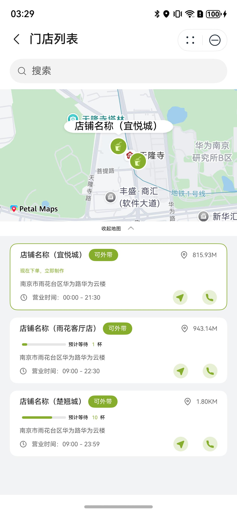

# 选择店铺组件快速入门

## 目录
- [简介](#简介)
- [约束与限制](#约束与限制)
- [快速入门](#快速入门)
- [API参考](#API参考)
- [示例代码](#示例代码)

## 简介

本组件提供了店铺选择功能，可以展示地图窗口，显示店铺位置与名称，选择店铺时可以切换地图上的店铺。

| 展开地图                                                   | 收起地图                                                   |
|--------------------------------------------------------|--------------------------------------------------------|
|  |  |

## 约束与限制

### 环境

* DevEco Studio版本：DevEco Studio 5.0.1 Release及以上
* HarmonyOS SDK版本：HarmonyOS 5.0.1 Release SDK及以上
* 设备类型：华为手机（包括双折叠和阔折叠）
* 系统版本：HarmonyOS 5.0.1(13)及以上

### 权限要求

- 获取位置权限：ohos.permission.APPROXIMATELY_LOCATION、ohos.permission.LOCATION
- 网络权限：ohos.permission.INTERNET

## 快速入门

1. 安装组件。  
   如果是在DevEco Studio使用插件集成组件，则无需安装组件，请忽略此步骤。
   如果是从生态市场下载组件，请参考以下步骤安装组件。  
   a. 解压下载的组件包，将包中所有文件夹拷贝至您工程根目录的xxx目录下。  
   b. 在项目根目录build-profile.json5并添加select_store和base_ui模块。
   ```typescript
   // 在项目根目录的build-profile.json5填写select_store和base_ui路径。其中xxx为组件存在的目录名
   "modules": [
     {
       "name": "select_store",
       "srcPath": "./xxx/select_store",
     },
     {
       "name": "base_ui",
       "srcPath": "./xxx/base_ui",
     }
   ]
   ```
   c. 在项目根目录oh-package.json5中添加依赖
   ```typescript
   // xxx为组件存放的目录名称
   "dependencies": {
     "select_store": "file:./xxx/select_store"
   }
   ```

2. 引入组件。

   ```typescript
   import { SelectStore } from 'select_store';
   ```

3. 在主工程的src/main路径下的module.json5文件的requestPermissions字段中添加如下权限：

   ```typescript
     "requestPermissions": [
      ...
      {
        "name": "ohos.permission.INTERNET",
        "reason": "$string:app_name",
        "usedScene": {
          "abilities": [
            "FormAbility"
          ],
          "when": "inuse"
        }
      },
      {
        "name": "ohos.permission.LOCATION",
        "reason": "$string:app_name",
        "usedScene": {
          "abilities": [
            "EntryAbility"
          ],
          "when": "inuse"
        }
      },
      {
        "name": "ohos.permission.APPROXIMATELY_LOCATION",
        "reason": "$string:app_name",
        "usedScene": {
          "abilities": [
            "EntryAbility"
          ],
          "when": "inuse"
        }
      }
      ...
    ],
   ```
   
4. 调用组件，详细参数配置说明参见[API参考](#API参考)。

   ```typescript
   SelectStore({
     storeInfoList: this.storeInfoList,
     navigateStoreCb: (coordinates: string = '', address: string = '') => {
       // 跳转店铺导航
     },
     selectStoreCb: (storeId: string) => {
       // 选择店铺后跳转页面
     },
     callTelCb: (callTelSheet: boolean, tel: string) => {
       // 拉起拨号页面
     },
   })
   ```

## API参考

### 接口

SelectStore(options?: SelectStoreOptions)

选择店铺组件。

**参数：**

| 参数名     | 类型                                            | 是否必填 | 说明       |
|---------|-----------------------------------------------|------|----------|
| options | [SelectStoreOptions](#SelectStoreOptions对象说明) | 是    | 选择店铺的参数。 |

### SelectStoreOptions对象说明

| 名称            | 类型                            | 是否必填 | 说明           |
|---------------|-------------------------------|------|--------------|
| storeInfoList | [storeInfo](#storeInfo对象说明)[] | 否    | 店铺列表         |
| listOffset    | number                        | 否    | list内容区末尾偏移量 |

### storeInfo对象说明

| 名称             | 类型      | 是否必填 | 说明       |
|----------------|---------|------|----------|
| id             | string  | 是    | 店铺序号     |
| name           | string  | 是    | 店铺名称     |
| address        | string  | 是    | 店铺地址     |
| time1          | string  | 是    | 店铺营业开始时间 |
| time2          | string  | 是    | 店铺营业结束时间 |
| tel            | string  | 是    | 店铺电话     |
| logo           | string  | 是    | 店铺图标     |
| coordinates    | string  | 是    | 店铺位置     |
| distance       | number  | 是    | 店铺距离     |
| distanceStr    | string  | 是    | 店铺距离字符串  |
| canTakeaways   | boolean | 是    | 是否可外带    |
| makingNum      | number  | 是    | 店铺制作中数量  |
| makingWaitTime | number  | 是    | 店铺等待时间   |

### 事件

支持以下事件：

#### navigateStoreCb

navigateStoreCb(callback: (coordinates: string = '', address: string = '') => void)

跳转店铺导航

#### selectStoreCb

selectStoreCb(callback: (storeId: string) => void)

选择店铺后跳转页面

#### callTelCb

callTelCb(callback: (callTelSheet: boolean, tel: string) => void)

拉起拨号页面

## 示例代码

```typescript
import { promptAction } from '@kit.ArkUI';
import { SelectStore, StoreInfo } from 'select_store';
import { abilityAccessCtrl, common } from '@kit.AbilityKit';
import { BusinessError } from '@kit.BasicServicesKit';

@Entry
@ComponentV2
struct Index {
   @Local storeInfoList: StoreInfo[] = [];

   aboutToAppear(): void {
      let atManager: abilityAccessCtrl.AtManager = abilityAccessCtrl.createAtManager();
      atManager.requestPermissionsFromUser(getContext() as common.UIAbilityContext,
      ['ohos.permission.LOCATION', 'ohos.permission.APPROXIMATELY_LOCATION'])
      .then((data) => {
         let grantStatus: Array<number> = data.authResults;
         if (grantStatus.every(item => item === 0)) {
         // 授权成功
      }
   }).catch((err: BusinessError) => {
      console.error(`Failed to request permissions from user. Code is ${err.code}, message is ${err.message}`);
   });
   for (let index = 0; index < 3; index++) {
      let store = new StoreInfo()
      store.id = `${index}`
      store.name = `店铺名称（${index}）`
      store.address = '南京市雨花台区华为路华为云楼'
      store.time1 = '00:00'
      store.time2 = '21:30'
      store.tel = `1000000000${index}`
      store.logo = ''
      store.coordinates = '31.97919489020034,118.76224773565536'
      store.distanceStr = '888M'
      this.storeInfoList.push(store)
   }
   this.storeInfoList[1].coordinates = '31.97831,118.76362'
   this.storeInfoList[1].makingNum = 1
   this.storeInfoList[2].coordinates = '31.97052568354233,118.76447685976373'
   this.storeInfoList[2].makingNum = 10
   }
   
   build() {
      RelativeContainer() {
         SelectStore({
            storeInfoList: this.storeInfoList,
            listOffset: 30,
            navigateStoreCb: (coordinates: string = '', address: string = '') => {
               // 跳转店铺导航
               promptAction.showToast({ message: '点击店铺导航' })
            },
            selectStoreCb: (storeId: string) => {
               // 选择店铺后跳转页面
               promptAction.showToast({ message: '选择店铺' })
            },
            callTelCb: (callTelSheet: boolean, tel: string) => {
               // 拉起拨号页面
               promptAction.showToast({ message: '点击店铺电话' })
            },
         })
      }
      .height('100%')
      .width('100%')
   }
}
```