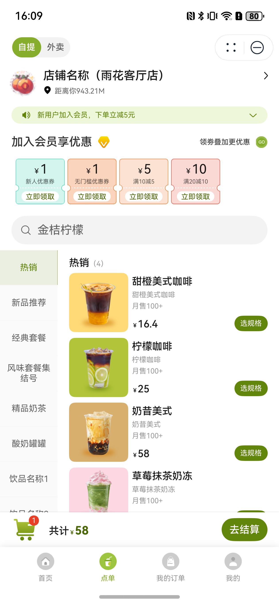
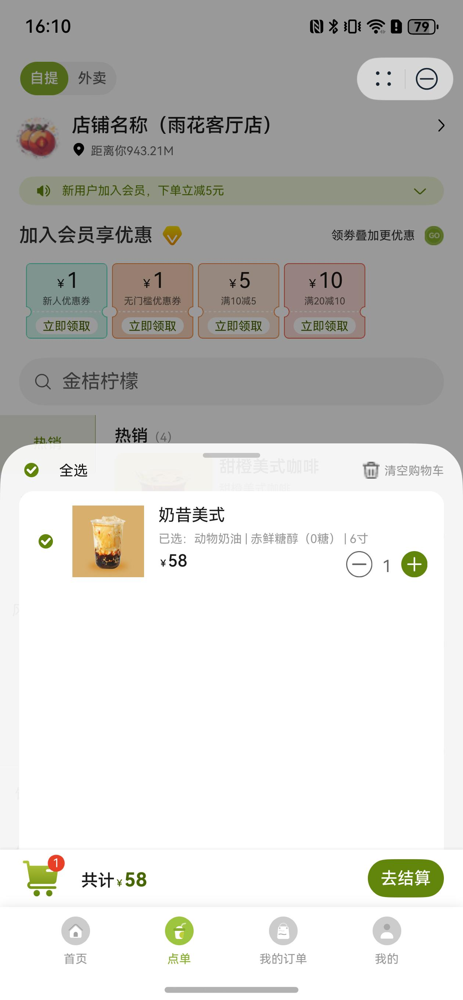

# 购物车组件快速入门

## 目录
- [简介](#简介)
- [约束与限制](#约束与限制)
- [快速入门](#快速入门)
- [API参考](#API参考)
- [示例代码](#示例代码)

## 简介

本组件提供了购物车展示功能，可以展示购物车悬浮条以及购物车列表，购物车商品可以编辑修改和选择下单。

| 展开地图                                                   | 收起地图                                                   |
|--------------------------------------------------------|--------------------------------------------------------|
|  |  |

## 约束与限制

### 环境

* DevEco Studio版本：DevEco Studio 5.0.1 Release及以上
* HarmonyOS SDK版本：HarmonyOS 5.0.1 Release SDK及以上
* 设备类型：华为手机（包括双折叠和阔折叠）
* 系统版本：HarmonyOS 5.0.1(13)及以上

### 权限

无

## 快速入门

1. 安装组件。  
   如果是在DevEvo Studio使用插件集成组件，则无需安装组件，请忽略此步骤。
   如果是从生态市场下载组件，请参考以下步骤安装组件。  
   a. 解压下载的组件包，将包中所有文件夹拷贝至您工程根目录的xxx目录下。  
   b. 在项目根目录build-profile.json5并添加shopping_cart和base_ui模块。
   ```typescript
   // 在项目根目录的build-profile.json5填写shopping_cart路径。其中xxx为组件存在的目录名
   "modules": [
     {
       "name": "shopping_cart",
       "srcPath": "./xxx/shopping_cart",
     },
     {
       "name": "base_ui",
       "srcPath": "./xxx/base_ui",
     }
   ]
   ```
   c. 在项目根目录oh-package.json5中添加依赖
   ```typescript
   // xxx为组件存放的目录名称
   "dependencies": {
     "shopping_cart": "file:./xxx/shopping_cart"
   }
   ```

2. 引入组件。

   ```typescript
   import { ShoppingCart } from 'shopping_cart';
   ```

3. 调用组件，详细参数配置说明参见[API参考](#API参考)。

   ```typescript
   ShoppingCart({
      myCar: this.myCarModel.myCar,
      carCheck: this.myCarModel.carCheck,
      isRest: this.storeModel.storeInfo.isRest || this.isRest,
      clearCarCb: () => {
        // 清空购物车
      },
      updateCarCb: (id: string, num: number) => {
        // 更新购物车
      },
      goConfirmOrderCb: (carGoodsSelect: Array<CarGoodsInfo>) => {
        // 提交订单
      },
      changeCarCheck: (id: string, isDelete?: boolean) => {
        // 修改购物车商品选择
      },
   })
   ```

## API参考

### 接口

ShoppingCart(options?: ShoppingCartOptions)

购物车组件。

**参数：**

| 参数名     | 类型                                              | 是否必填 | 说明      |
|---------|-------------------------------------------------|------|---------|
| options | [ShoppingCartOptions](#ShoppingCartOptions对象说明) | 是    | 购物车的参数。 |

### ShoppingCartOptions对象说明

| 名称       | 类型                  | 是否必填 | 说明      |
|----------|---------------------|------|---------|
| myCar    | [MyCar](#MyCar对象说明) | 是    | 购物车数据   |
| carCheck | string[]            | 是    | 购物车已选商品 |
| isRest   | boolean             | 否    | 店铺是否休息  |

### MyCar对象说明

| 名称       | 类型                                 | 是否必填 | 说明       |
|----------|------------------------------------|------|----------|
| boxMoney | number                             | 否    | 打包费用     |
| carGoods | [CarGoodsInfo](#CarGoodInfo对象说明)[] | 是    | 购物车商品数据  |
| num      | number                             | 否    | 购物车商品数量  |
| money    | number                             | 否    | 购物车商品总金额 |

### CarGoodInfo对象说明

| 名称          | 类型                                | 是否必填 | 说明       |
|-------------|-----------------------------------|------|----------|
| id          | number                            | 是    | 购物车内商品序号 |
| goodsId     | string                            | 是    | 商品序号     |
| logo        | string                            | 是    | 商品图标     |
| name        | string                            | 是    | 商品名称     |
| num         | number                            | 是    | 商品数量     |
| specType    | number                            | 是    | 商品类别     |
| spec        | string                            | 否    | 商品规格     |
| combination | [PackageSpec](#PackageSpec对象说明)[] | 否    | 商品规格信息   |
| money       | string                            | 是    | 商品单价     |

### PackageSpec对象说明

| 名称        | 类型     | 是否必填 | 说明      |
|-----------|--------|------|---------|
| specId    | string | 是    | 商品规格序号  |
| specValId | string | 是    | 商品规格默认值 |
| specName  | string | 是    | 商品规格名称  |
| specLogo  | string | 否    | 商品规格图标  |
| specVal   | string | 是    | 商品规格枚举值 |
| specNum   | number | 是    | 商品规格数据  |

### 事件

支持以下事件：

#### clearCarCb

clearCarCb(callback: (coordinates: string = '', address: string = '') => void)

清空购物车

#### updateCarCb

updateCarCb(callback: (storeId: string) => void)

更新购物车

#### goConfirmOrderCb

goConfirmOrderCb(callback: (callTelSheet: boolean, tel: string) => void)

提交订单

#### changeCarCheck

changeCarCheck(callback: (callTelSheet: boolean, tel: string) => void)

修改购物车商品选择

## 示例代码

```typescript
import { promptAction } from '@kit.ArkUI';
import { ShoppingCart } from 'shopping_cart';
import { CarGoodsInfo, MyCar } from 'shopping_cart/src/main/ets/models/Index';

@Entry
@ComponentV2
struct Index {
   @Local myCar: MyCar = new MyCar();
   @Local carCheck: Array<string> = [];
   @Local isRest: boolean = false

   aboutToAppear(): void {
      let goods = new CarGoodsInfo()
      goods.id = '1'
      goods.goodsId = '1'
      goods.name = '商品'
      goods.logo = 'TeaDrinkOrders/good_pkg_logo.png'
      goods.num = 2
      goods.money = '11.5'
      this.myCar.carGoods.push(goods)
      this.carCheck.push(goods.id)
   }

   build() {
      Stack() {
         ShoppingCart({
            myCar: this.myCar,
            carCheck: this.carCheck,
            isRest: this.isRest,
            clearCarCb: () => {
               // 清空购物车
               promptAction.showToast({ message: '清空购物车' })
            },
            updateCarCb: (id: string, num: number) => {
               // 更新购物车
               promptAction.showToast({ message: '更新购物车' })
            },
            goConfirmOrderCb: (carGoodsSelect: Array<CarGoodsInfo>) => {
               // 提交订单
               promptAction.showToast({ message: '提交订单' })
            },
            changeCarCheck: (id: string, isDelete?: boolean) => {
               // 修改购物车商品选择
               promptAction.showToast({ message: '修改购物车商品选择' })
            },
         })
      }
      .alignContent(Alignment.Bottom)
      .height('100%')
      .width('100%')
   }
}
```