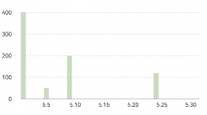

# 图表组件快速入门

- [简介](#简介)
- [约束与限制](#约束与限制)
- [使用](#使用)
- [API参考](#API参考)
- [示例代码](#示例代码)


## 简介

本组件提供一下几种形式的图表：

- BillBarChart 提供了根据传入数据，展示柱状图的能力。支持设置图表高度、颜色、标记样式等参数，支持自定义 UI 信息和交互逻辑。

| BillBarChart                                                 |
| ------------------------------------------------------------ |
|  |


## 约束与限制

### 环境

* DevEco Studio版本：DevEco Studio 5.0.2 Release及以上
* HarmonyOS SDK版本：HarmonyOS 5.0.2 Release SDK及以上
* 设备类型：华为手机（包括双折叠和阔折叠）
* 系统版本：HarmonyOS 5.0.2(14)及以上


## 使用

1. 安装组件。

   如果是在DevEco Studio使用插件集成组件，则无需安装组件，请忽略此步骤。

   如果是从生态市场下载组件，请参考以下步骤安装组件。

   a. 解压下载的组件包，将包中所有文件夹拷贝至您工程根目录的XXX目录下。

   b. 在项目根目录build-profile.json5添加module_chart模块。

   ```typescript
   // 在项目根目录build-profile.json5填写module_chart路径。其中XXX为组件存放的目录名
     "modules": [
       {
         "name": "module_chart",
         "srcPath": "./XXX/module_chart",
       }
     ]
   ```

   c. 在根目录oh-package.json5中添加依赖。

   ```typescript
   // XXX为组件存放的目录名称
   "dependencies": {
     "module_chart": "file:./XXX/module_chart",
   }
   ```

2. 引入组件句柄

   ```ts
   import { 
       BillBarChart,
       BillPieChart,
       BillRanking,
       BillReportTable,
       BillCalendar,
   } from 'module_chart';
   ```

3. 调用组件，详见[示例1](#示例1-图表的显示与切换)。详细参数配置说明参见[API参考](#API参考)。


## API参考

### 接口

#### BillBarChart(options?:BillBarChartOptions)

柱状图组件。

**参数：**

| 参数名  | 类型                                                | 是否必填 | 说明                   |
| ------- | --------------------------------------------------- | -------- | ---------------------- |
| options | [BillBarChartOptions](#BillBarChartOptions对象说明) | 否       | 配置柱状图组件的参数。 |


### BillBarChartOptions对象说明

| 名称           | 类型                                                         | 是否必填 | 说明                                  |
| -------------- | ------------------------------------------------------------ | -------- | ------------------------------------- |
| chartData      | [BillBarChartData](#BillBarChartData接口说明)                | 是       | 柱状图数据，必填字段                  |
| chartHeight    | [Length](https://developer.huawei.com/consumer/cn/doc/harmonyos-references-V14/ts-types-V14#length) | 否       | 柱状图高度，默认值为 `200`            |
| initColor      | number                                                       | 否       | 柱状图初始颜色，默认值为 `0x8094B982` |
| highlightColor | number                                                       | 否       | 柱状图高亮颜色，默认值为 `0x94B982`   |
| markerColor    | [ResourceColor](https://developer.huawei.com/consumer/cn/doc/harmonyos-references-V14/ts-types-V14#resourcecolor) | 否       | 标记颜色，默认值为 `#e6000000`        |
| markerFontSize | [Length](https://developer.huawei.com/consumer/cn/doc/harmonyos-references-V14/ts-types-V14#length) | 否       | 标记字体大小，默认值为 `12`           |


### BillBarChartData接口说明

| 名称  | 类型                                  | 是否必填 | 说明           |
| ----- | ------------------------------------- | -------- | -------------- |
| data  | [BillBarItem](#BillBarItem接口说明)[] | 是       | 账单数据数组   |
| month | string                                | 是       | 当前月份字符串 |


### BillBarItem接口说明

| 名称  | 类型   | 是否必填 | 说明                 |
| ----- | ------ | -------- |--------------------|
| date  | string | 是       | 日期字符串，格式YYYY-MM-DD |
| value | number | 是       | 对应的数据              |


## 示例代码

### 示例1-图表的显示与切换

```TS
// MockData.ets
import { BarItem } from 'module_chart';

export const MOCK_BAR_CHART_LIST: BarItem[] = [
  {
    date: '14:00',
    value: 50,
  },
];

export const MOCK_BAR_CHART_LIST1: BarItem[] = [
  {
    date: '周四',
    value: 50,
  },
  {
    date: '周六',
    value: 20,
  },
];

export const MOCK_BAR_CHART_LIST2: BarItem[] = [
  {
    date: '8-14',
    value: 50,
  },
  {
    date: '8-16',
    value: 20,
  },
  {
    date: '8-29',
    value: 30,
  },
];

export const MOCK_BAR_CHART_LIST3: BarItem[] = [
  {
    date: '2月',
    value: 200,
  },
  {
    date: '3月',
    value: 200,
  },
  {
    date: '6月',
    value: 620,
  },
  {
    date: '7月',
    value: 200,
  },
  {
    date: '11月',
    value: 300,
  },
];

export const MOCK_COLOR_LIST: number[] = [
  0x638750, 0x7ea568, 0x94b982, 0xabd39c, 0xc6e5b9, 0xdff3d7, 0xf2fdee,
];

export const MOCK_COLOR_LIST2: number[] = [
  0xd77525, 0xf2992c, 0xfbb935, 0xffce52, 0xffe38e, 0xfff1ca, 0xfffbef,
];
```

```ts
import {
  MOCK_BAR_CHART_LIST,
  MOCK_BAR_CHART_LIST2,
  MOCK_COLOR_LIST,
  MOCK_COLOR_LIST2
} from './Mockdata';
import {
  MonthBarChart, MonthBarChartData
} from 'module_chart';


@Entry
@ComponentV2
struct PreviewPage {
  @Local showChart: boolean = true;
  @Local isExpense: boolean = true;

  @Computed
  get barData(): MonthBarChartData {
    const list = this.isExpense ? MOCK_BAR_CHART_LIST : MOCK_BAR_CHART_LIST2;
    return {
      month: '2025-05',
      data: list,
    };
  }

  @Computed
  get barColor() {
    return this.isExpense ? 0x8094b982 : 0x80f2992c;
  }

  @Computed
  get colorList() {
    return this.isExpense ? MOCK_COLOR_LIST : MOCK_COLOR_LIST2;
  }

  build() {
    Column({ space: 16 }) {
      Row() {
        Text('图表').fontSize(18).fontWeight(FontWeight.Medium);
      }.width('100%')

      Row() {
        Radio({ value: 'Radio1', group: 'radioGroup' }).checked(true)
          .onChange((isChecked: boolean) => {
            this.isExpense = isChecked;
          });
        Text('支出');
        Blank().width(30);
        Radio({ value: 'Radio2', group: 'radioGroup' }).checked(false)
          .onChange((isChecked: boolean) => {
            this.isExpense = !isChecked;
          });
        Text('收入');
      };

      Scroll() {
        Column() {
          //柱状图
          MonthBarChart({
            chartData: this.barData,
            initColor: this.barColor,
          });
        };
      }
      .layoutWeight(1)
      .scrollBar(BarState.Off)
    }
    .padding(16);
  }
}
```
