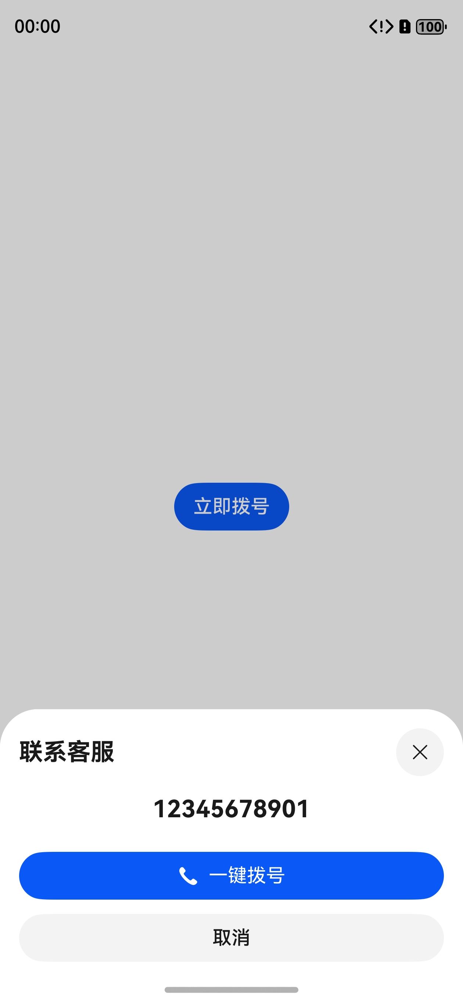
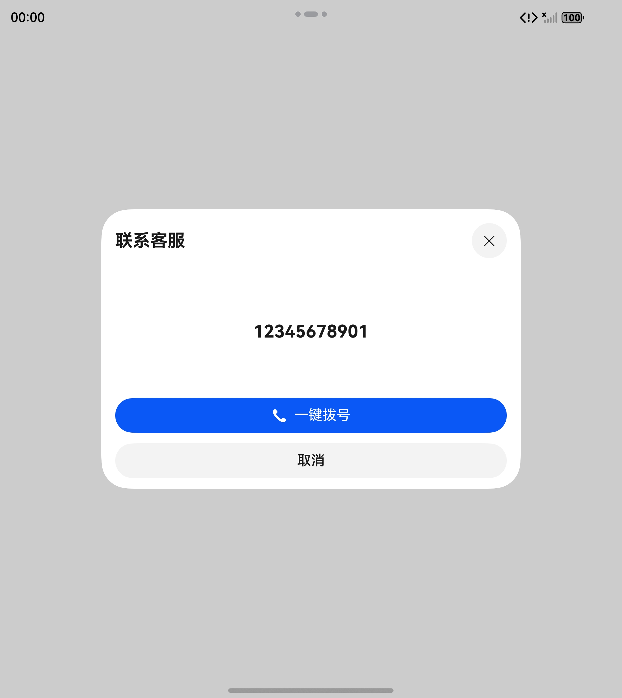
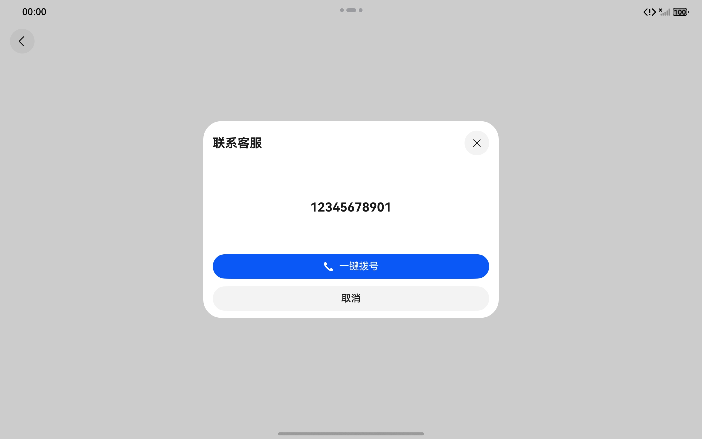

# 通用拨号组件快速入门

## 目录

- [简介](#简介)
- [约束与限制](#约束与限制)
- [快速入门](#快速入门)
- [API参考](#API参考)
- [示例代码](#示例代码)

## 简介

本组件提供了拉起拨号面板以及一键拨号的能力。

<div style='overflow-x:auto'>
  <table style='min-width:800px'>
    <tr>
      <th>直板机</th>
      <th>折叠屏</th>
      <th>平板</th>
    </tr>
    <tr>
      <td valign='top'></td>
      <td valign='top'></td>
      <td valign='top'></td>
    </tr>
  </table>
</div>

## 约束与限制

### 环境

- DevEco Studio版本：DevEco Studio 5.0.5 Release及以上
- HarmonyOS SDK版本：HarmonyOS 5.0.5 Release SDK及以上
- 设备类型：华为手机（包括双折叠和阔折叠）、华为平板
- 系统版本：HarmonyOS 5.0.1(13)及以上

### 调试

如果您需要在模拟器环境下进行相关测试，请使用 HarmonyOS 5.1.1(19) 及以上的模拟器测试拨号功能。(高版本模拟器可以通过最新的 DevEco Studio 下载)

## 快速入门

1. 安装组件

   如果是在 DevEco Studio 使用插件集成组件，则无需安装组件，请忽略此步骤。

   如果是从生态市场下载组件，请参考以下步骤安装组件。

   a. 解压下载的组件包，将包中所有文件夹拷贝至您工程根目录的 XXX 目录下。

   b. 在项目根目录 build-profile.json5 添加 dial_panel 模块。

    ```
    // 在项目根目录 build-profile.json5 填写 dial_panel 路径。其中 XXX 为组件存放的目录名
    "modules": [
      {
        "name": "dial_panel",
        "srcPath": "./XXX/dial_panel"
      }
    ]
    ```

   c. 在项目根目录 oh-package.json5 中添加依赖。

    ```
    // XXX 为组件存放的目录名称
    {
      "dependencies": {
        "dial_panel": "file:./XXX/dial_panel"
      }
    }
    ```

2. 引入组件。

    ```
    import { DialPanel } from 'dial_panel';
    ```

## API参考

### 子组件
无

### DialPanel

#### constructor(uiContext: UIContext)

DialPanel 的构造函数。

**参数：**

| 参数名       | 类型                                                                                                            | 是否必填   | 说明        |
|-----------|---------------------------------------------------------------------------------------------------------------|--------|-----------|
| uiContext | [UIContext](https://developer.huawei.com/consumer/cn/doc/harmonyos-references/arkts-apis-uicontext-uicontext) | 是      | 应用 UI 上下文 |


#### setTitle(value: string): DialPanel

设置拨号面板顶部标题。

**参数：**

| 参数名   | 类型     | 是否必填  | 说明       |
|-------|--------|-------|----------|
| value | string | 是     | 拨号面板顶部标题 |

**返回值：**

| 类型                      | 说明              |
|-------------------------|-----------------|
| [DialPanel](#DialPanel) | 拨号面板实例自身，用于链式调用 |


#### setPhoneNumber(value: string): DialPanel

设置电话号码。

**参数：**

| 参数名   | 类型     | 是否必填  | 说明   |
|-------|--------|-------|------|
| value | string | 是     | 电话号码 |

**返回值：**

| 类型                      | 说明              |
|-------------------------|-----------------|
| [DialPanel](#DialPanel) | 拨号面板实例自身，用于链式调用 |


#### setPhoneNumber(value: string): DialPanel

设置拨号面板自动关闭。

**参数：**

| 参数名   | 类型      | 是否必填  | 说明                            |
|-------|---------|-------|-------------------------------|
| value | boolean | 是     | 是否在成功前往拨号页面后自动关闭面板 (默认为 true) |

**返回值：**

| 类型                      | 说明              |
|-------------------------|-----------------|
| [DialPanel](#DialPanel) | 拨号面板实例自身，用于链式调用 |


#### onMakeCall(callback: AsyncCallback\<void\>): DialPanel

监听拨号页面跳转事件。

**参数：**

| 参数名      | 类型                    | 是否必填  | 说明       |
|----------|-----------------------|-------|----------|
| callback | AsyncCallback\<void\> | 是     | 页面跳转回调函数 |

**返回值：**

| 类型                      | 说明              |
|-------------------------|-----------------|
| [DialPanel](#DialPanel) | 拨号面板实例自身，用于链式调用 |


#### onWillDismiss(callback: (reason: DismissReason) => void): DialPanel

监听交互式关闭事件。

**参数：**

| 参数名      | 类型                                                                                                                                                     | 是否必填  | 说明                                        |
|----------|--------------------------------------------------------------------------------------------------------------------------------------------------------|-------|-------------------------------------------|
| callback | (reason: [DismissReason](https://developer.huawei.com/consumer/cn/doc/harmonyos-references/ts-universal-attributes-popup#dismissreason12枚举说明)) => void | 是     | 交互式关闭回调函数，其中 reason 为交互类型，回调注册后模态窗将不会自动关闭 |

**返回值：**

| 类型                      | 说明              |
|-------------------------|-----------------|
| [DialPanel](#DialPanel) | 拨号面板实例自身，用于链式调用 |


#### onWillSpringBackWhenDismiss(callback: (action: SpringBackAction) => void): DialPanel

监听模态窗关闭前回弹事件。

**参数：**

| 参数名      | 类型                                                                                                                                                                            | 是否必填  | 说明                                           |
|----------|-------------------------------------------------------------------------------------------------------------------------------------------------------------------------------|-------|----------------------------------------------|
| callback | callback: (action: [SpringBackAction](https://developer.huawei.com/consumer/cn/doc/harmonyos-references/ts-universal-attributes-sheet-transition#springbackaction12)) => void | 是     | 模态窗回弹回调函数，其中 action 用于主动触发回弹，回调注册后模态窗将不会自动回弹 |

**返回值：**

| 类型                      | 说明              |
|-------------------------|-----------------|
| [DialPanel](#DialPanel) | 拨号面板实例自身，用于链式调用 |


#### open(): Promise\<boolean\>

打开拨号面板。

**返回值：**

| 类型                 | 说明                      |
|--------------------|-------------------------|
| Promise\<boolean\> | true: 打开成功, false: 打开失败 |


#### close(): void

关闭拨号面板。


## 示例代码

```
import { DialPanel } from 'dial_panel';
import { BusinessError } from '@kit.BasicServicesKit';

@Entry
@ComponentV2
struct Index {

  private uiContext: UIContext = this.getUIContext();

  private dialPanel: DialPanel = new DialPanel(this.uiContext)
    .onMakeCall((e: BusinessError<void>): void => {
      if (e.code) {
        this.showToast(`拨号页面跳转失败 -> code: ${e.code}, msg: ${e.message}`);
      }
    })
    .onWillDismiss((reason: DismissReason): void => {
      if (reason === DismissReason.TOUCH_OUTSIDE) {
        this.showToast('已拦截点击其它区域进行关闭的交互方式');
      } else if (reason === DismissReason.SLIDE_DOWN) {
        this.showToast('已拦截下拉模态窗进行关闭的交互方式');
      } else {
        this.dialPanel.close();
      }
    });

  public build(): void {
    Column() {
      Button('立即拨号')
        .onClick(() => {
          this.dialPanel
            .setTitle('联系客服')
            .setPhoneNumber('12345678901')
            .setAutoClosePanel(false) // 成功跳转后不自动关闭模态窗
            .open();
        })
    }
    .width('100%')
    .height('100%')
    .justifyContent(FlexAlign.Center)
  }

  private showToast(msg: string): void {
    this.uiContext.getPromptAction().showToast({ message: msg });
  }
}
```
