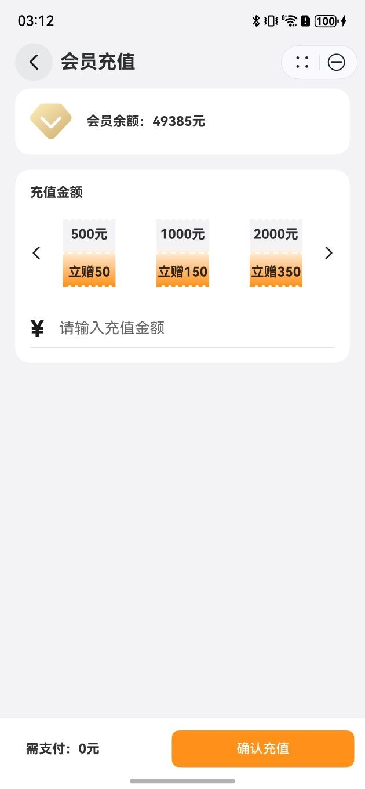

# 会员充值组件快速入门

## 目录

- [简介](#简介)
- [约束与限制](#约束与限制)
- [使用](#使用)
- [API参考](#API参考)
- [示例代码](#示例代码)

## 简介
本组件提供了展示会员充值页面，展示了不同的充值金额选择，以及可以手动输入金额，然后模拟充值的功能。



## 约束与限制

### 环境
* DevEco Studio版本：DevEco Studio 5.0.1 Release及以上
* HarmonyOS SDK版本：HarmonyOS 5.0.1 Release SDK及以上
* 设备类型：华为手机（直板机）
* 系统版本：HarmonyOS 5.0.1(13)及以上

### 权限
* 网络权限：ohos.permission.INTERNET

## 使用

1. 安装组件。
   如果是在DevEco Studio使用插件集成组件，则无需安装组件，请忽略此步骤。
   如果是从生态市场下载组件，请参考以下步骤安装组件。

   a. 解压下载的组件包，将包中所有文件夹拷贝至您工程根目录的XXX目录下。

   b. 在项目根目录build-profile.json5添加module_recharge模块。

   ```
   // 在项目根目录build-profile.json5填写module_recharge路径。其中XXX为组件存放的目录名
   "modules": [
       {
       "name": "module_recharge",
       "srcPath": "./XXX/module_recharge",
       }
   ]
   ```

   c. 在项目根目录oh-package.json5中添加依赖。

   ```
   // XXX为组件存放的目录名称
   "dependencies": {
     "module_recharge": "file:./XXX/module_recharge"
   }
   ```

2. 引入组件。

   ```
   import { Recharge } from 'module_recharge'
   ```

3. 调用组件，详细参数配置说明参见[API参考](#API参考)。

## API参考

### 子组件
无

### 接口

由于本组件内流程闭环，以页面的方式注册并对外提供，不涉及API介绍。

## 示例代码
````
//如需要在xxx模块中使用 Recharge 组件，先在xxx模块 route_map.json 文件中配置动态路由，比如以下示例在PageOne页面中调用该组件：
// 以下示例中“vip/VipRecharge”为自定义路由名称
{
  "routerMap": [
    {
      "name": "PageOne",
      "pageSourceFile": "src/main/ets/generated/RouterBuilder.ets",
      "buildFunction": "PageOneBuilder"
    },
    {
      "name": "vip/VipRecharge",
      "pageSourceFile": "src/main/ets/generated/RouterBuilder.ets",
      "buildFunction": "VipRechargeBuilder"
    }
  ]
}

// 在xxx模块的src/main/ets文件夹中，创建generated目录，在generated目录中创建路由构建类RouterBuilder.ets，在RouterBuilder.ets中编写页面构建函数
import { Recharge } from 'module_recharge';
import { PageOne } from '../pages/PageOne';

@Builder
export function PageOneBuilder() {
  PageOne();
}

@Builder
export function VipRechargeBuilder() {
  Recharge();
}

//在xxx模块的任意组件中或UI中（这里示例在PageOne.ets中），通过路由导航栈跳转到会员充值页面，余额、充值项和充值后的回调函数作为参数传入，代码如下：
import { RechargeRouteParam } from 'module_recharge';

@Entry
@Component
export struct PageOne {
  @State message: string = 'Hello World';
  pathStack: NavPathStack = new NavPathStack()

  build() {
    Navigation(this.pathStack){
      Column() {
        Button("button")
          .onClick(() => {
            this.pathStack.pushPath({
              // 这里是路由配置文件中自定义的路由名称
              name: 'vip/VipRecharge',
              param: {
                balance: 500,
                rechargeConfigs: [
                  { payNumber: 500, discounts: 50 },
                  { payNumber: 1000, discounts: 150 },
                  { payNumber: 2000, discounts: 350 }
                ], // 可选参数，自定义充值项，如充值500得550
                // 回调函数，Recharge组件返回充值后的用户余额，通过全局状态存储更新其他组件中的余额信息
                handleBack: (balance: number) => {
                  // 处理用户余额充值成功后的事件
                  AppStorage.set('globalBalance', balance)
                }
              } as RechargeRouteParam
            });
          })
      }
      .height('100%')
      .width('100%')
    }
  }
}

````
