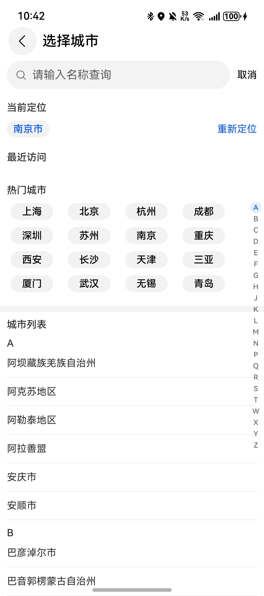

# 城市选择组件快速入门

## 目录

- [简介](#简介)
- [约束与限制](#约束与限制)
- [快速入门](#快速入门)
- [API参考](#API参考)
- [示例代码](#示例代码)

## 简介

本组件提供城市选择和城市搜索功能。



## 约束与限制
### 环境
* DevEco Studio版本：DevEco Studio 5.0.5 Release及以上
* HarmonyOS SDK版本：HarmonyOS 5.0.5 Release SDK及以上
* 设备类型：华为手机（直板机）
* HarmonyOS版本：HarmonyOS 5.0.5(17)及以上

### 权限
获取位置权限：ohos.permission.APPROXIMATELY_LOCATION

## 快速入门

1. 安装组件。

   如果是在DevEco Studio使用插件集成组件，则无需安装组件，请忽略此步骤。

   如果是从生态市场下载组件，请参考以下步骤安装组件。

   a. 解压下载的组件包，将包中所有文件夹拷贝至您工程根目录的xxx目录下。

   b. 在项目根目录build-profile.json5添加city_select模块。
   ```
   "modules": [
      {
      "name": "city_select",
      "srcPath": "./xxx/city_select",
      },
   ]
   ```
   c. 在项目根目录oh-package.json5中添加依赖
   ```
   "dependencies": {
      "city_select": "file:./xxx/city_select",
   }
   ```

2. 在主工程的src/main路径下的module.json5文件的requestPermissions字段中添加如下权限：
   ```
   "requestPermissions": [
   ...
   {
     "name": "ohos.permission.APPROXIMATELY_LOCATION",
     "reason": "$string:app_name",
     "usedScene": {
        "abilities": [
          "EntryAbility"
        ],
     "when": "inuse"
     }
   },
   ...
   ],
   ```

3. [开通地图服务](https://developer.huawei.com/consumer/cn/doc/harmonyos-guides/map-config-agc)。

4. 引入组件。

   ```typescript
   import { CitySearchController, UICitySelect } from 'module_city_select'
   ```

5. 在应用入口文件添加如下代码。

   ```typescript
   // EntryAbility.ets
   onWindowStageCreate(windowStage: window.WindowStage): void {
     AppStorage.setOrCreate<Context>('Context', this.context);
   }
   ```


## API参考

### UICitySelect(option: UICitySelectOptions)

**UICitySelectOptions对象说明**

| 参数名                   | 类型                                          | 是否必填 | 说明                   |
| :----------------------- | :-------------------------------------------- | :------- | :--------------------- |
| currentCity              | string                                        | 否       | 当前定位城市           |
| recentVisitList          | string[]                                      | 否       | 最近访问的城市列表     |
| controller               | [CitySelectController](#CitySelectController) | 否       | 城市选择控制器         |
| goBack                   | (city?: string) => void                       | 否       | 返回上一级页面         |
| emitUpdateCityLocation   | (city: string) => void                        | 否       | 更新当前定位城市的回调 |
| emitUpdateRecentCityList | (city: string) => void                        | 否       | 更新最近访问城市的回调 |

### CitySelectController

分类组件的控制器，用于控制分类条目的滚动。同一个控制器不可以控制多个分类组件。

#### constructor

constructor()

CitySelectController的构造函数。

#### onBackPressed

onBackPressed(): boolean

触发组件内部返回事件

## 示例代码

```
import { CitySearchController, UICitySelect } from 'city_select';

@Entry
@ComponentV2
struct CitySelectSample {
  @Local currentCity: string = '武汉';
  controller: CitySearchController = new CitySearchController();

  onBackPress(): boolean | void {
    return this.controller.onBackPressed();
  }

  build() {
    NavDestination() {
      Column() {
        UICitySelect({
          currentCity: this.currentCity,
          recentVisitList: ['北京', '上海', '深圳', '广西'],
          controller: this.controller,
          emitUpdateCityLocation: (city: string) => {
            this.currentCity = city;
          },
          goBack: (citySelected?: string) => {
            const message = citySelected ? `选择了${citySelected}并返回` : '直接返回';
            this.getUIContext().getPromptAction().showToast({ message });
          },
        })
      }
      .width('100%')
    }
    .height('100%')
    .width('100%')
    .title('城市选择组件')
  }
}
```
